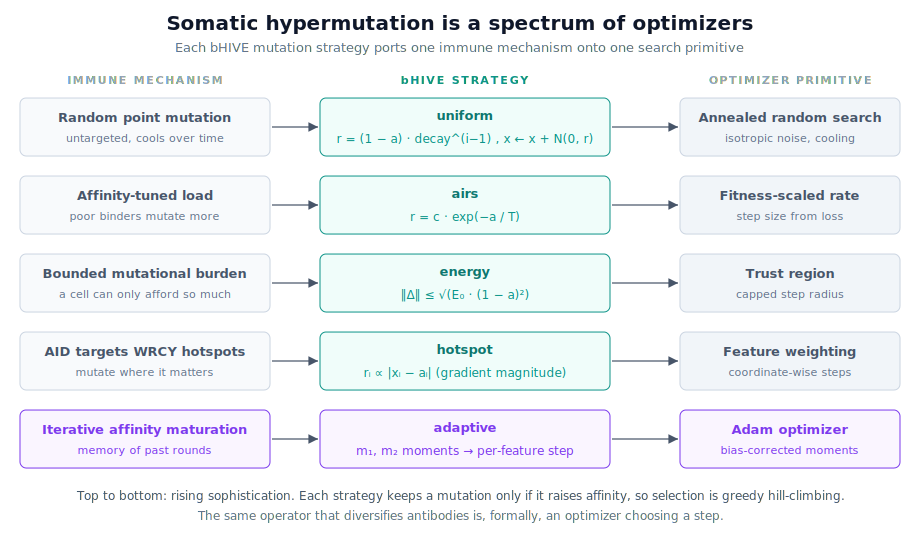
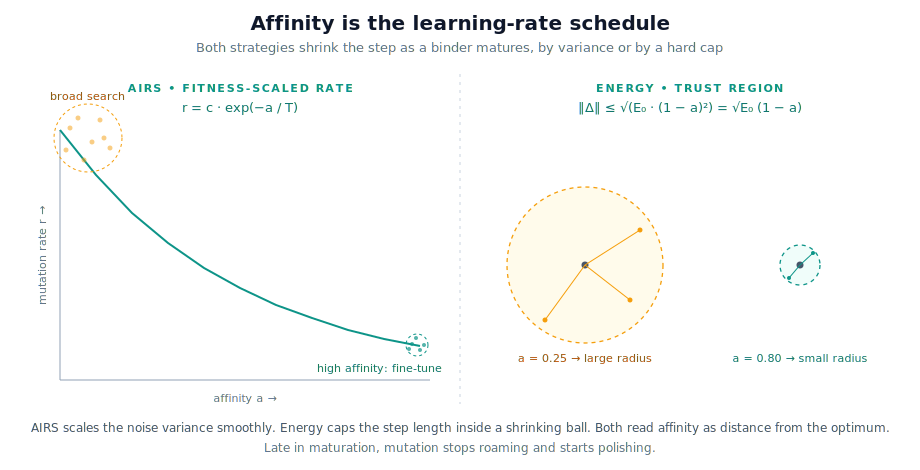
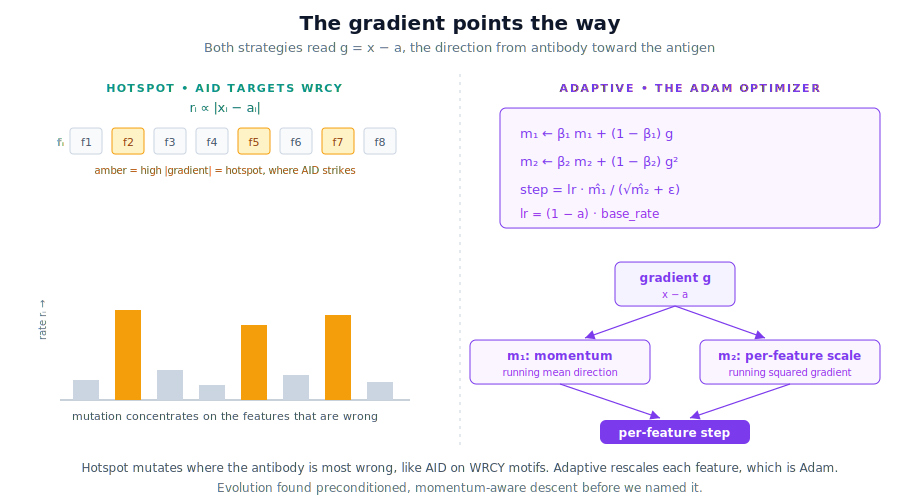

A germinal center is a search loop. B cells enter, mutate their receptors, and compete for limited help from follicular helper T cells. Winners cycle back and mutate again. Losers die. Over a week or two, average binding affinity climbs by orders of magnitude. Strip away the anatomy and the cytokines, and what remains is a population of candidate solutions, a fitness function, a mutation operator, and a selection rule. That is an optimizer.

[The last post](/posts/updating-the-ais-metaphor/) argued that Artificial Immune Systems left most of modern immunology on the table. This post takes one of those mechanisms, somatic hypermutation, and shows what happens when you import it for real. In [bHIVE](https://github.com/BorchLab/bHive), somatic hypermutation is not one trick. It is five, and each one is a search algorithm you already know.

## The operator classical AIS forgot to vary

Clonal selection algorithms have always mutated their antibodies. The classic recipe is one line. Take a candidate, add Gaussian noise scaled inversely to its affinity, and keep the result if it binds better. Good binders barely change. Bad binders scatter widely. It works, and it works without a gradient.

The problem is that this is the *only* operator most implementations ever use. One mutation rule, applied to every problem, at every stage of maturation. Real somatic hypermutation is not like that. The enzyme that drives it, activation-induced cytidine deaminase (AID), does not strike uniformly. It concentrates on hotspot motifs. The mutation load a cell carries scales with its state. The whole process runs in cycles, and later cycles behave differently from early ones. The biology has a structure that just adding Gaussian noise throws away.

That structure is the interesting part. Because once you write down the different ways a real cell can mutate, each one turns out to match a different optimizer.

## Five strategies, one ladder

bHIVE exposes mutation through an `SHMEngine` with five methods. Lined up from simplest to most sophisticated, they form a ladder. The bottom rung is unstructured noise. The top rung is Adam.

Two questions decide every one of these strategies. How big should the step be? And in which direction? The immune system answers both, and the answers are not arbitrary. They track the same two quantities every gradient method tracks. Distance from the goal sets the step size. The shape of the error sets the direction. 

## Affinity sets the step size

Start with step size. An antibody that already binds well should not throw itself across the search space. An antibody that binds poorly has nothing to lose by exploring. Affinity, in other words, behaves like a learning-rate schedule. High affinity means small steps. Low affinity means large ones. Two of the five strategies encode this, and they do it in two different ways.

The `airs` strategy, named for the Artificial Immune Recognition System of Watkins and Timmis, scales the noise variance directly. The mutation rate is

**r = c · e−a/T**

where *a* is affinity, *T* is a temperature, and *c* is a scale. A poorly matched antibody (*a* → 0) mutates at the full rate *c*. A well matched one (*a* → 1) settles toward c · e−1/T. The temperature controls how sharply the rate falls off. This is a fitness-dependent learning rate, the same idea as decaying your step size as the loss improves, written in the vocabulary of binding.

The `energy` strategy reinforces the same intuition with a hard ceiling instead of a soft variance. It gives each antibody a mutational budget

**E = E₀ (1 − a)²**

and draws a step whose length cannot exceed √E = √E₀ (1 − a). The direction is random and the magnitude is uniform up to that cap. This is a trust region. The cell is allowed to move, but only within a ball whose radius shrinks as it matures. The quadratic form is deliberate. It echoes models in which the metabolic cost of hypermutation grows with the square of the mutation load, so a high-affinity cell that has already paid for many mutations can afford very few more.

The difference between the two is the difference between a soft and a hard constraint. AIRS lets a low-affinity antibody, on rare draws, take a small step or a large one, because variance only sets the spread. Energy guarantees the step stays inside the ball. If you care about controlling worst-case moves, the trust region is the safer object. If you want smooth annealing, the variance schedule is cleaner. Same biology, two engineering choices.

## The gradient points the way

Step size is only half the answer. The other half is direction, and this is where the richest biology lives. Real hypermutation is not isotropic. AID does not mutate every position with equal probability. It targets WRCY hotspot motifs, concentrating change on a fraction of the sequence. The cell mutates where mutation is most likely to matter.

bHIVE's `hotspot` strategy ports this idea directly. It computes the gradient

**g = x − a**

the vector from the antibody *a* toward the data point *x* it is trying to recognize. Features where the antibody is far from the target have large |gᵢ|. The strategy turns those magnitudes into per-feature mutation rates, so the rate on feature *i* rises with |gᵢ|. Coordinates that are already correct barely move. Coordinates that are wrong get hammered. Computationally, this is feature-weighted, coordinate-wise mutation. Biologically, it is AID on a hotspot. The match is exact in spirit. Spend your mutational budget where the error is.

The `adaptive` strategy goes one step further and remembers. Instead of reacting to the current gradient alone, it keeps two running averages across maturation rounds, a first moment for direction and a second moment for per-feature scale:

**m₁ ← β₁ m₁ + (1 − β₁) g&nbsp;&nbsp;&nbsp;&nbsp;m₂ ← β₂ m₂ + (1 − β₂) g²**

then bias-corrects them and takes the step

**Δ = lr · m̂₁ / (√m̂₂ + ε),&nbsp;&nbsp;&nbsp;&nbsp;lr = (1 − a) · base_rate**

This is not *like* Adam. It is Adam, the optimizer Kingma and Ba published in 2015, with affinity supplying the learning rate. The first moment smooths the direction so a single noisy round does not throw the cell off course. The second moment rescales each feature by how variable its gradient has been, so stable directions take confident steps and noisy ones take cautious ones. bHIVE threads these moment matrices through every iteration of clonal selection, one per antibody, so each cell carries its own optimizer state.

There is a real subtlety worth naming. The `hotspot` and `adaptive` strategies use the data point as a target, which means they peek at the answer. AID does not. The enzyme has no idea which mutations will improve binding. It biases *where* it mutates based on sequence context, not on whether the result will bind better. So bHIVE's gradient-informed strategies are a stronger claim than the biology supports. They are what hypermutation would look like if a cell could see its own fitness landscape. That is a useful fiction for an optimizer and an overreach as a model of AID. Keeping the distinction honest matters more than the metaphor.

## Selection is the other half of the loop

Every strategy above proposes a mutated antibody. None of them decides whether to keep it. That job belongs to selection, and bHIVE's rule is strict. A mutation survives only if it raises affinity. In code it is a single comparison. If the mutant binds better than the parent, replace the parent. Otherwise discard.

This makes the whole engine a greedy hill-climber. Mutation proposes, selection accepts only improvements. It is the immune system's version of the germinal center light zone, where B cells that fail to capture enough antigen or win enough T cell help simply die. The strictness is the point. Affinity maturation works because the bar to survive keeps rising. The same strictness is also the engine's main limitation. Greedy acceptance cannot climb out of a local optimum on its own. The real germinal center hedges against this with permissive early selection and with clonal diversity that keeps many lineages alive at once. A future strategy could borrow that too, accepting the occasional neutral or slightly worse mutation the way simulated annealing does. The room to grow is right there in the biology.

## Why expose five instead of one

The argument from the last post was that AIS should import more immunology. This is what importing looks like in practice. Not a single richer mutation rule, but a menu, because the immune system itself does not commit to one. Different problems want different search. A noisy, high-dimensional landscape wants the per-feature caution of `adaptive`. A problem where you trust the geometry wants the directed aggression of `hotspot`. A setting where worst-case moves are dangerous wants the trust region of `energy`. The classical Gaussian still has its place as a baseline, and `uniform` keeps it.

Exposing the choice is the honest move. When you pick a strategy in bHIVE, you are choosing an optimizer, and you can say which one and why. That traceability is the same property the last post argued AIS gives you for free. A firing detector has a lineage. Now its mutations have a named search algorithm behind them too. The glass box extends all the way down to how each antibody learned to bind.

Somatic hypermutation spent millions of years discovering that good search means adapting your step to your progress and your direction to your error. We rediscovered the same thing and called it Adam. bHIVE just writes both down in the same place, and lets you pick which version of the immune system you want to run.

---

*These strategies live in the `SHMEngine` of [bHIVE](https://github.com/BorchLab/bHive), an open-source R package bringing AIS methods into modern immunology.*
