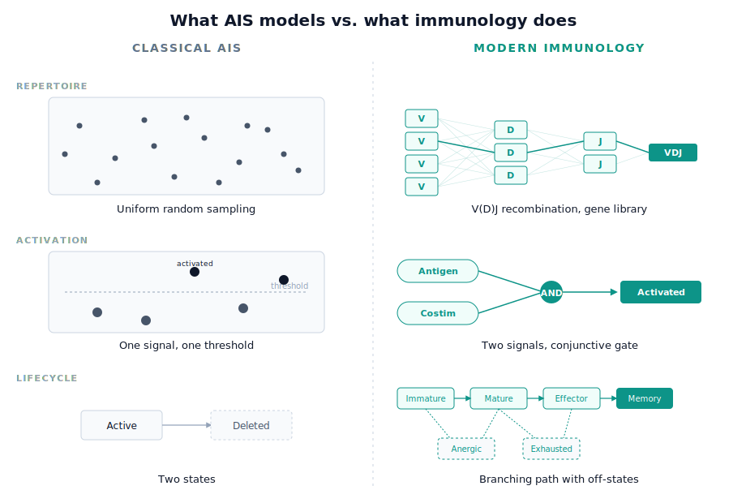
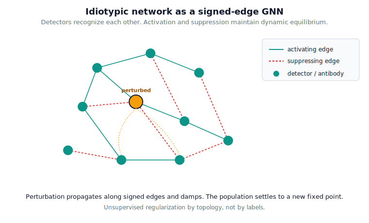
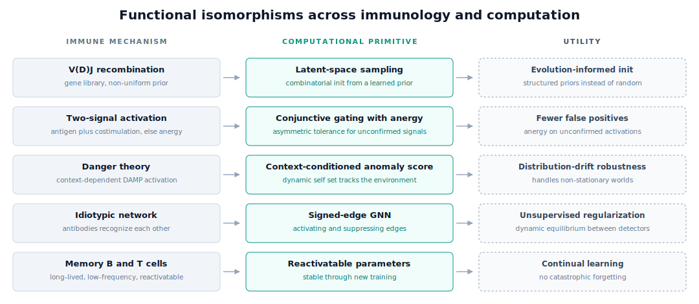

*On revisiting Artificial Immune Systems and the case for borrowing more biology, not less.*

Long before backpropagation and transformers, an adaptive learning system was already running inside every vertebrate on the planet. It identifies threats it has never seen. It does this without labeled data. It tells self from non-self in a feature space larger than any image dataset we have ever built. It also remembers. The immune system is the original adaptive learning machine. For a brief window in the late 1990s and early 2000s, it inspired its own corner of computer science: **Artificial Immune Systems**, or AIS.

For a moment, AIS looked like a real contender alongside neural networks and genetic algorithms. Negative selection algorithms offered principled anomaly detection. Clonal selection algorithms gave a clean evolutionary metaphor for optimization. Idiotypic networks hinted at self-organizing memory. Then deep learning ate the world. AIS receded into specialty journals. A generation of ML researchers grew up barely aware the field existed.

That was a mistake. The way back is not to defend the AIS canon as it stood in 2003. The way back is to modernize it. The immune system we model in AIS is the immune system as we understood it thirty years ago. Our fundamental understanding of immunology has moved on. Our algorithms should too.

## What AIS got right

The intellectual core of AIS has aged well. Strip away the implementation details, and three durable ideas remain.

The first is **clonal selection**. When a candidate solution (an "antibody") matches a target (an "antigen") well, you copy it and mutate the copies. The cloning rate scales with affinity. The mutation rate scales inversely with affinity. Promising regions of the search space get exploited. Mediocre ones get explored. It works without a gradient.

The second is **negative selection**. To learn what is anomalous, you generate detectors at random and discard any that match a corpus of "self." What survives is, by construction, sensitive to non-self. The model never sees a positive example of an attack. It can still flag one. For domains where anomalies are rare or adversarial, that is exactly the right inductive bias.

The third is the **idiotypic network**. Niels Jerne argued that antibodies recognize each other, not just antigens. The repertoire becomes a self-referential graph that can stabilize, oscillate, and remember without external input. Translated to ML, this is regularization by topology. Representations are constrained by their relationships to other representations, not just by labels.

These ideas are good. They are also half a century old.

## Where AIS got stuck

The honest critique runs roughly like this.

**The repertoires are uninformatively random.** Most AIS implementations sample detectors from a uniform feature space. Real B and T cell repertoires are nothing like this. The body builds them from a *gene library* of V, D, and J segments, recombining and editing under a strongly non-uniform prior. Hundreds of millions of years of evolution shape that prior. Randomness is one ingredient. It is not the whole recipe.

**Activation is a single threshold.** In an AIS detector, a match either crosses an affinity cutoff or it doesn't. Real lymphocytes need *two* (or more) signals: antigen recognition plus a costimulatory signal from another cell. Without the second signal, recognition produces tolerance, not response. Sometimes it produces cell death. That distinction is the heart of how the immune system avoids attacking its own host. We rarely model it.

**There is no notion of context, only content.** The immune system does not respond to antigens. It responds to antigens *in context*. Antigen-presenting cells (APCs) work as filters that suppress molecular noise. They also work as lenses that focus lymphocyte attention on what matters. A serum protein floating in plasma is harmless. The same protein on a stressed dendritic cell next to inflammatory cytokines is a threat. AIS algorithms have, almost universally, no analog of an APC (although dendritic cell-based networks have been tried).

**Overfitting controls are weak.** AIS prunes detectors by lifespan or hit count. The real immune system is far stricter. Lymphocytes that bind self too strongly die in the thymus. B cells whose mutated descendants perform worse than their parents lose the competition for follicular helper T cells. Our algorithms do almost none of this.

**Anomaly detection is benchmarked, not understood.** Most evaluations of negative selection treat the problem as standard classification. How often did the detector flag a non-self example? Real immune anomaly detection is dynamic, adversarial, and context-sensitive. Holding the test set constant is the wrong abstraction.

These limitations are not fatal. They are an invitation.

## The immunology we have not yet imported

The case is simple. The most interesting work in AIS for the next decade will not come from clever new optimizers. It will come from importing the parts of immunology we left on the table.

The deeper argument is one of *functional isomorphism*. Each mechanism below maps cleanly onto a computational primitive that modern ML either uses awkwardly or lacks entirely. Two-signal activation is conjunctive gating with asymmetric tolerance. Germinal center selection is population-based training with niche preservation. The idiotypic network is a graph neural network with signed edges. Anergy is a negative update on unconfirmed activations. This mapping is not metaphorical hand-waving. It is a tight correspondence between mechanisms evolution has tuned and primitives we are still figuring out. The reason to import this biology is not nostalgia. The immune system has, by trial over evolutionary time, solved problems we are still actively solving.

### Two-signal activation as a costimulation prior

The **two-signal model** of lymphocyte activation is one of the most useful concepts in modern immunology. Signal one is antigen recognition. Signal two is a confirming cue, either costimulation from a helper T cell or a danger-associated molecular pattern from a stressed neighbor. Signal one alone is not enough. By itself, it produces tolerance. Signal two alone gets ignored.

This maps onto modern ML. A recognition module proposes. A *separate* discriminator confirms. Only the conjunction triggers an update. We already do something like this in adversarial training and in mixture-of-experts gating. We rarely do it with the asymmetry the immune system enforces. Recognition without confirmation should *teach the system to ignore that pattern in the future*. Unconfirmed activation is not neutral. It anergizes the detector. A real regularization story sits buried in there that classical AIS never tells.

### Danger theory and the death of self/non-self

Polly Matzinger's danger theory reframed the immune system's central question. The system is not primarily asking "is this self or non-self?" That question is poorly posed for a body whose cells turn over constantly and whose gut is full of friendly bacteria. The system is asking "is this *dangerous*?" Injured cells, not pathogens, release tissue distress signals that push APCs into a state where they can deliver signal two.

For AIS, danger theory suggests something concrete. Replace static "self" sets with *dynamic* signals from the environment. An anomaly is not a point that fails a self-membership test. It is a point that arrives in the same neighborhood as a distress signal. This generalizes negative selection without abandoning it. It also handles the case where the underlying distribution drifts.

### Germinal center dynamics

The germinal center is where modern affinity maturation happens. It is a beautiful piece of computational machinery. B cells enter, mutate their receptors, and *compete* for limited help from follicular T cells. The competition is not over a single objective. It is over multiple kinds of help, on a cycle, in a structured anatomical niche. Cells that lose the competition die. Winners go on to mutate further or differentiate into memory or plasma cells.

This is much richer than "mutate proportionally to inverse affinity" of older AIS algorithms. It is iterative, competitive, niche-structured, and decision-bound. It looks more like population-based training with ranked selection and multi-objective fitness than hill-climbing. The process echoes stochastic gradient descent, with mutation rate as the step size and affinity as the loss function. AIS implementations of clonal selection have barely scratched what germinal-center-style dynamics offer. Cycling between exploration and consolidation. Niche-based diversity preservation. A graduation step that turns short-lived effectors into long-lived memory.

### Gene libraries instead of random init

This one matters more than it sounds. Real receptor repertoires are combinatorial, not uniform. A human can express on the order of $10^{13}$ distinct antibodies. Estimates of T cell diversity range from $10^{14}$ to $10^{20}$. Recombination and editing of a few hundred gene segments produces all of them. The space is structured. The prior is non-uniform. That structure carries evolutionary information about which shapes have historically been worth recognizing. In computational terms, shuffling gene segments is **latent space sampling**.

For AIS, this argues for replacing random repertoire initialization with **learned or curated gene libraries**. A finite set of building blocks, recombined to produce candidate detectors. Foundation models give us exactly this. Pretrained representations as the starting prior. It is one of the clearest places where the new ML toolkit and the actual immunology agree.

### Idiotypic networks as a GNN inspiration

A confession is in order here. Niels Jerne's idiotypic network theory holds that antibodies form a self-referential graph in which they recognize each other's variable regions. In immunology, the theory has not aged well. Forty years of follow-up produced little experimental support for the network as a primary regulator of immune behavior. Modern textbooks rarely invoke it. The field quietly retired it.

That does not mean we should discard the *idea*. Stripped of its claim to literal biological truth, the idiotypic network remains one of the clearest blueprints we have for self-organizing regularization in a population of learners. Each node is a detector. Edges carry both **activating** and **suppressing** signals. The system stabilizes not because any external loss tells it to, but because the topology forces a dynamic equilibrium. Perturb one node and the perturbation propagates along signed edges, gets damped by suppression, and the network settles into a new fixed point.

This is the substrate of a graph neural network with signed edges. The function it computes is unsupervised regularization that maintains diverse, stable, mutually-compatible representations. That is exactly what we want for repertoires that have to cover open-world distributions without supervision. Detectors evaluate each other, not just data. Neighbors suppress redundant representations before they bloat the population. Idiotypic networks may not run the immune system, but they remain the right metaphor for how a population of unsupervised detectors can regulate itself.

### Lifecycle states beyond "active"

A real lymphocyte moves through states. Immature. Mature. Anergic. Effector. Memory. Exhausted. Annihilated. Each state has different rules for activation, mutation, and death. Most AIS detectors live in two states (active or deleted) or three (immature, mature, memory). That is a lot of biology thrown away. Memory in particular deserves a richer treatment than a counter that decrements over time. The ability to retain a long-lived, low-frequency representation that can be reactivated quickly is one of the most interesting properties of the immune system.

### A map of the isomorphisms

Pulled together, the picture looks like this. Each immune mechanism on the left names a computational primitive in the middle, with the concrete capability we get on the right.

## What we get out of doing this

Why bother? Deep learning works. Foundation models work. Why import this baroque biology at all?

### Interpretability by construction

A modernized AIS is a distributed sensor network of named, lineaged, individually meaningful detectors. Every firing detector has an identity. It came from a specific recombination event. It survived a specific selection process. It recognizes a specific pattern. When the system makes a call, you can ask which detectors contributed and why. You get a real answer with traceable provenance.

Deep neural networks do not have this property. Their representations are entangled across layers, distributed across millions of weights, and only legible after extensive post-hoc analysis. Mechanistic interpretability is a heroic effort to recover what an immune-style architecture would expose for free. Saliency maps approximate which inputs mattered. Linear probes guess at what hidden layers encode. Sparse autoencoders try to extract interpretable features from activations after the fact. AIS gives you a glass box where the population *is* the explanation.

For some application domains, that distinction is not aesthetic. It is a hard requirement. Medical decision support, fraud detection, regulatory monitoring, and scientific discovery all benefit from architectures whose components engineers can inspect, audit, and reason about. Any setting where a model's output triggers consequential action wants this. A modernized AIS is not only competitive on accuracy. It is structurally honest about how it got there.

### The empirical case

The immune system is *empirically* good at the problems classical ML struggles with. Open-world recognition. Sample-efficient learning of novel patterns. Graceful handling of distribution shift. Adversarial robustness against inputs designed to fool it. These are exactly the failure modes of current systems. A real biological system has solved them, even imperfectly. Its design is worth studying.

More broadly, AIS gives us a vocabulary for thinking about *populations* of models rather than single ones. Ensembles, mixtures of experts, and agent collectives are growing more important. The immune system is one of the few well-studied biological examples of a population of specialists that coordinate without a central controller. Clonal competition, niche-based diversity, and idiotypic regulation transfer directly.

### The biology is finally legible

Single-cell sequencing has finally made the real immune system *computationally legible*. We can now profile gene expression and receptor sequences at single-cell resolution, longitudinally, with antigen specificity. The magnitude of these data sets are often only rivaled by the heterogeneity found across the immune cells. For the first time in the history of AIS, we can fit our algorithms to the actual dynamics of the immune system rather than a stylized 1990s sketch of it. Biology is no longer the bottleneck. Our willingness to model it is.

## The argument, in one paragraph

Artificial Immune Systems are not a failed paradigm. They are an unfinished one. The classical canon captured the easy parts of immunology. Affinity. Mutation proportional to fitness. Negative selection. It left the hard parts on the table. Two-signal activation, danger theory, germinal center competition, gene-library priors, idiotypic regularization, and the full richness of the lymphocyte life cycle are all there, well-characterized and ready to be ported into algorithms. The immune system is the original adaptive learner. If we want algorithms that learn the way it does, we should stop modeling it the way it was understood before most of its interesting machinery was discovered.

It is time to update the metaphor.

*Some of these ideas are being explored in [bHIVE](https://github.com/BorchLab/bHive), an open-source R project bringing AIS methods into modern immunology.*
