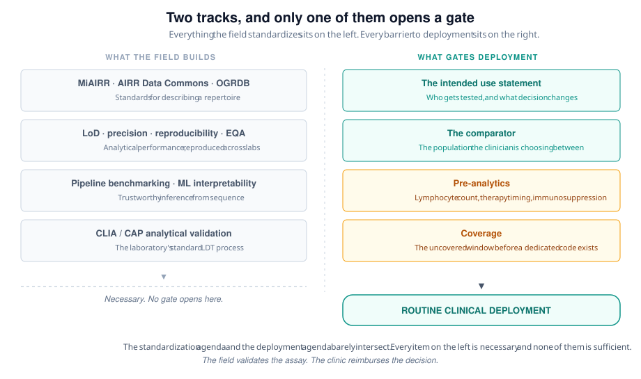

Almost every proof-of-concept paper in AIRR-seq diagnostics has the same design. Take patients with the disease. Take healthy controls. Sequence both repertoires. Train a classifier. Report an AUC.

The AUC is usually good. The design is usually wrong.

No clinician has ever looked at a healthy person and wondered whether to order a test. The patient in the room has symptoms. That is why they are in the room. The question is never "is this person sick or well." It is "which of the four things that produce this symptom does this person have." A classifier trained to separate disease from health has never been asked that question, and its AUC carries no information about how it would answer.

This is not a statistical refinement. It decides who you enroll, and enrollment is the slowest, most expensive, least reversible commitment in a diagnostic program. Get the comparator wrong and you produce a good paper and an unsubmittable dossier, and you find out three years later.

I am building one of these. A T cell receptor signature as a laboratory-developed test in an autoimmune indication, currently pre-validation. Everything below is either published or is something I got wrong first.

# The field's own account of its barriers

The AIRR Community's Diagnostics Working Group published a perspective on this in 2025 ([Stervbo et al., *ImmunoInformatics*](https://doi.org/10.1016/j.immuno.2025.100056)). It is the best available map of the territory and worth reading in full.

It names four barriers. Standardization, through MiAIRR metadata, the AIRR Data Commons, and germline databases like OGRDB. Regulatory compliance, spanning CLIA and the FDA LDT rule in the US and CE-IVD marking in the EU. Bioinformatics pipeline compatibility with clinical workflows. And interpretability of machine learning models, which both the FDA and the EU now classify as software medical devices under risk-based tiers. It is careful, and it is right about what it covers.

It is also written by immunologists and bioinformaticians rather than by anyone who has walked a test through a clinical laboratory. That shows in what is absent, not in what is wrong.

The paper opens by noting the obvious embarrassment. AIRR-seq has been established in lymphoid malignancy for years, with EuroClonality standards and one FDA-cleared platform for minimal residual disease. Proof-of-concept work exists for infectious disease, autoimmunity, transplant rejection, and early cancer detection. None of it has reached routine clinical use. Fifteen years of proof of concept and one disease area.

The paper reads that as a standardization problem. I think standardization is necessary and is not what is blocking anything.

# Gate one: the intended use statement is the test

The first document in a real diagnostic program is one sentence. Which patients get this test, and what decision changes based on the result.

That sentence is not marketing. It constrains everything downstream. It fixes the enrollment criteria. It fixes the comparator. It fixes what an acceptable limit of detection is, because detecting a signal at a frequency no clinical decision turns on is a technical achievement and nothing else. It fixes what the report says and who signs it.

Almost no translational AIRR-seq paper has one. What they have instead is a population, "patients with X," and a claim, "the repertoire distinguishes them." Neither is an intended use.

When I wrote mine, the first version said the test was an adjunct to clinical assessment across three related indications. It sounds appropriately humble. It is unusable. It names no decision, which means no payer can evaluate it and no clinician knows what to do with a positive. Breadth reads as ambition to an investigator and as vagueness to a reviewer. The two most common reasons a technical assessment fails are an intended use that is too broad and an intended use with no clinical decision attached, and that sentence managed both.

The rewrite named one population and one decision. It is narrower than the biology supports. That is the point. Expansion after a first coverage decision is cheap. A dossier built on a sentence nobody can evaluate is not.

Write the sentence before the first sample. It is free at that point and expensive at every point after.

# Gate two: nobody orders a test on a healthy person

The comparator question has the same shape in every indication the field talks about, so take the general form.

Most candidate applications sit downstream of a marker that is already in clinical use and already known to be imperfect. A risk genotype that most patients with the disease carry and that a large slice of the healthy population also carries. A serology that is sensitive and not specific. An imaging finding that goes equivocal in exactly the patients you most want to resolve. Markers like these get ordered for their negative predictive value. They rule out. They do not rule in, and the patient who tests positive is left in the room with the same unresolved question and, in several of these diseases, a diagnostic delay measured in years.

That gap is the opening a repertoire test is trying to fill. Now ask what it has to beat.

The discovery comparison is patients against healthy controls. If those controls are matched on the existing marker, that is better than it sounds, because it rules out the possibility that the classifier learned the risk background rather than the disease. It still does not touch the clinical question. The patient in the room is marker-positive, symptomatic, and unresolved by the workup already done. The clinician is choosing between this disease and everything else that produces that presentation.

The correct comparator is the symptomatic marker-positive patient who turns out not to have the disease. Not a healthy person. Not a marker-negative person. That arm recruits slowly, produces a worse AUC, and is the only one that answers the question anyone is paying for.

The structure holds across every application the perspective lists. In transplant, the comparator for a rejection signature is not a healthy volunteer, it is a stable recipient on similar immunosuppression whose graft function drifted for some other reason. In early cancer detection it is not a screened-negative population, it is the patient with an indeterminate nodule. In autoimmune subtyping it is the patient carrying the same diagnosis who will respond to a different drug. In post-acute infection syndromes it is the patient with the same symptom burden and a different mechanism. Every clinically relevant contrast is between two things that look alike. Every discovery contrast is between two things that do not.

A cohort assembled for discovery was assembled to maximize separation. A cohort that supports deployment has to hold up against a population assembled to minimize it, because the clinic only sends the hard cases. Those are different studies, and the first does not turn into the second by adding samples. Checking whether the cohort you already have can answer the clinical question costs an afternoon at the design stage. It is a three-year problem at the submission stage.

# Gate three: the repertoire is a measurement of living tissue

Genomic diagnostics get to assume the analyte is stable. A germline variant is the same on Tuesday as it was on Friday, in a fresh tube or a shipped one, on therapy or off it.

A repertoire is not like that. It is a sample of a moving population, and the pre-analytic variables that move it are exactly the ones a sick patient has.

Absolute lymphocyte count sets how much template exists at all. Timing relative to therapy shifts clonal composition, and any patient far enough along to warrant an expensive test is usually on something. Immunosuppression collapses yield, which means the sickest patients give the worst samples. Time from draw and shipping conditions matter. None of this is exotic. All of it is invisible in a genomics QC framework, because that framework was designed for an analyte that does not care.

The failure mode is what makes this dangerous rather than merely annoying. A low-input repertoire run does not look like a failure. It looks like a repertoire with few clones, which is a result. The instrument reports success. The pipeline exits zero. The report is signable.

I have spent this year finding the research version of that failure in one codebase after another. A downloader that exits zero on a partial transfer. A quantifier that exits zero on a truncated file and reports a plausible read count. An encoder that returns a correctly shaped matrix full of the wrong values. In a research pipeline that costs a figure and some credibility. In a clinical pipeline it costs a report with a physician's name on it.

The defense is not a better pipeline. It is a template-sufficiency acceptance criterion, written and fixed before enrollment opens, so that "indeterminate" is a defined result rather than something discovered on case forty. Every ingest and assembly step needs the same standing question asked once rather than rediscovered per incident: does this tool report success on partial input.

# Gate four: the regulation got easier and the money did not

In March 2025 a federal court vacated the FDA's LDT final rule in its entirety, holding the agency lacked authority to regulate laboratory-developed tests as devices. In September 2025 the FDA formally rescinded it and reverted to enforcement discretion. HHS did not appeal.

Everyone in this field read that as the barrier falling. The barrier that fell was rarely the binding one for an academic laboratory. CLIA and CAP validation was always the path, and it is a path laboratory medicine runs constantly.

The binding constraint is coverage, and nothing about it improved.

A CLIA-validated LDT can bill on day one and collect close to nothing. Bill it under a miscellaneous molecular code and the rate is set at payer discretion, frequently at or below the cost of running the test. A dedicated code through the AMA's proprietary laboratory analyses process takes about a year from application to effect and needs demonstrated clinical utility. Medicare coverage, written by the MolDX program for most of the country, typically lands somewhere between two and three years out, and it also requires clinical utility.

Clinical utility means a study showing that having the result changed what the physician did. Not that the classifier was accurate. That management changed.

Sit with what that funds. Analytical validity is fundable, because it looks like methods development and every mechanism will pay for it. Clinical validity is fundable, because it looks like a cohort study. Clinical utility is a prospective interventional study with a management endpoint, and no discovery grant I have ever seen will pay for one. Neither will they pay for a quality and regulatory specialist or a clinical bioinformatics scientist, and those two roles are where CLIA validation and technical assessments actually fail. Not on chemistry.

Federal and foundation awards fund discovery. They cannot fund a validated clinical footprint. That gap is not a funding oversight, it is structural, and any translation plan that does not name who pays for the uncovered window is a research plan wearing a translation plan's clothes.

# What this changes

Four things, none of which require new technology.

**Write the intended use sentence before the first sample.** One population, one decision. If you cannot name the decision, you do not have a diagnostic yet, you have an association.

**Choose the comparator from the clinic, not from the biobank.** Then check honestly whether the cohort you already have can answer it. It usually cannot. Finding that out while writing a grant costs an afternoon.

**Define the indeterminate result before enrollment opens.** A repertoire test on an immunosuppressed patient will sometimes have nothing to read, and that has to be a defined outcome rather than a surprise.

**Budget the uncovered window as a line item.** Two years of billing below cost is the single largest financial risk in most of these programs and it is almost never modeled.

The standardization work is real and I use it. MiAIRR, OGRDB, and the external quality assessment programs all matter, and the field should keep building them. But if AIRR-seq diagnostics are still one cleared platform in one disease area in 2030, it will not be because the metadata standards were not good enough.

It will be because we kept validating the assay and never validated the decision.

---

*Related reading: [Stervbo et al. 2025, Challenges and future directions of AIRR-seq-based diagnostics](https://doi.org/10.1016/j.immuno.2025.100056), the AIRR Community Diagnostics Working Group perspective this post argues with.*
