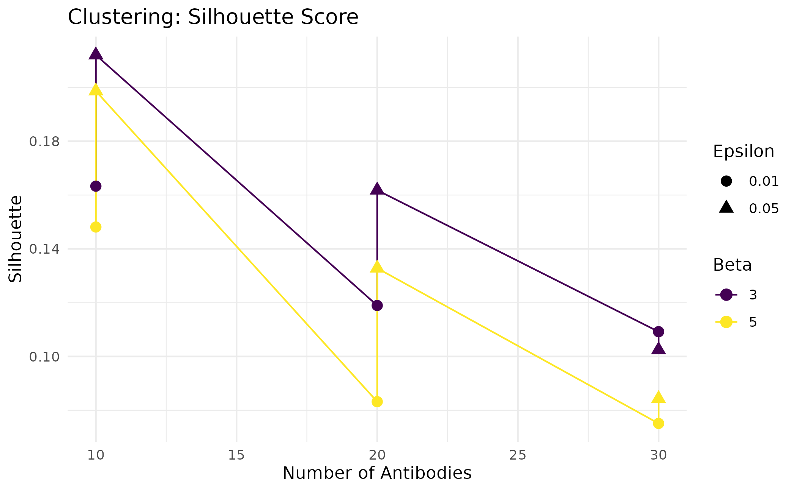
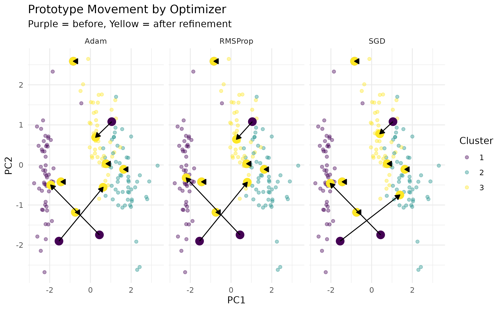
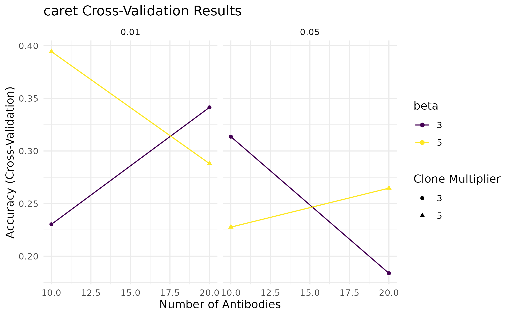
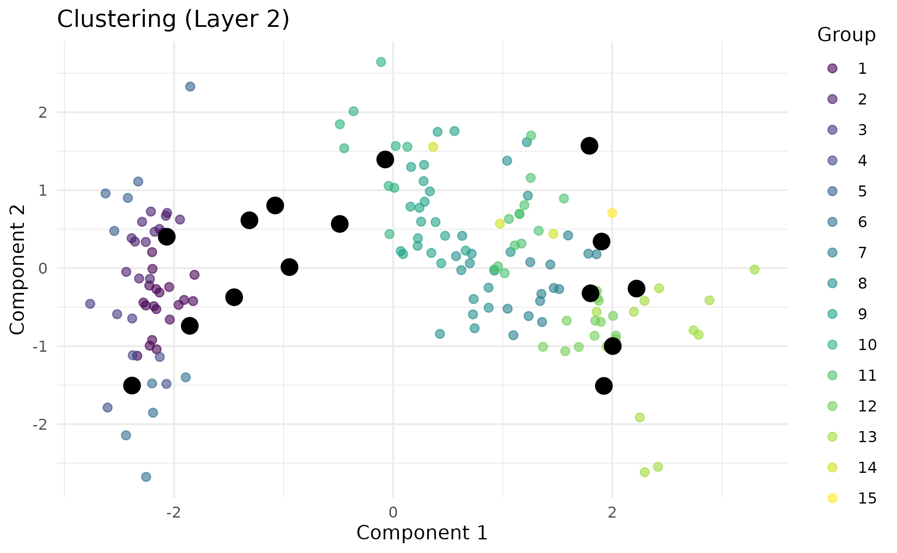
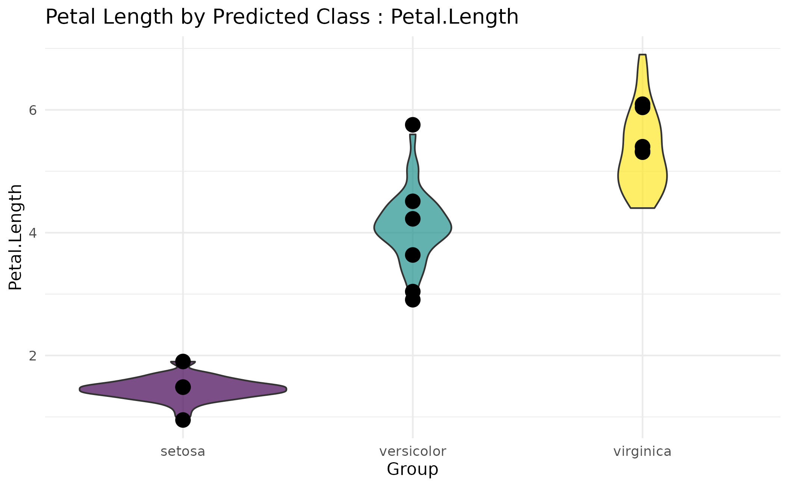

# Advanced Tuning & Workflows

## Introduction

This vignette covers advanced usage patterns for bHIVE:

1.  Hyperparameter tuning with
    [`swarmbHIVE()`](https://www.borch.dev/uploads/bhive/reference/swarmbHIVE.md)
    across tasks
2.  Multilayer hierarchical refinement with
    [`honeycombHIVE()`](https://www.borch.dev/uploads/bhive/reference/honeycombHIVE.md)
3.  Gradient-based prototype refinement with
    [`refineB()`](https://www.borch.dev/uploads/bhive/reference/refineB.md)
4.  Integration with the `caret` framework
5.  Visualization with
    [`visualizeHIVE()`](https://www.borch.dev/uploads/bhive/reference/visualizeHIVE.md)

## Hyperparameter Tuning with swarmbHIVE

[`swarmbHIVE()`](https://www.borch.dev/uploads/bhive/reference/swarmbHIVE.md)
performs grid search over bHIVE hyperparameters and evaluates each
combination using a task-specific metric.

### Available Metrics

| Task | Metrics | Direction |
|:---|:---|:---|
| Clustering | `"silhouette"`, `"davies_bouldin"`, `"calinski_harabasz"` | Higher is better (except D-B) |
| Classification | `"accuracy"`, `"balanced_accuracy"`, `"f1"`, `"kappa"` | Higher is better |

### Clustering Tuning

``` r

data(iris)
X <- as.matrix(iris[, 1:4])

grid <- expand.grid(
  nAntibodies = c(10, 20, 30),
  beta        = c(3, 5),
  epsilon     = c(0.01, 0.05)
)

set.seed(42)
tuning <- swarmbHIVE(X = X, task = "clustering", grid = grid,
                     metric = "silhouette", maxIter = 15, verbose = FALSE)

ggplot(tuning$results, aes(x = nAntibodies, y = metric_value,
                            color = factor(beta))) +
  geom_line() +
  geom_point(aes(shape = factor(epsilon)), size = 3) +
  labs(title = "Clustering: Silhouette Score",
       x = "Number of Antibodies", y = "Silhouette",
       color = "Beta", shape = "Epsilon") +
  scale_color_viridis(discrete = TRUE) +
  theme_minimal()
```



``` r

tuning$best_params
```

    ##   nAntibodies beta epsilon metric_value
    ## 7          10    3    0.05    0.2120379

### Classification Tuning

``` r

y <- iris$Species
grid_cls <- expand.grid(
  nAntibodies = c(15, 30, 50),
  beta        = c(3, 5, 10),
  epsilon     = c(0.01, 0.05)
)

set.seed(42)
tuning_cls <- swarmbHIVE(X = X, y = y, task = "classification",
                         grid = grid_cls, metric = "accuracy",
                         maxIter = 15, verbose = FALSE)
tuning_cls$best_params
```

    ##   nAntibodies beta epsilon metric_value
    ## 3          50    3    0.01    0.9666667

### Parallelization with BiocParallel

[`swarmbHIVE()`](https://www.borch.dev/uploads/bhive/reference/swarmbHIVE.md)
accepts a `BPPARAM` argument for parallel execution. This is especially
useful when the grid is large:

``` r

library(BiocParallel)

# Use 4 cores
tuning <- swarmbHIVE(
  X = X, y = y, task = "classification",
  grid = grid_cls, metric = "accuracy",
  BPPARAM = MulticoreParam(4),
  verbose = FALSE
)
```

## Multilayer Refinement with honeycombHIVE

[`honeycombHIVE()`](https://www.borch.dev/uploads/bhive/reference/honeycombHIVE.md)
runs bHIVE iteratively across multiple layers. Each layer produces
prototypes that become the input for the next layer, creating a
hierarchical compression of the data.

### Basic Multilayer Clustering

``` r

set.seed(42)
res <- honeycombHIVE(X = X, task = "clustering",
                     layers = 3, nAntibodies = 30,
                     beta = 5, epsilon = 0.05,
                     maxIter = 10, verbose = FALSE)

# Each layer progressively refines cluster structure
layer_info <- sapply(res, function(r) {
  c(n_prototypes = nrow(r$antibodies),
    n_clusters = length(unique(r$membership)))
})
layer_info
```

    ##              [,1] [,2] [,3]
    ## n_prototypes   30   19   13
    ## n_clusters     22   14    9

### Collapse Methods

The `collapseMethod` parameter controls how clusters are summarized into
prototypes for the next layer:

| Method       | Description                         |
|:-------------|:------------------------------------|
| `"centroid"` | Mean of cluster members (default)   |
| `"medoid"`   | Actual data point closest to center |
| `"median"`   | Coordinate-wise median              |

``` r

set.seed(42)
res_centroid <- honeycombHIVE(X = X, task = "clustering", layers = 2,
                              nAntibodies = 20, collapseMethod = "centroid",
                              verbose = FALSE)
res_medoid <- honeycombHIVE(X = X, task = "clustering", layers = 2,
                            nAntibodies = 20, collapseMethod = "medoid",
                            verbose = FALSE)

cat("Centroid clusters:", length(unique(res_centroid[[2]]$membership)), "\n")
```

    ## Centroid clusters: 10

``` r

cat("Medoid clusters:  ", length(unique(res_medoid[[2]]$membership)), "\n")
```

    ## Medoid clusters:   13

### With Gradient Refinement

Setting `refine = TRUE` applies gradient-based updates via
[`refineB()`](https://www.borch.dev/uploads/bhive/reference/refineB.md)
after each layer’s bHIVE pass. This fine-tunes prototype positions
before collapsing.

``` r

data(iris)
X_iris <- as.matrix(iris[, 1:4])
y_iris <- iris$Species

set.seed(42)
res_plain <- honeycombHIVE(X = X_iris, y = y_iris, task = "classification",
                           layers = 3, nAntibodies = 30, verbose = FALSE)

res_refined <- honeycombHIVE(X = X_iris, y = y_iris, task = "classification",
                             layers = 3, nAntibodies = 30,
                             refine = TRUE, refineOptimizer = "adam",
                             refineLoss = "categorical_crossentropy",
                             refineSteps = 5, refineLR = 0.01, verbose = FALSE)

acc_plain   <- mean(res_plain[[3]]$predictions   == as.character(y_iris))
acc_refined <- mean(res_refined[[3]]$predictions == as.character(y_iris))
cat("Accuracy (plain):  ", round(acc_plain, 3), "\n")
```

    ## Accuracy (plain):   0.333

``` r

cat("Accuracy (refined):", round(acc_refined, 3), "\n")
```

    ## Accuracy (refined): 0.333

## Gradient Refinement with refineB

[`refineB()`](https://www.borch.dev/uploads/bhive/reference/refineB.md)
takes trained antibody positions and fine-tunes them using
gradient-based optimization. It supports 5 optimizers and 8 loss
functions.

### Optimizers

| Optimizer    | Key Parameter    | Notes                                 |
|:-------------|:-----------------|:--------------------------------------|
| `"sgd"`      | `lr`             | Simple, good baseline                 |
| `"momentum"` | `momentum_coef`  | Accelerates SGD                       |
| `"adagrad"`  | –                | Per-parameter adaptive learning rates |
| `"adam"`     | `beta1`, `beta2` | Best general-purpose optimizer        |
| `"rmsprop"`  | `rmsprop_decay`  | Good for non-stationary objectives    |

### Loss Functions

| Loss | Tasks | Description |
|:---|:---|:---|
| `"mae"` | All | Mean absolute error (sign-based pull/push) |
| `"categorical_crossentropy"` | Classification | Cross-entropy loss |
| `"binary_crossentropy"` | Classification | Binary cross-entropy |
| `"kullback_leibler"` | Classification | KL divergence |
| `"cosine"` | Classification | Cosine distance loss |

### Comparing Optimizers

``` r

X <- as.matrix(iris[, 1:4])
y <- iris$Species

set.seed(42)
res <- bHIVE(X, y, task = "classification", nAntibodies = 10,
             beta = 5, epsilon = 0.05, initMethod = "random",
             k = 4, verbose = FALSE)

Ab <- res$antibodies
colnames(Ab) <- colnames(X)
assignments <- as.integer(factor(res$assignments,
                                 levels = unique(res$assignments)))

pca <- prcomp(X, scale. = TRUE)
X_pca <- pca$x[, 1:2]
A_orig_pca <- predict(pca, Ab)

optimizers <- c("sgd", "adam", "rmsprop")
refined_list <- lapply(optimizers, function(opt) {
  Ab_refined <- refineB(A = Ab, X = X, y = y,
                        assignments = assignments,
                        task = "classification",
                        loss = "categorical_crossentropy",
                        optimizer = opt, steps = 5, lr = 0.01,
                        verbose = FALSE)
  colnames(Ab_refined) <- colnames(X)
  A_ref_pca <- predict(pca, Ab_refined)
  data.frame(optimizer = opt,
             PC1_after = A_ref_pca[, 1],
             PC2_after = A_ref_pca[, 2])
})

refined_df <- do.call(rbind, refined_list)
refined_df$ID <- factor(rep(seq_len(nrow(Ab)), times = length(optimizers)))

proto_df <- data.frame(ID = factor(seq_len(nrow(A_orig_pca))),
                       PC1_before = A_orig_pca[, 1],
                       PC2_before = A_orig_pca[, 2])

merged <- merge(proto_df, refined_df, by = "ID")

ggplot() +
  geom_point(data = data.frame(PC1 = X_pca[, 1], PC2 = X_pca[, 2],
                                Cluster = factor(assignments)),
             aes(x = PC1, y = PC2, color = Cluster), alpha = 0.4) +
  geom_point(data = proto_df,
             aes(x = PC1_before, y = PC2_before),
             color = "#440154", size = 4) +
  geom_point(data = merged,
             aes(x = PC1_after, y = PC2_after),
             color = "#FDE725", size = 4) +
  geom_segment(data = merged,
               aes(x = PC1_before, y = PC2_before,
                   xend = PC1_after, yend = PC2_after),
               arrow = arrow(length = unit(0.2, "cm"), type = "closed"),
               color = "black", linewidth = 0.5) +
  scale_color_viridis(discrete = TRUE) +
  labs(title = "Prototype Movement by Optimizer",
       subtitle = "Purple = before, Yellow = after refinement",
       x = "PC1", y = "PC2") +
  facet_wrap(~optimizer, nrow = 1,
             labeller = as_labeller(c(sgd = "SGD", adam = "Adam",
                                      rmsprop = "RMSProp"))) +
  theme_minimal()
```



## caret Integration

bHIVE provides two caret-compatible model objects for use with
[`train()`](https://rdrr.io/pkg/caret/man/train.html):

- `bHIVEmodel` – single-pass bHIVE with tuning over `nAntibodies`,
  `beta`, and `epsilon`
- `honeycombHIVEmodel` – multilayer bHIVE with additional tuning over
  `layers`, `refineOptimizer`, `refineSteps`, and `refineLR`

### Basic caret Workflow

``` r

library(caret)

data(iris)
X_iris <- as.matrix(iris[, 1:4])
y_iris <- iris$Species

set.seed(42)
idx <- sample(nrow(X_iris), nrow(X_iris) * 0.7)
X_train <- X_iris[idx, ]
X_test  <- X_iris[-idx, ]
y_train <- y_iris[idx]
y_test  <- y_iris[-idx]

ctrl <- trainControl(method = "cv", number = 3)

model <- train(
  x = X_train, y = y_train,
  method = bHIVEmodel,
  trControl = ctrl,
  tuneGrid = expand.grid(
    nAntibodies = c(10, 20),
    beta        = c(3, 5),
    epsilon     = c(0.01, 0.05)
  ),
  verbose = FALSE
)

ggplot(model) +
  labs(title = "caret Cross-Validation Results") +
  scale_color_viridis(discrete = TRUE) +
  theme_minimal()
```



### Prediction on Held-Out Data

``` r

preds <- predict(model, newdata = X_test)
table(Predicted = preds, Actual = y_test)
```

    ##             Actual
    ## Predicted    setosa versicolor virginica
    ##   setosa         12          2         0
    ##   versicolor      0         13        18
    ##   virginica       0          0         0

### honeycombHIVE caret Model

The multilayer caret model adds layer count and refinement parameters to
the tuning grid:

``` r

model_hc <- train(
  x = X_train, y = y_train,
  method = honeycombHIVEmodel,
  trControl = trainControl(method = "cv", number = 3),
  tuneGrid = expand.grid(
    nAntibodies = c(20, 30),
    beta        = 5,
    epsilon     = 0.05,
    layers      = c(2, 3),
    refineOptimizer = "adam",
    refineSteps     = 5,
    refineLR        = 0.01
  ),
  verbose = FALSE
)
```

## Visualization with visualizeHIVE

The
[`visualizeHIVE()`](https://www.borch.dev/uploads/bhive/reference/visualizeHIVE.md)
function produces publication-ready ggplot2 figures for bHIVE and
honeycombHIVE results.

### Plot Types

| Type | Description |
|:---|:---|
| `"scatter"` | 2D scatter with optional dimensionality reduction (PCA, UMAP, t-SNE) |
| `"boxplot"` | Feature distributions by group with prototype overlay |
| `"violin"` | Violin plots with prototype markers |
| `"density"` | Density curves with prototype reference lines |

### Scatter Plot with PCA

``` r

X <- as.matrix(iris[, 1:4])

set.seed(42)
res <- honeycombHIVE(X = X, task = "clustering", layers = 3,
                     nAntibodies = 30, beta = 5, epsilon = 0.05,
                     maxIter = 10, verbose = FALSE)

visualizeHIVE(result = res, X = iris[, 1:4],
              plot_type = "scatter",
              transformation_method = "PCA",
              title = "Clustering (Layer 2)",
              layer = 2, task = "clustering")
```



### Violin Plot for Classification

``` r

set.seed(42)
res_cls <- honeycombHIVE(X = X, y = iris$Species,
                         task = "classification",
                         layers = 2, nAntibodies = 15,
                         beta = 5, maxIter = 10, verbose = FALSE)

visualizeHIVE(result = res_cls, X = iris[, 1:4],
              plot_type = "violin", feature = "Petal.Length",
              title = "Petal Length by Predicted Class",
              layer = 1, task = "classification")
```



## Combining Modules with honeycombHIVE

The R6 API with modules and the functional
[`honeycombHIVE()`](https://www.borch.dev/uploads/bhive/reference/honeycombHIVE.md)
API serve different use cases. For maximum control, use `AINet` directly
with modules for single-pass analysis. For hierarchical refinement, use
[`honeycombHIVE()`](https://www.borch.dev/uploads/bhive/reference/honeycombHIVE.md)
with its built-in layer management and gradient refinement.

A typical advanced workflow:

1.  **Explore** with
    [`bHIVE()`](https://www.borch.dev/uploads/bhive/reference/bHIVE.md)
    to establish baseline performance
2.  **Tune** with
    [`swarmbHIVE()`](https://www.borch.dev/uploads/bhive/reference/swarmbHIVE.md)
    to find good hyperparameters
3.  **Compose** modules via `AINet` to add biological mechanisms
4.  **Layer** with
    [`honeycombHIVE()`](https://www.borch.dev/uploads/bhive/reference/honeycombHIVE.md)
    for hierarchical refinement
5.  **Visualize** with
    [`visualizeHIVE()`](https://www.borch.dev/uploads/bhive/reference/visualizeHIVE.md)
    to understand results

``` r

sessionInfo()
```

    ## R version 4.6.0 (2026-04-24)
    ## Platform: x86_64-pc-linux-gnu
    ## Running under: Ubuntu 24.04.4 LTS
    ## 
    ## Matrix products: default
    ## BLAS:   /usr/lib/x86_64-linux-gnu/openblas-pthread/libblas.so.3 
    ## LAPACK: /usr/lib/x86_64-linux-gnu/openblas-pthread/libopenblasp-r0.3.26.so;  LAPACK version 3.12.0
    ## 
    ## locale:
    ##  [1] LC_CTYPE=C.UTF-8       LC_NUMERIC=C           LC_TIME=C.UTF-8       
    ##  [4] LC_COLLATE=C.UTF-8     LC_MONETARY=C.UTF-8    LC_MESSAGES=C.UTF-8   
    ##  [7] LC_PAPER=C.UTF-8       LC_NAME=C              LC_ADDRESS=C          
    ## [10] LC_TELEPHONE=C         LC_MEASUREMENT=C.UTF-8 LC_IDENTIFICATION=C   
    ## 
    ## time zone: UTC
    ## tzcode source: system (glibc)
    ## 
    ## attached base packages:
    ## [1] stats     graphics  grDevices utils     datasets  methods   base     
    ## 
    ## other attached packages:
    ## [1] caret_7.0-1       lattice_0.22-9    viridis_0.6.5     viridisLite_0.4.3
    ## [5] ggplot2_4.0.3     bHIVE_0.99.4      BiocStyle_2.40.0 
    ## 
    ## loaded via a namespace (and not attached):
    ##  [1] pROC_1.19.0.1        gridExtra_2.3        rlang_1.2.0         
    ##  [4] magrittr_2.0.5       otel_0.2.0           e1071_1.7-17        
    ##  [7] compiler_4.6.0       png_0.1-9            systemfonts_1.3.2   
    ## [10] vctrs_0.7.3          reshape2_1.4.5       stringr_1.6.0       
    ## [13] pkgconfig_2.0.3      fastmap_1.2.0        labeling_0.4.3      
    ## [16] rmarkdown_2.31       prodlim_2026.03.11   ragg_1.5.2          
    ## [19] purrr_1.2.2          xfun_0.58            cachem_1.1.0        
    ## [22] jsonlite_2.0.0       recipes_1.3.3        BiocParallel_1.46.0 
    ## [25] clusterCrit_1.3.0    parallel_4.6.0       cluster_2.1.8.2     
    ## [28] R6_2.6.1             bslib_0.11.0         stringi_1.8.7       
    ## [31] RColorBrewer_1.1-3   reticulate_1.46.0    parallelly_1.47.0   
    ## [34] rpart_4.1.27         lubridate_1.9.5      jquerylib_0.1.4     
    ## [37] Rcpp_1.1.1-1.1       bookdown_0.46        iterators_1.0.14    
    ## [40] knitr_1.51           future.apply_1.20.2  Matrix_1.7-5        
    ## [43] splines_4.6.0        nnet_7.3-20          timechange_0.4.0    
    ## [46] tidyselect_1.2.1     yaml_2.3.12          timeDate_4052.112   
    ## [49] codetools_0.2-20     listenv_0.10.1       tibble_3.3.1        
    ## [52] plyr_1.8.9           withr_3.0.2          S7_0.2.2            
    ## [55] askpass_1.2.1        evaluate_1.0.5       Rtsne_0.17          
    ## [58] future_1.70.0        desc_1.4.3           survival_3.8-6      
    ## [61] proxy_0.4-29         pillar_1.11.1        BiocManager_1.30.27 
    ## [64] foreach_1.5.2        stats4_4.6.0         generics_0.1.4      
    ## [67] scales_1.4.0         globals_0.19.1       class_7.3-23        
    ## [70] glue_1.8.1           tools_4.6.0          data.table_1.18.4   
    ## [73] RSpectra_0.16-2      ModelMetrics_1.2.2.2 gower_1.0.2         
    ## [76] fs_2.1.0             grid_4.6.0           umap_0.2.10.0       
    ## [79] ipred_0.9-15         nlme_3.1-169         cli_3.6.6           
    ## [82] textshaping_1.0.5    lava_1.9.1           dplyr_1.2.1         
    ## [85] gtable_0.3.6         sass_0.4.10          digest_0.6.39       
    ## [88] htmlwidgets_1.6.4    farver_2.1.2         htmltools_0.5.9     
    ## [91] pkgdown_2.2.0        lifecycle_1.0.5      hardhat_1.4.3       
    ## [94] openssl_2.4.1        MASS_7.3-65
