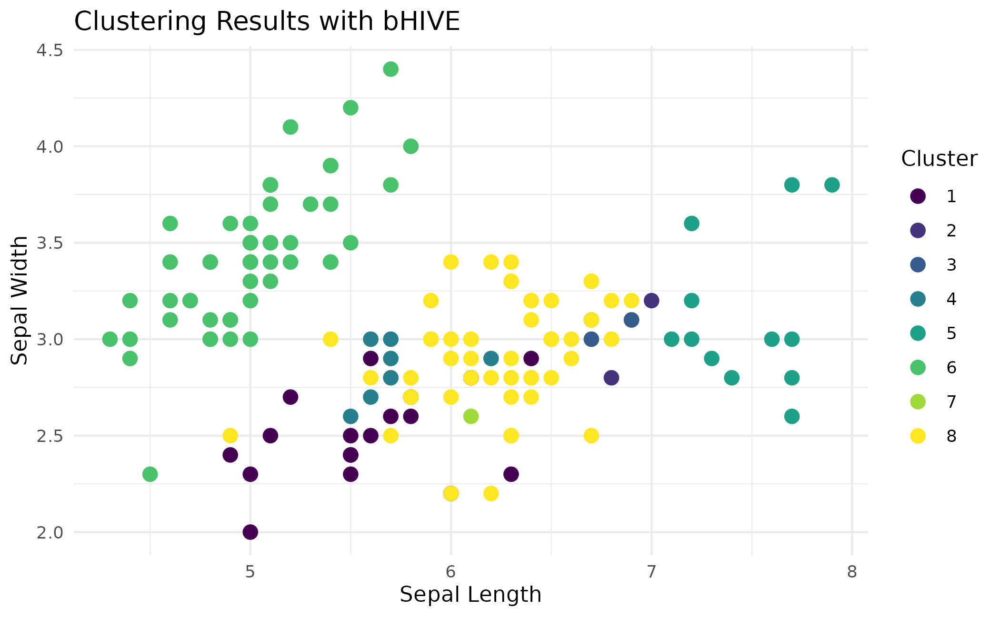
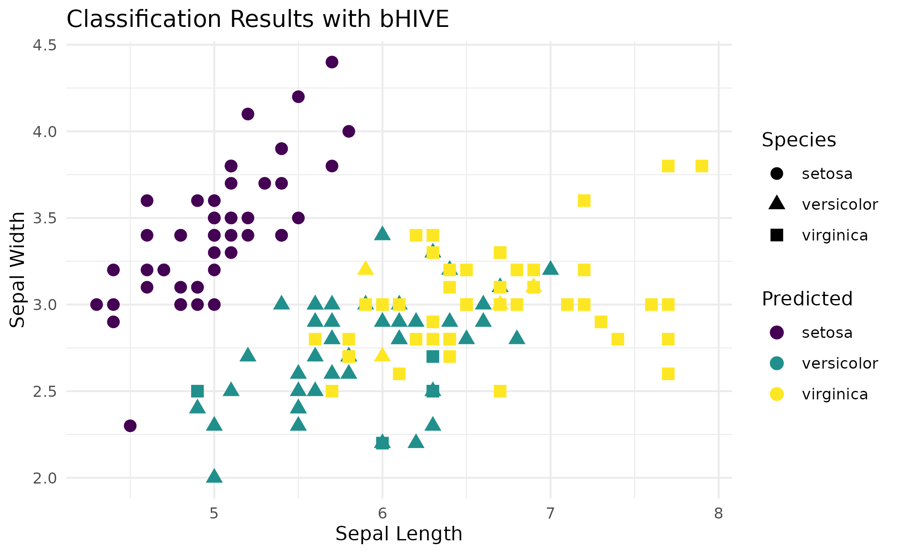
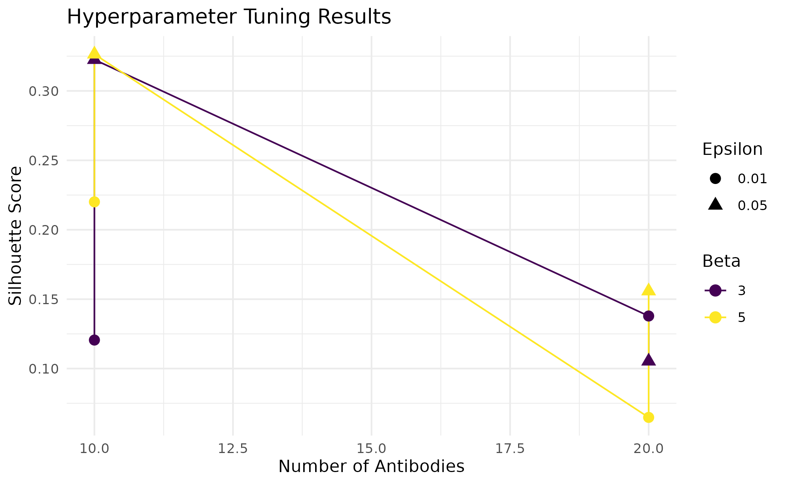
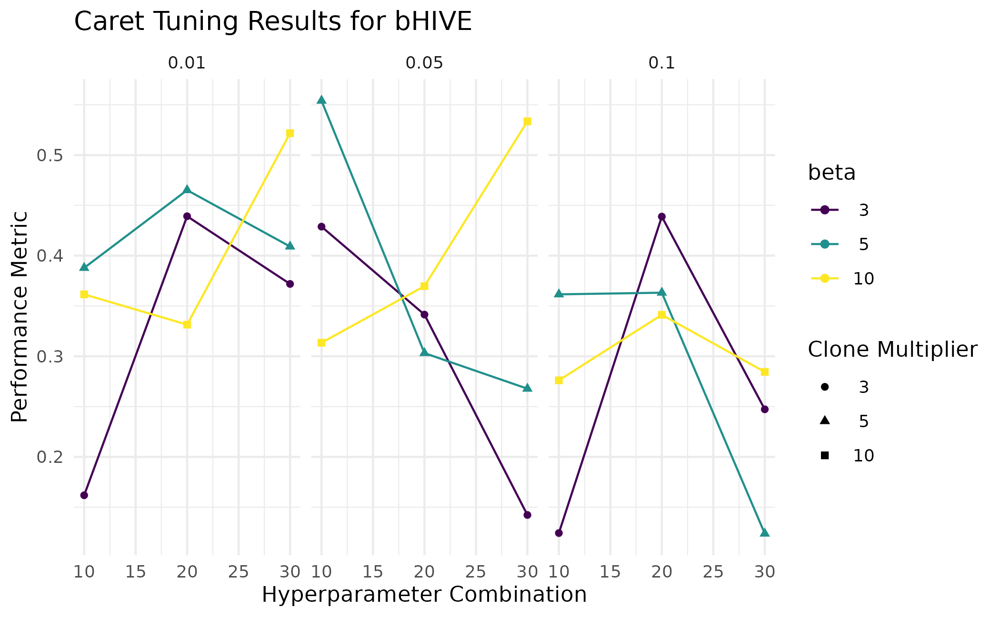
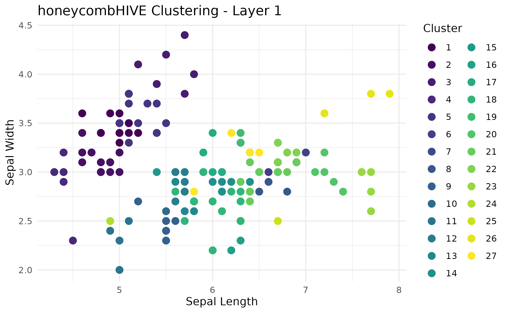
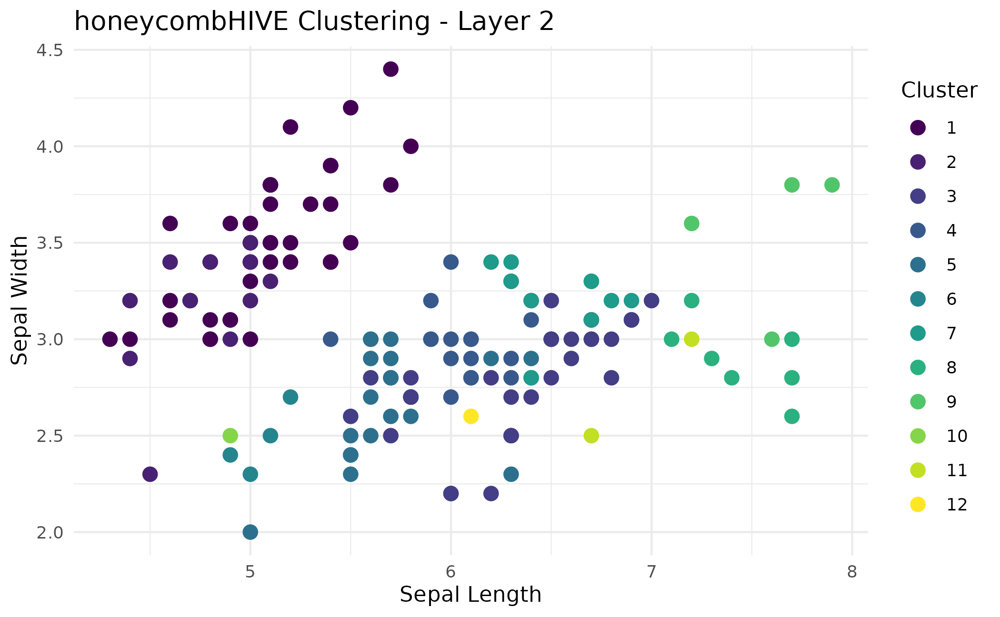
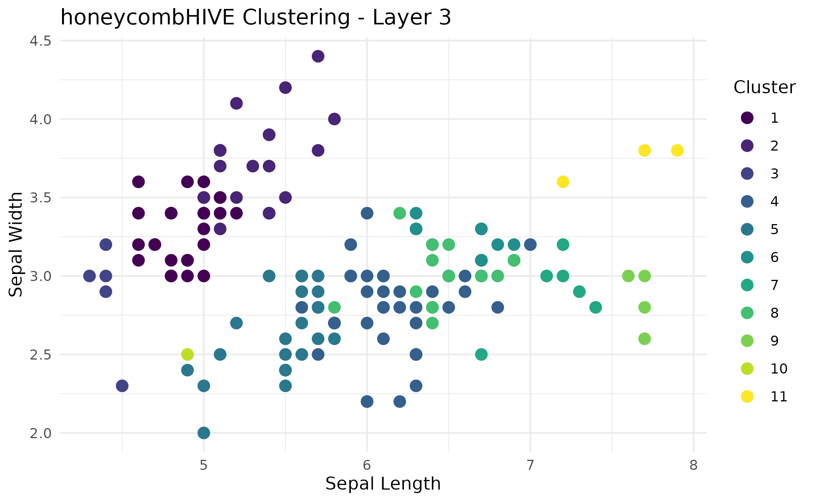
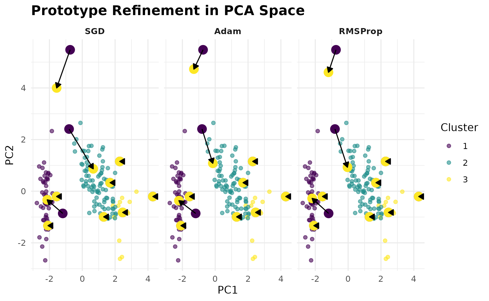
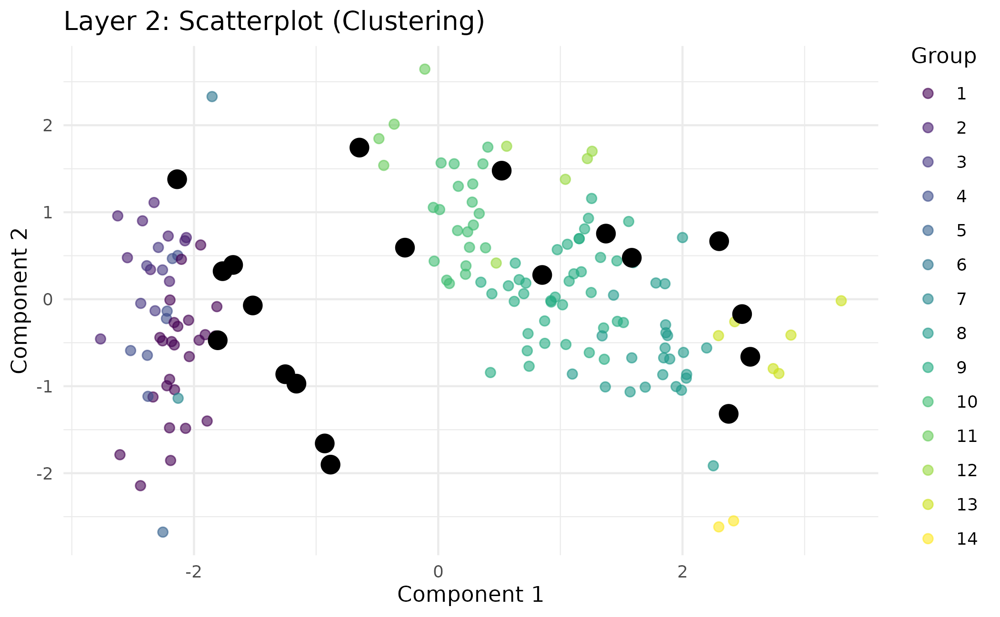

# The buzz on using bHIVE

## Introduction

The **bHIVE** package implements an Artificial Immune Network (AI-Net)
algorithm for clustering and classification tasks. Inspired by
biological immune systems, bHIVE uses principles like clonal selection,
mutation, and suppression to analyze and model data.

This vignette demonstrates how to: 1. Perform clustering and
classification using `bHIVE`. 2. Tune hyperparameters using
`swarmbHIVE`. 3. Use the `caret` wrapper for easy integration with
machine learning workflows. 4. Use multilayered immune networks with
`honeycombHIVE` 5. Visualize results with `ggplot2`.

### Parameters for `bHIVE()`

The behavior of the `bHIVE` function can be fine-tuned using a range of
hyperparameters. Below is a description of the key parameters:

| **Parameter** | **Description** |
|----|----|
| `X` | A numeric matrix or data frame of input features (rows are observations, columns are features). |
| `y` | (Optional) Factor target vector for classification. If `NULL`, clustering is performed. |
| `task` | Specifies the task: `"clustering"` or `"classification"`. |
| `nAntibodies` | Number of initial antibodies in the population. Larger values increase diversity but add computational cost. |
| `beta` | Clone multiplier. Determines how many clones are generated for top-matching antibodies. |
| `epsilon` | Suppression threshold. Antibodies closer than `epsilon` are considered redundant and removed. |
| `maxIter` | Maximum number of iterations for the algorithm. |
| `affinityFunc` | Affinity (similarity) function. Options include `"gaussian"`, `"laplace"`, `"polynomial"`, `"cosine"`, `"hamming"`. |
| `distFunc` | Distance function for clustering and suppression. Options include `"euclidean"`, `"manhattan"`, `"cosine"`, `"minkowski"`, `"hamming"`. |
| `affinityParams` | A list of optional parameters for the affinity/distance functions. |
| `mutationDecay` | Factor controlling how the mutation rate decays over iterations. Default is `1.0` (no decay). |
| `mutationMin` | Minimum mutation rate to avoid zero mutation. |
| `maxClones` | Maximum number of clones per antibody. Default is unlimited (`Inf`). |
| `stopTolerance` | Tolerance for stopping the algorithm if the antibody population size stabilizes. |
| `noImprovementLimit` | Number of iterations without improvement before early stopping. |
| `initMethod` | Method for initializing antibodies. Options: `"sample"` (randomly selects rows from `X`), `"random"` (Gaussian noise), `"random_uniform"` (samples uniformly in \[min, max\] of each column), or `"kmeans++"` (kmeans++-like initialization for coverage). |
| `k` | Number of top-matching antibodies to consider during cloning. |
| `seed` | Random seed for reproducibility. |
| `verbose` | Logical. If `TRUE`, prints progress messages for each iteration. |

#### How `bHIVE` Works

1.  **Affinity Calculation**: Measures the similarity between each data
    point and antibodies using a specified `affinityFunc`.
2.  **Clonal Expansion and Mutation**: Generates clones of top-matching
    antibodies, introducing diversity via mutation.
3.  **Network Suppression**: Removes antibodies that are too similar to
    maintain diversity in the population.
4.  **Assignment**: Assigns data points to antibodies (clusters, labels,
    or numeric predictions).

#### Example of Parameter Selection

The following example demonstrates how to configure the `bHIVE` function
for clustering, emphasizing the impact of key parameters:

``` r

# Load the Iris dataset
data(iris)
X <- as.matrix(iris[, 1:4])

# Configure bHIVE parameters for clustering
set.seed(42)
res <- bHIVE(
  X = X,                      # Input data
  task = "clustering",        # Task type
  nAntibodies = 20,           # Number of antibodies
  beta = 5,                   # Clone multiplier
  epsilon = 0.01,             # Suppression threshold
  maxIter = 20,               # Maximum iterations
  affinityFunc = "gaussian",  # Affinity function
  distFunc = "euclidean",     # Distance function
  verbose = TRUE              # Print progress
)
```

## Applications

### Clustering

**Clustering** is an unsupervised learning task where we group similar
data points based on their features. In this example, we cluster the
numeric features of the Iris dataset using `bHIVE`.

``` r

# Load Iris dataset
data(iris)
X <- as.matrix(iris[, 1:4])

# Perform clustering
set.seed(42)
res <- bHIVE(X = X, 
             task = "clustering", 
             nAntibodies = 10, 
             beta = 5, 
             epsilon = 0.05, 
             maxIter = 20, 
             k = 3,
             verbose = FALSE)

# Add cluster assignments to the data
iris$Cluster <- as.factor(res$assignments)

# Visualize clusters
ggplot(iris, aes(x = Sepal.Length, 
                 y = Sepal.Width, 
                 color = Cluster)) +
    geom_point(size = 3) +
    labs(title = "Clustering Results with bHIVE", 
         x = "Sepal Length", 
         y = "Sepal Width") +
    scale_color_viridis(discrete = TRUE) + 
    theme_minimal()
```



### Classification

**Classification** is a supervised learning task where data points are
assigned to predefined categories based on their features. Here, we
classify the species of Iris flowers using `bHIVE`.

``` r

# Classification setup
y <- iris$Species

# Perform classification
set.seed(42)
res <- bHIVE(X = X, 
             y = y, 
             task = "classification", 
             nAntibodies = 100, 
             beta = 5, 
             epsilon = 0.05, 
             initMethod = "random",
             k = 4,
             verbose = FALSE)

# Visualize classification results
iris$Predicted <- res$assignments
ggplot(iris, aes(x = Sepal.Length, 
                 y = Sepal.Width, 
                 color = Predicted, 
                 shape = Species)) +
    geom_point(size = 3) +
    labs(title = "Classification Results with bHIVE", 
         x = "Sepal Length", 
         y = "Sepal Width") +
    scale_color_viridis(discrete = TRUE) + 
    theme_minimal()
```



Comparing predicted vs actual

``` r

table(Predicted = res$assignments, Actual = y)
```

    ##             Actual
    ## Predicted    setosa versicolor virginica
    ##   setosa         50          0         0
    ##   versicolor      0         37         1
    ##   virginica       0         13        49

### Hyperparameter Tuning

Tuning hyperparameters is crucial for optimizing the performance of
machine learning algorithms. In this example, we perform hyperparameter
tuning for clustering using `swarmbHIVE`.

``` r

grid <- expand.grid(
    nAntibodies = c(10, 20),
    beta = c(3, 5),
    epsilon = c(0.01, 0.05)
)

# Perform tuning
set.seed(42)
tuning_results <- swarmbHIVE(X = X, 
                             task = "clustering", 
                             grid = grid, 
                             metric = "silhouette",
                             verbose = FALSE)

# Visualize tuning results
ggplot(tuning_results$results, aes(x = nAntibodies, 
                                   y = metric_value, 
                                   color = factor(beta))) +
    geom_line() +
    geom_point(aes(shape = as.factor(epsilon)), 
                   size = 3) +
    labs(title = "Hyperparameter Tuning Results", 
         x = "Number of Antibodies", 
         y = "Silhouette Score", 
         color = "Beta", 
         shape = "Epsilon") +
    scale_color_viridis(discrete = TRUE) + 
    theme_minimal()
```



Best parameters

``` r

tuning_results$best_params
```

    ##   nAntibodies beta epsilon metric_value
    ## 7          10    5    0.05    0.3264228

### Using the `caret` wrapper

The `bHIVE` package provides a `caret` wrapper for seamless integration
with the `caret` framework, allowing for easy cross-validation and
hyperparameter tuning. Here, we demonstrate classification on the iris
dataset.

``` r

data(iris)
X <- as.matrix(iris[, 1:4])
y <- iris$Species

# Splitting Training and Validation Data Sets
set.seed(42)
sample.idx <- sample(nrow(X), nrow(X)*0.7)
x_test <- X[sample.idx,]
x_val <- X[-sample.idx,]
y_test <- y[sample.idx]
y_val <- y[-sample.idx]


train_control <- trainControl(method = "cv", number = 2)
set.seed(42)
model <- train(x = x_test,
               y = y_test,
               method = bHIVEmodel,
               trControl = train_control,
               tuneGrid = expand.grid(
                 nAntibodies = c(10, 20, 30),
                 beta = c(3, 5, 10),
                 epsilon = c(0.01, 0.05, 0.1)),
               verbose = FALSE)

# Visualize caret results
ggplot(model) +
    labs(title = "Caret Tuning Results for bHIVE",
         x = "Hyperparameter Combination",
         y = "Performance Metric") +
    scale_color_viridis(discrete = TRUE) +
    theme_minimal()
```



#### Applying the caret-based model

To use the best performing model from the above, we just using the
[`predict()`](https://rdrr.io/r/stats/predict.html) function with the
separated validation data set (**X_val**).

``` r

preds <- predict(model, newdata = x_val)
table(Predicted = preds, Actual = y_val)
```

    ##             Actual
    ## Predicted    setosa versicolor virginica
    ##   setosa         11          0        13
    ##   versicolor      0         14         5
    ##   virginica       1          1         0

### honeycombHIVE: Multilayered bHIVES

In `honeycombHIVE`, clustering proceeds hierarchically across multiple
layers:

`honeycombHIVE` iteratively builds and refines a network of “antibodies”
(prototypes) to capture complex patterns in data. Initially, the `bHIVE`
algorithm creates a set of prototypes, and then each layer can be
fine-tuned using gradient-based updates (via the
[`refineB()`](https://www.borch.dev/uploads/bhive/reference/refineB.md)
function) with flexible optimizers like SGD, Adam, and RMSProp.

Fo each layer, a collapse step aggregates the refined prototypes - by
computing a centroid, medoid, or another statistic - compressing the
data into a new, lower-dimensional representation where each prototype
becomes a new observation. This new representation serves as the input
for the next layer, similar to neural network architecture.

``` r

# Load the Iris dataset
data(iris)
X <- as.matrix(iris[, 1:4])

# Run honeycombHIVE for clustering
res <- honeycombHIVE(X = X, 
                     task = "clustering", 
                     epsilon = 0.05,
                     layers = 3, 
                     nAntibodies = 30, 
                     beta = 5, 
                     maxIter = 10, 
                     verbose = FALSE)

# Visualize results from each layer
for (i in seq_along(res)) {
  
  # Create a data frame for plotting; add original Sepal.Length and Sepal.Width
  plot_df <- data.frame(
    Sepal.Length = iris$Sepal.Length, 
    Sepal.Width  = iris$Sepal.Width,
    Cluster      = factor(res[[i]]$membership)  # cluster labels from layer i
  )
  
  # Basic ggplot scatter plot
  plot <- ggplot(plot_df, aes(x = Sepal.Length, 
                              y = Sepal.Width, 
                              color = Cluster)) +
    geom_point(size = 3) +
    labs(
      title = paste("honeycombHIVE Clustering - Layer", i),
      x     = "Sepal Length",
      y     = "Sepal Width"
    ) +
    theme_minimal() +
    scale_color_viridis(discrete = TRUE)
  
  print(plot)
}
```



Note: If you use `task = "classification"`, honeycombHIVE will generate
multi-layer predictions. You can compare each layer’s predictions
against the true labels to see if performance improves or if the data
become too collapsed.

### Gradient-based Refinement

The
[`refineB()`](https://www.borch.dev/uploads/bhive/reference/refineB.md)
function takes the prototypes produced by the
[`bHIVE()`](https://www.borch.dev/uploads/bhive/reference/bHIVE.md)
algorithm and fine-tunes them using gradient‐based updates. In addition
to the basic parameters:

- **loss:** The loss function used to guide refinement. For a
  classification task, “categorical_crossentropy” is a typical choice.
- **steps:** The number of gradient update iterations.
- **lr:** The learning rate for each update.
- **optimizers**
  - *sgd:* Standard stochastic gradient descent.
  - *momentum:* SGD with momentum. (Control the momentum with
    **momentum_coef**).
  - *adagrad:* Adaptive gradient descent.
  - *adam:* Adaptive moment estimation. (Control the decay rates with
    **beta1** and **beta2**).
  - *rmsprop:* Root Mean Square Propagation. (Control the decay of the
    squared gradient average with **rmsprop_decay**)

``` r

# Prepare the Iris dataset
X <- as.matrix(iris[, 1:4])
y <- iris$Species

# Run bHIVE to obtain initial antibody prototypes.
set.seed(42)
res <- bHIVE(X = X, 
             y = y, 
             task = "classification", 
             nAntibodies = 10, 
             beta = 5, 
             epsilon = 0.05, 
             initMethod = "random",
             k = 4,
             verbose = FALSE)

Ab <- res$antibodies
colnames(Ab) <- colnames(X)
assignments <- res$assignments 
# Ensure assignments are numeric indices.
assignments <- as.integer(factor(assignments, levels = unique(assignments)))

# PCA of the Iris data for visualization in 2D
pca <- prcomp(X, scale. = TRUE)
X_pca <- pca$x[, 1:2]
colnames(X_pca) <- c("PC1", "PC2")
# Transform initial prototypes into PCA space.
A_bhive_pca <- predict(pca, Ab)

# Run refinement using several optimizers.
optimizers <- c("sgd", "adam", "rmsprop")
refined_list <- lapply(optimizers, function(opt) {
  Ab_refined <- refineB(A = Ab,
                        X = X, 
                        y = y,
                        assignments = assignments,
                        loss = "categorical_crossentropy", 
                        task = "classification", 
                        steps = 5, 
                        lr = 0.01,
                        verbose = FALSE,
                        optimizer = opt,
                        beta1 = 0.9,
                        beta2 = 0.999,
                        rmsprop_decay = 0.9)
  colnames(Ab_refined) <- colnames(X)
  A_refined_pca <- predict(pca, Ab_refined)
  data.frame(optimizer = opt,
             PC1_after = A_refined_pca[,1],
             PC2_after = A_refined_pca[,2])
})
refined_df <- do.call(rbind, refined_list)
refined_df$optimizer <- factor(refined_df$optimizer, levels = optimizers)
```



**Interpretation** \* Data points are shown in a light transparency,
colored by their cluster assignments (as determined by the original
`bHIVE` algorithm). \* Initial prototypes are shown in dark purple.
These are the prototypes (antibodies) before refinement. \* Refined
prototypes are shown in bright yellow. The arrows indicate the direction
and magnitude of the update from the original positions to the refined
positions.

### Applying Refinement to honeycombHIVE

``` r

data(iris)
X <- as.matrix(iris[, 1:4])
y <- iris$Species

res_class <- honeycombHIVE(X = X,
                           y = y,
                           layers = 3,
                           task = "classification",
                           nAntibodies = 30,
                           beta = 5,
                           epsilon = 0.01,
                           verbose = FALSE)

res_class_refine <- honeycombHIVE(X = X,
                                  y = y,
                                  task = "classification",
                                  layers = 3,
                                  nAntibodies = 30,
                                  beta = 5,
                                  epsilon = 0.01,
                                  refine = TRUE,
                                  refineOptimizer = "adam",
                                  refineLoss = "categorical_crossentropy",
                                  refineSteps = 3,
                                  refineLR = 0.01,
                                  verbose = FALSE)

table(Refined = res_class_refine[[3]]$predictions,
      Actual  = y)
```

    ##         Actual
    ## Refined  setosa versicolor virginica
    ##   setosa     50         50        50

## Visualizing Results with visualizeHIVE

Below are several examples that demonstrate how to use the
visualizeHIVE() function for different tasks and plot types.

### Example 1: Scatterplot for Clustering Results

In this example we run
[`honeycombHIVE()`](https://www.borch.dev/uploads/bhive/reference/honeycombHIVE.md)
on the Iris dataset for a clustering task. The scatterplot is generated
using a PCA transformation to reduce the feature space to two
dimensions. Data points are colored by cluster membership (treated as
discrete) and prototypes are overlaid as black points.

``` r

data(iris)
X <- as.matrix(iris[, 1:4])


set.seed(42)
res <- honeycombHIVE(X = X, 
                     task = "clustering", 
                     epsilon = 0.05,
                     layers = 3, 
                     nAntibodies = 30, 
                     beta = 5, 
                     maxIter = 10, 
                     verbose = FALSE)

visualizeHIVE(result = res,
              X = iris[, 1:4],
              plot_type = "scatter",
              title = "Layer 2: Scatterplot (Clustering)",
              layer = 2,
              task = "clustering",
              transform = TRUE,
              transformation_method = "PCA")
```



This scatterplot shows the data projected onto the first two principal
components. Each data point is colored according to its cluster
(discrete grouping), and the prototypes computed by honeycombHIVE are
displayed as large black points. Faceting by layer is applied if
multiple layers are selected.

### Example 2: Violin Plot for Classification Results

For a classification task, assume that the algorithm stores class
predictions. The following example generates a violin plot of the
“Sepal.Width” feature from layer 1. The discrete grouping (class labels)
is used to color the violins, and prototype values are overlaid as black
points.

``` r

set.seed(42)
res_class <- honeycombHIVE(X = X, 
                           y = iris$Species, 
                           task = "classification", 
                           layers = 2, 
                           nAntibodies = 15, 
                           beta = 5, 
                           maxIter = 10, 
                           verbose = FALSE)

visualizeHIVE(result = res_class,
              X = iris[, 1:4],
              plot_type = "violin",
              feature = "Sepal.Width",
              title = "Violin Plot: Sepal.Width by Group",
              layer = 1,
              task = "classification")
```


The violin plot shows the distribution of **Sepal.Width** for each
predicted class. Discrete color scales ensure that class labels are
clearly distinguished, and the black markers indicate the prototype
(group summary) for each group.

## Conclusions

The `bHIVE` package is a versatile tool for clustering and
classification tasks. Its integration with caret simplifies
hyperparameter tuning and cross-validation, making it suitable for a
variety of datasets and use cases. If you have any questions, comments,
or suggestions, please visit the [GitHub
repository](https://github.com/BorchLab/bHIVE).

``` r

sessionInfo()
```

    ## R version 4.6.0 (2026-04-24)
    ## Platform: x86_64-pc-linux-gnu
    ## Running under: Ubuntu 24.04.4 LTS
    ## 
    ## Matrix products: default
    ## BLAS:   /usr/lib/x86_64-linux-gnu/openblas-pthread/libblas.so.3 
    ## LAPACK: /usr/lib/x86_64-linux-gnu/openblas-pthread/libopenblasp-r0.3.26.so;  LAPACK version 3.12.0
    ## 
    ## locale:
    ##  [1] LC_CTYPE=C.UTF-8       LC_NUMERIC=C           LC_TIME=C.UTF-8       
    ##  [4] LC_COLLATE=C.UTF-8     LC_MONETARY=C.UTF-8    LC_MESSAGES=C.UTF-8   
    ##  [7] LC_PAPER=C.UTF-8       LC_NAME=C              LC_ADDRESS=C          
    ## [10] LC_TELEPHONE=C         LC_MEASUREMENT=C.UTF-8 LC_IDENTIFICATION=C   
    ## 
    ## time zone: UTC
    ## tzcode source: system (glibc)
    ## 
    ## attached base packages:
    ## [1] stats     graphics  grDevices utils     datasets  methods   base     
    ## 
    ## other attached packages:
    ## [1] caret_7.0-1       lattice_0.22-9    viridis_0.6.5     viridisLite_0.4.3
    ## [5] ggplot2_4.0.3     bHIVE_0.99.3      BiocStyle_2.40.0 
    ## 
    ## loaded via a namespace (and not attached):
    ##  [1] pROC_1.19.0.1        gridExtra_2.3        rlang_1.2.0         
    ##  [4] magrittr_2.0.5       otel_0.2.0           e1071_1.7-17        
    ##  [7] compiler_4.6.0       png_0.1-9            systemfonts_1.3.2   
    ## [10] vctrs_0.7.3          reshape2_1.4.5       stringr_1.6.0       
    ## [13] pkgconfig_2.0.3      fastmap_1.2.0        labeling_0.4.3      
    ## [16] rmarkdown_2.31       prodlim_2026.03.11   ragg_1.5.2          
    ## [19] purrr_1.2.2          xfun_0.57            cachem_1.1.0        
    ## [22] jsonlite_2.0.0       recipes_1.3.2        BiocParallel_1.46.0 
    ## [25] clusterCrit_1.3.0    parallel_4.6.0       cluster_2.1.8.2     
    ## [28] R6_2.6.1             bslib_0.10.0         stringi_1.8.7       
    ## [31] RColorBrewer_1.1-3   reticulate_1.46.0    parallelly_1.47.0   
    ## [34] rpart_4.1.27         lubridate_1.9.5      jquerylib_0.1.4     
    ## [37] Rcpp_1.1.1-1.1       bookdown_0.46        iterators_1.0.14    
    ## [40] knitr_1.51           future.apply_1.20.2  Matrix_1.7-5        
    ## [43] splines_4.6.0        nnet_7.3-20          timechange_0.4.0    
    ## [46] tidyselect_1.2.1     yaml_2.3.12          timeDate_4052.112   
    ## [49] codetools_0.2-20     listenv_0.10.1       tibble_3.3.1        
    ## [52] plyr_1.8.9           withr_3.0.2          S7_0.2.2            
    ## [55] askpass_1.2.1        evaluate_1.0.5       Rtsne_0.17          
    ## [58] future_1.70.0        desc_1.4.3           survival_3.8-6      
    ## [61] proxy_0.4-29         pillar_1.11.1        BiocManager_1.30.27 
    ## [64] foreach_1.5.2        stats4_4.6.0         generics_0.1.4      
    ## [67] scales_1.4.0         globals_0.19.1       class_7.3-23        
    ## [70] glue_1.8.1           tools_4.6.0          data.table_1.18.4   
    ## [73] RSpectra_0.16-2      ModelMetrics_1.2.2.2 gower_1.0.2         
    ## [76] fs_2.1.0             grid_4.6.0           umap_0.2.10.0       
    ## [79] ipred_0.9-15         nlme_3.1-169         cli_3.6.6           
    ## [82] textshaping_1.0.5    lava_1.9.0           dplyr_1.2.1         
    ## [85] gtable_0.3.6         sass_0.4.10          digest_0.6.39       
    ## [88] htmlwidgets_1.6.4    farver_2.1.2         htmltools_0.5.9     
    ## [91] pkgdown_2.2.0        lifecycle_1.0.5      hardhat_1.4.3       
    ## [94] openssl_2.4.0        MASS_7.3-65
