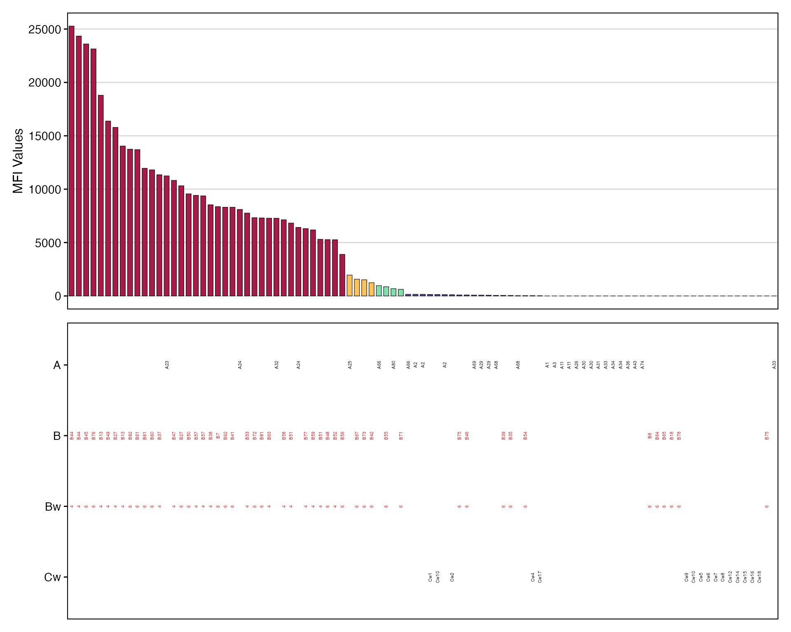
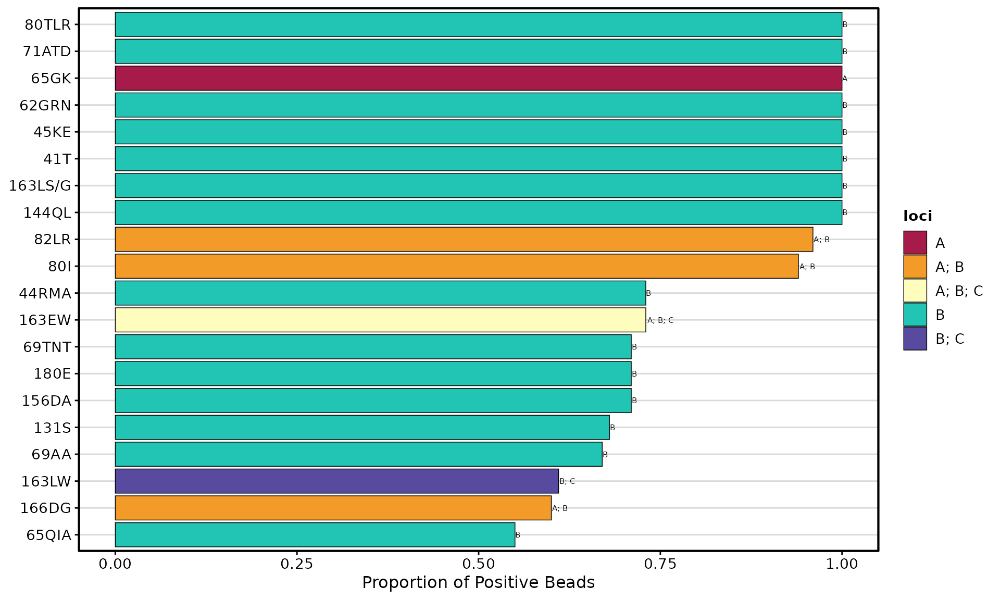
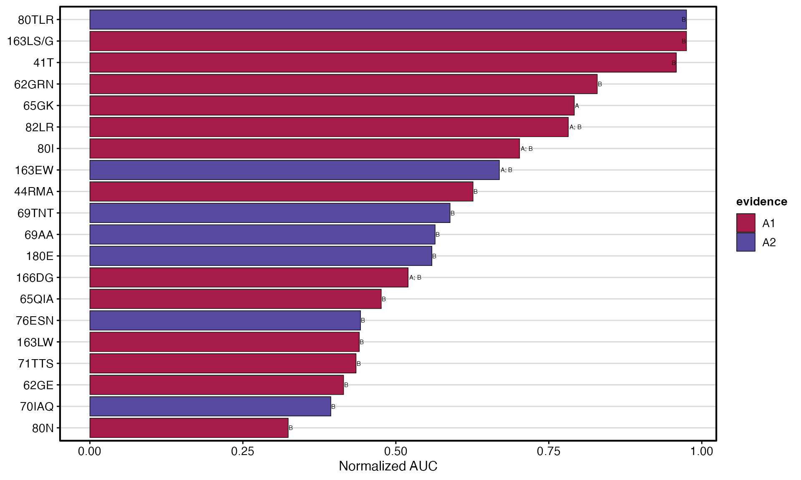
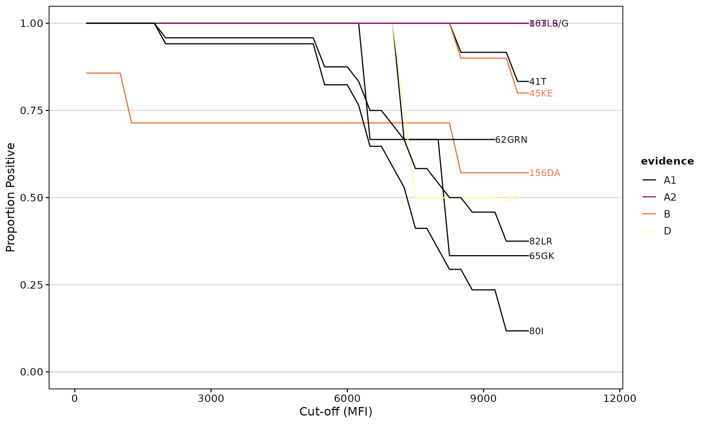
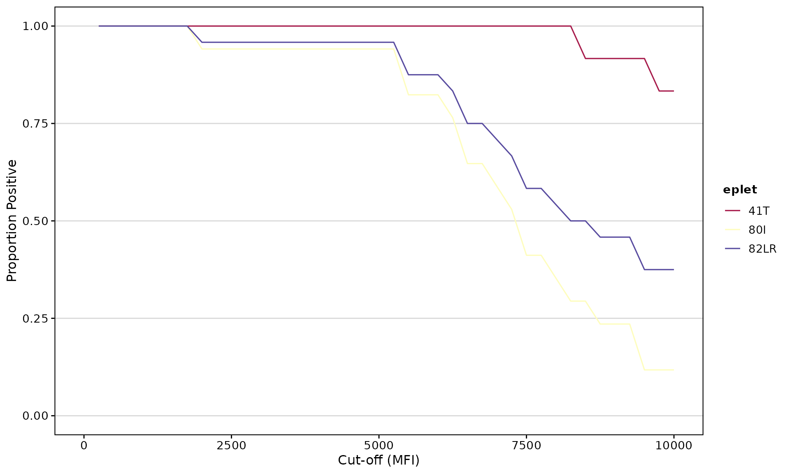
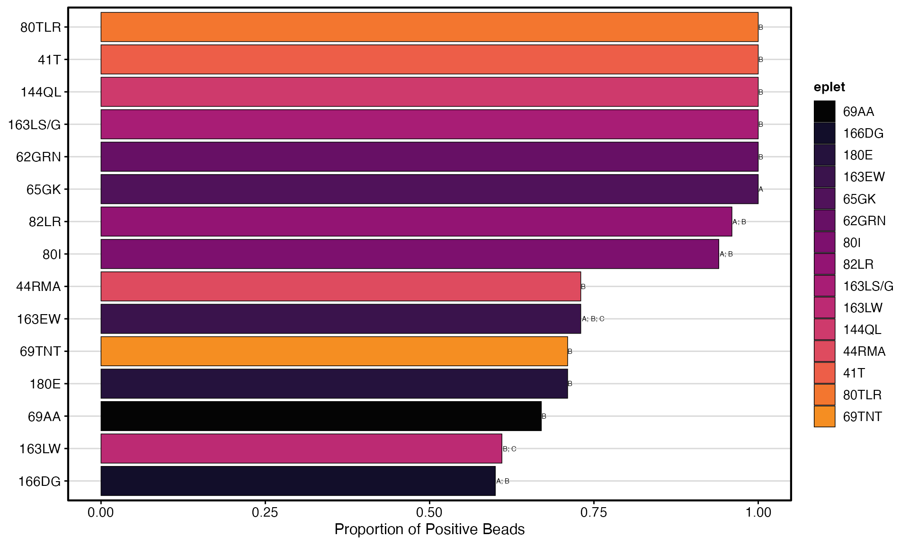
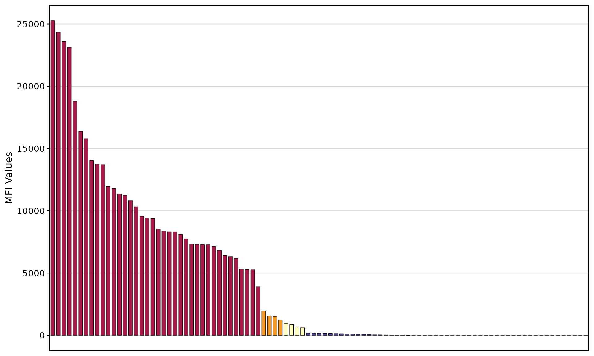

# Antibody Visualization

## Introduction

Visualizing HLA antibody data is essential for:

- Monitoring patient sensitization
- Identifying unacceptable antigens for transplant
- Tracking antibody trends over time
- Analyzing eplet-level reactivity patterns

This article covers **deepMatchR**’s visualization tools for Single
Antigen Bead (SAB) and Panel Reactive Antibody (PRA) assay results.

## Loading the Package

``` r
library(deepMatchR)
library(dplyr)
library(ggplot2)
```

## Example Data

**deepMatchR** includes simulated assay data for demonstrations:

``` r
data("deepMatchR_example")

# Available datasets:
# 1. Class I SAB
# 2. Class II SAB
# 3. PRA

head(deepMatchR_example[[1]], 5)
#>   BeadID         SpecAbbr       Specificity NormalValue  RawData CountValue
#> 1      1  -,-,-,-,-,-,-,-       -,-,-,-,-,-          NA    48.04         77
#> 2      2  -,-,-,-,-,-,-,-       -,-,-,-,-,-          NA 14068.42         78
#> 3      3 A1,-,-,-,-,-,-,- A*01:01,-,-,-,-,-        0.00    37.41         73
#> 4      4 A2,-,-,-,-,-,-,- A*02:01,-,-,-,-,-      153.63   215.17         60
#> 5      5 A2,-,-,-,-,-,-,- A*02:03,-,-,-,-,-      127.24   180.22         85
```

### Data Format Requirements

For downstream analysis, your data must include these columns:

| Column        | Description             | Example            |
|---------------|-------------------------|--------------------|
| `BeadID`      | Unique bead identifier  | 1, 2, 3…           |
| `SpecAbbr`    | Abbreviated specificity | A01, B35           |
| `Specificity` | Full specificity string | “A*01:01, B*07:01” |
| `NormalValue` | Measured MFI value      | 15234              |

## Plotting Antibodies

### SAB Bar Plot

The
[`plotAntibodies()`](https://www.borch.dev/uploads/deepMatchR/reference/plotAntibodies.md)
function creates publication-quality visualizations:

``` r
plotAntibodies(
  result_file = deepMatchR_example[[1]],
  type = "SAB",
  bead_cutoffs = c(2000, 1000, 500, 250),
  add_table = TRUE,
  palette = "spectral"
)
```


### Highlighting Specific Antigens

Focus on antigens of interest using `highlight_antigen`:

``` r
plotAntibodies(
  result_file = deepMatchR_example[[1]],
  type = "SAB",
  bead_cutoffs = c(2000, 1000, 500),
  add_table = TRUE,
  palette = "spectral",
  highlight_antigen = c("Bw4", "Bw6")
)
```



### PRA Bar Plot

``` r
plotAntibodies(
  result_file = deepMatchR_example[[3]],
  type = "PRA",
  class = "I",
  add_table = TRUE,
  palette = "spectral"
)
```


### Time-Series Trend Plot

Track antibody levels over multiple time points:

``` r
# Simulate longitudinal data
set.seed(123)
sab_data_list <- list(
  "01/01/2023" = deepMatchR_example[[1]],
  "02/01/2023" = deepMatchR_example[[1]] %>%
    mutate(NormalValue = NormalValue * runif(n(), 0.5, 0.8)),
  "03/01/2023" = deepMatchR_example[[1]] %>%
    mutate(NormalValue = NormalValue * runif(n(), 1, 3))
)

plotAntibodies(
  result_file = sab_data_list,
  type = "SAB",
  plot_trend = TRUE,
  highlight_threshold = 5000,
  vline_dates = c("2023-02-15")
)
```


## Eplet Visualization

### `plotEplets()` Overview

The
[`plotEplets()`](https://www.borch.dev/uploads/deepMatchR/reference/plotEplets.md)
function offers three visualization types:

| Type      | Best For                      |
|-----------|-------------------------------|
| `treemap` | Overview of eplet prominence  |
| `bar`     | Ranking eplets by positivity  |
| `AUC`     | Performance across thresholds |

### Treemap View

Tile area represents importance (positive beads × positivity rate):

``` r
plotEplets(
  result_file = deepMatchR_example[[1]],
  plot_type = "treemap",
  cutoff = 2000,
  evidence_level = c("A1", "A2", "B"),
  percPos_filter = 0.4,
  palette = "spectral"
)
```


### Bar Plot

Ranks eplets by positivity rate at a specific threshold:

``` r
plotEplets(
  result_file = deepMatchR_example[[1]],
  plot_type = "bar",
  group_by = "loci",
  cutoff = 2000,
  evidence_level = c("A1", "A2", "B"),
  percPos_filter = 0.4,
  top_eplets = 20,
  palette = "spectral"
)
```



### AUC Bar Plot

Ranks eplets by performance across multiple thresholds:

``` r
plotEplets(
  result_file = deepMatchR_example[[1]],
  plot_type = "AUC",
  percPos_filter = 0.4,
  group_by = "evidence_level",
  cut_min = 250,
  cut_max = 10000,
  cut_step = 250,
  top_eplets = 20,
  palette = "spectral"
)
```



## Eplet AUC Analysis

### `epletAUC()` Function

Calculates the Area Under the Curve for eplet reactivity across multiple
MFI thresholds. This provides a more robust measure than a single
cutoff.

### Visualize Reactivity Curves

``` r
epletAUC(
  result_file = deepMatchR_example[[1]],
  group_by = "evidence",
  evidence_level = c("A1", "A2", "B", "D"),
  plot_results = TRUE,
  cut_min = 250,
  cut_max = 10000,
  cut_step = 250,
  palette = "inferno"
)
```



### Get AUC Values as Data

``` r
auc_result <- epletAUC(
  result_file = deepMatchR_example[[1]],
  plot_results = FALSE,
  cut_min = 250,
  cut_max = 10000,
  cut_step = 250
)
head(auc_result)
#>     eplet      AUC total_count   loci  norm_AUC
#>    <char>    <num>       <int> <char>     <num>
#> 1:   82LR 7817.708          24   A; B 0.7817708
#> 2:    80I 7022.059          17   A; B 0.7022059
#> 3:   69AA 5641.667          15      B 0.5641667
#> 4:  163EW 6691.667          15   A; B 0.6691667
#> 5:    41T 9583.333          12      B 0.9583333
#> 6:  65QIA 4761.364          11      B 0.4761364
```

### Advanced Filtering

``` r
epletAUC(
  result_file = deepMatchR_example[[1]],
  label = FALSE,
  plot_results = TRUE,
  eplet_filter = 10,      # Minimum bead count
  percPos_filter = 1.0    # Minimum positivity threshold
)
```



## Customization Options

### Color Palettes

Available palettes include:

- `spectral` - Rainbow diverging
- `inferno` - Yellow to purple
- `viridis` - Green to purple
- `plasma` - Yellow to magenta

``` r
# Using inferno palette
plotEplets(
  result_file = deepMatchR_example[[1]],
  plot_type = "bar",
  cutoff = 2000,
  top_eplets = 15,
  palette = "inferno"
)
```



### Table Options

Control the summary table with `add_table`:

``` r
# Without table
plotAntibodies(
  result_file = deepMatchR_example[[1]],
  type = "SAB",
  add_table = FALSE
)
```



## Function Reference

### `plotAntibodies()`

| Argument            | Default                | Description                                 |
|---------------------|------------------------|---------------------------------------------|
| `result_file`       | –                      | SAB/PRA data frame or named list for trends |
| `type`              | `"SAB"`                | Assay type: “SAB” or “PRA”                  |
| `class`             | `NULL`                 | HLA class filter: “I” or “II”               |
| `bead_cutoffs`      | `c(2000,1000,500,250)` | MFI cutoff thresholds                       |
| `add_table`         | `TRUE`                 | Include summary table                       |
| `palette`           | `"spectral"`           | Color palette                               |
| `highlight_antigen` | `NULL`                 | Antigens to highlight                       |
| `plot_trend`        | `FALSE`                | Create time-series plot                     |
| `vline_dates`       | `NULL`                 | Vertical line dates for trends              |

### `plotEplets()`

| Argument         | Default            | Description                        |
|------------------|--------------------|------------------------------------|
| `result_file`    | –                  | SAB data frame                     |
| `plot_type`      | `"treemap"`        | “treemap”, “bar”, or “AUC”         |
| `cutoff`         | `2000`             | MFI cutoff for positive            |
| `evidence_level` | `c("A1","A2","B")` | Evidence levels to include         |
| `percPos_filter` | `0.4`              | Minimum positivity rate            |
| `top_eplets`     | `20`               | Number of top eplets for bar plots |
| `group_by`       | `"evidence"`       | Grouping variable                  |
| `palette`        | `"spectral"`       | Color palette                      |

### `epletAUC()`

| Argument             | Default        | Description              |
|----------------------|----------------|--------------------------|
| `result_file`        | –              | SAB data frame           |
| `plot_results`       | `TRUE`         | Generate plot            |
| `cut_min`, `cut_max` | `250`, `10000` | MFI range                |
| `cut_step`           | `250`          | Step size                |
| `eplet_filter`       | `NULL`         | Minimum bead count       |
| `percPos_filter`     | `NULL`         | Minimum final positivity |
| `label`              | `TRUE`         | Add labels to plot       |
| `palette`            | `"spectral"`   | Color palette            |

## Session Information

``` r
sessionInfo()
#> R version 4.5.2 (2025-10-31)
#> Platform: x86_64-pc-linux-gnu
#> Running under: Ubuntu 24.04.3 LTS
#> 
#> Matrix products: default
#> BLAS:   /usr/lib/x86_64-linux-gnu/openblas-pthread/libblas.so.3 
#> LAPACK: /usr/lib/x86_64-linux-gnu/openblas-pthread/libopenblasp-r0.3.26.so;  LAPACK version 3.12.0
#> 
#> locale:
#>  [1] LC_CTYPE=C.UTF-8       LC_NUMERIC=C           LC_TIME=C.UTF-8       
#>  [4] LC_COLLATE=C.UTF-8     LC_MONETARY=C.UTF-8    LC_MESSAGES=C.UTF-8   
#>  [7] LC_PAPER=C.UTF-8       LC_NAME=C              LC_ADDRESS=C          
#> [10] LC_TELEPHONE=C         LC_MEASUREMENT=C.UTF-8 LC_IDENTIFICATION=C   
#> 
#> time zone: UTC
#> tzcode source: system (glibc)
#> 
#> attached base packages:
#> [1] stats     graphics  grDevices utils     datasets  methods   base     
#> 
#> other attached packages:
#> [1] ggplot2_4.0.1     dplyr_1.1.4       deepMatchR_0.99.0 BiocStyle_2.38.0 
#> 
#> loaded via a namespace (and not attached):
#>  [1] ggfittext_0.10.3       gtable_0.3.6           dir.expiry_1.18.0     
#>  [4] xfun_0.56              bslib_0.9.0            lattice_0.22-7        
#>  [7] quadprog_1.5-8         vctrs_0.7.1            tools_4.5.2           
#> [10] generics_0.1.4         stats4_4.5.2           parallel_4.5.2        
#> [13] tibble_3.3.1           pkgconfig_2.0.3        Matrix_1.7-4          
#> [16] data.table_1.18.0      RColorBrewer_1.1-3     S7_0.2.1              
#> [19] desc_1.4.3             S4Vectors_0.48.0       readxl_1.4.5          
#> [22] lifecycle_1.0.5        compiler_4.5.2         farver_2.1.2          
#> [25] textshaping_1.0.4      Biostrings_2.78.0      Seqinfo_1.0.0         
#> [28] htmltools_0.5.9        sass_0.4.10            yaml_2.3.12           
#> [31] pillar_1.11.1          pkgdown_2.2.0          crayon_1.5.3          
#> [34] jquerylib_0.1.4        cachem_1.1.0           basilisk_1.22.0       
#> [37] tidyselect_1.2.1       rvest_1.0.5            digest_0.6.39         
#> [40] stringi_1.8.7          bookdown_0.46          labeling_0.4.3        
#> [43] fastmap_1.2.0          grid_4.5.2             treemapify_2.6.0      
#> [46] cli_3.6.5              magrittr_2.0.4         patchwork_1.3.2       
#> [49] withr_3.0.2            filelock_1.0.3         scales_1.4.0          
#> [52] rmarkdown_2.30         pwalign_1.6.0          XVector_0.50.0        
#> [55] httr_1.4.7             reticulate_1.44.1      cellranger_1.1.0      
#> [58] ragg_1.5.0             png_0.1-8              memoise_2.0.1         
#> [61] evaluate_1.0.5         knitr_1.51             IRanges_2.44.0        
#> [64] immReferent_0.99.6     rlang_1.1.7            Rcpp_1.1.1            
#> [67] glue_1.8.0             BiocManager_1.30.27    xml2_1.5.2            
#> [70] directlabels_2025.6.24 BiocGenerics_0.56.0    svglite_2.2.2         
#> [73] jsonlite_2.0.0         R6_2.6.1               systemfonts_1.3.1     
#> [76] fs_1.6.6
```
