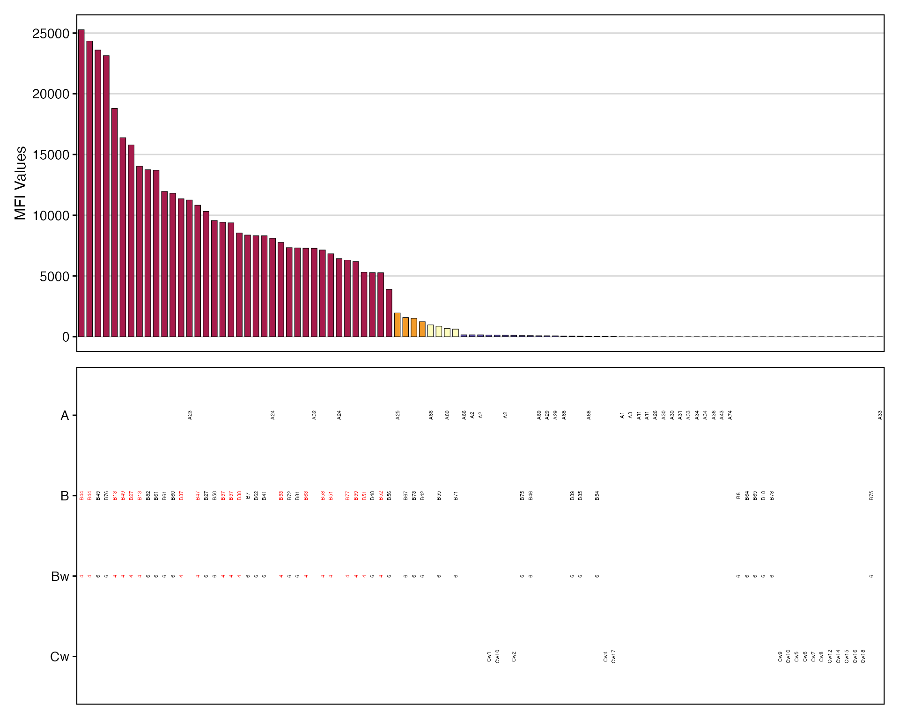
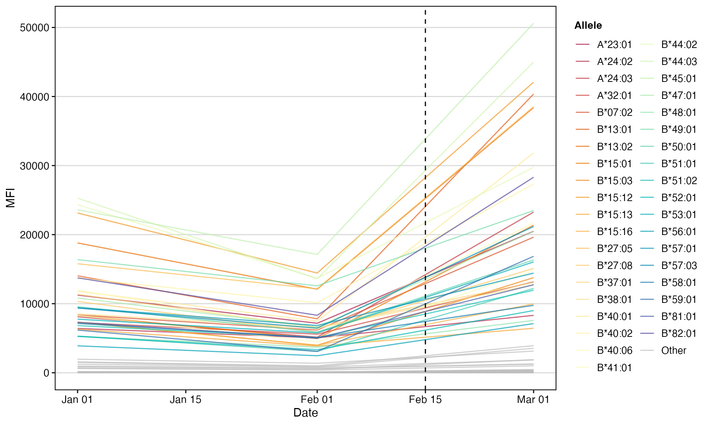
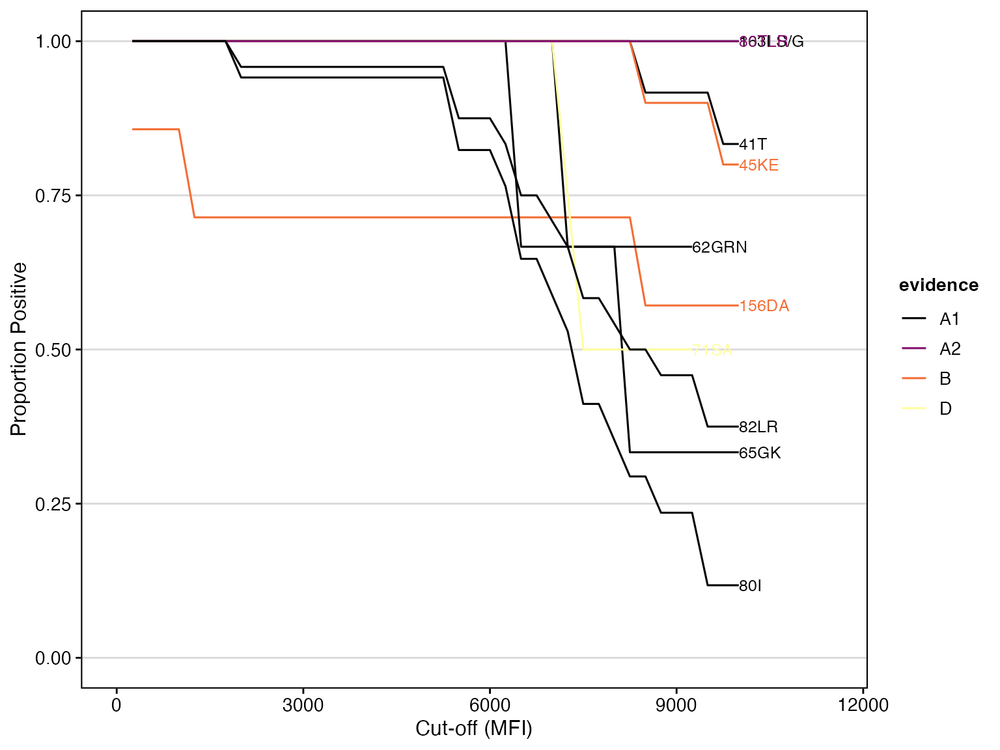
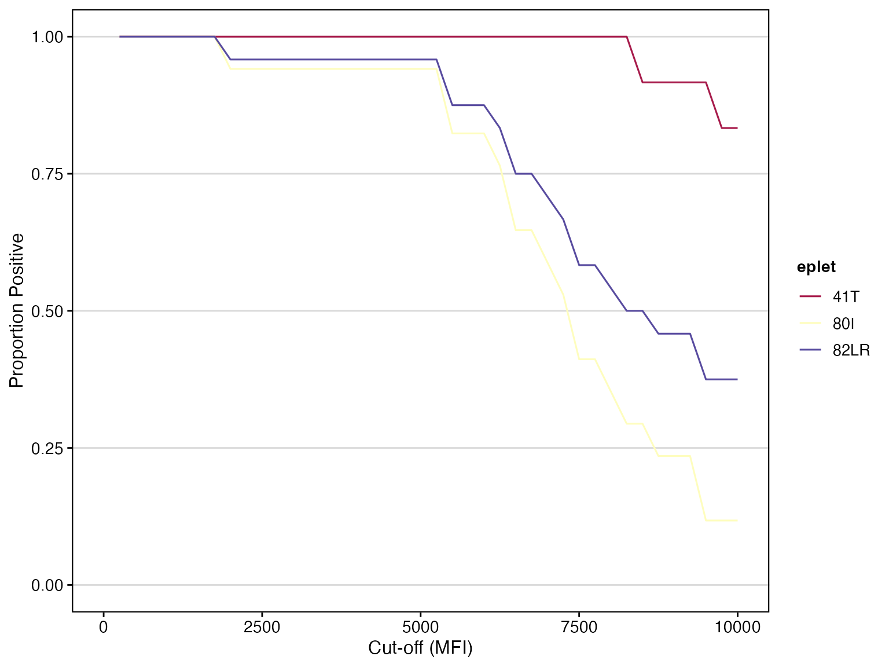
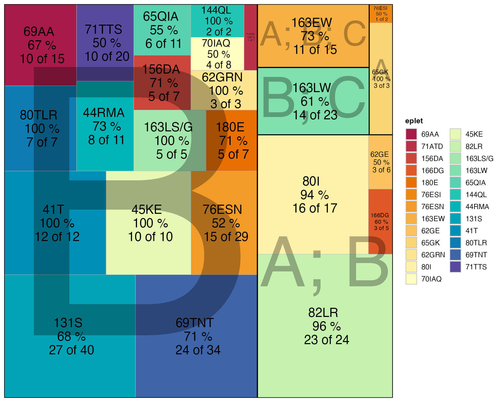
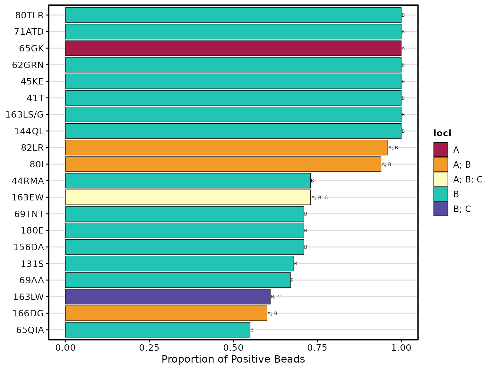
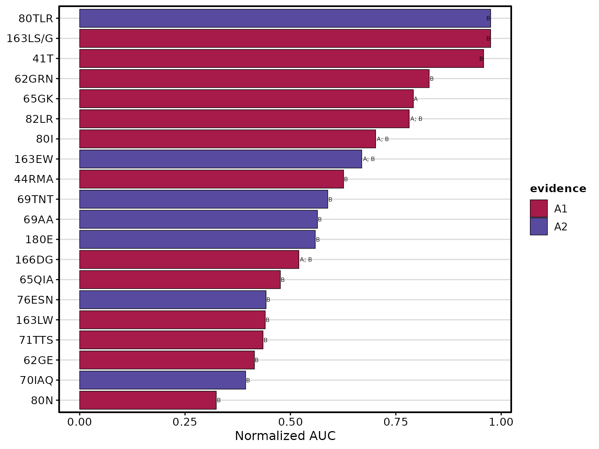

# Getting Started with deepMatchR

## Introduction

Human leukocyte antigen (HLA) molecules are central to both innate and
adaptive immune responses. Characterizing HLA antibodies and typing
plays a pivotal role in bone marrow and solid organ transplantation.

**deepMatchR** provides a collection of tools that use advanced
statistical approaches and deep learning to better characterize HLA
immunogenicity for clinical and research applications.

**Key capabilities include:**

- Sequence-level mismatch quantification (amino acid and eplet)
- Peptide-MHC binding prediction
- Visualization of antibody reactivity data
- Integration with standard HLA nomenclature

For more information, visit the [deepMatchR GitHub
repository](https://github.com/BorchLab/deepMatchR).

### Installation

``` r
# Install from Bioconductor (when available)
if (!requireNamespace("BiocManager", quietly = TRUE))
    install.packages("BiocManager")
BiocManager::install("deepMatchR")

# Or install the development version from GitHub
# remotes::install_github("BorchLab/deepMatchR")
```

### Quick Start

``` r
library(deepMatchR)
library(dplyr)
library(ggplot2)
```

## Working with HLA Data

### Built-in Example Data

**deepMatchR** includes simulated assay data for learning and testing:

1.  **Class I SAB** - Single Antigen Bead assay results
2.  **Class II SAB** - Single Antigen Bead assay results
3.  **PRA** - Panel Reactive Antibody assay results

``` r
data("deepMatchR_example")
```

#### Data Format Requirements

For downstream analysis, your data must include these columns:

| Column        | Description             | Example            |
|---------------|-------------------------|--------------------|
| `BeadID`      | Unique bead identifier  | 1, 2, 3…           |
| `SpecAbbr`    | Abbreviated specificity | A01, B35           |
| `Specificity` | Full specificity string | “A*01:01, B*07:01” |
| `NormalValue` | Measured MFI value      | 15234              |

``` r
# Class I SAB example
head(deepMatchR_example[[1]], 3)
#>   BeadID         SpecAbbr       Specificity NormalValue  RawData CountValue
#> 1      1  -,-,-,-,-,-,-,-       -,-,-,-,-,-          NA    48.04         77
#> 2      2  -,-,-,-,-,-,-,-       -,-,-,-,-,-          NA 14068.42         78
#> 3      3 A1,-,-,-,-,-,-,- A*01:01,-,-,-,-,-           0    37.41         73

# Class II SAB example
head(deepMatchR_example[[2]], 3)
#>   BeadID          SpecAbbr                      Specificity  RawData
#> 1      1   -,-,-,-,-,-,-,-          -,-,-,-,-,-,-,-,-,-,-,-    15.51
#> 2      2   -,-,-,-,-,-,-,-          -,-,-,-,-,-,-,-,-,-,-,- 13759.52
#> 3      3 DR1,-,-,-,-,-,-,- DRB1*01:01,-,-,-,-,-,-,-,-,-,-,-   131.86
#>   NormalValue CountValue
#> 1          NA        128
#> 2          NA         56
#> 3       75.22        117

# PRA example
head(deepMatchR_example[[3]], 3)
#>     BeadID               SpecAbbr                         Specificity
#> 98       1                                                           
#> 99       2                                                           
#> 100      3 A2,-,B46,-,Bw6,-,Cw1,- A*02:01,A*02:07,B*46:01,-,C*01:02,-
#>     NormalValue RawData CountValue
#> 98           NA   12.13        272
#> 99           NA 9209.35        277
#> 100       551.9  602.17        152
```

### Creating HLA Genotypes

The
[`hlaGeno()`](https://www.borch.dev/uploads/deepMatchR/reference/hlaGeno.md)
function creates standardized genotype objects used throughout the
package.

``` r
# Define recipient and donor genotypes
recipient <- data.frame(
  A_1 = "A*01:01", A_2 = "A*02:01",
  B_1 = "B*07:02", B_2 = "B*08:01",
  DQA1_1 = "DQA1*02:01", DQA1_2 = "DQA1*05:05",
  DQB1_1 = "DQB1*02:02", DQB1_2 = "DQB1*03:01"
)

donor <- data.frame(
  A_1 = "A*03:01", A_2 = "A*24:02",
  B_1 = "B*44:02", B_2 = "B*51:01",
  DQA1_1 = "DQA1*05:05", DQA1_2 = "DQA1*01:02",
  DQB1_1 = "DQB1*06:02", DQB1_2 = "DQB1*03:01"
)

# Create genotype objects
rgeno <- hlaGeno(recipient)
dgeno <- hlaGeno(donor)
```

## Sequence-Level Analysis

### Retrieving Allele Sequences

The
[`getAlleleSequence()`](https://www.borch.dev/uploads/deepMatchR/reference/getAlleleSequence.md)
function retrieves protein sequences from the IMGT/HLA database.

``` r
# Get the amino acid sequence for A*01:01
a0101_seq <- getAlleleSequence("A*01:01")
```

``` r
# View first 50 amino acids
substr(a0101_seq, 1, 50)
#> [1] "MAVMAPRTLLLLLSGALALTQTWAGSHSMRYFFTSVSRPGRGEPRFIAVG"
```

### Quantifying Amino Acid Mismatches

The
[`quantifyMismatch()`](https://www.borch.dev/uploads/deepMatchR/reference/quantifyMismatch.md)
function compares two protein sequences and counts differences. You can
optionally filter by biophysical properties.

#### Basic Usage

``` r
seq1 <- "YFAMYGEKVAHTHVDTLYVRYHY"
seq2 <- "YFDMYGEKVAHTHVDTLYVRFHY"

# Count all mismatches
quantifyMismatch(seq1, seq2)
#> [1] 2
```

#### Filtering by Biophysical Properties

**deepMatchR** uses these classification models:

- **Charge:** K/R/H = positive; D/E = negative; others = neutral
- **Polarity:** Nonpolar {A,V,L,I,P,M,F,W,G}; Polar
  {S,T,N,Q,Y,C,H,K,R,D,E}

``` r
# Only charge-changing mismatches
quantifyMismatch(seq1, 
                 seq2, 
                 filter_charge = TRUE)
#> [1] 1

# Only polarity-changing mismatches
quantifyMismatch(seq1, 
                 seq2, 
                 filter_polarity = TRUE)
#> [1] 2

# Both charge AND polarity changing
quantifyMismatch(seq1, 
                 seq2, 
                 filter_charge = TRUE, 
                 filter_polarity = TRUE)
#> [1] 1
```

#### Detailed Position-by-Position Analysis

``` r
details <- quantifyMismatch(seq1, 
                            seq2, 
                            return = "detail")
head(details)
#>   alignment_position ref alt is_gap_ref is_gap_alt is_mismatch charge_ref
#> 1                  1   Y   Y      FALSE      FALSE       FALSE        neu
#> 2                  2   F   F      FALSE      FALSE       FALSE        neu
#> 3                  3   A   D      FALSE      FALSE        TRUE        neu
#> 4                  4   M   M      FALSE      FALSE       FALSE        neu
#> 5                  5   Y   Y      FALSE      FALSE       FALSE        neu
#> 6                  6   G   G      FALSE      FALSE       FALSE        neu
#>   charge_alt charge_change polarity_ref polarity_alt polarity_change counted
#> 1        neu         FALSE        polar        polar           FALSE   FALSE
#> 2        neu         FALSE     nonpolar     nonpolar           FALSE   FALSE
#> 3        neg          TRUE     nonpolar        polar            TRUE    TRUE
#> 4        neu         FALSE     nonpolar     nonpolar           FALSE   FALSE
#> 5        neu         FALSE        polar        polar           FALSE   FALSE
#> 6        neu         FALSE     nonpolar     nonpolar           FALSE   FALSE
```

The detail output includes:

- `is_mismatch`: Whether amino acids differ at this position
- `charge_change` / `polarity_change`: Whether that property changed
- `counted`: Whether this position counts toward the final tally

#### Function Reference

| Argument | Default | Description |
|----|----|----|
| `sequence1`, `sequence2` | – | Two protein sequences (same length) |
| `filter_charge` | `NULL` | Filter by charge change (`TRUE`/`FALSE`/`NULL`) |
| `filter_polarity` | `NULL` | Filter by polarity change (`TRUE`/`FALSE`/`NULL`) |
| `return` | `"count"` | Output type: `"count"` or `"detail"` |
| `na_action` | `"exclude"` | Handle unknown residues: `"exclude"`, `"error"`, `"count"` |

## Donor-Recipient Matching

### Calculating Mismatch Load

The
[`calculateMismatchLoad()`](https://www.borch.dev/uploads/deepMatchR/reference/calculateMismatchLoad.md)
function aggregates amino acid mismatches across HLA loci between a
donor and recipient.

#### Total Mismatch Load

``` r
calculateMismatchLoad(rgeno, 
                      dgeno, 
                      parallel = FALSE)
#> [1] 378
```

#### Per-Locus Breakdown

``` r
per_locus <- calculateMismatchLoad(
  rgeno, dgeno,
  return = "per_locus",
  parallel = FALSE
)
per_locus
#>   locus mismatch_load
#> 1     A            96
#> 2     B           128
#> 3  DQA1            71
#> 4  DQB1            83
```

#### Pairwise Allele Matrix

View mismatches between each recipient-donor allele pair at a specific
locus:

``` r
mB <- calculateMismatchLoad(
  rgeno, dgeno,
  return = "pairwise",
  pairwise_locus = "B",
  parallel = FALSE
)
mB
#>          donor
#> recipient B*44:02 B*51:01
#>   B*07:02      37      33
#>   B*08:01      31      27
```

#### Applying Filters

``` r
# Charge-changing mismatches only
calculateMismatchLoad(rgeno, 
                      dgeno, 
                      filter_charge = TRUE, 
                      parallel = FALSE)
#> [1] 140

# Polarity-changing mismatches only
calculateMismatchLoad(rgeno, 
                      dgeno, 
                      filter_polarity = TRUE, 
                      parallel = FALSE)
#> [1] 138

# Restrict to specific loci
calculateMismatchLoad(rgeno, 
                      dgeno, 
                      loci = "A", 
                      parallel = FALSE)
#> [1] 96
```

#### Function Reference

| Argument | Default | Description |
|----|----|----|
| `recipient_geno`, `donor_geno` | – | HLA genotypes from [`hlaGeno()`](https://www.borch.dev/uploads/deepMatchR/reference/hlaGeno.md) |
| `loci` | `NULL` | Restrict to specific loci (e.g., `c("A","B")`) |
| `filter_charge`, `filter_polarity` | `NULL` | Biophysical filters |
| `return` | `"total"` | `"total"`, `"per_locus"`, or `"pairwise"` |
| `pairwise_locus` | `NULL` | Locus for pairwise matrix |
| `parallel` | `TRUE` | Use parallel processing |

## Eplet Analysis

Eplets are short amino acid sequences that form antibody-binding
epitopes on HLA molecules. They are key determinants of HLA
immunogenicity.

### Quantifying Eplet Mismatches

The
[`quantifyEpletMismatch()`](https://www.borch.dev/uploads/deepMatchR/reference/quantifyEpletMismatch.md)
function calculates the number of non-shared eplets between two alleles.

``` r
# Basic eplet comparison (A1/A2 evidence level)
quantifyEpletMismatch("A*01:01", 
                      "A*02:01")
#> [1] 13

# Filter by exposition level
quantifyEpletMismatch("B*07:02", 
                      "B*44:02", 
                      exposition_filter = "High")
#> [1] 6

# Filter by reactivity confirmation
quantifyEpletMismatch("C*07:01", 
                      "C*06:02",
                      evidence_level = NULL,
                      reactivity_filter = "Confirmed")
#> [1] 9
```

### Calculating Eplet Load

The
[`calculateEpletLoad()`](https://www.borch.dev/uploads/deepMatchR/reference/calculateEpletLoad.md)
function calculates total donor-specific eplets across all loci.

#### Total Eplet Load

``` r
calculateEpletLoad(rgeno, 
                   dgeno)
#> [1] 19
```

#### Per-Locus Summary

``` r
per <- calculateEpletLoad(rgeno, 
                          dgeno, 
                          return = "per_locus")
per
#>   locus eplet_load
#> 1     A          4
#> 2     B          6
#> 3  DQA1          1
#> 4  DQB1          8
```

#### Pairwise Allele Matrix

``` r
mB <- calculateEpletLoad(
  rgeno, dgeno,
  return = "pairwise",
  pairwise_locus = "B"
)
mB
#>          donor
#> recipient B*44:02 B*51:01
#>   B*07:02       5       4
#>   B*08:01       4       3
```

#### Applying Evidence and Exposition Filters

``` r
# High-exposition eplets only
calculateEpletLoad(rgeno, 
                   dgeno, 
                   exposition_filter = "High")
#> [1] 15

# Antibody-confirmed eplets only
calculateEpletLoad(rgeno, 
                   dgeno, 
                   reactivity_filter = "Confirmed")
#> [1] 19

# All evidence levels (no filter)
calculateEpletLoad(rgeno, 
                   dgeno, 
                   evidence_level = NULL)
#> [1] 79
```

## Peptide Binding Prediction

### MHCnuggets Integration

The
[`predictMHCnuggets()`](https://www.borch.dev/uploads/deepMatchR/reference/predictMHCnuggets.md)
function provides an R interface to the MHCnuggets deep learning model
for peptide-MHC binding prediction.

> **Note:** This section requires Python dependencies and is skipped on
> Windows due to path length limitations with the TensorFlow/MHCnuggets
> installation.

``` r
# Define peptides and allele
peptides <- c("SIINFEKL", "LLFGYPVYV")
allele <- "A*02:01"

# Predict binding affinity (IC50)
binding_results <- predictMHCnuggets(
  peptides = peptides,
  allele = allele,
  mhc_class = "I",
  rank_output = TRUE
)
#> Predicting for 2 peptides
#> Number of peptides skipped/total due to length 0 / 0
#> Building model
#> Closest allele found HLA-A02:01
#> BA_to_HLAp model found, predicting with BA_to_HLAp model...
#> Rank output selected, computing peptide IC50 ranks against human proteome peptides...
#> Writing output files...

print(binding_results)
#>     peptide    ic50
#> 1  SIINFEKL 5600.06
#> 2 LLFGYPVYV  535.92
```

### Calculating Peptide Binding Load

The
[`calculatePeptideBindingLoad()`](https://www.borch.dev/uploads/deepMatchR/reference/calculatePeptideBindingLoad.md)
function predicts transplant risk by analyzing peptide-HLA binding
between recipient molecules and donor-derived peptides.

**Workflow:**

1.  **Input processing** - Standardizes recipient/donor allele formats
2.  **Peptide derivation** - Generates mismatched peptides from sequence
    differences
3.  **Binding prediction** - Predicts IC50 using PWM, NetMHCpan, or
    MHCflurry
4.  **Risk calculation** - Aggregates predictions into risk scores

#### Total Risk Score

``` r
total_risk <- calculatePeptideBindingLoad(
  recipient = rgeno,
  donor = dgeno,
  return = "total"
)
print(total_risk)
#> [1] 0
```

#### Per-Allele Summary

``` r
summary_load <- calculatePeptideBindingLoad(
  recipient = rgeno,
  donor = dgeno,
  return = "summary"
)
print(summary_load)
#>   hla_allele n_peptides n_strong n_weak risk_contribution
#> 1    A*01:01          0        0      0                 0
#> 2    A*02:01          0        0      0                 0
#> 3    B*07:02          0        0      0                 0
#> 4    B*08:01          0        0      0                 0
#> 5 DQA1*02:01          0        0      0                 0
#> 6 DQA1*05:05          0        0      0                 0
#> 7 DQB1*02:02          0        0      0                 0
#> 8 DQB1*03:01          0        0      0                 0
```

#### Detailed Peptide-Level Results

``` r
detailed_load <- calculatePeptideBindingLoad(
  recipient = rgeno,
  donor = dgeno,
  return = "detail"
)
head(detailed_load)
#> [1] peptide        hla_allele     predicted_ic50 binding_level  contribution  
#> <0 rows> (or 0-length row.names)
```

## Visualizing Antibody Data

### Antibody Plots with `plotAntibodies()`

The
[`plotAntibodies()`](https://www.borch.dev/uploads/deepMatchR/reference/plotAntibodies.md)
function creates publication-quality visualizations of SAB and PRA assay
data.

#### SAB Bar Plot

``` r
plotAntibodies(
  result_file = deepMatchR_example[[1]],
  type = "SAB",
  bead_cutoffs = c(2000, 1000, 500, 250),
  add_table = TRUE,
  palette = "spectral",
  highlight_antigen = c("Bw4")
)
```



#### PRA Bar Plot

``` r
plotAntibodies(
  result_file = deepMatchR_example[[3]],
  type = "PRA",
  class = "I",
  add_table = TRUE,
  palette = "spectral"
)
```


#### Time-Series Trend Plot

Track antibody levels over multiple time points:

``` r
# Simulate longitudinal data
set.seed(123)
sab_data_list <- list(
  "01/01/2023" = deepMatchR_example[[1]],
  "02/01/2023" = deepMatchR_example[[1]] %>%
    mutate(NormalValue = NormalValue * runif(n(), 0.5, 0.8)),
  "03/01/2023" = deepMatchR_example[[1]] %>%
    mutate(NormalValue = NormalValue * runif(n(), 1, 3))
)

plotAntibodies(
  result_file = sab_data_list,
  type = "SAB",
  plot_trend = TRUE,
  highlight_threshold = 5000,
  vline_dates = c("2023-02-15")
)
```



### Eplet Reactivity Analysis with `epletAUC()`

The
[`epletAUC()`](https://www.borch.dev/uploads/deepMatchR/reference/calculateAUC.md)
function calculates the Area Under the Curve (AUC) for eplet reactivity
across multiple MFI thresholds. This provides a more robust measure than
a single cutoff.

#### Visualize Reactivity Curves

``` r
epletAUC(
  result_file = deepMatchR_example[[1]],
  group_by = "evidence",
  evidence_level = c("A1", "A2", "B", "D"),
  plot_results = TRUE,
  cut_min = 250,
  cut_max = 10000,
  cut_step = 250,
  palette = "inferno"
)
```



#### Get AUC Values as Data

``` r
auc_result <- epletAUC(
  result_file = deepMatchR_example[[1]],
  plot_results = FALSE,
  cut_min = 250,
  cut_max = 10000,
  cut_step = 250
)
head(auc_result)
#>     eplet      AUC total_count   loci  norm_AUC
#>    <char>    <num>       <int> <char>     <num>
#> 1:   82LR 7817.708          24   A; B 0.7817708
#> 2:    80I 7022.059          17   A; B 0.7022059
#> 3:   69AA 5641.667          15      B 0.5641667
#> 4:  163EW 6691.667          15   A; B 0.6691667
#> 5:    41T 9583.333          12      B 0.9583333
#> 6:  65QIA 4761.364          11      B 0.4761364
```

#### Advanced Filtering

``` r
epletAUC(
  result_file = deepMatchR_example[[1]],
  label = FALSE,
  plot_results = TRUE,
  eplet_filter = 10,      # Minimum bead count
  percPos_filter = 1.0    # Minimum positivity threshold
)
```



### Eplet Visualization with `plotEplets()`

The
[`plotEplets()`](https://www.borch.dev/uploads/deepMatchR/reference/plotEplets.md)
function offers three visualization types for eplet reactivity data.

#### Treemap View

Ideal for an overview of eplet prominence. Tile area represents
importance (positive beads x positivity rate):

``` r
plotEplets(
  result_file = deepMatchR_example[[1]],
  plot_type = "treemap",
  cutoff = 2000,
  evidence_level = c("A1", "A2", "B"),
  percPos_filter = 0.4,
  palette = "spectral"
)
```



#### Bar Plot

Ranks eplets by positivity rate at a specific threshold:

``` r
plotEplets(
  result_file = deepMatchR_example[[1]],
  plot_type = "bar",
  group_by = "loci",
  cutoff = 2000,
  evidence_level = c("A1", "A2", "B"),
  percPos_filter = 0.4,
  top_eplets = 20,
  palette = "spectral"
)
```



#### AUC Bar Plot

Ranks eplets by performance across multiple thresholds:

``` r
plotEplets(
 result_file = deepMatchR_example[[1]],
  plot_type = "AUC",
  percPos_filter = 0.4,
  group_by = "evidence_level",
  cut_min = 250,
  cut_max = 10000,
  cut_step = 250,
  top_eplets = 20,
  palette = "spectral"
)
```



## Session Information

``` r
sessionInfo()
#> R version 4.5.0 (2025-04-11)
#> Platform: aarch64-apple-darwin20
#> Running under: macOS Sonoma 14.0
#> 
#> Matrix products: default
#> BLAS:   /Library/Frameworks/R.framework/Versions/4.5-arm64/Resources/lib/libRblas.0.dylib 
#> LAPACK: /Library/Frameworks/R.framework/Versions/4.5-arm64/Resources/lib/libRlapack.dylib;  LAPACK version 3.12.1
#> 
#> locale:
#> [1] en_US.UTF-8/en_US.UTF-8/en_US.UTF-8/C/en_US.UTF-8/en_US.UTF-8
#> 
#> time zone: America/Chicago
#> tzcode source: internal
#> 
#> attached base packages:
#> [1] stats     graphics  grDevices utils     datasets  methods   base     
#> 
#> other attached packages:
#> [1] ggplot2_4.0.1     dplyr_1.1.4       deepMatchR_0.99.0 BiocStyle_2.36.0 
#> 
#> loaded via a namespace (and not attached):
#>  [1] ggfittext_0.10.3        gtable_0.3.6            dir.expiry_1.16.0      
#>  [4] xfun_0.55               bslib_0.9.0             htmlwidgets_1.6.4      
#>  [7] lattice_0.22-7          quadprog_1.5-8          vctrs_0.6.5            
#> [10] tools_4.5.0             generics_0.1.4          stats4_4.5.0           
#> [13] parallel_4.5.0          tibble_3.3.0            pkgconfig_2.0.3        
#> [16] Matrix_1.7-4            data.table_1.18.0       RColorBrewer_1.1-3     
#> [19] S7_0.2.1                desc_1.4.3              S4Vectors_0.46.0       
#> [22] readxl_1.4.5            lifecycle_1.0.4         GenomeInfoDbData_1.2.14
#> [25] compiler_4.5.0          farver_2.1.2            textshaping_1.0.4      
#> [28] Biostrings_2.76.0       GenomeInfoDb_1.44.3     htmltools_0.5.9        
#> [31] sass_0.4.10             yaml_2.3.12             pillar_1.11.1          
#> [34] pkgdown_2.2.0           crayon_1.5.3            jquerylib_0.1.4        
#> [37] cachem_1.1.0            basilisk_1.20.0         tidyselect_1.2.1       
#> [40] rvest_1.0.5             digest_0.6.39           stringi_1.8.7          
#> [43] bookdown_0.46           labeling_0.4.3          fastmap_1.2.0          
#> [46] grid_4.5.0              treemapify_2.6.0        cli_3.6.5              
#> [49] magrittr_2.0.4          patchwork_1.3.2         withr_3.0.2            
#> [52] filelock_1.0.3          scales_1.4.0            UCSC.utils_1.4.0       
#> [55] pwalign_1.4.0           rmarkdown_2.30          XVector_0.48.0         
#> [58] httr_1.4.7              otel_0.2.0              reticulate_1.44.1      
#> [61] cellranger_1.1.0        ragg_1.5.0              png_0.1-8              
#> [64] memoise_2.0.1           evaluate_1.0.5          knitr_1.51             
#> [67] IRanges_2.42.0          basilisk.utils_1.20.0   immReferent_0.99.0     
#> [70] rlang_1.1.6             Rcpp_1.1.0              glue_1.8.0             
#> [73] BiocManager_1.30.27     xml2_1.5.1              directlabels_2025.6.24 
#> [76] BiocGenerics_0.54.1     svglite_2.2.2           rstudioapi_0.17.1      
#> [79] jsonlite_2.0.0          R6_2.6.1                systemfonts_1.3.1      
#> [82] fs_1.6.6
```

## Getting Help

If you have questions, suggestions, or encounter issues:

- **GitHub Issues:**
  [github.com/ncborcherding/deepMatchR/issues](https://github.com/ncborcherding/deepMatchR/issues)
