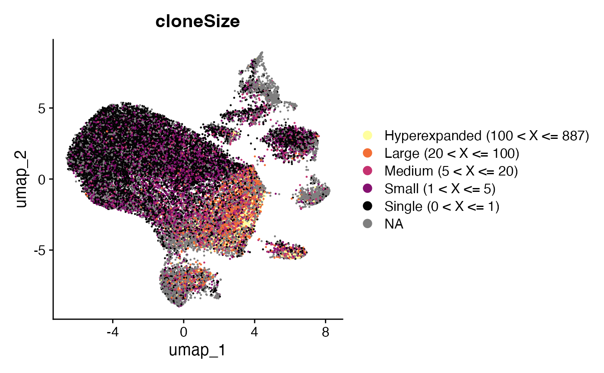

# Combining Clones and Single-Cell Objects

## Note on Dimensional Reduction

In single-cell RNA sequencing workflows, dimensional reduction is
typically performed by first identifying highly variable features. These
features are then used directly for UMAP/tSNE projection or as inputs
for principal component analysis. The same approach is commonly applied
to clustering as well.

However, in immune-focused datasets, VDJ genes from TCR and BCR are
often among the most variable genes. This variability arises naturally
due to clonal expansion and diversity within lymphocytes. As a result,
UMAP projections and clustering outcomes may be influenced by clonal
information rather than broader transcriptional differences across cell
types.

To mitigate this issue, a common strategy is to exclude VDJ genes from
the set of highly variable features before proceeding with clustering
and dimensional reduction. We introduce a set of functions that
facilitate this process by removing VDJ-related genes from either a
Seurat Object or a vector of gene names (useful for SCE-based
workflows).

### Functions to Exclude VDJ Genes

- [`quietVDJgenes()`](https://www.borch.dev/uploads/scRepertoire/reference/quietVDJgenes.md)
  – Removes both TCR and BCR VDJ genes.
- [`quietTCRgenes()`](https://www.borch.dev/uploads/scRepertoire/reference/quietVDJgenes.md)
  – Removes only TCR VDJ genes.
- [`quietBCRgenes()`](https://www.borch.dev/uploads/scRepertoire/reference/quietVDJgenes.md)
  – Removes only BCR VDJ genes, but retains BCR VDJ pseudogenes in the
  variable features.

Let’s first check the top 10 variable features in the scRep_example
Seurat object before any removal:

``` r
# Check the first 10 variable features before removal
VariableFeatures(scRep_example)[1:10]
```

    ##  [1] "TRBV7-2"  "HSPA1B"   "HSPA1A"   "TRBV4-1"  "CCL4"     "TRBV5-1" 
    ##  [7] "TRBV10-3" "TRBV3-1"  "TRBV6-6"  "CD79A"

Now, we’ll remove TCR VDJ genes from the scRep_example object:

``` r
# Remove TCR VDJ genes
scRep_example <- quietTCRgenes(scRep_example)

# Check the first 10 variable features after removal
VariableFeatures(scRep_example)[1:10]
```

    ##  [1] "HSPA1B"  "HSPA1A"  "CCL4"    "CD79A"   "HLA-DRA" "CCL20"   "TUBA1B" 
    ##  [8] "HSPA6"   "TNF"     "MS4A1"

By applying these functions, you can ensure that clustering and
dimensional reduction are driven by broader transcriptomic differences
across cell types rather than being skewed by the inherent variability
due to clonal expansion. This provides a more accurate representation of
cellular heterogeneity independent of clonal lineage.

## Preprocessed Single-Cell Object

The data in the `scRepertoire` package is derived from a
[study](https://pubmed.ncbi.nlm.nih.gov/33622974/) of acute respiratory
stress disorder in the context of bacterial and COVID-19 infections. The
internal single cell data
([`scRep_example()`](https://www.borch.dev/uploads/scRepertoire/reference/scRep_example.md))
built in to scRepertoire is randomly sampled 500 cells from the fully
integrated Seurat object to minimize the package size. However, for the
purpose of the vignette we will use the full single-cell object with
30,000 cells. We will use both Seurat and Single-Cell Experiment (SCE)
with `scater` to perform further visualizations in tandem.

### Demonstrating Preprocessed Object Loading

Here’s how to load the full single-cell object and convert it to a
Single-Cell Experiment object:

``` r
scRep_example <- readRDS("scRep_example_full.rds")

#Making a Single-Cell Experiment object
sce <- Seurat::as.SingleCellExperiment(scRep_example)
```

## combineExpression

After processing the contig data into clones via
[`combineBCR()`](https://www.borch.dev/uploads/scRepertoire/reference/combineBCR.md)
or
[`combineTCR()`](https://www.borch.dev/uploads/scRepertoire/reference/combineTCR.md),
we can add the clonal information to the single-cell object using
[`combineExpression()`](https://www.borch.dev/uploads/scRepertoire/reference/combineExpression.md).

**Importantly**, the major requirement for the attachment is matching
contig cell barcodes and barcodes in the row names of the metadata of
the Seurat or Single-Cell Experiment object. If these do not match, the
attachment will fail. We suggest making changes to the single-cell
object barcodes for ease of use.

### Calculating `cloneSize`

Part of
[`combineExpression()`](https://www.borch.dev/uploads/scRepertoire/reference/combineExpression.md)
is calculating the clonal frequency and proportion, placing each clone
into groups called `cloneSize`. The default `cloneSize` argument uses
the following bins:
`c(Rare = 1e-4, Small = 0.001, Medium = 0.01, Large = 0.1, Hyperexpanded = 1)`,
which can be modified to include more/less bins or different names.

Clonal frequency and proportion are dependent on the repertoires being
compared. You can modify the calculation using the `group.by` parameter,
such as grouping by a Patient variable. If `group.by` is not set,
[`combineExpression()`](https://www.borch.dev/uploads/scRepertoire/reference/combineExpression.md)
will calculate clonal frequency, proportion, and `cloneSize` as a
function of individual sequencing runs. Additionally, `cloneSize` can
use the frequency of clones when `proportion = FALSE`.

Key Parameter(s) for
[`combineExpression()`](https://www.borch.dev/uploads/scRepertoire/reference/combineExpression.md)

- `input.data`: The product of
  [`combineTCR()`](https://www.borch.dev/uploads/scRepertoire/reference/combineTCR.md),
  [`combineBCR()`](https://www.borch.dev/uploads/scRepertoire/reference/combineBCR.md),
  or a list containing both.
- `sc.data`: The Seurat or Single-Cell Experiment (SCE) object to attach
  the clonal data to.
- `proportion`: If `TRUE` (default), calculates the proportion of the
  clone; if `FALSE`, calculates total frequency.
- `cloneSize`: Bins for grouping based on proportion or frequency. If
  proportion is `FALSE` and cloneSize bins are not set high enough, the
  upper limit will automatically adjust.
- `filterNA`: Method to subset the Seurat/SCE object of barcodes without
  clone information.
- `addLabel`: Adds a label to the frequency header, useful for trying
  multiple group.by variables or recalculating frequencies after
  subsetting.

We can look at the default cloneSize groupings using the Single-Cell
Experiment object we just created, with group.by set to the sample
variable used in combineTCR():

``` r
sce <- combineExpression(combined.TCR, 
                         sce, 
                         cloneCall="gene", 
                         group.by = "sample", 
                         proportion = TRUE)

#Define color palette 
colorblind_vector <- hcl.colors(n=7, palette = "inferno", fixup = TRUE)

plotUMAP(sce, colour_by = "cloneSize") +
    scale_color_manual(values=rev(colorblind_vector[c(1,3,5,7)]))
```



Alternatively, if we want `cloneSize` to be based on the frequency of
the clone, we can set proportion = FALSE and will need to change the
`cloneSize` bins to integers. If we haven’t inspected our clone data,
setting the upper limit of the clonal frequency might be difficult;
[`combineExpression()`](https://www.borch.dev/uploads/scRepertoire/reference/combineExpression.md)
will automatically adjust the upper limit to fit the distribution of the
frequencies.

``` r
scRep_example <- combineExpression(combined.TCR, 
                                   scRep_example, 
                                   cloneCall="gene", 
                                   group.by = "sample", 
                                   proportion = FALSE, 
                                   cloneSize=c(Single=1, Small=5, Medium=20, Large=100, Hyperexpanded=500))

Seurat::DimPlot(scRep_example, group.by = "cloneSize") +
    scale_color_manual(values=rev(colorblind_vector[c(1,3,4,5,7)]))
```


### Combining both TCR and BCR

If you have both TCR and BCR enrichment data, or wish to include
information for both gamma-delta and alpha-beta T cells, you can create
a single list containing the outputs of
[`combineTCR()`](https://www.borch.dev/uploads/scRepertoire/reference/combineTCR.md)
and
[`combineBCR()`](https://www.borch.dev/uploads/scRepertoire/reference/combineBCR.md)
and then use
[`combineExpression()`](https://www.borch.dev/uploads/scRepertoire/reference/combineExpression.md).

**Major Note**: If there are duplicate barcodes (e.g., if a cell has
both Ig and TCR information), the immune receptor information will not
be added for those cells. It might be worth checking cluster identities
and removing incongruent barcodes in the products of
[`combineTCR()`](https://www.borch.dev/uploads/scRepertoire/reference/combineTCR.md)
and
[`combineBCR()`](https://www.borch.dev/uploads/scRepertoire/reference/combineBCR.md).
As an anecdote, the [testing
data](https://support.10xgenomics.com/single-cell-vdj/datasets/6.0.1/SC5v2_Melanoma_5Kcells_Connect_single_channel_SC5v2_Melanoma_5Kcells_Connect_single_channel)
used to improve this function showed 5-6% barcode overlap.

``` r
#This is an example of the process, which will not be evaluated during knit
TCR <- combineTCR(...)
BCR <- combineBCR(...)
list.receptors <- c(TCR, BCR)


seurat <- combineExpression(list.receptors, 
                            seurat, 
                            cloneCall="gene", 
                            proportion = TRUE)
```

[`combineExpression()`](https://www.borch.dev/uploads/scRepertoire/reference/combineExpression.md)
is a core function in `scRepertoire` that bridges the immune repertoire
data with single-cell gene expression data. It enriches your Seurat or
SCE object with crucial clonal information, including calculated
frequencies and proportions, allowing for integrated analysis of
cellular identity and clonal dynamics. Its flexibility in defining
`cloneSize` and handling various grouping scenarios makes it adaptable
to diverse experimental designs, even accommodating the integration of
both TCR and BCR data.

## Next Steps

- [Visualizations for Single-Cell
  Objects](https://www.borch.dev/uploads/scRepertoire/articles/SC_Visualizations.md) -
  Alluvial plots, chord diagrams, clonal networks, and UMAP overlays.
- [Quantifying Clonal
  Bias](https://www.borch.dev/uploads/scRepertoire/articles/Clonal_Bias.md) -
  Measure clonal expansion bias across clusters.
- [Basic Clonal
  Visualizations](https://www.borch.dev/uploads/scRepertoire/articles/Clonal_Visualizations.md) -
  Clonal abundance, length distributions, and scatter plots.
