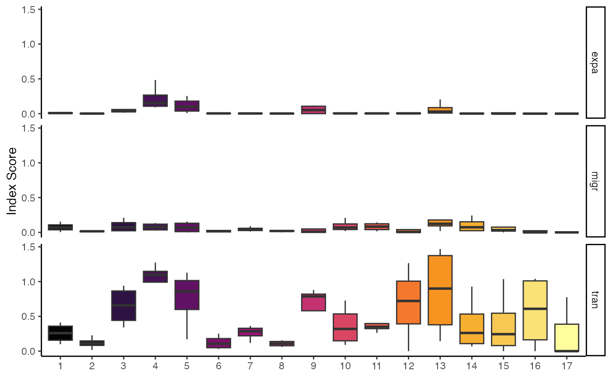
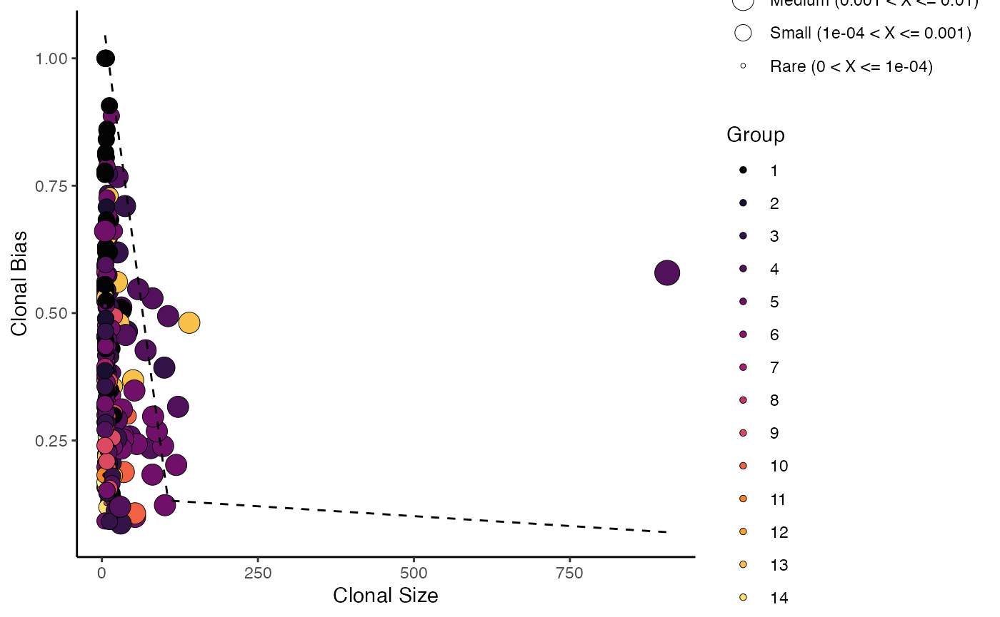
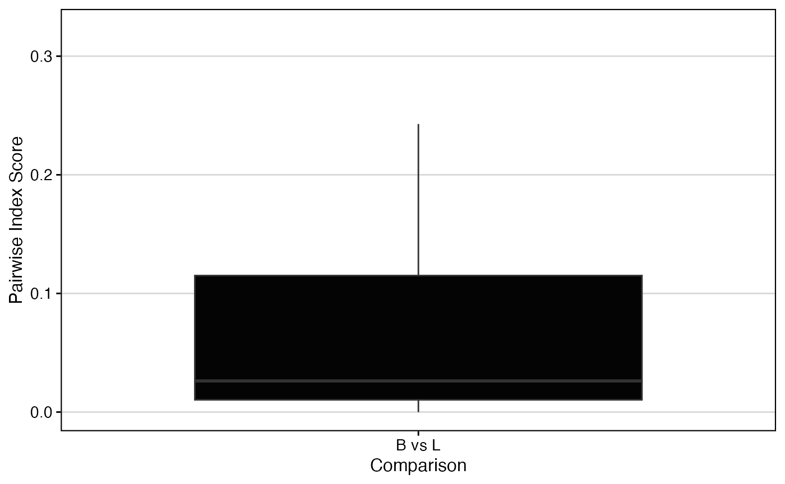
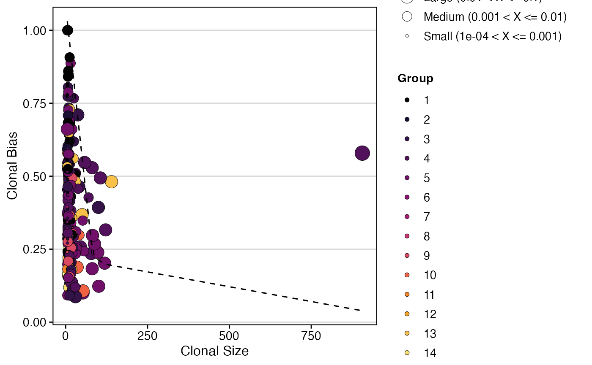

# Quantifying Clonal Bias

## StartracDiversity

From the excellent work by [Zhang et al. (2018,
Nature)](https://www.nature.com/articles/s41586-018-0694-x), the authors
introduced new methods for looking at clones by cellular origins and
cluster identification. We strongly recommend you read and cite their
publication when using this function.

To use the
[`StartracDiversity()`](https://www.borch.dev/uploads/scRepertoire/reference/StartracDiversity.md)
function, you need the output of the
[`combineExpression()`](https://www.borch.dev/uploads/scRepertoire/reference/combineExpression.md)
function and a column in your metadata that specifies the tissue of
origin.

### Indices Output from `StartracDiversity()`

- `expa` - Clonal Expansion. Measures the degree of clonal proliferation
  within a given cell cluster. It is calculated as
  `1 - normalized Shannon entropy`, where a higher value indicates that
  a few clones dominate the cluster.  
- `migr` - Cross-tissue Migration. Quantifies the movement of clonal T
  cells between different tissues, as defined by the `type` parameter.
  This index is based on the entropy of a single clonotype’s
  distribution across the specified tissues.  
- `tran` - State Transition. Measures the developmental transition of T
  cell clones between different functional clusters. This index is
  calculated from the entropy of a single clonotype’s distribution
  across the cell clusters identified in the data.

Key Parameters for
[`StartracDiversity()`](https://www.borch.dev/uploads/scRepertoire/reference/StartracDiversity.md)

- `type`: The variable in the metadata that provides tissue type.
- `group.by`: A column header in the metadata to group the analysis by
  (e.g., “sample”, “treatment”).

By default,
[`StartracDiversity()`](https://www.borch.dev/uploads/scRepertoire/reference/StartracDiversity.md)
will calculate all three indices (`expa`, `migr`, and `tran`) for each
cluster and group you define. This provides a comprehensive overview of
the clonal dynamics in your dataset. The output is a three-paneled plot,
with each panel representing one index.

In the example data, `type` corresponds to the “Type” column, which
includes “P” (peripheral blood) and “L” (lung) classifiers. The analysis
is grouped by the “Patient” column.

``` r
# Calculate and plot all three STARTRAC indices
StartracDiversity(scRep_example, 
                  type = "Type", 
                  group.by = "Patient")
```



### Calculating a Single Index

If you’re only interested in one aspect of clonal dynamics, you can
specify it using the `index` parameter. For example, to only calculate
and plot clonal expansion:

``` r
# Calculate and plot only the clonal expansion index
StartracDiversity(scRep_example, 
                  type = "Type", 
                  group.by = "Patient",
                  index = "expa")
```



### Pairwise Migration Analysis

Another feature of
[`StartracDiversity()`](https://www.borch.dev/uploads/scRepertoire/reference/StartracDiversity.md)
is the ability to perform pairwise comparisons. To specifically quantify
the migration between two tissues (e.g., Lung vs. Periphery), set
`index = "migr"` and tell the function which column to use for the
comparison with `pairwise = "Type"`.

``` r
# # Calculate pairwise migration between tissues
StartracDiversity(scRep_example, 
                  type = "Type", 
                  group.by = "Patient",
                  index = "migr",
                  pairwise = "Type")
```



## clonalBias

A new metric proposed by [Massimo et
al](https://pubmed.ncbi.nlm.nih.gov/35829695/),
[`clonalBias()`](https://www.borch.dev/uploads/scRepertoire/reference/clonalBias.md),
like STARTRAC, is a clonal metric that seeks to quantify how individual
clones are skewed towards a specific cellular compartment or cluster. A
clone bias of `1` indicates that a clone is composed of cells from a
single compartment or cluster, while a clone bias of `0` matches the
background subtype distribution. Please read and cite the linked
manuscript if using
[`clonalBias()`](https://www.borch.dev/uploads/scRepertoire/reference/clonalBias.md)

Key Parameter(s) for
[`clonalBias()`](https://www.borch.dev/uploads/scRepertoire/reference/clonalBias.md)

- `group.by`: A column header in the metadata that bias will be based
  on.
- `split.by`: The variable to use for calculating the baseline
  frequencies (e.g., “Type” for lung vs peripheral blood comparison)
- `n.boots`: Number of bootstraps to downsample.
- `min.expand`: Clone frequency cut-off for the purpose of comparison
  (default = 10).

Here we calculate and plot clonal bias using `aa` clone calls, splitting
by “Patient” and grouping by “seurat_clusters”, with a minimum expansion
of 5 and 10 bootstraps:

``` r
clonalBias(scRep_example, 
           cloneCall = "aa", 
           split.by = "Patient", 
           group.by = "seurat_clusters",
           n.boots = 10,
           min.expand =5)
```



## Related Articles

- [Visualizations for Single-Cell
  Objects](https://www.borch.dev/uploads/scRepertoire/articles/SC_Visualizations.md) -
  Alluvial plots, chord diagrams, and clonal network overlays.
- [Combining Clones and Single-Cell
  Objects](https://www.borch.dev/uploads/scRepertoire/articles/Attaching_SC.md) -
  Attach clonal data with
  [`combineExpression()`](https://www.borch.dev/uploads/scRepertoire/reference/combineExpression.md).
- [Comparing Clonal Diversity and
  Overlap](https://www.borch.dev/uploads/scRepertoire/articles/Clonal_Diversity.md) -
  Diversity metrics and repertoire overlap.
