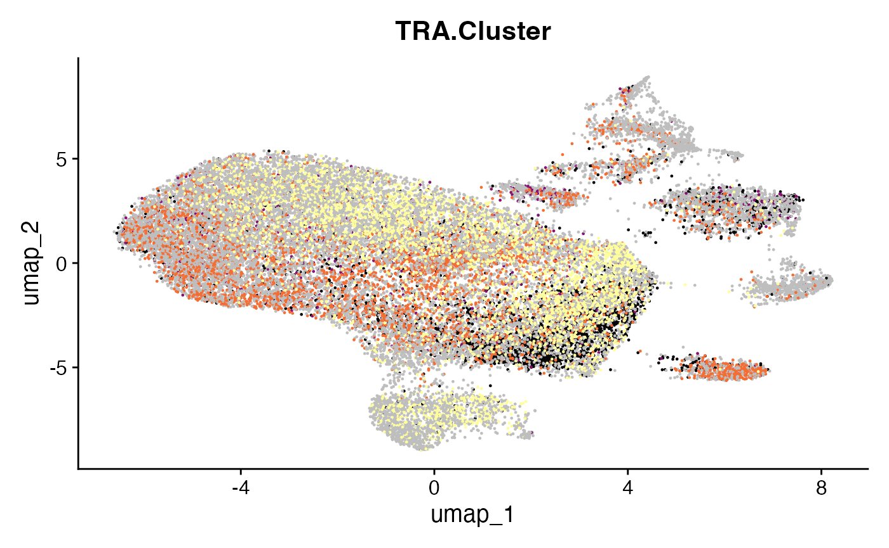
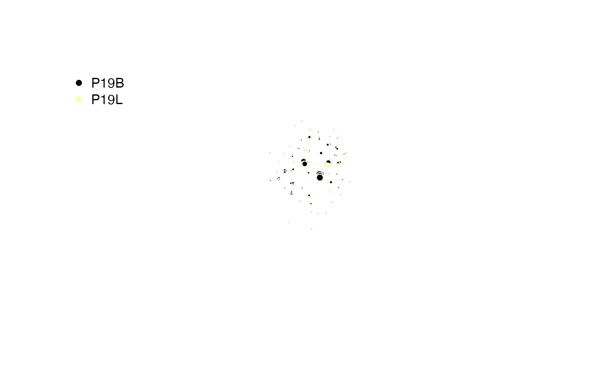

# Clustering by Edit Distance

## clonalCluster: Cluster by Sequence Similarity

The
[`clonalCluster()`](https://www.borch.dev/uploads/scRepertoire/reference/clonalCluster.md)
function provides a powerful method to group clonotypes based on
sequence similarity. It calculates the edit distance between CDR3
sequences and uses this information to build a network, identifying
closely related clusters of T or B cell receptors. This functionality
allows for a more nuanced definition of a “clone” that extends beyond
identical sequence matches.

### Core Concepts

The clustering process follows these key steps:

- **Sequence Selection**: The function selects either the nucleotide
  (`sequence = "nt"`) or amino acid (`sequence = "aa"`) CDR3 sequences
  for a specified chain.
- **Distance Calculation**: It calculates the edit distance between all
  pairs of sequences. By default, it also requires sequences to share
  the same V gene (`use.v = TRUE`).
- **Network Construction**: An edge is created between any two sequences
  that meet the similarity threshold, forming a network graph.
- **Clustering**: A graph-based clustering algorithm is run to identify
  connected components or communities within the network. By default, it
  identifies all directly or indirectly connected sequences as a single
  cluster (`cluster.method = "components"`).
- **Output**: The function can either add the resulting cluster IDs to
  the input object, return an `igraph` object for network analysis, or
  export a sparse adjacency matrix.

### Understanding the `threshold` Parameter

The behavior of the threshold parameter is critical for controlling
cluster granularity:

- **Normalized Similarity (threshold \< 1)**: When the threshold is a
  value between 0 and 1 (e.g., `0.85`), it represents the normalized
  edit distance (Levenshtein distance / mean sequence length). A higher
  value corresponds to a stricter similarity requirement. This is useful
  for comparing sequences of varying lengths.
- **Raw Edit Distance (threshold \>= 1)**: When the threshold is a whole
  number (e.g., 2), it represents the maximum raw edit distance allowed.
  A lower value corresponds to a stricter similarity requirement. This
  is useful when you want to allow a specific number of mutations.

Key Parameter(s) for
[`clonalCluster()`](https://www.borch.dev/uploads/scRepertoire/reference/clonalCluster.md)

- `sequence`: Specifies whether to cluster based on `aa` (amino acid) or
  `nt` (nucleotide) sequences.
- `threshold`: The similarity threshold for clustering. Values `< 1` are
  normalized similarity, while values `>= 1` are raw edit distance.
- `group.by`: A column header in the metadata or lists to group the
  analysis by (e.g., “sample”, “treatment”). If `NULL`, clusters are
  calculated across all sequences.
- `use.V`: If `TRUE`, sequences must share the same V gene to be
  clustered together.
- `use.J`: If `TRUE`, sequences must share the same J gene to be
  clustered together.
- `cluster.method`: The clustering algorithm to use. Defaults to
  `components`, which finds connected subgraphs.
- `cluster.prefix`: A character prefix to add to the cluster names
  (e.g., “cluster.”).
- `exportGraph`: If `TRUE`, returns an igraph object of the sequence
  network.
- `exportAdjMatrix`: If `TRUE`, returns a sparse adjacency matrix
  (dgCMatrix) of the network.

### Demonstrating Basic Use

To run clustering on the first two samples for the TRA chain, using
amino acid sequences with a normalized similarity threshold of 0.85:

``` r
# Run clustering on the first two samples for the TRA chain
sub_combined <- clonalCluster(combined.TCR[c(1,2)], 
                              chain = "TRA", 
                              sequence = "aa", 
                              threshold = 0.85)

# View the new cluster column
head(sub_combined[[1]][, c("barcode", "TCR1", "TRA.Cluster")])
```

    ##                   barcode                     TCR1 TRA.Cluster
    ## 1 P17B_AAACCTGAGTACGACG-1       TRAV25.TRAJ20.TRAC        <NA>
    ## 2 P17B_AAACCTGCAACACGCC-1 TRAV38-2/DV8.TRAJ52.TRAC        <NA>
    ## 3 P17B_AAACCTGCAGGCGATA-1      TRAV12-1.TRAJ9.TRAC  cluster.18
    ## 4 P17B_AAACCTGCATGAGCGA-1      TRAV12-1.TRAJ9.TRAC  cluster.18
    ## 5 P17B_AAACGGGAGAGCCCAA-1        TRAV20.TRAJ8.TRAC cluster.159
    ## 6 P17B_AAACGGGAGCGTTTAC-1      TRAV12-1.TRAJ9.TRAC  cluster.18

### Demonstrating Clustering with a Single-Cell Object

You can calculate clusters based on specific metadata variables within a
single-cell object by using the `group.by` parameter. This is useful for
analyzing clusters on a per-sample or per-patient basis without
subsetting the data first.

First, add patient and type information to the `scRep_example` Seurat
object:

``` r
#Adding patient information
scRep_example$Patient <- substr(scRep_example$orig.ident, 1,3)

#Adding type information
scRep_example$Type <- substr(scRep_example$orig.ident, 4,4)
```

Now, run clustering on the `scRep_example` Seurat object, grouping
calculations by “Patient”:

``` r
# Run clustering, but group calculations by "Patient"
scRep_example <- clonalCluster(scRep_example, 
                               chain = "TRA", 
                               sequence = "aa", 
                               threshold = 0.85, 
                               group.by = "Patient")

#Define color palette 
num_clusters <- length(unique(na.omit(scRep_example$TRA.Cluster)))
cluster_colors <- hcl.colors(n = num_clusters, palette = "inferno")

DimPlot(scRep_example, group.by = "TRA.Cluster") +
  scale_color_manual(values = cluster_colors, na.value = "grey") + 
  NoLegend()
```



### Returning an igraph Object:

Instead of modifying the input object,
[`clonalCluster()`](https://www.borch.dev/uploads/scRepertoire/reference/clonalCluster.md)
can export the underlying network structure for advanced analysis. Set
`exportGraph = TRUE` to get an igraph object consisting of the networks
of barcodes by the indicated clustering scheme.

``` r
set.seed(42)
#Clustering Patient 19 samples
igraph.object <- clonalCluster(combined.TCR[c(5,6)],
                               chain = "TRB",
                               sequence = "aa",
                               group.by = "sample",
                               threshold = 0.85, 
                               exportGraph = TRUE)

# Setting color scheme
col_legend <- factor(igraph::V(igraph.object)$group)
col_samples <- hcl.colors(2,"inferno")[as.numeric(col_legend)]
color.legend <- factor(unique(igraph::V(igraph.object)$group))

# Sampling 1000 Barcodes
sample.vertices <- V(igraph.object)[sample(length(igraph.object), 1000)]
subgraph.object <- induced_subgraph(igraph.object, vids = sample.vertices)
V(subgraph.object)$degrees <- igraph::degree(subgraph.object)
edge_alpha_color <- adjustcolor("gray", alpha.f = 0.3)

#Plotting
plot(subgraph.object,
     layout = layout_nicely(subgraph.object),
     vertex.label = NA,
     vertex.size = sqrt(igraph::V(subgraph.object)$degrees), 
     vertex.color = col_samples[sample.vertices],
     vertex.frame.color = "white", 
     edge.color = edge_alpha_color,
     edge.arrow.size = 0.05,
     edge.curved = 0.05, 
     margin = -0.1)
legend("topleft", 
       legend = levels(color.legend), 
       pch = 16, 
       col = unique(col_samples), 
       bty = "n")
```



### Returning a Sparse Adjacency Matrix

For computational applications, you can export a sparse adjacency matrix
using `exportAdjMatrix = TRUE`. This matrix represents the connections
between all barcodes in the input data, with the edit distance that meet
the threshold in places of connection.

``` r
# Generate the sparse matrix
adj.matrix <- clonalCluster(combined.TCR[c(1,2)],
                            chain = "TRB",
                            exportAdjMatrix = TRUE)

# View the dimensions and a snippet of the matrix
dim(adj.matrix)
```

    ## [1] 5698 5698

``` r
print(adj.matrix[1:10, 1:10])
```

    ## 10 x 10 sparse Matrix of class "dgCMatrix"

    ##                                                                          
    ## P17B_AAACCTGAGTACGACG-1 . . .      .      . .      .      .      . .     
    ## P17B_AAACCTGCAACACGCC-1 . . .      .      . .      .      .      . .     
    ## P17B_AAACCTGCAGGCGATA-1 . . .       1e-06 .  1e-06  1e-06  1e-06 .  1e-06
    ## P17B_AAACCTGCATGAGCGA-1 . .  1e-06 .      .  1e-06  1e-06  1e-06 .  1e-06
    ## P17B_AAACGGGAGAGCCCAA-1 . . .      .      . .      .      .      . .     
    ## P17B_AAACGGGAGCGTTTAC-1 . .  1e-06  1e-06 . .       1e-06  1e-06 .  1e-06
    ## P17B_AAACGGGAGGGCACTA-1 . .  1e-06  1e-06 .  1e-06 .       1e-06 .  1e-06
    ## P17B_AAACGGGAGTGGTCCC-1 . .  1e-06  1e-06 .  1e-06  1e-06 .      .  1e-06
    ## P17B_AAACGGGCAGTTAACC-1 . . .      .      . .      .      .      . .     
    ## P17B_AAACGGGGTCGCCATG-1 . .  1e-06  1e-06 .  1e-06  1e-06  1e-06 . .

### Using Both Chains

You can analyze the combined network of both TRA/TRB or IGH/IGL chains
by setting `chain = "both"`. This will create a single cluster column
named `Multi.Cluster`.

``` r
# Cluster using both TRB and TRA chains simultaneously
clustered_both <- clonalCluster(combined.TCR[c(1,2)], 
                                chain = "both")

# View the new "Multi.Cluster" column
head(clustered_both[[1]][, c("barcode", "TCR1", "TCR2", "Multi.Cluster")])
```

    ##                   barcode                     TCR1                        TCR2
    ## 1 P17B_AAACCTGAGTACGACG-1       TRAV25.TRAJ20.TRAC  TRBV5-1.None.TRBJ2-7.TRBC2
    ## 2 P17B_AAACCTGCAACACGCC-1 TRAV38-2/DV8.TRAJ52.TRAC TRBV10-3.None.TRBJ2-2.TRBC2
    ## 3 P17B_AAACCTGCAGGCGATA-1      TRAV12-1.TRAJ9.TRAC    TRBV9.None.TRBJ2-2.TRBC2
    ## 4 P17B_AAACCTGCATGAGCGA-1      TRAV12-1.TRAJ9.TRAC    TRBV9.None.TRBJ2-2.TRBC2
    ## 5 P17B_AAACGGGAGAGCCCAA-1        TRAV20.TRAJ8.TRAC                        <NA>
    ## 6 P17B_AAACGGGAGCGTTTAC-1      TRAV12-1.TRAJ9.TRAC    TRBV9.None.TRBJ2-2.TRBC2
    ##   Multi.Cluster
    ## 1          <NA>
    ## 2          <NA>
    ## 3    cluster.18
    ## 4    cluster.18
    ## 5   cluster.156
    ## 6    cluster.18

### Using Different Clustering Algorithms

While the default `cluster.method = "components"` is robust, you can use
other algorithms from the igraph package, such as `walktrap` or
`louvain`, to potentially uncover different community structures.

``` r
# Cluster using the walktrap algorithm
graph_walktrap <- clonalCluster(combined.TCR[c(1,2)],
                                cluster.method = "walktrap",
                                exportGraph = TRUE)

# Compare the number of clusters found
length(unique(V(graph_walktrap)$cluster))
```

    ## [1] 419

Overall,
[`clonalCluster()`](https://www.borch.dev/uploads/scRepertoire/reference/clonalCluster.md)
is a versatile function for defining and analyzing clonal relationships
based on sequence similarity. It allows researchers to move beyond exact
sequence matches, providing a more comprehensive understanding of clonal
families. The ability to customize parameters like `threshold`, `chain`
selection, and `group.by` ensures adaptability to diverse research
questions. Furthermore, the option to export `igraph` objects or sparse
adjacency matrices provides advanced users with the tools for in-depth
network analysis.

## Next Steps

- [Combining Clones and Single-Cell
  Objects](https://www.borch.dev/uploads/scRepertoire/articles/Attaching_SC.md) -
  Attach clonal data to Seurat or SCE objects with
  [`combineExpression()`](https://www.borch.dev/uploads/scRepertoire/reference/combineExpression.md).
- [Visualizations for Single-Cell
  Objects](https://www.borch.dev/uploads/scRepertoire/articles/SC_Visualizations.md) -
  Chord diagrams, alluvial plots, and clonal network overlays.
- [Comparing Clonal Diversity and
  Overlap](https://www.borch.dev/uploads/scRepertoire/articles/Clonal_Diversity.md) -
  Diversity indices and repertoire overlap analysis.
