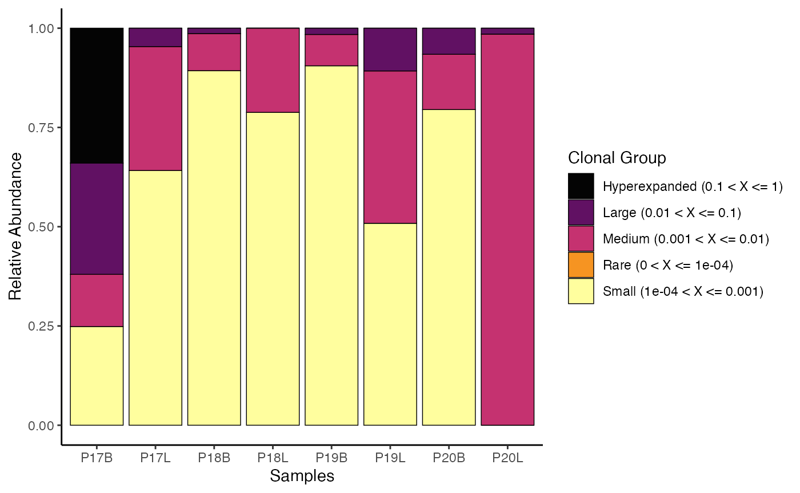
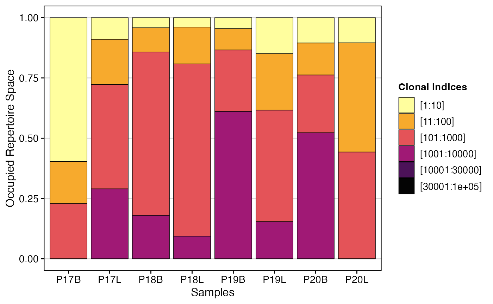
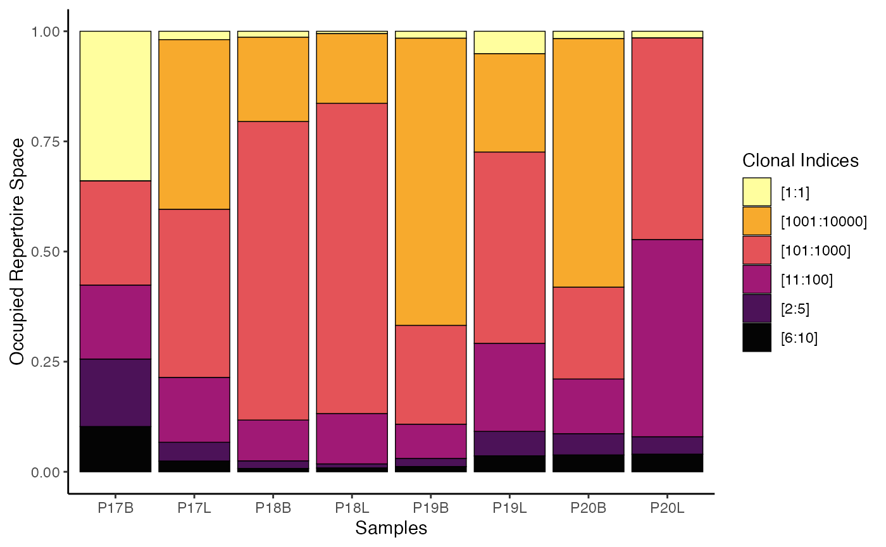

# Visualizing Clonal Dynamics

## clonalHomeostasis: Examining Clonal Space

By examining the clonal space, we effectively look at the relative space
occupied by clones at specific proportions. Another way to think about
this would be to consider the total immune receptor sequencing run as a
measuring cup. In this cup, we will fill liquids of different
viscosity—or different numbers of clonal proportions. Clonal space
homeostasis asks what percentage of the cup is filled by clones in
distinct proportions (or liquids of different viscosity, to extend the
analogy). The proportional cut points are set under the `cloneSize`
variable in the function and can be adjusted.

Default `cloneSize` Bins

- **Rare**: 0 to 0.0001
- **Small**: 0.0001 to 0.001
- **Medium**: 0.001 to 0.01
- **Large**: 0.01 to 0.1
- **Hyperexpanded**: 0.1 to 1

To visualize clonal homeostasis using gene clone calls with default
`cloneSize` bins:

``` r
clonalHomeostasis(combined.TCR, 
                  cloneCall = "gene")
```



We can reassign the proportional cut points for `cloneSize`, which can
drastically alter the visualization and analysis

``` r
clonalHomeostasis(combined.TCR, 
                  cloneCall = "gene",
                  cloneSize = c(Rare = 0.001, Small = 0.01, Medium = 0.1, 
                                Large = 0.3, Hyperexpanded = 1))
```


In addition, we can use the `group.by` parameter to look at the relative
proportion of clones between groups, such as by tissue type. First,
ensure the “Type” variable is added to `combined.TCR`:

``` r
combined.TCR <- addVariable(combined.TCR, 
                            variable.name = "Type", 
                            variables = rep(c("B", "L"), 4))
```

Now, visualize clonal homeostasis grouped by “Type”:

``` r
clonalHomeostasis(combined.TCR, 
                  group.by = "Type",
                  cloneCall = "gene")
```


[`clonalHomeostasis()`](https://www.borch.dev/uploads/scRepertoire/reference/clonalHomeostasis.md)
provides an assessment of how different “sizes” of clones (based on
their proportional abundance) contribute to the overall repertoire. This
visualization helps to identify shifts in repertoire structure, such as
expansion of large clones in response to infection or contraction in
chronic conditions, offering insights into immune system activity and
health.

## clonalProportion: Examining Space Occupied by Ranks of Clones

Like clonal space homeostasis,
[`clonalProportion()`](https://www.borch.dev/uploads/scRepertoire/reference/clonalProportion.md)
also categorizes clones into separate bins. The key difference is that
instead of looking at the relative proportion of the clone to the total,
[`clonalProportion()`](https://www.borch.dev/uploads/scRepertoire/reference/clonalProportion.md)
ranks the clones by their total count or frequency of occurrence and
then places them into predefined bins.

The `clonalSplit` parameter represents the ranking of clonotypes. For
example, 1:10 refers to the top 10 clonotypes in each sample. The
default bins are set under the `clonalSplit` variable and can be
adjusted.

Default `clonalSplit` Bins

- **10** (top 1-10 clones)
- **100**: (top 11-100 clones)
- **1000**: (top 101-1000 clones)
- **10000**: (top 1001-10000 clones)
- **30000**: (top 10001-30000 clones)
- **100000**: (top 30001-100000 clones)

To visualize the clonal proportion using `gene` clone calls with default
`clonalSplit` bins:

``` r
clonalProportion(combined.TCR, 
                 cloneCall = "gene") 
```



To visualize clonal proportion using `nt` (nucleotide) clone calls with
custom `clonalSplit` bins:

``` r
clonalProportion(combined.TCR, 
                 cloneCall = "nt",
                 clonalSplit = c(1, 5, 10, 100, 1000, 10000)) 
```



[`clonalProportion()`](https://www.borch.dev/uploads/scRepertoire/reference/clonalProportion.md)
complements
[`clonalHomeostasis()`](https://www.borch.dev/uploads/scRepertoire/reference/clonalHomeostasis.md)
by providing a perspective on how the “richest” (most abundant) clones
contribute to the overall repertoire space. By segmenting clones into
rank-based bins, it helps identify whether a few highly expanded clones
or a larger number of moderately expanded clones dominate the immune
response, offering distinct insights into repertoire structure and
dynamics.

## Next Steps

- [Comparing Clonal Diversity and
  Overlap](https://www.borch.dev/uploads/scRepertoire/articles/Clonal_Diversity.md) -
  Diversity indices, rarefaction curves, and repertoire overlap.
- [Basic Clonal
  Visualizations](https://www.borch.dev/uploads/scRepertoire/articles/Clonal_Visualizations.md) -
  Clonal abundance, length distributions, and scatter plots.
- [Visualizations for Single-Cell
  Objects](https://www.borch.dev/uploads/scRepertoire/articles/SC_Visualizations.md) -
  Overlay clonal data on UMAP/tSNE embeddings.
