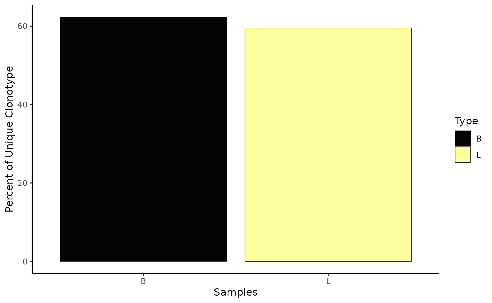
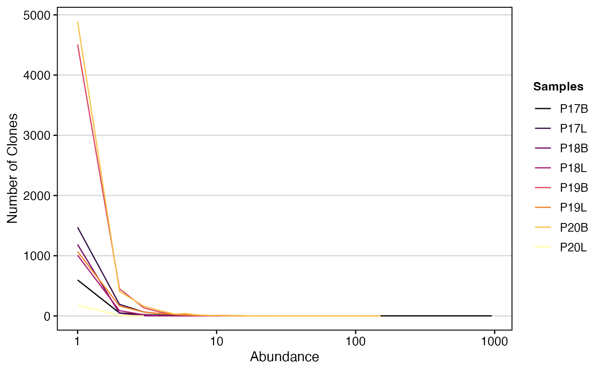
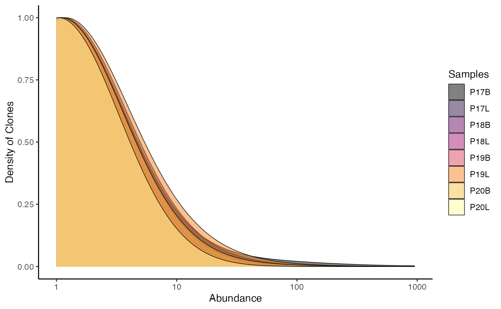
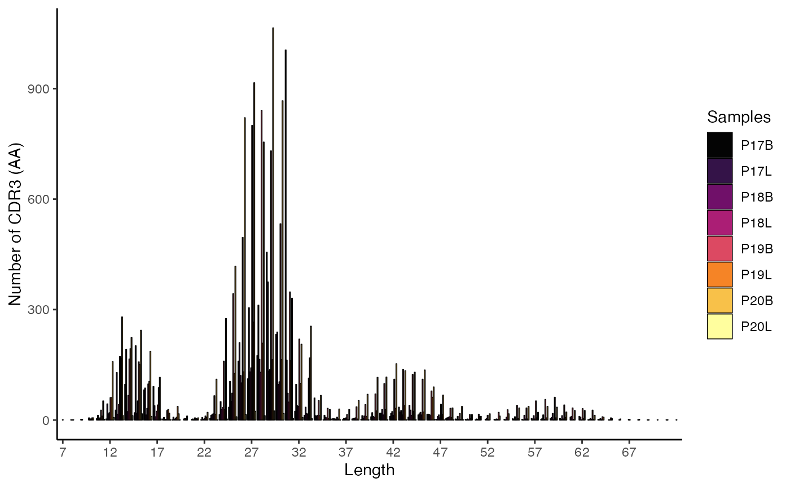
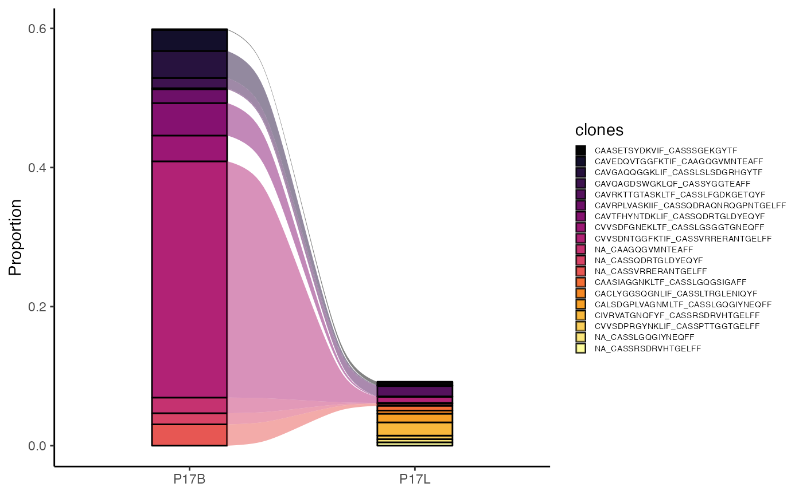
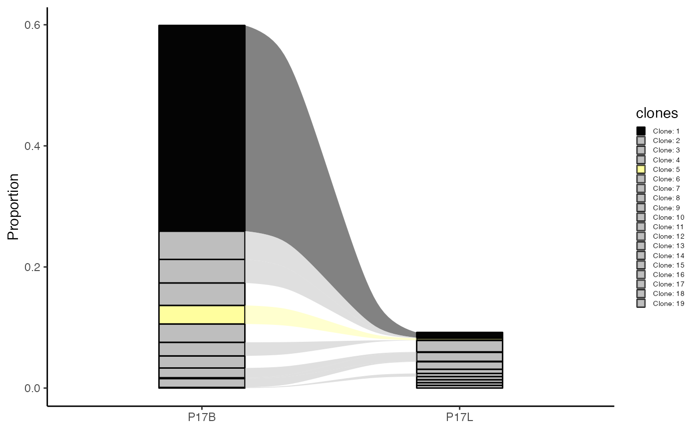
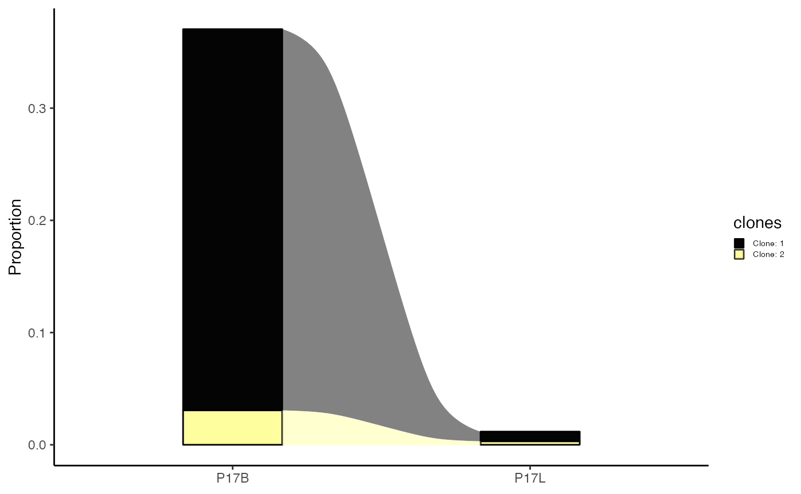
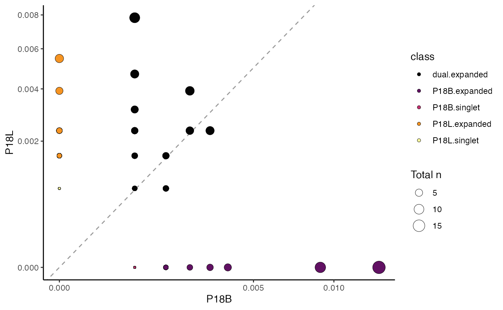

# Basic Clonal Visualizations

## clonalQuant: Quantifying Unique Clones

The
[`clonalQuant()`](https://www.borch.dev/uploads/scRepertoire/reference/clonalQuant.md)
function is used to explore the clones by returning the total or
relative numbers of unique clones.

Key Parameter(s) for
[`clonalQuant()`](https://www.borch.dev/uploads/scRepertoire/reference/clonalQuant.md)

- `scale`: If `TRUE`, converts the output to the relative percentage of
  unique clones scaled by the total repertoire size; if `FALSE`
  (default), reports the total number of unique clones.

To visualize the relative percent of unique clones across all chains
(`"both"`) using the `strict` clone definition:

``` r
clonalQuant(combined.TCR, 
            cloneCall="strict", 
            chain = "both", 
            scale = TRUE)
```


Another option is to define the visualization by data classes using the
`group.by` parameter. Here, we’ll use the `"Type"` variable, which was
previously added to the combined.TCR list.

``` r
clonalQuant(combined.TCR, 
            cloneCall="gene", 
            group.by = "Type", 
            scale = TRUE)
```



## clonalAbundance: Distribution of Clones by Size

[`clonalAbundance()`](https://www.borch.dev/uploads/scRepertoire/reference/clonalAbundance.md)
allows for the examination of the relative distribution of clones by
abundance. It produces a line graph showing the total number of clones
at specific frequencies within a sample or group.

Key Parameter(s) for
[`clonalAbundance()`](https://www.borch.dev/uploads/scRepertoire/reference/clonalAbundance.md)

- `scale`: If `TRUE`, converts the graphs into density plots to show
  relative distributions; if `FALSE` (default), displays raw counts.

To visualize the raw clonal abundance using the `gene` clone definition:

``` r
clonalAbundance(combined.TCR, 
                cloneCall = "gene", 
                scale = FALSE)
```



[`clonalAbundance()`](https://www.borch.dev/uploads/scRepertoire/reference/clonalAbundance.md)
output can also be converted into a density plot, which may allow for
better comparisons between different repertoire sizes, by setting
`scale = TRUE`.

``` r
clonalAbundance(combined.TCR, 
                cloneCall = "gene", 
                scale = TRUE)
```



## clonalLength: Distribution of Sequence Lengths

[`clonalLength()`](https://www.borch.dev/uploads/scRepertoire/reference/clonalLength.md)
allows you to look at the length distribution of the CDR3 sequences.
Importantly, unlike the other basic visualizations, the `cloneCall` can
only be `nt` (nucleotide) or `aa` (amino acid). Due to the method of
calling clones as outlined previously (e.g., using NA for unreturned
chain sequences or multiple chains within a single barcode), the length
distribution may reveal a multimodal curve.

To visualize the amino acid length distribution for both chains
(“both”):

``` r
clonalLength(combined.TCR, 
             cloneCall="aa", 
             chain = "both") 
```



To visualize the amino acid length distribution for the `TRA` chain,
scaled as a density plot:

``` r
clonalLength(combined.TCR, 
             cloneCall="aa", 
             chain = "TRA", 
             scale = TRUE) 
```



## clonalCompare: Clonal Dynamics Between Categorical Variables

[`clonalCompare()`](https://www.borch.dev/uploads/scRepertoire/reference/clonalCompare.md)
allows you to look at clones between samples and changes in dynamics. It
is useful for tracking how the proportions of top clones change between
conditions.

Key Parameters for
[`clonalCompare()`](https://www.borch.dev/uploads/scRepertoire/reference/clonalCompare.md)

- `samples`: A character vector to isolate specific samples by their
  list element name.
- `clones`: A character vector of specific clonal sequences to
  visualize. If used, `top.clones` will be ignored. \*`top.clones`: The
  top n number of clones to graph, calculated based on the frequency
  within individual samples.
- `highlight.clones`: A character vector of specific clonal sequences to
  color; all other clones will be greyed out.
- `relabel.clones`: If `TRUE`, simplifies the legend by labeling
  isolated clones numerically (e.g., “Clone: 1”).
- `graph`: The type of plot to generate; `alluvial` (default) or `area`.
- `proportion`: If `TRUE` (default), the y-axis represents proportional
  abundance; if `FALSE`, it represents raw clone counts.

To compare the top 10 clones between samples “P17B” and “P17L” using
amino acid sequences as an alluvial plot:

``` r
clonalCompare(combined.TCR, 
                  top.clones = 10, 
                  samples = c("P17B", "P17L"), 
                  cloneCall="aa", 
                  graph = "alluvial")
```



We can also choose to highlight specific clones, such as in the case of
*“CVVSDNTGGFKTIF_CASSVRRERANTGELFF”* and *“NA_CASSVRRERANTGELFF”* using
the `highlight.clones` parameter. In addition, we can simplify the plot
to label the clones as “Clone: 1”, “Clone: 2”, etc., by setting
`relabel.clones = TRUE`.

``` r
clonalCompare(combined.TCR, 
              top.clones = 10,
              highlight.clones = c("CVVSDNTGGFKTIF_CASSVRRERANTGELFF", "NA_CASSVRRERANTGELFF"),
              relabel.clones = TRUE,
              samples = c("P17B", "P17L"), 
              cloneCall="aa", 
              graph = "alluvial")
```



Alternatively, if we only want to show specific clones, we can use the
`clones` parameter.

``` r
clonalCompare(combined.TCR, 
              clones = c("CVVSDNTGGFKTIF_CASSVRRERANTGELFF", "NA_CASSVRRERANTGELFF"),
              relabel.clones = TRUE,
              samples = c("P17B", "P17L"), 
              cloneCall="aa", 
              graph = "alluvial")
```



## clonalScatter: Scatterplot of Two Variables

clonalScatter() organizes two repertoires, quantifies their relative
clone sizes, and produces a scatter plot comparing the two samples.
Clones are categorized by counts into singlets or expanded, either
exclusively present or shared between the selected samples.

Key Parameter(s) for
[`clonalScatter()`](https://www.borch.dev/uploads/scRepertoire/reference/clonalScatter.md)

- `x.axis`, `y.axis`: Names of the list elements or meta data variable
  to place on the x-axis and y-axis.
- `dot.size`: Specifies how dot size is determined; `total` (default)
  displays the total number of clones between the x- and y-axis, or a
  specific list element name for size calculation.
- `graph`: The type of graph to display; `proportion` for the relative
  proportion of clones (default) or `count` for the total count of
  clones by sample.

To compare samples “P18B” and “P18L” based on `gene` clone calls, with
dot size representing the total number of clones, and plotting clone
proportions:

``` r
clonalScatter(combined.TCR, 
              cloneCall ="gene", 
              x.axis = "P18B", 
              y.axis = "P18L",
              dot.size = "total",
              graph = "proportion")
```


## Next Steps

- [Visualizing Clonal
  Dynamics](https://www.borch.dev/uploads/scRepertoire/articles/Clonal_Dynamics.md) -
  Explore clonal homeostasis and proportional analysis.
- [Comparing Clonal Diversity and
  Overlap](https://www.borch.dev/uploads/scRepertoire/articles/Clonal_Diversity.md) -
  Diversity metrics, rarefaction, and repertoire overlap.
- [Summarizing
  Repertoires](https://www.borch.dev/uploads/scRepertoire/articles/Repertoire_Summary.md) -
  Gene usage, amino acid properties, and k-mer analysis.
- [Combining Clones and Single-Cell
  Objects](https://www.borch.dev/uploads/scRepertoire/articles/Attaching_SC.md) -
  Integrate clonal data with Seurat or SCE objects.
