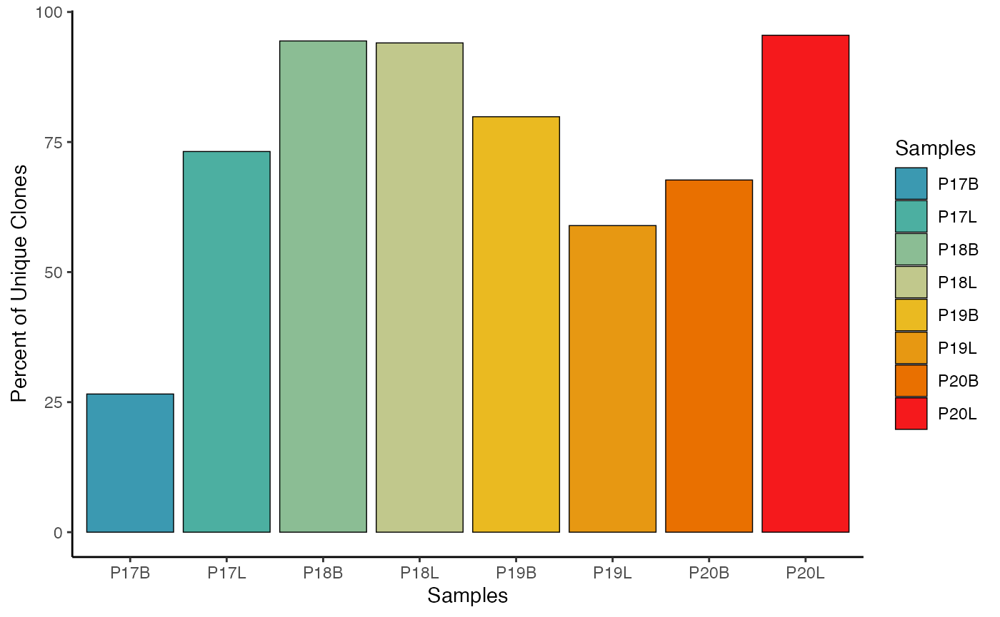
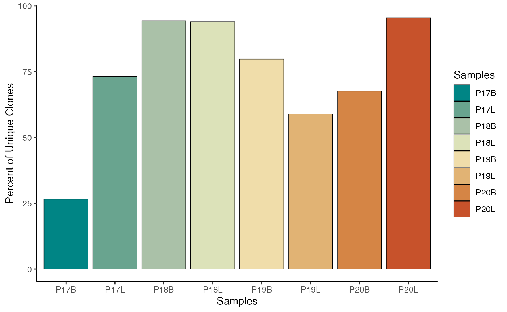
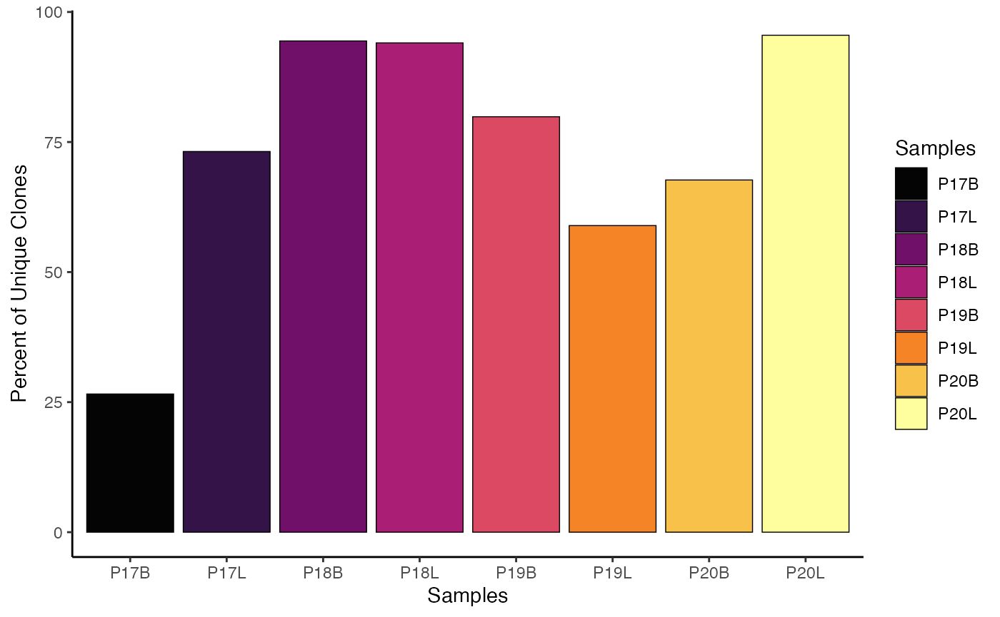
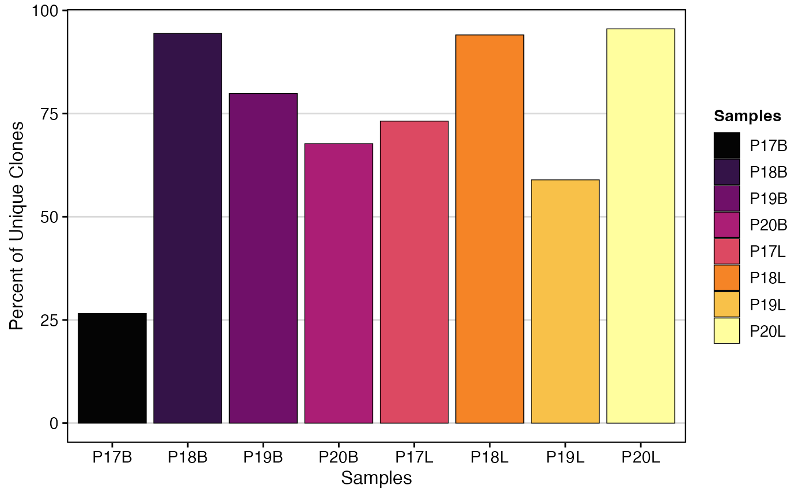

# Frequently Asked Questions

## Barcode Mismatch

Depending on the pipeline used to generate the single-cell object, there
may be inherent mismatches in the barcodes in the single-cell object and
the output of
[`combineBCR()`](https://www.borch.dev/uploads/scRepertoire/reference/combineBCR.md)
or
[`combineTCR()`](https://www.borch.dev/uploads/scRepertoire/reference/combineTCR.md).

### Common Barcode Modification Examples

**Seurat-modified barcodes**: By default, Seurat will append \_X to the
suffix of the barcodes.

- `original: ACGTACGTACGTACGT-1`
- `seurat-modified: ACGTACGTACGTACGT-1_1`

**scRepertoire-modified barcodes**: `scRepertoire` uses the samples
and/or ID parameters in
[`combineTCR()`](https://www.borch.dev/uploads/scRepertoire/reference/combineTCR.md)
or
[`combineBCR()`](https://www.borch.dev/uploads/scRepertoire/reference/combineBCR.md)
to add a prefix to the barcodes.

- `original: ACGTACGTACGTACGT-1`
- `scRepertoire-modified: Sample1_ACGTACGTACGTACGT-1`

### Solution: Renaming Cell Barcodes in Seurat

The easiest way to make these compatible is to rename the cell barcodes
in the Seurat object using `RenameCells()` from the `SeuratObject`
package

``` r
# Assuming 'seuratObj' is your Seurat object
cell.barcodes <- rownames(seuratObj[[]])
# removing the _1 at the end of the barcodes (adjust regex if your suffix differs)
cell.barcodes <- stringr::str_split(cell.barcodes, "_", simplify = TRUE)[,1]
# adding the prefix of the orig.ident to the barcodes, assuming that is the sample IDs
cell.barcodes <- paste0(seuratObj$orig.ident, "_", cell.barcodes)
seuratObj <- RenameCells(seuratObj, new.names = cell.barcodes)
```

## Adjusting Color Palettes

For all visualizations in `scRepertoire`, you have two primary ways to
adjust the color scheme.

Methods for Color Adjustment

- **Internal Palette Selection**: Change the `palette` parameter within
  `scRepertoire` functions to the desired color scheme. This approach
  uses the built-in palettes of `grDevices`, and you can access the list
  of available color schemes using
  [`hcl.pals()`](https://rdrr.io/r/grDevices/palettes.html).
- **Adding a ggplot Layer**: Extend the `scRepertoire` plot (which is a
  ggplot object) by adding a `ggplot2` layer with a new color scheme
  using
  [`scale_fill_manual()`](https://ggplot2.tidyverse.org/reference/scale_manual.html)
  or similar functions.

### Using Internal Palette Selection

``` r
# Internal Palette Selection
clonalQuant(combined.TCR, 
            cloneCall="strict", 
            chain = "both", 
            scale = TRUE, 
            palette = "Zissou 1")
```



### Using ggplot2 System:

``` r
# Using gg System
clonalQuant(combined.TCR, 
            cloneCall="strict", 
            chain = "both", 
            scale = TRUE) + 
  scale_fill_manual(values = hcl.colors(8,"geyser"))
```



### Adjusting Plot Theme

Since `scRepertoire` functions return `ggplot` objects, modifying the
general appearance or theme of the plot is straightforward, similar to
adjusting color palettes—by adding a `ggplot2` theme layer.

``` r
# Original clonalQuant plot
clonalQuant(combined.TCR, 
            cloneCall="strict", 
            chain = "both", 
            scale = TRUE)
```



``` r
# Modifying the theme of the clonalQuant plot
clonalQuant(combined.TCR, 
            cloneCall="strict", 
            chain = "both", 
            scale = TRUE) + 
  theme_classic()
```


### Adjusting Order of Plotting

The order of grouping/group.by variables in `scRepertoire` plots
(whether along an axis or in color legends) can be precisely controlled
using the order.by parameter.

Key Parameter for Plot Order

- `order.by`: A character vector defining the desired order of elements
  for the `group.by` variable. It’s crucial that the strings in this
  vector exactly match the `group.by` strings. Alternatively, setting
  `order.by = "alphanumeric"` will automatically sort groups
  alphanumerically.

``` r
clonalQuant(combined.TCR, 
            cloneCall="strict", 
            chain = "both", 
            scale = TRUE, 
            order.by = c("P17B","P18B","P19B","P20B","P17L","P18L","P19L","P20L"))
```



### Getting Data Used in Plots

Within each of the general analysis functions in `scRepertoire`, there’s
an option to export the underlying data frame used to create the
visualization.

Key Parameter for Data Export

- `exportTable`: Set this parameter to `TRUE` to return the data frame
  used to generate the graph instead of the visual output.

``` r
clonalQuant_output <- clonalQuant(combined.TCR, 
                                  cloneCall="strict", 
                                  scale = TRUE, 
                                  exportTable = TRUE)
clonalQuant_output
```

    ##   contigs values total   scaled
    ## 1     745   P17B  2805 26.55971
    ## 2    2117   P17L  2893 73.17663
    ## 3    1254   P18B  1328 94.42771
    ## 4    1202   P18L  1278 94.05321
    ## 5    5544   P19B  6942 79.86171
    ## 6    1619   P19L  2747 58.93702
    ## 7    6087   P20B  8991 67.70103
    ## 8     192   P20L   201 95.52239

### Citing scRepertoire

When using `scRepertoire` in your research, please cite the appropriate
version of the package.

Citation Details

- **Version 2**: Yang, Q, & Safina, K., Nguyen, K., Tuong, Z.K., &
  Borcherding, N. (2025). “scRepertoire 2: Enhanced and efficient
  toolkit for single-cell immune profiling.” *PLoS Computational
  Biology* <https://doi.org/10.1371/journal.pcbi.1012760>
- **Version 1**: Borcherding, Nicholas, Nicholas L. Bormann, and Gloria
  Kraus. “scRepertoire: An R-based toolkit for single-cell immune
  receptor analysis.” *F1000Research*
  <https://doi.org/10.12688/f1000research.22139.2>

### Bug Reports/New Features

Your feedback is valuable for improving scRepertoire! If you encounter a
bug or have a suggestion for a new feature, please report it.

Submit a [GitHub
issue](https://github.com/BorchLab/scRepertoire/issues) - if possible
please include a [reproducible example](https://reprex.tidyverse.org/).
Alternatively, an example with the internal **scRep_example** and
**contig_list** would be extremely helpful.

### Helpful Articles

- [Installation
  Instructions](https://www.borch.dev/uploads/scRepertoire/articles/Installation.md) -
  Getting scRepertoire installed.
- [Loading
  Data](https://www.borch.dev/uploads/scRepertoire/articles/Loading.md) -
  Loading contig data from various formats.
- [Basic Clonal
  Visualizations](https://www.borch.dev/uploads/scRepertoire/articles/Clonal_Visualizations.md) -
  Plot customization and visualization options.
- [Visualizations for Single-Cell
  Objects](https://www.borch.dev/uploads/scRepertoire/articles/SC_Visualizations.md) -
  Overlaying clonal data on embeddings.
