# Single-cell Gene Set Enrichment Analysis

## Overview

*escape* is a R package designed for **E**asy **s**ingle-**c**ell
**a**nalysis **p**latform for **e**nrichment. As the tortuous acronym
implies, *escape* was designed as a user-friendly package for gene set
enrichment analysis that leverages the heterogeneity of single-cell
data. escape turns raw single-cell counts into intuitive, per-cell
gene-set scores with a single command and then provides plotting helpers
to interrogate them.

The core workflow is:

1.  Choose gene-set library (`getGeneSets()` or your own list)
2.  Score cells (`runEscape()`)
3.  (Optional) Normalize for drop-out (`performNormalization()`)
4.  Explore with the built-in visualization gallery

More information is available at the [GitHub
Repo](https://github.com/BorchLab/escape).

### Citation

If using *escape*, please cite the
[article](https://www.nature.com/articles/s42003-020-01625-6):
Borcherding, N., Vishwakarma, A., Voigt, A.P. et al. Mapping the immune
environment in clear cell renal carcinoma by single-cell genomics.
Commun Biol 4, 122 (2021).

## Installation

``` r
devtools::install_github("BorchLab/escape")

if (!require("BiocManager", quietly = TRUE))
    install.packages("BiocManager")

BiocManager::install("escape")
```

## Loading Data

For the purposes of the vignette, we will use the scRepertoire full
example data. More information is available
[here](https://www.borch.dev/uploads/screpertoire/articles/loading#example-data-in-screpertoire).
We will subset the data for patient 17 and 18 from the data set in order
to speed up the calculations.

``` r
scRep_example <- subset(scRep_example, Patient %in% c("P17", "P18"))
```

## Getting Gene Sets

### Option 1: Built-In gene sets

``` r
data("escape.gene.sets", package="escape")
```

### Option 2: MSigDB via `getGeneSets()`

Gene set enrichment analysis begins by identifying the appropriate gene
sets for your study. The `getGeneSets()` function simplifies this
process by extracting one or more gene set libraries from the Molecular
Signature Database (MSigDB) and returning them as a GSEABase
GeneSetCollection object. Note that the first time you run
`getGeneSets()`, it downloads a complete local copy of the gene sets,
which may take a little while. Future calls will use the cached version,
greatly improving performance.

To retrieve gene set collections from MSigDB, specify the library or
libraries of interest using the library parameter. For example, to
select multiple libraries, use:

- **subcategory**: Narrow down your selection by specifying
  subcategories within a library. Examples include “CGN”, “CGP”,
  “CP:BIOCARTA”, “CP:KEGG”, “<GO:BP>”, “IMMUNESIGDB”, etc.
- **gene.sets:** Isolate individual pathways or gene sets by providing
  their specific names.

``` r
GS.hallmark <- getGeneSets(library = "H")
```

### Option 3: Define personal gene sets

``` r
gene.sets <- list(Bcells = c("MS4A1","CD79B","CD79A","IGH1","IGH2"),
                        Myeloid = c("SPI1","FCER1G","CSF1R"),
                        Tcells = c("CD3E", "CD3D", "CD3G", "CD7","CD8A"))
```

### Option 4: Using msigdbr

[msigdbr](https://cran.r-project.org/web/packages/msigdbr/index.html) is
an alternative R package to access the Molecular Signature Database in
R. There is expanded support for species in the package as well as a mix
of accessible versus downloadable gene sets, so it can be faster than
caching a copy locally.

``` r
GS.hallmark <- msigdbr(species  = "Homo sapiens",  
                       category = "H")
```

## Performing Enrichment Calculation

Several popular methods exist for Gene Set Enrichment Analysis (GSEA).
These methods can vary in the underlying assumptions. *escape*
incorporates several methods that are particularly advantageous for
single-cell RNA values:

#### **ssGSEA**

This method calculates the enrichment score using a rank-normalized
approach and generating an empirical cumulative distribution function
for each individual cell. The enrichment score is defined for a gene set
(*G*) using the number of genes in the gene set (*NG*) and total number
of genes (*N*).

``` math

ES(G,S) \sum_{i = 1}^{n} [P_W^G(G,S,i)-P_{NG}(G,S,i)]
```

Please see the following
[citation](https://pubmed.ncbi.nlm.nih.gov/19847166/) for more
information.

#### **GSVA**

GSVA varies slightly by estimating a Poisson-based kernel cumulative
density function. But like ssGSEA, the ultimate enrichment score
reported is based on the maximum value of the random walk statistic.
GSVA appears to have better overall consistency and runs faster than
ssGSEA.

``` math

ES_{jk}^{max} = V_{jk} [max_{l=1,...,p}|v_{jk}(l)]
```

Please see the following
[citation](https://pubmed.ncbi.nlm.nih.gov/23323831/) for more
information.

#### **AUCell**

In contrast to ssGSEA and GSVA, AUCell takes the gene rankings for each
cell and step-wise plots the position of each gene in the gene set along
the y-axis. The output score is the area under the curve for this
approach.

Please see the following
[citation](https://pubmed.ncbi.nlm.nih.gov/28991892/) for more
information.

#### UCell

UCell calculates a Mann-Whitney U statistic based on the gene rank list.
**Importantly**, UCell has a cut-off for ranked genes (
``` math
r_{max}
```
) at 1500 - this is per design as drop-out in single-cell can alter
enrichment results. This also substantially speeds the calculations up.

The enrichment score output is then calculated using the complement of
the U statistic scaled by the gene set size and cut-off.

\$\$ U_j^\` = 1-\frac{U_j}{n \bullet r\_{max}} \$\$

Please see the following
[citation](https://pubmed.ncbi.nlm.nih.gov/34285779/) for more
information.

### escape.matrix

escape has 2 major functions - the first being `escape.matrix()`, which
serves as the backbone of enrichment calculations. Using count-level
data supplied from a single-cell object or matrix, `escape.matrix()`
will produce an enrichment score for the individual cells with the gene
sets selected and output the values as a matrix.

**method**

- AUCell
- GSVA
- ssGSEA
- UCell

**groups**

- The number of cells to calculate at once.

**min.size**

- The minimum size of detectable genes in a gene set. Gene sets less
  than the **min.size** will be removed before the calculation.

**normalize**

- Use the number of genes from the gene sets in each cell to normalize
  the enrichment scores. The default value is **FALSE**.

**make.positive**

- During normalization, whether to shift the enrichment values to a
  positive range (**TRUE**) or not (**FALSE**). The default value is
  **FALSE**.

*Cautionary note:* **make.positive** was added to allow for differential
analysis downstream of enrichment as some methods may produce negative
values. It preserves log-fold change, but ultimately modifies the
enrichment values and should be used with caution.

``` r
enrichment.scores <- escape.matrix(scRep_example, 
                                   gene.sets = escape.gene.sets, 
                                   groups = 1000, 
                                   min.size = 5)

ggplot(data = as.data.frame(enrichment.scores), 
      mapping = aes(enrichment.scores[,1], enrichment.scores[,2])) + 
  geom_point() + 
  theme_classic() + 
  theme(axis.title = element_blank())
```

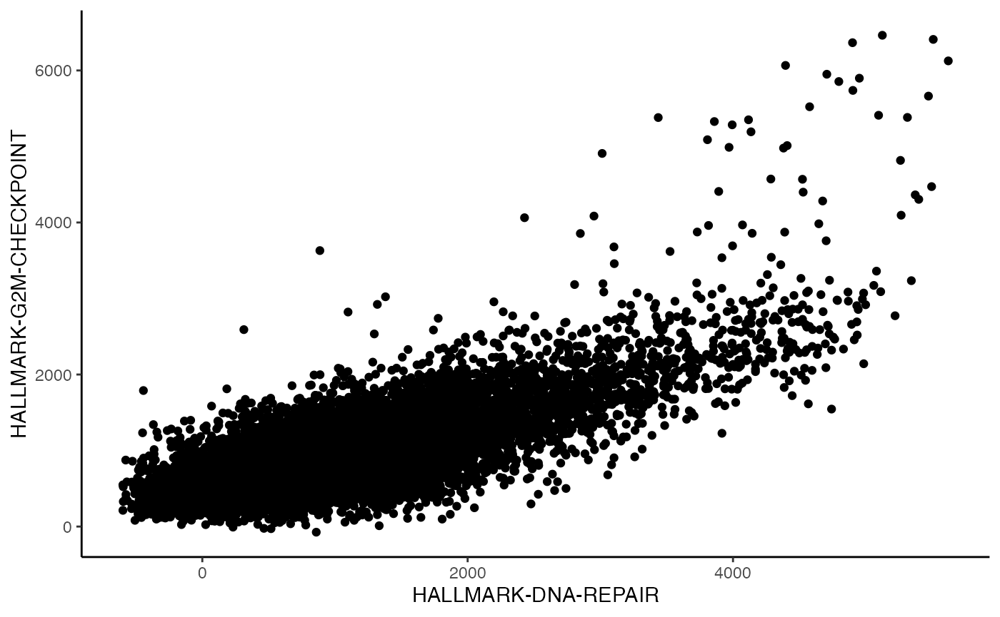

Multi-core support is for all methods is available through
[BiocParallel](https://bioconductor.org/packages/release/bioc/html/BiocParallel.html).
To add more cores, use the argument **BPPARAM** to `escape.matrix()`.
Here we will use the `SnowParam()` for it’s support across platforms and
explicitly call 2 workers (or cores).

``` r
enrichment.scores <- escape.matrix(scRep_example, 
                                   gene.sets = escape.gene.sets, 
                                   groups = 1000, 
                                   min.size = 3, 
                                   BPPARAM = BiocParallel::SnowParam(workers = 2))
```

### runEscape

Alternatively, we can use `runEscape()` to calculate the enrichment
score and directly attach the output to a single-cell object. The
additional parameter for \`\``runEscape` is **new.assay.name**, in order
to save the enrichment scores as a custom assay in the single-cell
object.

``` r
scRep_example <- runEscape(scRep_example, 
                           method = "ssGSEA",
                           gene.sets = escape.gene.sets, 
                           groups = 1000, 
                           min.size = 3,
                           new.assay.name = "escape.ssGSEA")

scRep_example <- runEscape(scRep_example, 
                           method = "UCell",
                           gene.sets = escape.gene.sets, 
                           groups = 1000, 
                           min.size = 5,
                           new.assay.name = "escape.UCell")
```

We can quickly examine the attached enrichment scores using the
visualization/workflow we prefer - here we will use just
[`FeaturePlot()`](https://satijalab.org/seurat/reference/FeaturePlot.html)
from the Seurat R package.

``` r
#Define color palette 
colorblind_vector <- hcl.colors(n=7, palette = "inferno", fixup = TRUE)

DefaultAssay(scRep_example) <- "escape.ssGSEA"
FeaturePlot(scRep_example, "Proinflammatory") + 
  scale_color_gradientn(colors = colorblind_vector) + 
  theme(plot.title = element_blank())
```

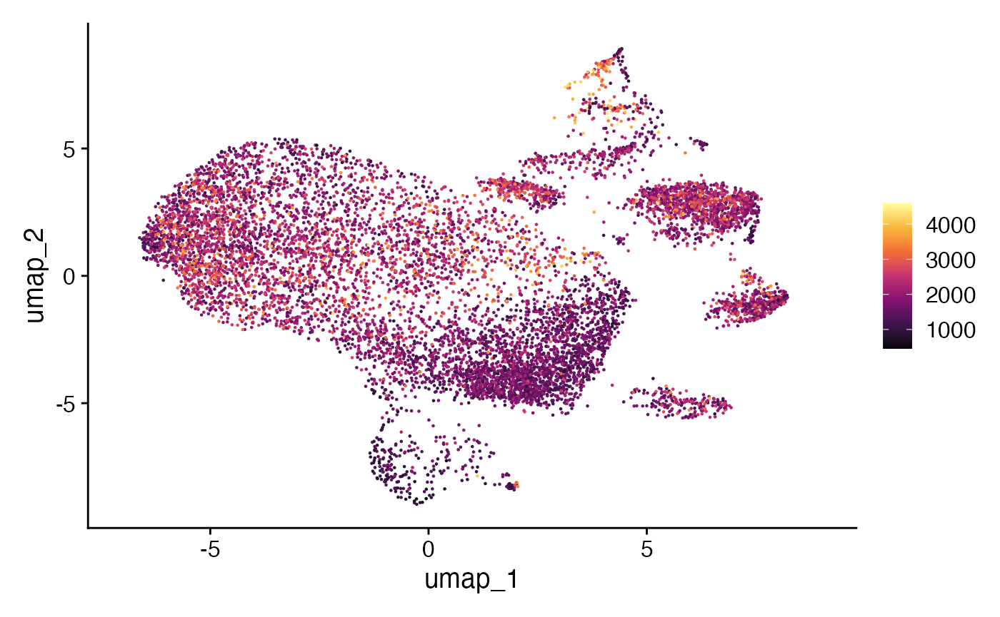

### performNormalization

Although we glossed over the normalization that can be used in
`escape.matrix()` and `runEscape()`, it is worth mentioning here as
normalization can affect all downstream analyses.

There can be inherent bias in enrichment values due to drop out in
single-cell expression data. Cells with larger numbers of features and
counts will likely have higher enrichment values.
`performNormalization()` will normalize the enrichment values by
calculating the number of genes expressed in each gene set and cell.
This is similar to the normalization in classic GSEA and it will be
stored in a new assay.

``` r
scRep_example <- performNormalization(input.data = scRep_example, 
                                   assay = "escape.ssGSEA", 
                                   gene.sets = escape.gene.sets)
```

An alternative for scaling by expressed gene sets would be to use a
scaling factor previously calculated during normal single-cell data
processing and quality control. This can be done using the
**scale.factor** argument and providing a vector.

``` r
scRep_example <- performNormalization(input.data = scRep_example, 
                                   assay = "escape.ssGSEA", 
                                   gene.sets = escape.gene.sets, 
                                   scale.factor = scRep_example$nFeature_RNA)
```

`performNormalization()` has an additional parameter **make.positive**.
Across the individual gene sets, if negative normalized enrichment
scores are seen, the minimum value is added to all values. For example
if the normalized enrichment scores (after the above accounting for drop
out) ranges from -50 to 50, **make.positive** will adjust the range to 0
to 100 (by adding 50). This allows for compatible log2-fold change
downstream, but can alter the enrichment score interpretation.

------------------------------------------------------------------------

## Visualizations

There are a number of ways to look at the enrichment values downstream
of `runEscape()` with the myriad plotting and visualizations
functions/packages for single-cell data. *escape* include several
additional plotting functions to assist in the analysis.

### heatmapEnrichment

We can examine the enrichment values across our gene sets by using
`heatmapEnrichment()`. This visualization will return the mean of the
**group.by** variable. As a default - all visualizations of single-cell
objects will use the cluster assignment or active identity as a default
for visualizations.

``` r
heatmapEnrichment(scRep_example, 
                  group.by = "ident",
                  gene.set.use = "all",
                  assay = "escape.ssGSEA")
```

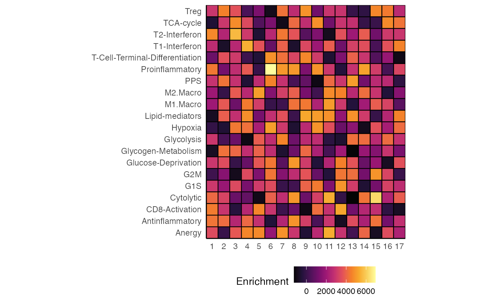

Most of the visualizations in *escape* have a defined set of parameters.

**group.by**

- The grouping variable for the comparison.

**facet.by**

- Using a variable to facet the graph into separate visualizations.

**scale**

- **TRUE** - z-transform the enrichment values.
- **FALSE** - leave raw values (**DEFAULT**).

In addition, `heatmapEnrichment()` allows for the reclustering of rows
and columns using Euclidean distance of the enrichment scores and the
Ward2 methods for clustering using **cluster.rows** and
**cluster.columns**.

``` r
heatmapEnrichment(scRep_example, 
                  group.by = "ident",
                  assay = "escape.UCell",
                  scale = TRUE,
                  cluster.rows = TRUE,
                  cluster.columns = TRUE)
```

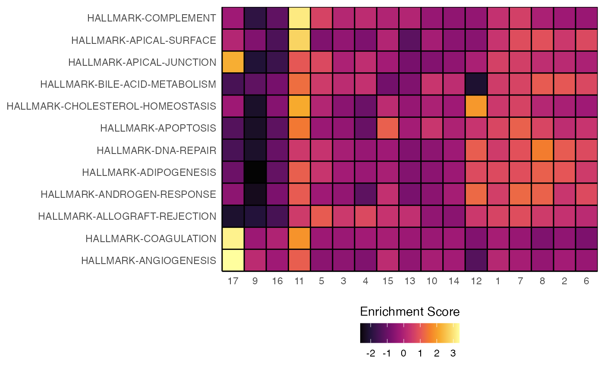

Each visualization has an additional argument called \*\*palette that
supplies the coloring scheme to be used - available color palettes can
be viewed with
[`hcl.pals()`](https://rdrr.io/r/grDevices/palettes.html).

``` r
hcl.pals()
```

    ##   [1] "Pastel 1"      "Dark 2"        "Dark 3"        "Set 2"        
    ##   [5] "Set 3"         "Warm"          "Cold"          "Harmonic"     
    ##   [9] "Dynamic"       "Grays"         "Light Grays"   "Blues 2"      
    ##  [13] "Blues 3"       "Purples 2"     "Purples 3"     "Reds 2"       
    ##  [17] "Reds 3"        "Greens 2"      "Greens 3"      "Oslo"         
    ##  [21] "Purple-Blue"   "Red-Purple"    "Red-Blue"      "Purple-Orange"
    ##  [25] "Purple-Yellow" "Blue-Yellow"   "Green-Yellow"  "Red-Yellow"   
    ##  [29] "Heat"          "Heat 2"        "Terrain"       "Terrain 2"    
    ##  [33] "Viridis"       "Plasma"        "Inferno"       "Rocket"       
    ##  [37] "Mako"          "Dark Mint"     "Mint"          "BluGrn"       
    ##  [41] "Teal"          "TealGrn"       "Emrld"         "BluYl"        
    ##  [45] "ag_GrnYl"      "Peach"         "PinkYl"        "Burg"         
    ##  [49] "BurgYl"        "RedOr"         "OrYel"         "Purp"         
    ##  [53] "PurpOr"        "Sunset"        "Magenta"       "SunsetDark"   
    ##  [57] "ag_Sunset"     "BrwnYl"        "YlOrRd"        "YlOrBr"       
    ##  [61] "OrRd"          "Oranges"       "YlGn"          "YlGnBu"       
    ##  [65] "Reds"          "RdPu"          "PuRd"          "Purples"      
    ##  [69] "PuBuGn"        "PuBu"          "Greens"        "BuGn"         
    ##  [73] "GnBu"          "BuPu"          "Blues"         "Lajolla"      
    ##  [77] "Turku"         "Hawaii"        "Batlow"        "Blue-Red"     
    ##  [81] "Blue-Red 2"    "Blue-Red 3"    "Red-Green"     "Purple-Green" 
    ##  [85] "Purple-Brown"  "Green-Brown"   "Blue-Yellow 2" "Blue-Yellow 3"
    ##  [89] "Green-Orange"  "Cyan-Magenta"  "Tropic"        "Broc"         
    ##  [93] "Cork"          "Vik"           "Berlin"        "Lisbon"       
    ##  [97] "Tofino"        "ArmyRose"      "Earth"         "Fall"         
    ## [101] "Geyser"        "TealRose"      "Temps"         "PuOr"         
    ## [105] "RdBu"          "RdGy"          "PiYG"          "PRGn"         
    ## [109] "BrBG"          "RdYlBu"        "RdYlGn"        "Spectral"     
    ## [113] "Zissou 1"      "Cividis"       "Roma"

``` r
heatmapEnrichment(scRep_example, 
                  assay = "escape.ssGSEA",
                  palette = "Spectral") 
```

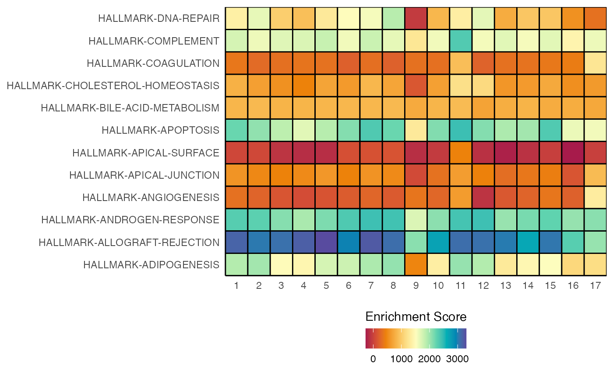

Alternatively, we can add an additional layer to the ggplot object that
is returned by the visualizations using something like
[`scale_fill_gradientn()`](https://ggplot2.tidyverse.org/reference/scale_gradient.html)
for continuous values or
[`scale_fill_manual()`](https://ggplot2.tidyverse.org/reference/scale_manual.html)
for the categorical variables.

``` r
heatmapEnrichment(scRep_example, 
                  group.by = "ident",
                  assay = "escape.UCell") + 
  scale_fill_gradientn(colors = rev(brewer.pal(11, "RdYlBu"))) 
```

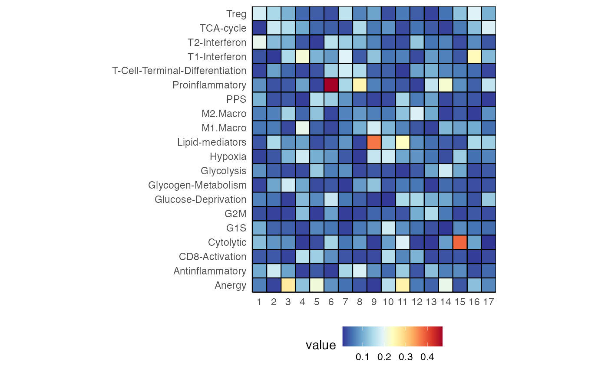

### geyserEnrichment

We can also focus on individual gene sets - one approach is to use
`geyserEnrichment()`. Here individual cells are plotted along the Y-axis
with graphical summary where the central dot refers to the median
enrichment value and the thicker/thinner lines demonstrate the interval
summaries referring to the 66% and 95%.

``` r
geyserEnrichment(scRep_example, 
                 assay = "escape.ssGSEA",
                 gene.set = "T1-Interferon")
```

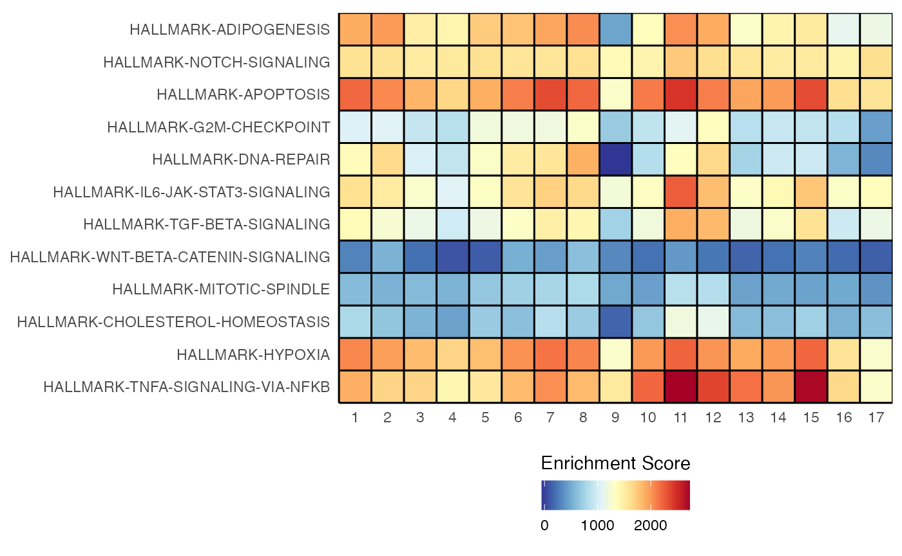

To show the additional parameters that appear in visualizations of
individual enrichment gene sets - we can reorder the groups by the mean
of the gene set using **order.by** = “mean”.

``` r
geyserEnrichment(scRep_example, 
                 assay = "escape.ssGSEA",
                 gene.set = "T1-Interferon", 
                 order.by = "mean")
```

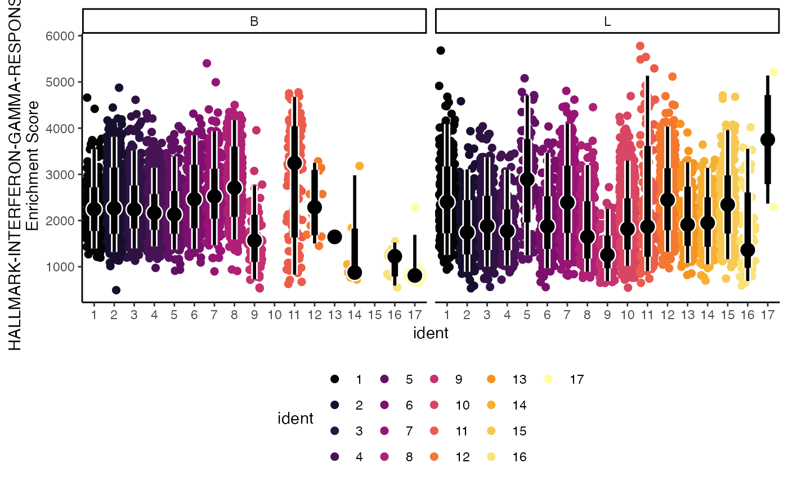

What if we had 2 separate samples or groups within the data? Another
parameter we can use is **facet.by** to allow for direct visualization
of an additional variable.

``` r
geyserEnrichment(scRep_example, 
                 assay = "escape.ssGSEA",
                 gene.set = "T1-Interferon", 
                 facet.by = "Type")
```

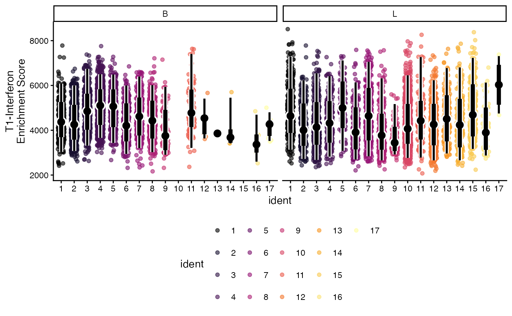

Lastly, we can select the way the color is applied to the plot using the
**color.by** parameter. Here we can set it to the gene set of interest
*“HALLMARK-INTERFERON-GAMMA-RESPONSE”*.

``` r
geyserEnrichment(scRep_example, 
                 assay = "escape.ssGSEA",
                 gene.set = "T1-Interferon", 
                 color.by  = "T1-Interferon")
```

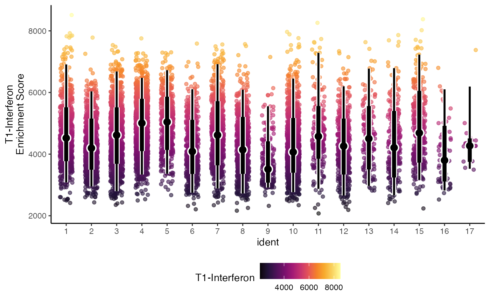

### ridgeEnrichment

Similar to the `geyserEnrichment()` the `ridgeEnrichment()` can display
the distribution of enrichment values across the selected gene set. The
central line is at the median value for the respective grouping.

``` r
ridgeEnrichment(scRep_example, 
                assay = "escape.UCell",
                gene.set = "T2-Interferon")
```

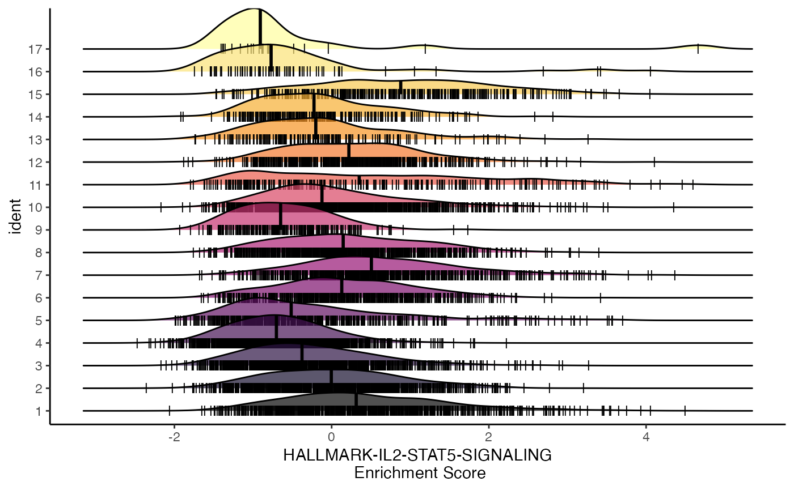

We can get the relative position of individual cells along the x-axis
using the **add.rug** parameter.

``` r
ridgeEnrichment(scRep_example, 
                assay = "escape.UCell",
                gene.set = "T2-Interferon",
                add.rug = TRUE,
                scale = TRUE)
```


### splitEnrichment

Another distribution visualization is a violin plot, which we separate
and directly compare using a binary classification. Like
`ridgeEnrichment()`, this allows for greater use of categorical
variables. For `splitEnrichment()`, the output will be two halves of a
violin plot based on the **split.by** parameter with a central boxplot
with the relative distribution across all samples.

``` r
splitEnrichment(scRep_example, 
                assay = "escape.ssGSEA",
                gene.set = "Lipid-mediators", 
                split.by = "Type")
```

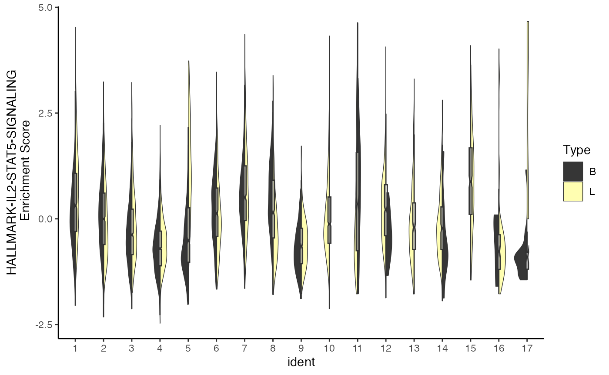

If selecting a **split.by** variable with more than 2 levels,
`splitEnrichment()` will convert the violin plots to dodge.

``` r
splitEnrichment(scRep_example, 
                assay = "escape.ssGSEA",
                gene.set = "Lipid-mediators", 
                split.by = "ident", 
                group.by = "Patient")
```

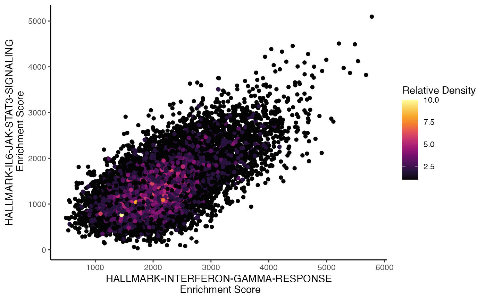

### gseaEnrichment

`gseaEnrichment()` reproduces the two-panel GSEA graphic from
Subramanian et al. (2005): \* Panel A – the running enrichment score
(RES) as you “walk” down the ranked list. \* Panel B – a rug showing
exact positions of each pathway gene.

It works on escape’s per-cell ranks, but collapses them across cells
with a summary statistic (summary.fun = “median” by default).

**How it works:**

1.  Rank all genes in each group by summary.fun of expression/statistic.
2.  Perform the weighted Kolmogorov–Smirnov walk: +w when the next gene
    is in the set, −1/(N − NG) otherwise.
3.  ES = maximum signed deviation; permutation on gene labels (or
    phenotypes) to derive NES and p.

``` r
gseaEnrichment(scRep_example,
               gene.set.use = "T2_Interferon",
               gene.sets    = escape.gene.sets,
               group.by     = "ident",
               summary.fun  = "mean",
               nperm        = 50)
```


### densityEnrichment

`densityEnrichment()` is a method to visualize the mean rank position of
the gene set features along the total feature space by group. Instead of
the classic GSEA running-score, it overlays **kernel-density traces** of
the *gene ranks* (1 = most highly expressed/ranked gene) for every group
or cluster. High densities at the *left-hand* side mean the pathway is
collectively **up-regulated**; peaks on the *right* imply
down-regulation.

**Anatomy of the plot**

1.  **X-axis** – gene rank (1 … *N*). Left = top-ranked genes.  
2.  **Y-axis** – density estimate (area under each curve = 1).  
3.  **One coloured line per level of `group.by`** – default is
    Seurat/SCE cluster.

``` r
densityEnrichment(scRep_example, 
                  gene.set.use = "T2_Interferon", 
                  gene.sets = escape.gene.sets)
```

### scatterEnrichment

It may be advantageous to look at the distribution of multiple gene
sets - here we can use `scatterEnrichment()` for a 2 gene set
comparison. The color values are based on the density of points
determined by the number of neighbors, similar to the [Nebulosa R
package](https://www.bioconductor.org/packages/release/bioc/html/Nebulosa.html).
We just need to define which gene set to plot on the **x.axis** and
which to plot on the **y.axis**.

``` r
scatterEnrichment(scRep_example, 
                  assay = "escape.ssGSEA",
                  x.axis = "T2-Interferon",
                  y.axis = "Lipid-mediators")
```


The scatter plot can also be converted into a hexbin, another method for
summarizing the individual cell distributions along the x and y axis, by
setting **style** = “hex”.

``` r
scatterEnrichment(scRep_example, 
                  assay = "escape.UCell",
                  x.axis = "T2-Interferon",
                  y.axis = "Lipid-mediators",
                  style = "hex")
```

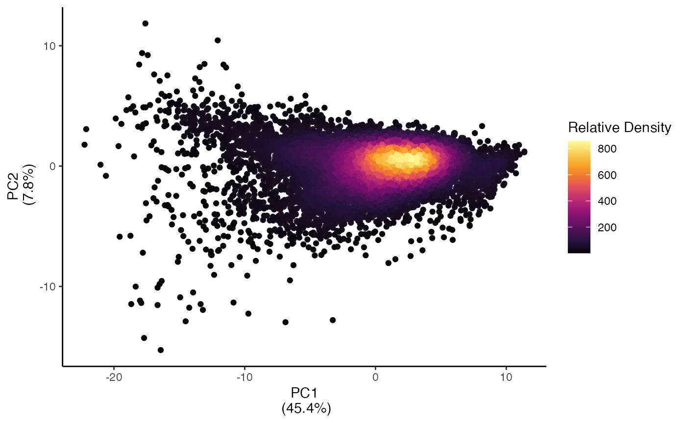

------------------------------------------------------------------------

## Statistical Analysis

### Principal Component Analysis (PCA)

escape has its own PCA function `performPCA()` which will work on a
single-cell object or a matrix of enrichment values. This is
specifically useful for downstream visualizations as it stores the
eigenvalues and rotations. If we want to look at the relative
contribution to overall variance of each component or a Biplot-like
overlay of the individual features, use `performPCA()`.

Alternatively, other PCA-based functions like Seurat’s
[`RunPCA()`](https://satijalab.org/seurat/reference/RunPCA.html) or
scater’s
\`\`[`runPCA()`](https://rdrr.io/pkg/BiocSingular/man/runPCA.html) can
be used. These functions are likely faster and would be ideal if we have
a larger number of cells and/or gene sets.

``` r
scRep_example <- performPCA(scRep_example, 
                         assay = "escape.ssGSEA",
                         n.dim = 1:10)
```

*escape* has a built in method for plotting PCA `pcaEnrichment()` that
functions similarly to the `scatterEnrichment()` function where
**x.axis** and **y.axis** are the components to plot.

``` r
pcaEnrichment(scRep_example, 
              dimRed = "escape.PCA",
              x.axis = "PC1",
              y.axis = "PC2")
```

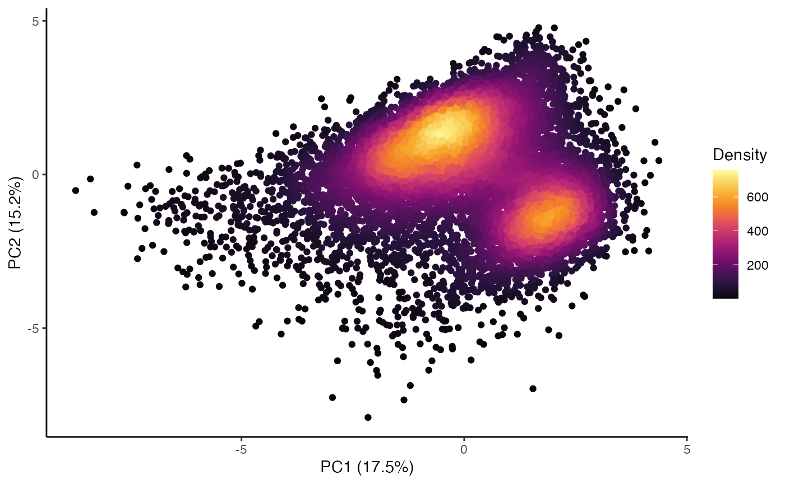

`pcaEnrichment()` can plot additional information on the principal
component analysis.

**add.percent.contribution** will add the relative percent contribution
of the x and y.axis to total variability observed in the PCA.

**display.factors** will overlay the magnitude and direction that the
features/gene sets contribute to the selected components. The number of
gene sets is determined by **number.of.factors**. This can assist in
understanding the underlying differences in enrichment across different
cells.

``` r
pcaEnrichment(scRep_example, 
              dimRed = "escape.PCA",
              x.axis = "PC1",
              y.axis = "PC2",
              add.percent.contribution = TRUE,
              display.factors = TRUE,
              number.of.factors = 10)
```

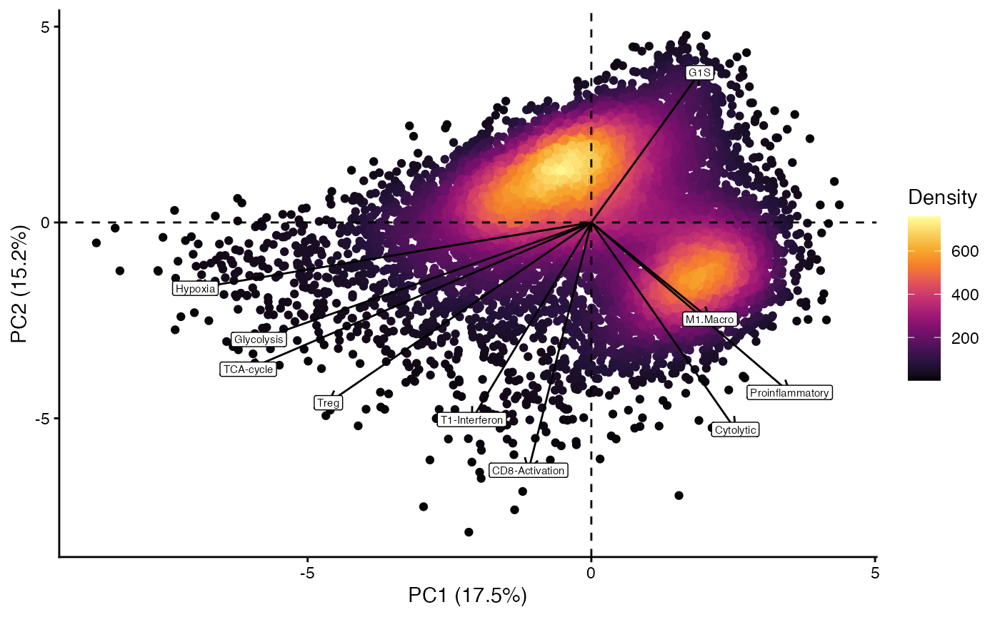

### Precomputed Rank Lists

Functional enrichment is not limited to per-cell scores. Many workflows
start with **differential-expression (DE) statistics** (e.g. Seurat’s
[`FindMarkers()`](https://satijalab.org/seurat/reference/FindMarkers.html),
DESeq2’s `results()`, edgeR’s
[`topTags()`](https://rdrr.io/pkg/edgeR/man/topTags.html)). Those
produce a *ranked gene list* that can be fed into a classical **Gene-Set
Enrichment Analysis (GSEA)**.

#### Why do this?

- **Aggregates signal across genes**: a borderline but *consistent*
  trend across 30 pathway genes is often more informative than a single
  high-logFC gene.  
- **Directionality**: by combining log-fold-change (*effect size*) and
  an adjusted *p*-value (*confidence*)
- **Speed**: you avoid re-scoring every cell; only one numeric vector is
  needed.

`enrichIt()` accepts either

1.  a **named numeric vector** (*already ranked*), or  
2.  a **data frame** containing logFC + *p* (or *adj.p*).

The helper **automatically chooses** the best *p*-value column in this
order:

1.  `p_val_adj`  
2.  `padj` (DESeq2)  
3.  `FDR` (edgeR)  
4.  plain `p_val`

#### Example `enrichIt()` workflow

``` r
DefaultAssay(scRep_example) <- "RNA"
DEG.markers <- FindMarkers(scRep_example, 
                           ident.1 = "1", 
                           ident.2 = "2")

GSEA.results <- enrichIt(input.data = DEG.markers, 
                         gene.sets = escape.gene.sets, 
                         ranking_fun = "signed_log10_p")               

head(GSEA.results)
```

    ##                            pathway        pval       padj   log2err        ES
    ##                             <char>       <num>      <num>     <num>     <num>
    ## 1:                             G1S 0.004459379 0.08918759 0.4070179 0.9495747
    ## 2:                   T1_Interferon 0.045590848 0.43715847 0.3217759 0.9916719
    ## 3: T_Cell_Terminal_Differentiation 0.088135593 0.43715847 0.2820134 0.9905942
    ## 4:             Glucose_Deprivation 0.108474576 0.43715847 0.2529611 0.9869766
    ## 5:                       Cytolytic 0.121951220 0.43715847 0.2249661 0.9827274
    ## 6:                 Antinflammatory 0.131147541 0.43715847 0.2529611 0.9883311
    ##         NES  size                                        leadingEdge  geneRatio
    ##       <num> <int>                                             <char>      <num>
    ## 1: 1.552116    63 HIST1H4C;CDKN1A;HIST1H1D;CCNG2;H2AFZ;HIST1H1E;H1FX 0.11111111
    ## 2: 1.541180    17                                               OASL 0.05882353
    ## 3: 1.933083     7                                        PDCD1;CTLA4 0.28571429
    ## 4: 1.926023     7                              FAM129A;HSPA1A;HSPA1B 0.42857143
    ## 5: 1.996093     6                                     GZMB;GZMA;GZMH 0.50000000
    ## 6: 1.824227     9                    LGALS3;PDCD1;FOXP3;CTLA4;ENTPD1 0.55555556

What does the result look like?

- **ES / NES** – raw and normalised enrichment scores from fgsea
- **pval / padj** – nominal and multiple-testing-corrected p
- **size** – total number of genes in the set
- **geneRatio** – (core hits)/(size), useful for dot plots
- **leadingEdge** – semi-colon-separated genes driving the signal

#### Visualizing the enrichment table

The companion `enrichItPlot()` gives three quick chart types.

``` r
## (1) Bar plot –20 most significant per database
enrichItPlot(GSEA.results) + 
  theme(strip.background = element_blank(),
        strip.text.x = element_blank())              
```

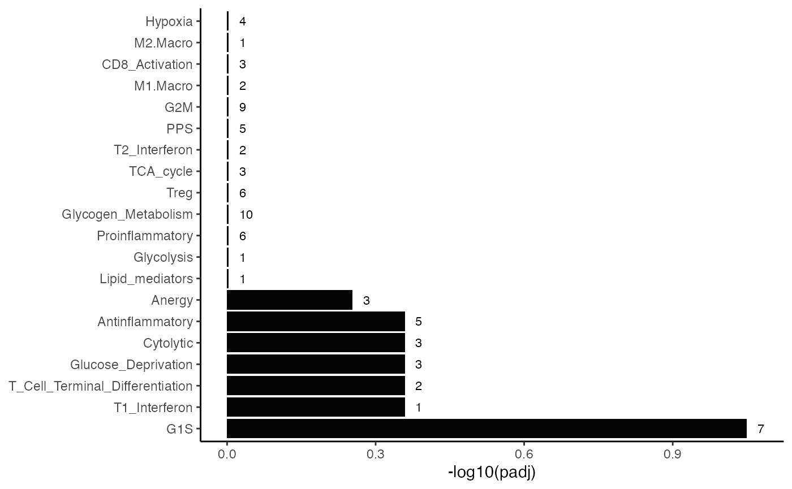

``` r
## (2) Dot plot – colored by –log10 padj, sized by core-hits
enrichItPlot(GSEA.results, "dot", top = 10) + 
  theme(strip.background = element_blank(),
        strip.text.x = element_blank())   
```

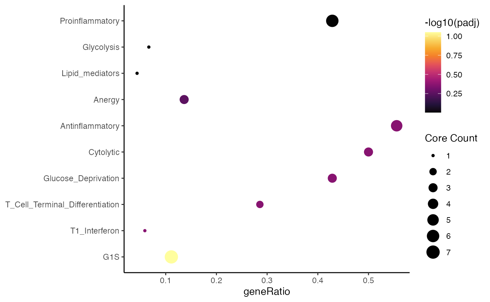

``` r
## (3) C-net plot – network of pathways ↔ leading-edge genes
enrichItPlot(GSEA.results, "cnet", top = 5) 
```


### Differential Enrichment

Differential enrichment analysis can be performed similar to
differential gene expression analysis. For the purposes of finding the
differential enrichment values, we can first normalize the enrichment
values for the ssGSEA calculations. Notice here, we are using
**make.positive** = TRUE in order to adjust any negative values. This is
a particular issue when it comes to ssGSEA and GSVA enrichment scores.

``` r
scRep_example <- performNormalization(scRep_example, 
                                   assay = "escape.ssGSEA", 
                                   gene.sets = escape.gene.sets,
                                   make.positive = TRUE)

all.markers <- FindAllMarkers(scRep_example, 
                              assay = "escape.ssGSEA_normalized", 
                              min.pct = 0,
                              logfc.threshold = 0)

head(all.markers)
```

    ##                        p_val  avg_log2FC pct.1 pct.2    p_val_adj cluster
    ## Cytolytic       8.835726e-33 -0.22290562     1     1 1.767145e-31       1
    ## TCA-cycle       3.828829e-15 -0.18921087     1     1 7.657658e-14       1
    ## Antinflammatory 7.518488e-11 -0.09552935     1     1 1.503698e-09       1
    ## Hypoxia         8.299977e-10  0.02923536     1     1 1.659995e-08       1
    ## G1S             2.501304e-09 -0.31214094     1     1 5.002607e-08       1
    ## PPS             3.565329e-09 -0.10738891     1     1 7.130657e-08       1
    ##                            gene
    ## Cytolytic             Cytolytic
    ## TCA-cycle             TCA-cycle
    ## Antinflammatory Antinflammatory
    ## Hypoxia                 Hypoxia
    ## G1S                         G1S
    ## PPS                         PPS
