# Visualizations for Single-Cell Objects

## clonalOverlay

Using the dimensional reduction graphs as a reference,
[`clonalOverlay()`](https://www.borch.dev/uploads/scRepertoire/reference/clonalOverlay.md)
generates an overlay of the positions of clonally-expanded cells. It
highlights areas of high clonal frequency or proportion on your UMAP or
tSNE plots.

Key Parameters for clonalOverlay()

- `sc.data`: The single-cell object
  after[`combineExpression()`](https://www.borch.dev/uploads/scRepertoire/reference/combineExpression.md).
- `reduction`: The dimensional reduction to visualize (e.g., “umap”,
  “pca”). Default is “pca”.
- `cut.category`: The metadata variable to use for filtering the overlay
  (e.g., “clonalFrequency” or “clonalProportion”).
- `cutpoint`: The lowest clonal frequency or proportion to include in
  the contour plot.
- `bins`: The number of contours to draw.

[`clonalOverlay()`](https://www.borch.dev/uploads/scRepertoire/reference/clonalOverlay.md)
can be used to look across all cells or faceted by a metadata variable
using `facet.by`. The overall dimensional reduction will be maintained
as we facet, while the contour plots will adjust based on the `facet.by`
variable. The coloring of the dot plot is based on the active identity
of the single-cell object.

This visualization was authored by Dr. Francesco Mazziotta and inspired
by Drs. Carmona and Andreatta and their work with
[ProjectTIL](https://github.com/carmonalab/ProjecTILs), a pipeline for
annotating T cell subtypes.

``` r
clonalOverlay(scRep_example, 
              reduction = "umap", 
              cutpoint = 1, 
              bins = 10, 
              facet.by = "Patient") + 
              guides(color = "none")
```

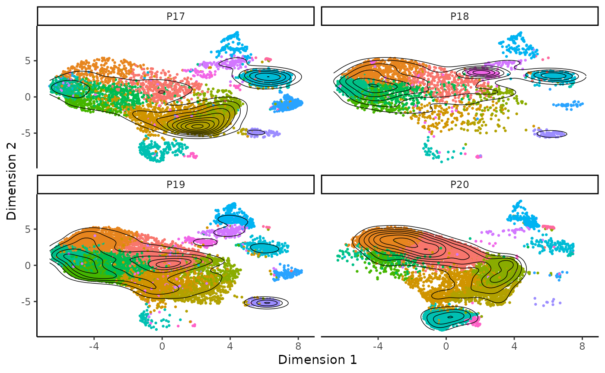

## clonalNetwork

Similar to
[`clonalOverlay()`](https://www.borch.dev/uploads/scRepertoire/reference/clonalOverlay.md),
[`clonalNetwork()`](https://www.borch.dev/uploads/scRepertoire/reference/clonalNetwork.md)
visualizes the network interaction of clones shared between clusters
along the single-cell dimensional reduction. This function shows the
relative proportion of clones flowing from a starting node, with the
ending node indicated by an arrow

### Filtering Options for clonalNetwork()

- `filter.clones`:
  - Select a number to isolate the clones comprising the top n number of
    cells (e.g., `filter.clones = 2000`).
  - Select `min` to scale all groups to the size of the minimum group.
- `filter.identity`: For the identity chosen to visualize, show the “to”
  and “from” network connections for a single group.
- `filter.proportion`: Remove clones from the network that comprise less
  than a certain proportion of clones in groups.
- `filter.graph`: Remove reciprocal edges from one half of the graph,
  allowing for cleaner visualization.

Now, visualize the clonal network with no specific identity filter:

``` r
#ggraph needs to be loaded due to issues with ggplot
library(ggraph)

#No Identity filter
clonalNetwork(scRep_example, 
              reduction = "umap", 
              group.by = "seurat_clusters",
              filter.clones = NULL,
              filter.identity = NULL,
              cloneCall = "aa")
```

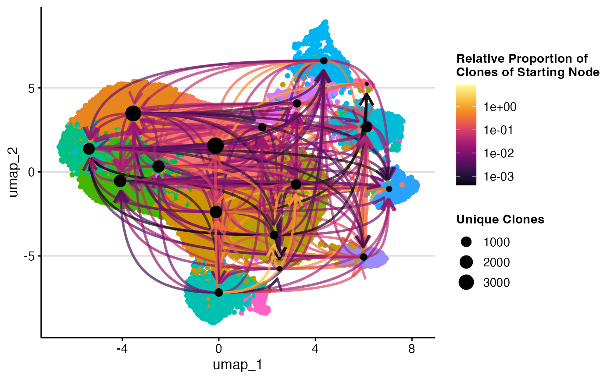

We can look at the clonal relationships relative to a single cluster
using the `filter.identity` parameter. For example, focusing on Cluster
3:

``` r
#Examining Cluster 3 only
clonalNetwork(scRep_example, 
              reduction = "umap", 
              group.by = "seurat_clusters",
              filter.identity = 3,
              cloneCall = "aa")
```

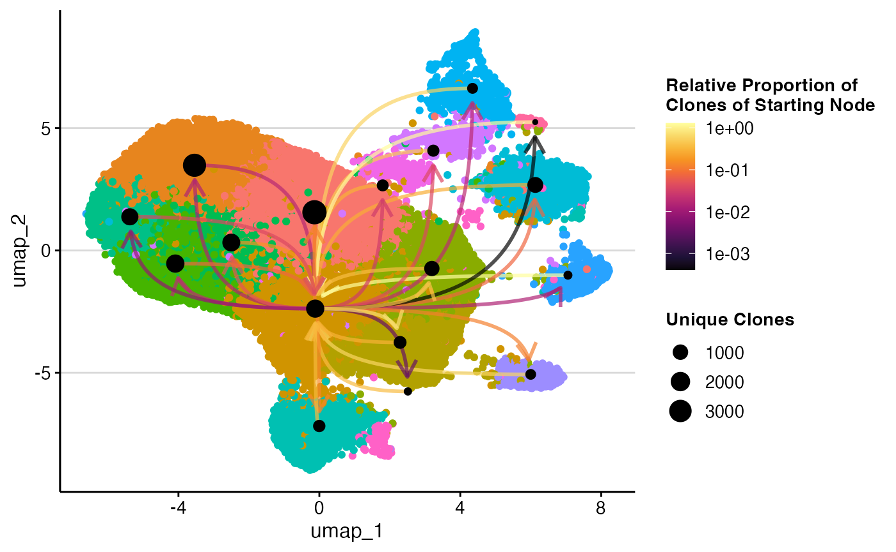

You can also use the `exportClones` parameter to quickly get clones that
are shared across multiple identity groups, along with the total number
of clone copies in the dataset.

``` r
shared.clones <- clonalNetwork(scRep_example, 
                               reduction = "umap", 
                               group.by = "seurat_clusters",
                               cloneCall = "aa", 
                               exportClones = TRUE)
head(shared.clones)
```

    ## # A tibble: 6 × 2
    ##   clone                                sum
    ##   <fct>                              <int>
    ## 1 CVVSDNTGGFKTIF_CASSVRRERANTGELFF     906
    ## 2 CAERGSGGSYIPTF_CASSDPSGRQGPRWDTQYF   140
    ## 3 CAVTFHYNTDKLIF_CASSQDRTGLDYEQYF      122
    ## 4 CAVRDDGNTGFQKLVF_CASSQDFNDGGLNIQYF   119
    ## 5 CARKVRDSSYKLIF_CASSDSGYNEQFF         106
    ## 6 CAVGAQQGGKLIF_CASSLSLSDGRHGYTF       101

## highlightClones

The
[`highlightClones()`](https://www.borch.dev/uploads/scRepertoire/reference/highlightClones.md)
function allows you to specifically visualize the distribution of
particular clonal sequences on your single-cell dimensional reduction
plots. This helps in tracking the location and expansion of clones of
interest.

Key Parameters for
[`highlightClones()`](https://www.borch.dev/uploads/scRepertoire/reference/highlightClones.md)

- `cloneCall`: The type of sequence to use for highlighting (e.g., “aa”,
  “nt”, “strict”).
- `sequence`: A character vector of the specific clonal sequences to
  highlight.

To highlight the most prominent amino acid sequences:
*CAERGSGGSYIPTF_CASSDPSGRQGPRWDTQYF* and *CARKVRDSSYKLIF_CASSDSGYNEQFF*:

``` r
scRep_example <- highlightClones(scRep_example, 
                    cloneCall= "aa", 
                    sequence = c("CAERGSGGSYIPTF_CASSDPSGRQGPRWDTQYF", 
                                 "CARKVRDSSYKLIF_CASSDSGYNEQFF"))

Seurat::DimPlot(scRep_example, group.by = "highlight") + 
  guides(color=guide_legend(nrow=3,byrow=TRUE)) + 
  ggplot2::theme(plot.title = element_blank(), 
                 legend.position = "bottom")
```

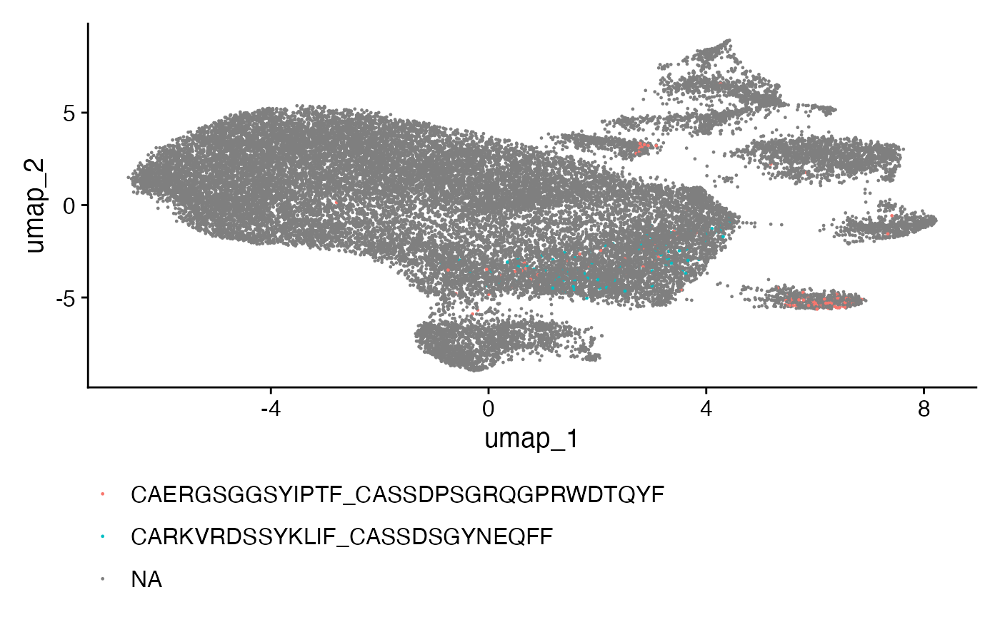

## clonalOccupy

[`clonalOccupy()`](https://www.borch.dev/uploads/scRepertoire/reference/clonalOccupy.md)
visualizes the count of cells by cluster, categorized into specific
clonal frequency ranges. It uses the cloneSize metadata variable
(generated by
[`combineExpression()`](https://www.borch.dev/uploads/scRepertoire/reference/combineExpression.md))
to plot the number of cells within each clonal expansion designation,
using a secondary variable like cluster. Credit for the idea goes to
Drs. Carmona and Andreatta.

Key Parameters for
[`clonalOccupy()`](https://www.borch.dev/uploads/scRepertoire/reference/clonalOccupy.md)
\* `x.axis`: The variable in the metadata to graph along the x-axis
(e.g., “seurat_clusters”, “ident”). \* `label`: If TRUE, includes the
number of clones in each category by x.axis variable. \* `proportion`:
If TRUE, converts the stacked bars into relative proportions. \*
`na.include`: If TRUE, visualizes NA values.

To visualize the count of cells by `seurat_clusters` based on
`cloneSize` groupings:

``` r
clonalOccupy(scRep_example, 
              x.axis = "seurat_clusters")
```

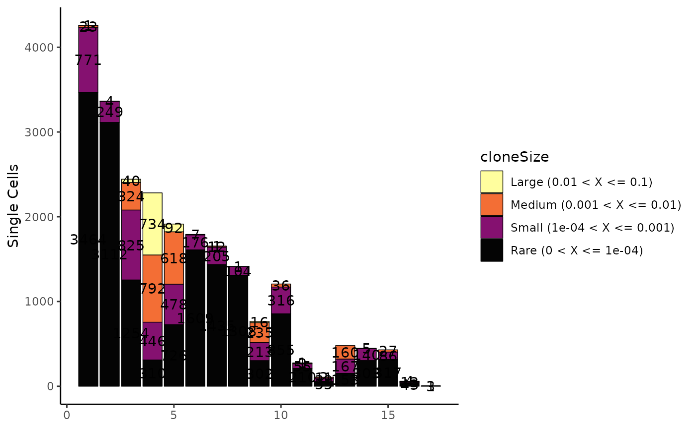

To visualize the proportion of cells by `ident` (active identity),
without labels:

``` r
clonalOccupy(scRep_example, 
             x.axis = "ident", 
             proportion = TRUE, 
             label = FALSE)
```

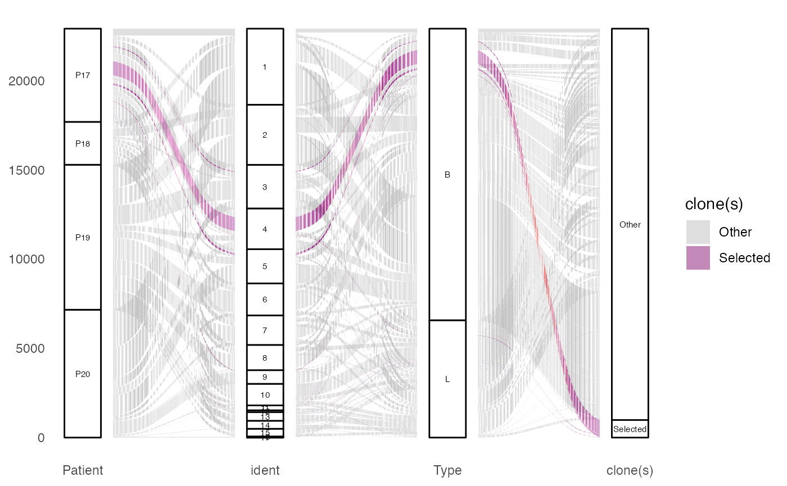

## alluvialClones

After the metadata has been modified with clonal information,
[`alluvialClones()`](https://www.borch.dev/uploads/scRepertoire/reference/alluvialClones.md)
allows you to look at clones across multiple categorical variables,
enabling the examination of the interchange between these variables.
Because this function produces a graph with each clone arranged by
called stratification, it may take some time depending on the size of
the repertoire.

Key Parameters for
[`alluvialClones()`](https://www.borch.dev/uploads/scRepertoire/reference/alluvialClones.md)

- `y.axes`: The columns that will separate the proportional
  visualizations.
- `color`: The column header or clone(s) to be highlighted.
- `facet`: The column label to separate facets.
- `alpha`: The column header to have gradated opacity.
- `top.clones`: Show only the top N clones by frequency.
- `min.freq`: Minimum frequency threshold for displaying flows.
- `highlight.clones`: Character vector of specific clone sequences to
  highlight.
- `stratum.width`: Control the width of stratum bars.
- `flow.alpha`: Control the transparency of flows.
- `order.strata`: Named list to specify the order of levels within each
  stratum.

To visualize clonal flow across “Patient”, “ident”, and “Type”,
highlighting specific amino acid clones:

``` r
alluvialClones(scRep_example,
               clone.call = "aa",
               y.axes = c("Patient", "ident", "Type"),
               color = c("CVVSDNTGGFKTIF_CASSVRRERANTGELFF", "NA_CASSVRRERANTGELFF")) +
    scale_fill_manual(values = c("grey", colorblind_vector[3]))
```

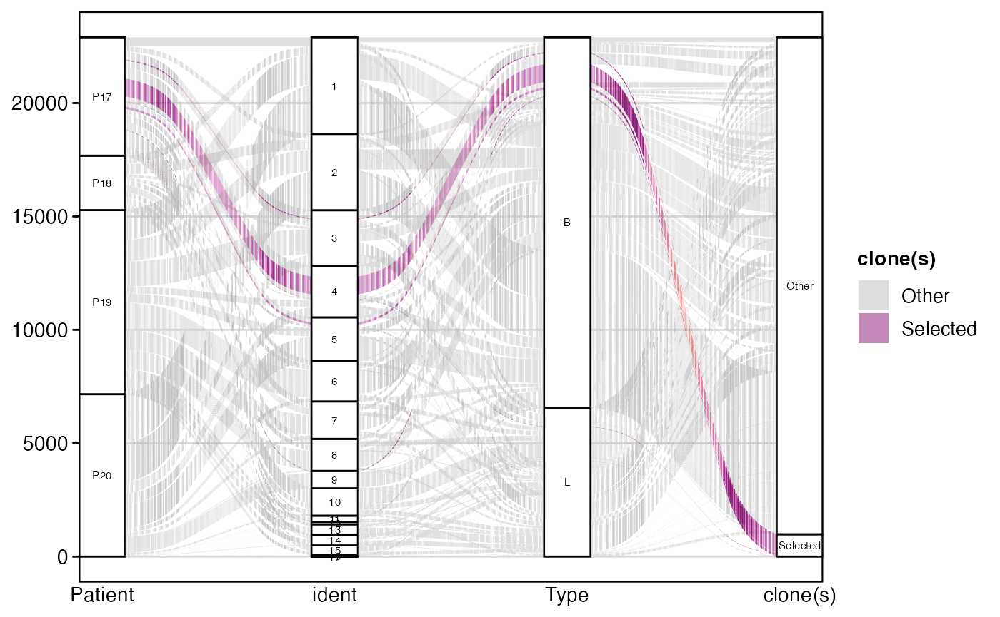

To visualize clonal flow across “Patient”, “ident”, and “Type”, coloring
by “ident”:

``` r
alluvialClones(scRep_example,
               clone.call = "gene",
               y.axes = c("Patient", "ident", "Type"),
               color = "ident")
```

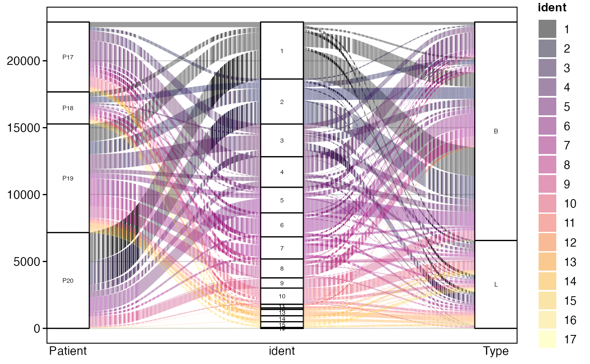

### Filtering and Highlighting Clones

For large datasets, it can be useful to filter to only the most frequent
clones using `top.clones`:

``` r
alluvialClones(scRep_example,
               clone.call = "aa",
               y.axes = c("Patient", "ident"),
               top.clones = 25,
               color = "ident")
```

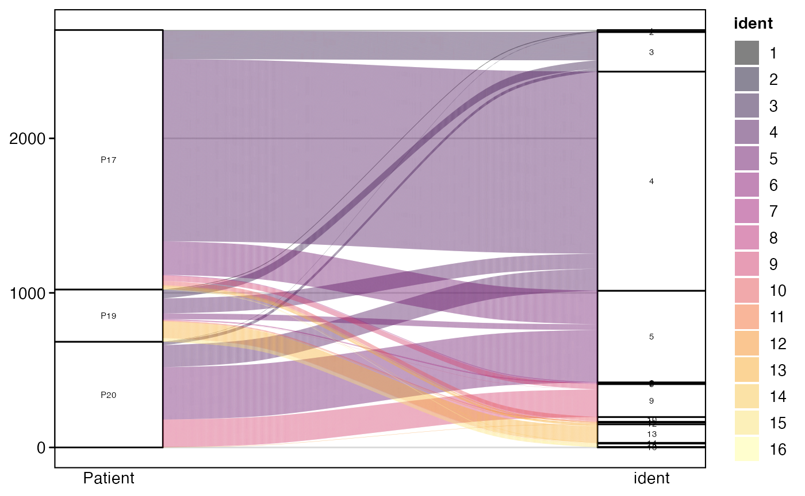

To highlight specific clones of interest while showing all others in
gray:

``` r
alluvialClones(scRep_example,
               clone.call = "aa",
               y.axes = c("Patient", "ident", "Type"),
               highlight.clones = c("CVVSDNTGGFKTIF_CASSVRRERANTGELFF"),
               highlight.color = "red")
```

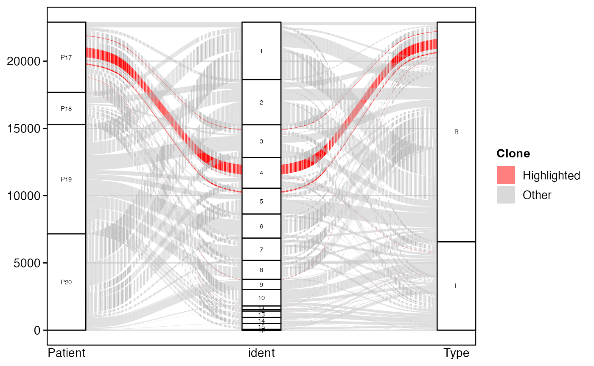

### Customizing Visual Appearance

Control the appearance with `stratum.width`, `flow.alpha`, and
`label.size`:

``` r
alluvialClones(scRep_example,
               clone.call = "gene",
               y.axes = c("Patient", "ident"),
               color = "ident",
               stratum.width = 0.3,
               flow.alpha = 0.7,
               label.size = 3)
```

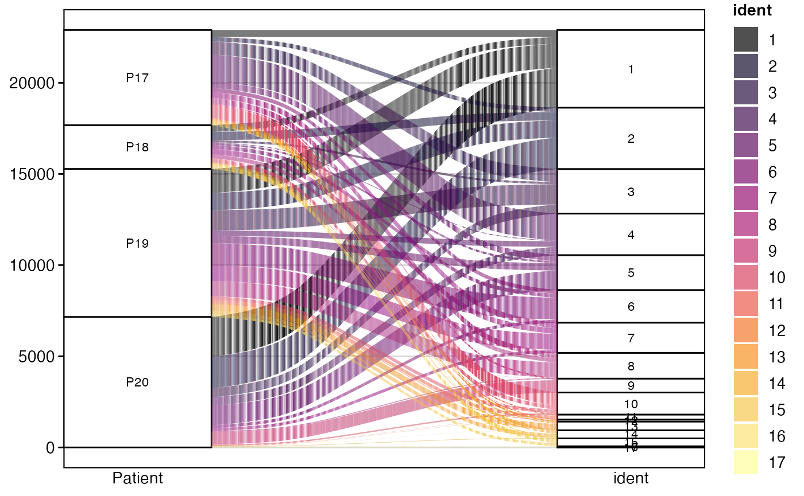

[`alluvialClones()`](https://www.borch.dev/uploads/scRepertoire/reference/alluvialClones.md)
provides a visual representation of clonal distribution and movement
across multiple categorical annotations. It is particularly effective
for tracking how specific clones or clonal groups transition between
different states, tissues, or cell types, offering a dynamic perspective
on immune repertoire evolution and function.

## getCirclize and vizCirclize

Like alluvial graphs, we can also visualize the interconnection of
clusters using chord diagrams from the [circlize R
package](https://jokergoo.github.io/circlize_book/book/). There are two
approaches:
[`getCirclize()`](https://www.borch.dev/uploads/scRepertoire/reference/getCirclize.md)
returns data for custom circlize plotting, while
[`vizCirclize()`](https://www.borch.dev/uploads/scRepertoire/reference/vizCirclize.md)
provides a convenient wrapper for quick visualizations.

### Quick Visualization with vizCirclize

The simplest way to create a chord diagram is with
[`vizCirclize()`](https://www.borch.dev/uploads/scRepertoire/reference/vizCirclize.md),
which handles all the circlize setup automatically:

``` r
library(circlize)
vizCirclize(scRep_example,
            group.by = "seurat_clusters")
```

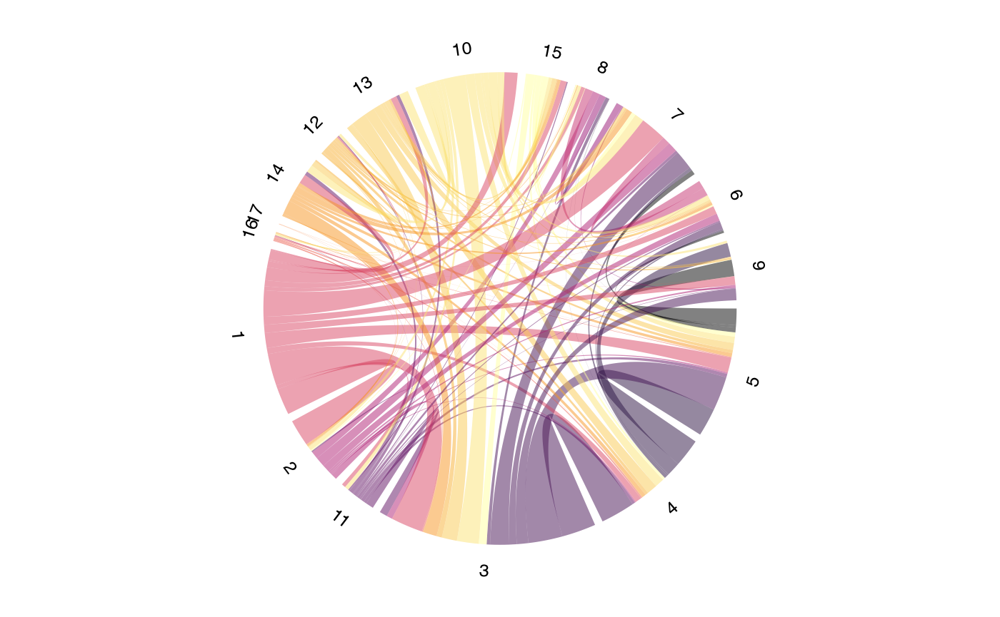

For directional flow showing clonal migration patterns:

``` r
vizCirclize(scRep_example,
            group.by = "seurat_clusters",
            directional = TRUE)
```

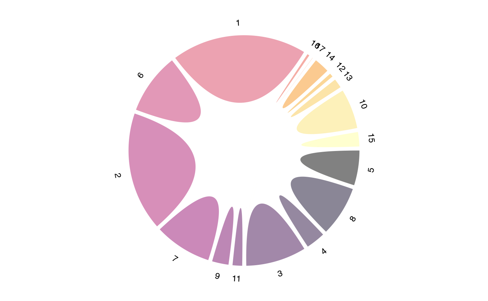

### Advanced Control with getCirclize

For more control over the visualization, use
[`getCirclize()`](https://www.borch.dev/uploads/scRepertoire/reference/getCirclize.md)
to generate the data and then customize the circlize plot manually.

Key Parameters for getCirclize()

- `group.by`: Single column or vector of columns for hierarchical
  grouping.
- `method`: Calculation method - `"unique"` (count), `"jaccard"`,
  `"overlap"`, or `"abundance"`.
- `proportion`: If `TRUE`, normalizes the relationship by proportion.
- `symmetric`: If `FALSE`, returns directional flow data.
- `include.metadata`: If `TRUE`, returns rich output with sector
  statistics.
- `min.shared`: Minimum shared clones to include a link.
- `top.links`: Keep only the top N links by value.

To get data for a chord diagram showing shared clones between
`seurat_clusters`:

``` r
library(scales)

circles <- getCirclize(scRep_example,
                       group.by = "seurat_clusters")

#Just assigning the normal colors to each cluster
grid.cols <- hue_pal()(length(unique(scRep_example$seurat_clusters)))
names(grid.cols) <- unique(scRep_example$seurat_clusters)

#Graphing the chord diagram
chordDiagram(circles, self.link = 1, grid.col = grid.cols)
```

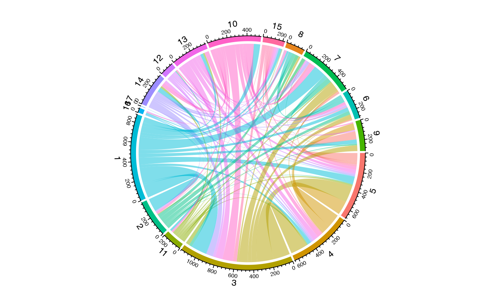

### Multi-Level Hierarchical Chord Diagrams

One powerful feature is the ability to create hierarchical groupings by
passing multiple columns to `group.by`. This creates compound sector
labels that can be used for multi-track annotations:

``` r
# Get hierarchical data with metadata
result <- getCirclize(scRep_example,
                      group.by = c("Patient", "seurat_clusters"),
                      include.metadata = TRUE)

# The result contains links, sector statistics, and suggested colors
head(result$links)
```

    ##     from    to value
    ## 1  P17_5 P17_5     0
    ## 2  P17_5 P17_8     1
    ## 3  P17_4 P17_5    42
    ## 4  P17_3 P17_5    46
    ## 5 P17_11 P17_5     5
    ## 6  P17_5 P17_9    12

``` r
head(result$sectors)
```

    ##   sector n.cells n.clones n.shared expansion Patient seurat_clusters
    ## 1  P17_1     408      361    15675 0.1151961     P17               1
    ## 2 P17_10     892      628    15675 0.2959641     P17              10
    ## 3 P17_11     137       51    15675 0.6277372     P17              11
    ## 4 P17_12     472       39    15675 0.9173729     P17              12
    ## 5 P17_13      99       55    15675 0.4444444     P17              13
    ## 6 P17_14     183      154    15675 0.1584699     P17              14

``` r
# Use for chord diagram with built-in colors
circos.clear()
chordDiagram(result$links,
             grid.col = result$colors,
             self.link = 1)
```

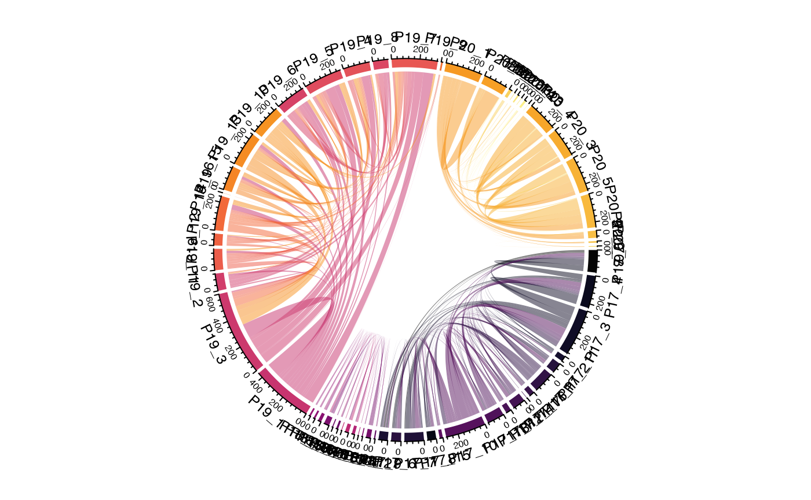

### Using Different Overlap Methods

The `method` parameter allows different ways to quantify relationships:

``` r
# Jaccard similarity - good for comparing repertoire overlap
circles_jaccard <- getCirclize(scRep_example,
                               group.by = "seurat_clusters",
                               method = "jaccard")

circos.clear()
chordDiagram(circles_jaccard, self.link = 1)
```

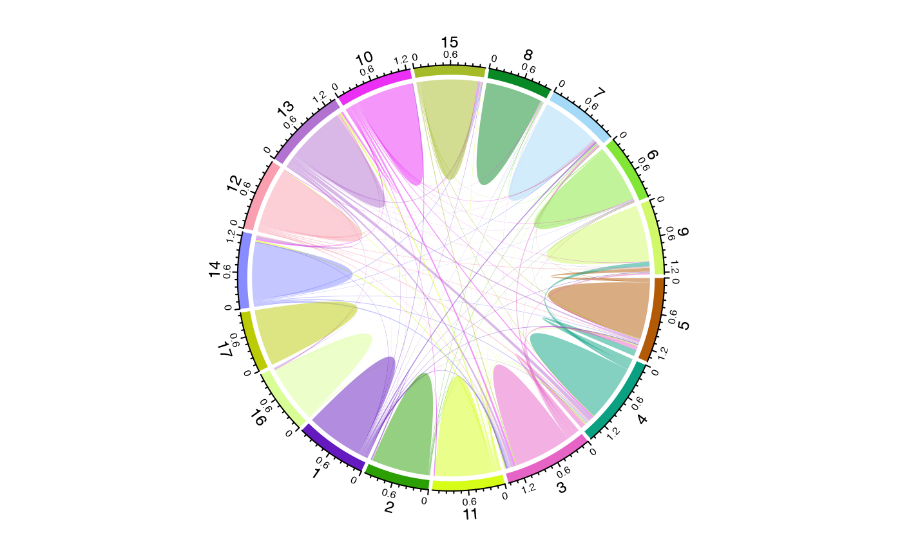

### Directional Flow Analysis

Setting `symmetric = FALSE` enables directional analysis showing what
proportion of each sector’s clones are found in other sectors:

``` r
subset <- subset(scRep_example, Type == "L")

circles <- getCirclize(subset, group.by = "ident", symmetric = FALSE)

grid.cols <- scales::hue_pal()(length(unique(subset@active.ident)))
names(grid.cols) <- levels(subset@active.ident)

circos.clear()
chordDiagram(circles,
             self.link = 1,
             grid.col = grid.cols,
             directional = 1,
             direction.type = "arrows",
             link.arr.type = "big.arrow")
```

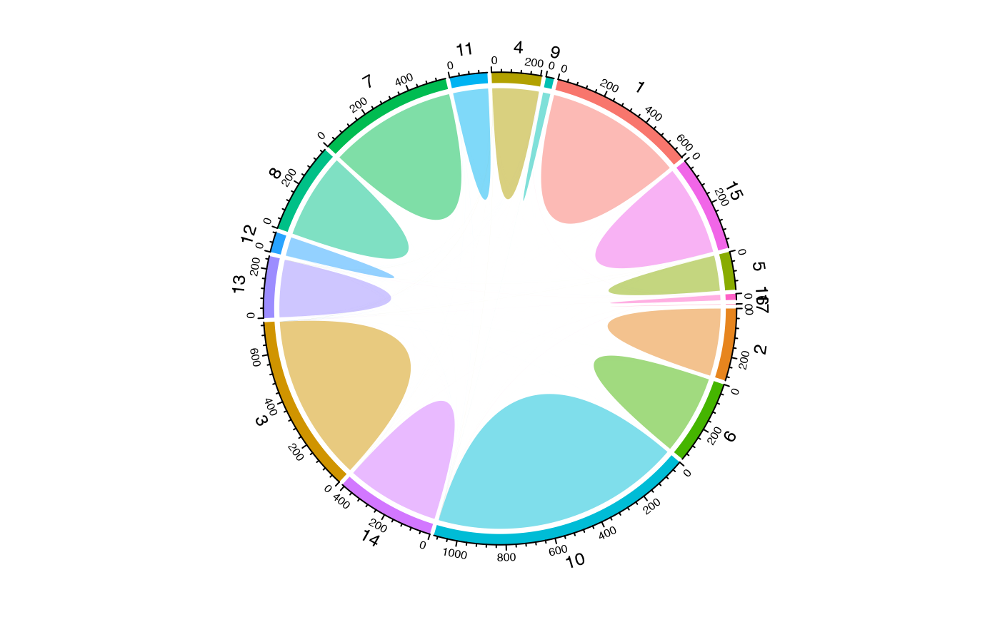

### Filtering Links

For cleaner visualizations, filter out weak connections:

``` r
# Keep only links with at least 5 shared clones
circles_filtered <- getCirclize(scRep_example,
                                group.by = "seurat_clusters",
                                min.shared = 5)

circos.clear()
chordDiagram(circles_filtered, self.link = 1)
```

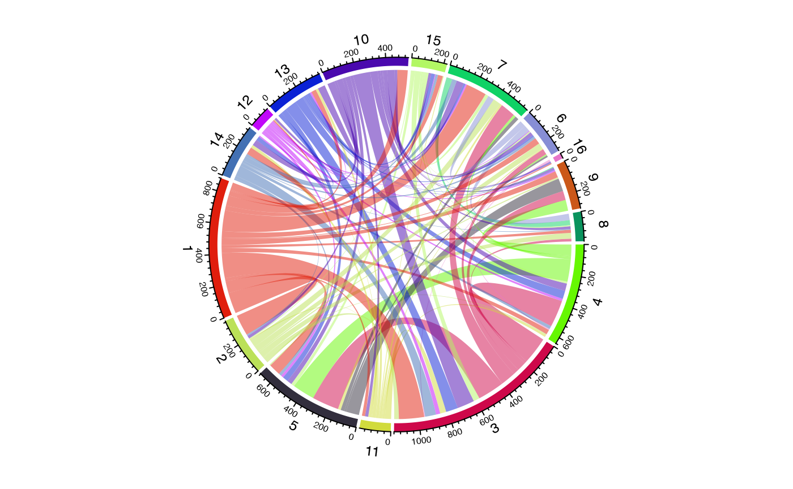

[`getCirclize()`](https://www.borch.dev/uploads/scRepertoire/reference/getCirclize.md)
and
[`vizCirclize()`](https://www.borch.dev/uploads/scRepertoire/reference/vizCirclize.md)
facilitate the creation of visually striking and informative chord
diagrams to represent shared clonal relationships between distinct
groups within your single-cell data. By providing flexible ways to
quantify and format clonal overlap, they enable researchers to
effectively illustrate complex clonal connectivity patterns, which are
crucial for understanding immune communication and migration.

## Next Steps

- [Quantifying Clonal
  Bias](https://www.borch.dev/uploads/scRepertoire/articles/Clonal_Bias.md) -
  Measure clonal expansion bias across clusters and conditions.
- [Clustering by Edit
  Distance](https://www.borch.dev/uploads/scRepertoire/articles/Clonal_Cluster.md) -
  Group clones by sequence similarity beyond exact matches.
- [FAQ](https://www.borch.dev/uploads/scRepertoire/articles/FAQ.md) -
  Common questions about color palettes, plot customization, and data
  export.
