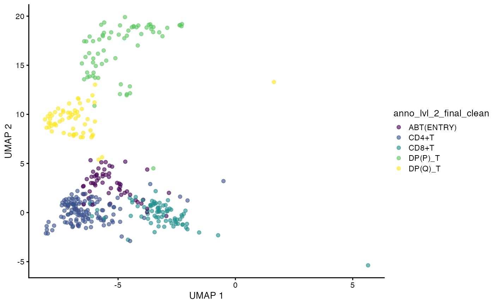
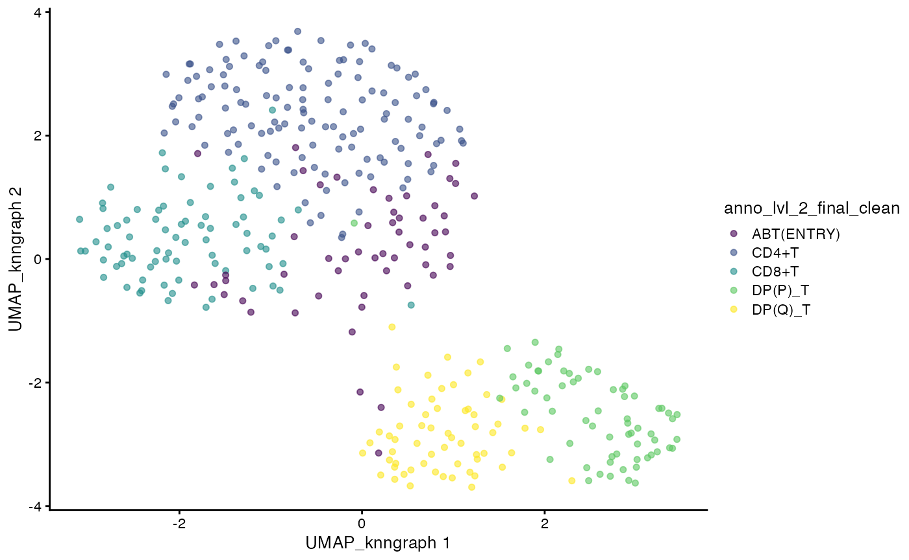
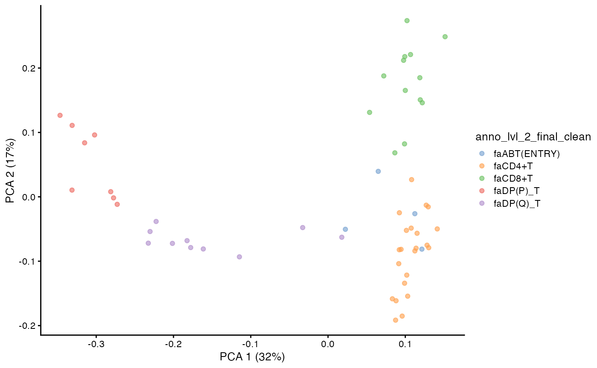
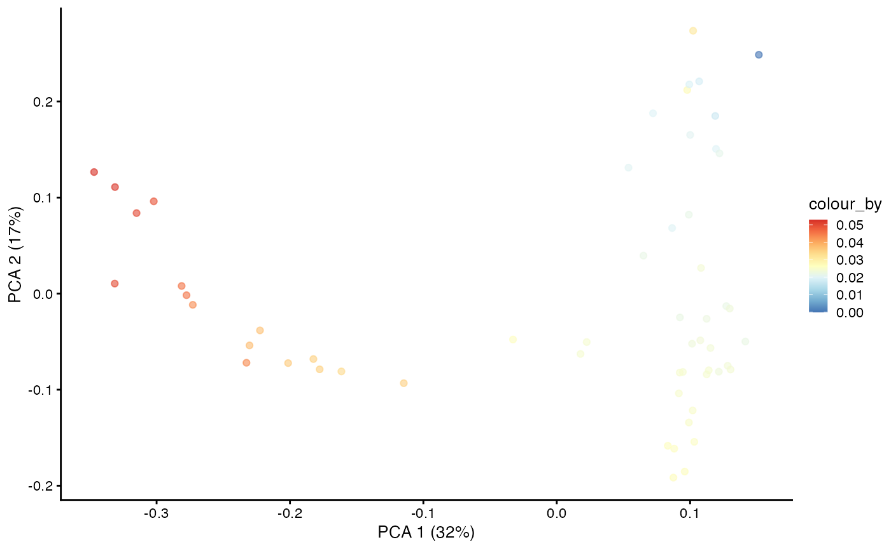
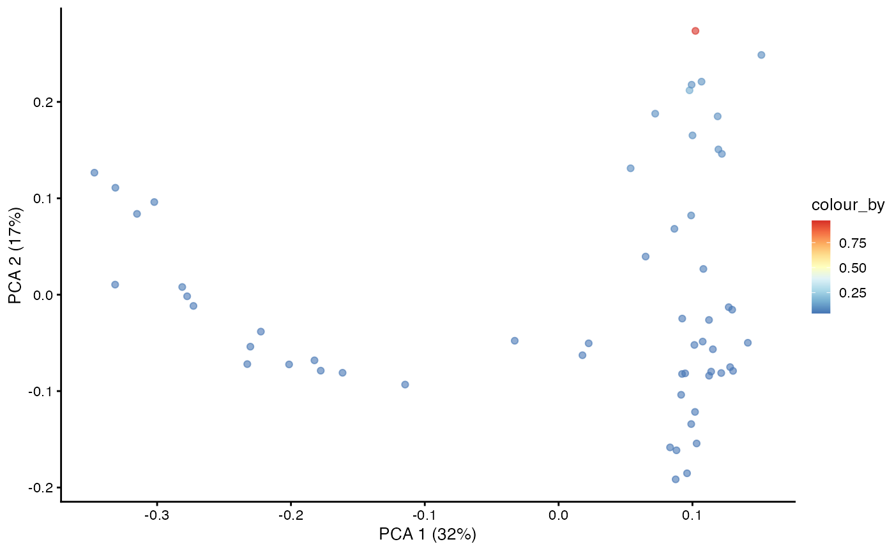
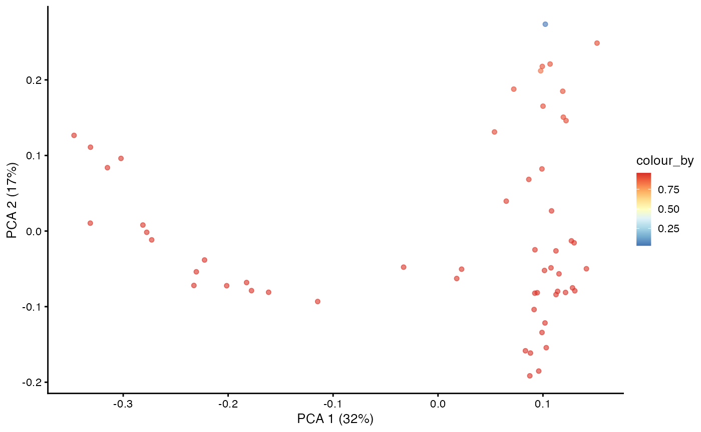
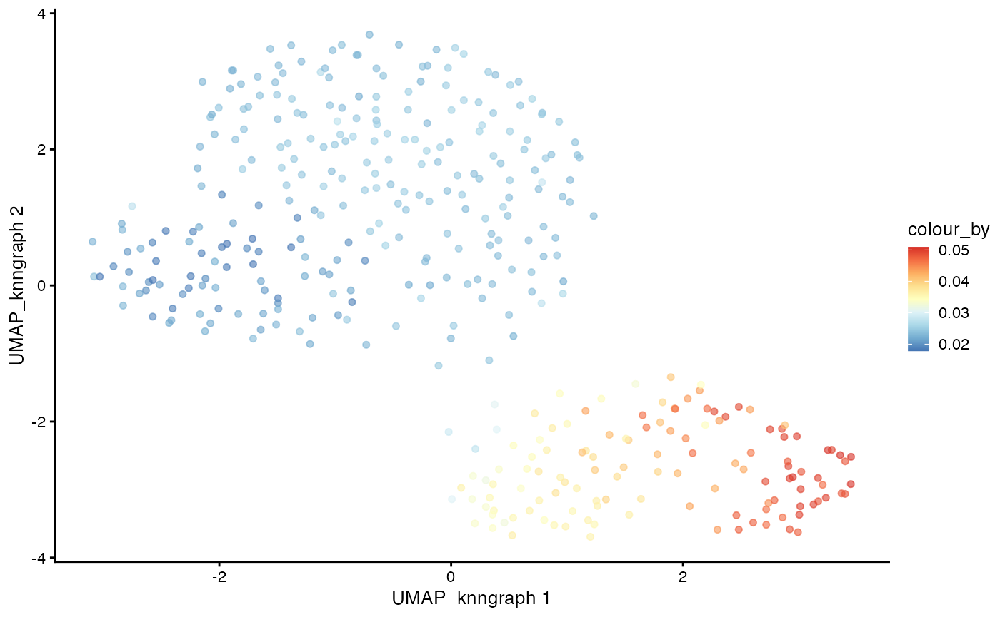
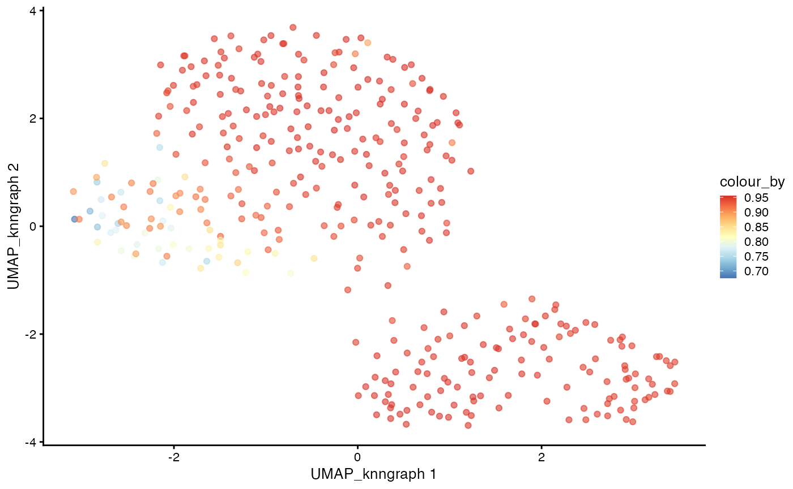
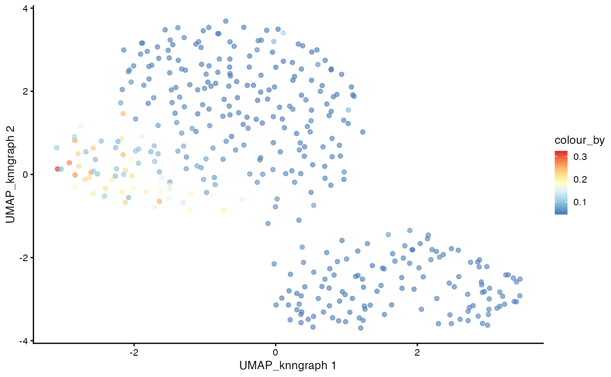

# VDJ Trajectory Analysis with dandelionR

## Overview

`dandelionR` is an R package for performing single-cell immune
repertoire trajectory analysis, based on the original python
implementation in [dandelion](https://www.github.com/zktuong/dandelion).

It provides all the necessary tools to interface with
[scRepertoire](https://github.com/ncborcherding/scRepertoire) and a
custom implementation of absorbing markov chain for pseudotime
inference, inspired based on the
[palantir](https://github.com/dpeerlab/Palantir) python package.

### Citation

If using *dandelionR*, please cite the
[article](https://pmc.ncbi.nlm.nih.gov/articles/PMC12270724/): Yu, J.,
et al., dandelionR: Single-cell immune repertoire trajectory analysis in
R. *Computational and Structural Biotechnology Journal.* 2025.

## Installation

``` r
if (!require("BiocManager", quietly = TRUE))
    install.packages("BiocManager")

BiocManager::install("dandelionR")

remotes::install_github("tuonglab/dandelionR", dependencies = TRUE)
```

### Usage

#### Load the required libraries

#### Load the demo data

Due to size limitations of the package, we have provided a very trimmed
down version of the demo data to ~2000 cells. The full dataset can be
found here accordingly: GEX -
<https://developmental.cellatlas.io/fetal-immune> (Lymphoid Cells) and
VDJ -
<https://github.com/zktuong/dandelion-demo-files/tree/master/dandelion_manuscript/data/dandelion-remap>

Check out the other vignette for an example dataset that starts from the
original `dandelion` output associated with the original
[manuscript](https://www.nature.com/articles/s41587-023-01734-7).

``` r
data(demo_sce)
data(demo_airr)
```

#### Use `scRepertoire` to load the VDJ data

For the trajectory analysis work here, we are focusing on the main
productive TCR chains. Therefore we will flag `filterMulti = TRUE`,
which will keep the selection of the 2 corresponding chains with the
highest expression for a single barcode. For more details, refer to
`scRepertoire`’s
[documentation](https://www.borch.dev/uploads/screpertoire/reference/combinetcr).

``` r
contig.list <- loadContigs(input = demo_airr, 
                           format = "AIRR")

# Format to `scRepertoire`'s requirements and some light filtering
combined.TCR <- combineTCR(contig.list,
    removeNA = TRUE,
    removeMulti = TRUE,
    filterMulti = TRUE
)

# Merge VDJ and GEX data
sce <- combineExpression(combined.TCR, demo_sce)

# Subsetting Complete TCR Gene Sequences
sce <- sce[,grep("TRAC", sce$CTgene)]
sce <- sce[,grep("TRBC", sce$CTgene)]
```

#### Initiate `dandelionR` workflow

Here, the data is ready to be used for the pseudobulk and trajectory
analysis workflow in `dandelionR`.

Because this is a alpha-beta TCR data, we will set the `mode_option` to
“abT”. This will append `abT` to the relevant columns holding the VDJ
gene information. If you are going to try other types of VDJ data
e.g. BCR, you should set `mode_option` to “B” instead. And this argument
should be consistently set with the `vdjPseudobulk` function later.

Since the TCR data is already filtered for productive chains in
`combineTCR`, we will set `already.productive = TRUE` and can keep
`allowed_chain_status` as `NULL`.

We will also subset the data to only include the main T-cell types:
CD8+T, CD4+T, ABT(ENTRY), DP(P)\_T, DP(Q)\_T.

``` r
sce <- setupVdjPseudobulk(sce,
    mode_option = "abT",
    already.productive = TRUE,
    subsetby = "anno_lvl_2_final_clean",
    groups = c("CD8+T", "CD4+T", "ABT(ENTRY)", "DP(P)_T", "DP(Q)_T")
)
```

The main output of this function is a `SingleCellExperiment` object with
the relevant VDJ information appended to the `colData`, particularly the
columns with the `_main` suffix e.g. `v_call_abT_VJ_main`,
`j_call_abT_VJ_main` etc.

``` r
head(colData(sce))[,1:10]
```

    ## DataFrame with 6 rows and 10 columns
    ##                                  n_counts   n_genes           file      mito
    ##                                 <numeric> <integer>       <factor> <numeric>
    ## FCAImmP7851891-CCTACCATCGGACAAG      2947      1275 FCAImmP7851891 0.0105192
    ## FCAImmP7851892-ACGGGCTCAGCATGAG      4969      1971 FCAImmP7851892 0.0245522
    ## FCAImmP7803035-CCAGCGATCCGAAGAG      7230      1733 FCAImmP7803035 0.0302905
    ## FCAImmP7528296-ATAAGAGTCAAAGACA      2504       901 FCAImmP7528296 0.0207668
    ## FCAImmP7555860-AACTTTCTCAACGGGA      8689      2037 FCAImmP7555860 0.0357924
    ## FCAImmP7292034-CGTCACTGTGGTCTCG      3111      1254 FCAImmP7292034 0.0228222
    ##                                 doublet_scores predicted_doublets
    ##                                      <numeric>           <factor>
    ## FCAImmP7851891-CCTACCATCGGACAAG      0.0439224              False
    ## FCAImmP7851892-ACGGGCTCAGCATGAG      0.0610687              False
    ## FCAImmP7803035-CCAGCGATCCGAAGAG      0.0383747              False
    ## FCAImmP7528296-ATAAGAGTCAAAGACA      0.0236220              False
    ## FCAImmP7555860-AACTTTCTCAACGGGA      0.0738255              False
    ## FCAImmP7292034-CGTCACTGTGGTCTCG      0.0222841              False
    ##                                 old_annotation_uniform    organ  Sort_id
    ##                                               <factor> <factor> <factor>
    ## FCAImmP7851891-CCTACCATCGGACAAG              SP T CELL       TH    TOT  
    ## FCAImmP7851892-ACGGGCTCAGCATGAG              DP T CELL       TH    TOT  
    ## FCAImmP7803035-CCAGCGATCCGAAGAG              SP T CELL       SK    CD45P
    ## FCAImmP7528296-ATAAGAGTCAAAGACA              SP T CELL       SK    CD45P
    ## FCAImmP7555860-AACTTTCTCAACGGGA              SP T CELL       TH    CD45P
    ## FCAImmP7292034-CGTCACTGTGGTCTCG              SP T CELL       TH    TOT  
    ##                                       age
    ##                                 <integer>
    ## FCAImmP7851891-CCTACCATCGGACAAG        11
    ## FCAImmP7851892-ACGGGCTCAGCATGAG        12
    ## FCAImmP7803035-CCAGCGATCCGAAGAG        14
    ## FCAImmP7528296-ATAAGAGTCAAAGACA        12
    ## FCAImmP7555860-AACTTTCTCAACGGGA        16
    ## FCAImmP7292034-CGTCACTGTGGTCTCG        14

Visualize the UMAP of the filtered data.

``` r
plotUMAP(sce, 
         color_by = "anno_lvl_2_final_clean")
```



### Milo object and neighbourhood graph construction

We will use miloR to create the pseudobulks based on the gene expression
data. The goal is to construct a neighbourhood graph with many neighbors
with which we can sample the representative neighbours to form the
objects.

``` r
library(miloR)
milo_object <- Milo(sce)
milo_object <- buildGraph(milo_object, 
                          k = 30, 
                          d = 20, 
                          reduced.dim = "X_scvi")
milo_object <- makeNhoods(milo_object, 
                          reduced_dims = "X_scvi", 
                          d = 20, 
                          prop = 0.3)
```

#### Construct UMAP on milo neighbor graph

We can visualize this milo object using UMAP.

``` r
milo_object <- miloUmap(milo_object, 
                        n_neighbors = 30)
plotUMAP(milo_object, 
         color_by = "anno_lvl_2_final_clean", 
         dimred = "UMAP_knngraph")
```



### Construct pseudobulked VDJ feature space

Next, we will construct the pseudobulked VDJ feature space using the
neighbourhood graph constructed above. We will also run PCA on the
pseudobulked VDJ feature space.

``` r
pb.milo <- vdjPseudobulk(milo_object, 
                         mode_option = "abT", 
                         col_to_take = "anno_lvl_2_final_clean")
```

We can compute and visualize the PCA of the pseudobulked VDJ feature
space.

``` r
pb.milo <- runPCA(pb.milo, 
                  assay.type = "Feature_space", 
                  ncomponents = 20)
plotPCA(pb.milo, 
        color_by = "anno_lvl_2_final_clean")
```



### TCR trajectory inference using Absorbing Markov Chain

In the original `dandelion` python package, the trajectory inference is
done using the `palantir` package. Here, we implement the absorbing
markov chain approach in dandelionR to infer the trajectory, leveraging
on `destiny` for diffusion map computation.

#### Define root and branch tips

``` r
pca <- t(as.matrix(reducedDim(pb.milo, 
                              type = "PCA")))
# define the CD8 terminal cell as the top-most cell and CD4 terminal cell as
# the bottom-most cell
branch.tips <- c(which.max(pca[2, ]), which.min(pca[2, ]))
names(branch.tips) <- c("CD8+T", "CD4+T")
# define the start of our trajectory as the right-most cell
root <- which.max(pca[1, ])
```

#### Construct diffusion map

``` r
library(destiny)
# Run diffusion map on the PCA
feature_space <- t(assay(pb.milo, "Feature_space"))
dm <- DiffusionMap(as.matrix(feature_space), 
                   n_pcs = 10, 
                   n_eigs = 10, 
                   sigma = 0.5)
```

#### Compute diffusion pseudotime on diffusion map

``` r
dif.pse <- DPT(dm, tips = c(root, branch.tips), w_width = 0.1)

# the root is automatically called DPT + index of the root cell
DPTroot <- paste0("DPT", root)
# store pseudotime in milo object
pb.milo$pseudotime <- dif.pse[[DPTroot]]
# set the colours for pseudotime
pal <- colorRampPalette(rev((RColorBrewer::brewer.pal(9, "RdYlBu"))))(255)
plotPCA(pb.milo, color_by = "pseudotime") + scale_colour_gradientn(colours = pal)
```



#### Markov chain construction on the pseudobulk VDJ feature space

This step will compute the Markov chain probabilities on the pseudobulk
VDJ feature space. It will return the branch probabilities in the
`colData` and the column name corresponds to the branch tips defined
earlier.

``` r
pb.milo <- markovProbability(
    milo = pb.milo,
    diffusionmap = dm,
    terminal_state = branch.tips,
    root_cell = root,
    n_eigs = 10,
    pseudotime_key = "pseudotime",
    knn = 30
)
```

#### Visualising branch probabilities

With the Markov chain probabilities computed, we can visualise the
branch probabilities towards CD4+ or CD8+ T-cell fate on the PCA plot.

``` r
plotPCA(pb.milo, 
        color_by = "CD8+T") + 
  scale_color_gradientn(colors = pal)
```



``` r
plotPCA(pb.milo, 
        color_by = "CD4+T") + 
  scale_color_gradientn(colors = pal)
```



### Transfer

The next step is to project the pseudotime and the branch probability
information from the pseudobulks back to each cell in the dataset. If
the cell do not belong to any of the pseudobulk, it will be removed. If
a cell belongs to multiple pseudobulk samples, its value should be
calculated as a weighted average of the corresponding values from each
pseudobulk, where each weight is inverse of the size of the pseudobulk.

#### Project pseudobulk data to each cell

``` r
cdata <- projectPseudotimeToCell(milo_object, 
                                 pb.milo, 
                                 branch.tips)
```

#### Visualise the trajectory data on a per cell basis

``` r
# Plotting Cell Anntotation
plotUMAP(cdata, color_by = "anno_lvl_2_final_clean", 
         dimred = "UMAP_knngraph")
```


``` r
# Plotting pseudotime
plotUMAP(cdata, color_by = "pseudotime", 
         dimred = "UMAP_knngraph") + 
  scale_color_gradientn(colors = pal)
```



``` r
# Plotting CD4 trajectory
plotUMAP(cdata, color_by = "CD4+T", 
         dimred = "UMAP_knngraph") + 
  scale_color_gradientn(colors = pal)
```



``` r
# Plotting CD8 trajectory
plotUMAP(cdata, color_by = "CD8+T", 
         dimred = "UMAP_knngraph") + 
  scale_color_gradientn(colors = pal)
```


