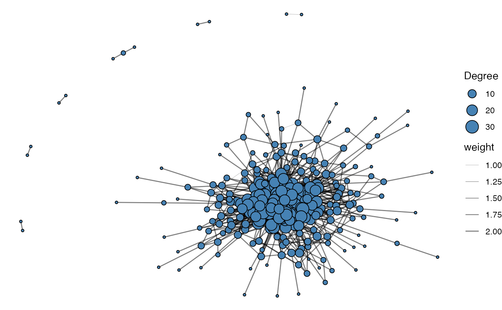
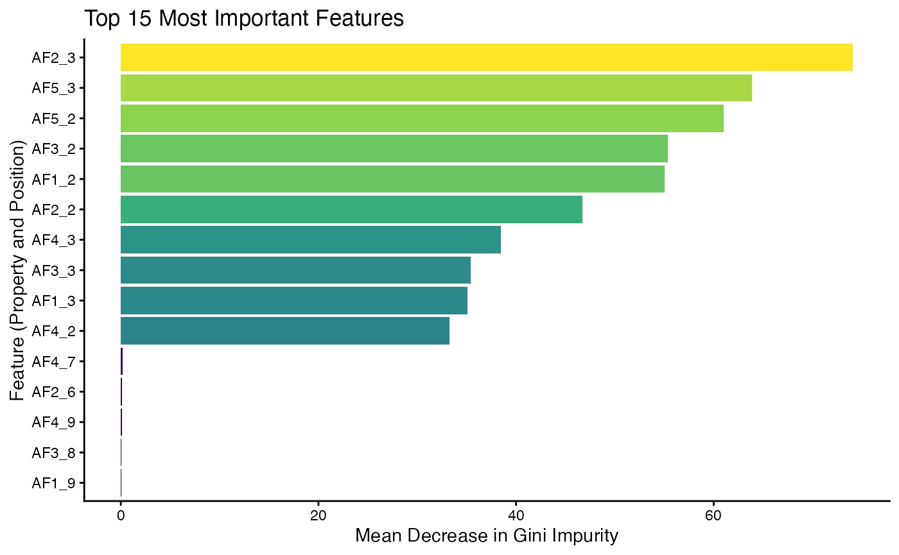
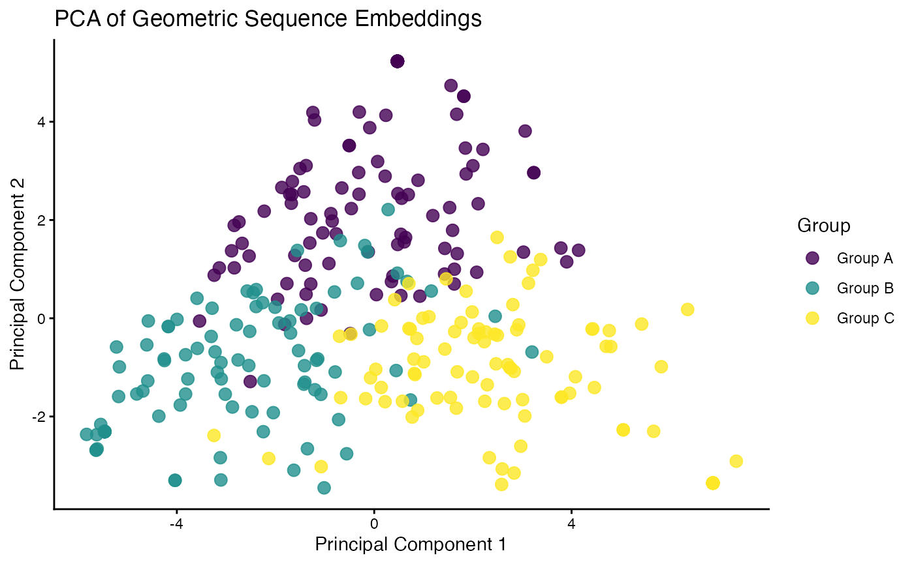
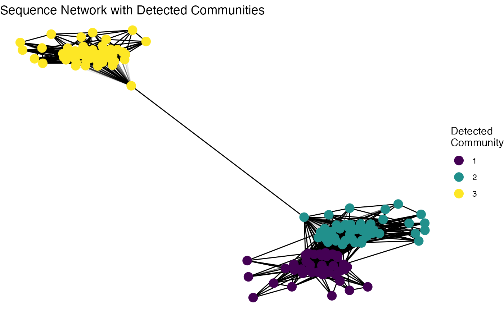

# Making Deep Learning Models with immApex

## Getting Started

**immApex** is meant to serve as an API for supervised and unsupervised
learning tasks based on immune receptor sequencing. These functions
extract or generate amino acid or nucleotide sequences and prepare them
for downstream machine learning. **immApex** is the underlying structure
for the BCR models in [Ibex](https://github.com/BorchLab/Ibex) and TCR
models in [Trex](https://github.com/BorchLab/Trex). It should be noted
that the tools here are created for immune receptor sequences; they will
work more generally for nucleotide or amino acid sequences. The package
itself supports AIRR, Adaptive, and 10x formats and interacts with the
**scRepertoire** R package.

More information is available at the [immApex GitHub
Repo](https://github.com/BorchLab/immApex).

### Loading Libraries

``` r
suppressMessages(library(immApex))
suppressMessages(library(ggplot2))
suppressMessages(library(viridis))
suppressMessages(library(dplyr))
suppressMessages(library(igraph))
suppressMessages(library(tidygraph))
suppressMessages(library(ggraph))
```

## Acquiring and Preparing Repertoire Data

### getIMGT

Depending on the sequencing technology and the version, we might want to
expand the length of our sequence embedding approach. The first step in
the process is pulling the reference sequences from the ImMunoGeneTics
(IMGT) system using
[`getIMGT()`](https://rdrr.io/pkg/immApex/man/getIMGT.html). More
information for IMGT can be found at [imgt.org](https://www.imgt.org/).
Data from IMGT is under a CC BY-NC-ND 4.0 license. Please be aware that
attribution is required for usage and should not be used to create
commercial or derivative work.

Parameters for
[`getIMGT()`](https://rdrr.io/pkg/immApex/man/getIMGT.html)

- **species** One or two word designation of species. Currently
  supporting: “human”, “mouse”, “rat”, “rabbit”, “rhesus monkey”,
  “sheep”, “pig”, “platypus”, “alpaca”, “dog”, “chicken”, and “ferret”
- **chain** Sequence chain to access
- **frame** Designation for “all”, “inframe” or “inframe+gap”
- **region** Sequence gene loci to access
- **sequence.type** Type of sequence - “aa” for amino acid or “nt” for
  nucleotide

Here, we will use the
[`getIMGT()`](https://rdrr.io/pkg/immApex/man/getIMGT.html) function to
get the amino acid sequences for the TRBV region to get all the
sequences by V gene allele.

``` r
TRBV_aa <- getIMGT(species = "human",
                   chain = "TRB",
                   frame = "inframe",
                   region = "v",
                   sequence.type = "aa") 

TRBV_aa[[1]][1]
```

    ## $`TRBV1*01`
    ## [1] "TRBVHPVREGIONAADTGITQTPKYLVTAMGSKRTMKREHLGHDSMYWYRQKAKKSLEFMFYYNCKEFIENKTVPNHFTPECPDSSRLYLHVVALQQEDSAAYLCTSSQ"

### formatGenes

Immune receptor nomenclature can be highly variable across sequencing
platforms. When preparing data for models, we can use
[`formatGenes()`](https://rdrr.io/pkg/immApex/man/formatGenes.html) to
universalize the gene formats into IMGT nomenclature.

Parameters for
[`formatGenes()`](https://rdrr.io/pkg/immApex/man/formatGenes.html)

- **input.data** Data frame of sequencing data or scRepertoire outputs
- **region** Sequence gene loci to access - ‘v’, ‘d’, ‘j’, ‘c’ or a
  combination using c(‘v’, ‘d’, ‘j’)
- **technology** The sequencing technology employed - ‘TenX’,
  “Adaptive’, or ‘AIRR’
- **species** One or two word designation of species. Currently
  supporting: “human”, “mouse”, “rat”, “rabbit”, “rhesus monkey”,
  “sheep”, “pig”, “platypus”, “alpaca”, “dog”, “chicken”, and “ferret”
- **simplify.format** If applicable, remove the allelic designation
  (TRUE) or retain all information (FALSE)

Here, we will use the built-in example from Adaptive Biotechnologies and
reformat and simplify the **v** region.
[`formatGenes()`](https://rdrr.io/pkg/immApex/man/formatGenes.html) will
add 2 columns to the end of the data frame per region selected - 1)
**v_IMGT** will be the formatted gene calls and 2) **v_IMGT.check** is a
binary for if the formatted region appears in the IMGT database. In the
example below, “TRBV2-1” is not recognized as a designation within IMGT.

``` r
data("immapex_example.data")
Adaptive_example <- formatGenes(immapex_example.data[["Adaptive"]],
                                region = "v",
                                technology = "Adaptive", 
                                simplify.format = TRUE) 

head(Adaptive_example[,c("aminoAcid","vGeneName", "v_IMGT", "v_IMGT.check")])
```

    ##              aminoAcid  vGeneName  v_IMGT v_IMGT.check
    ## 4490  CASSQDGPSGIETQYF TCRBV04-02 TRBV4-2            1
    ## 18266    CASSEGSNQPQHF TCRBV02-01 TRBV2-1            0
    ## 22061   CSASAGDMVTEAFF       <NA>    <NA>            0
    ## 22174  CASSQDPGETDTQYF       <NA>    <NA>            0
    ## 19117     CATSAWTGELFF       <NA>    <NA>            0
    ## 2659     CATSVPGQETQYF       <NA>    <NA>            0

### inferCDR

We can now use
[`inferCDR()`](https://rdrr.io/pkg/immApex/man/inferCDR.html) to add
additional sequence elements to our example data using the outputs of
[`formatGenes()`](https://rdrr.io/pkg/immApex/man/formatGenes.html) and
[`getIMGT()`](https://rdrr.io/pkg/immApex/man/getIMGT.html). Here, we
will use the function to isolate the complementarity-determining regions
(CDR) 1 and 2. If the gene nomenclature does not match the IMGT the
result will be NA for the given sequences. Likewise, if the IMGT
nomenclature has been simplified, the first allelic match will be used
for sequence extraction.

Parameters for `inferCDR`

- **input.data** Data frame of sequencing data or output from
  formatGenes().
- **reference** IMGT sequences from
  [`getIMGT()`](https://rdrr.io/pkg/immApex/man/getIMGT.html)
- **technology** The sequencing technology employed - ‘TenX’,
  “Adaptive’, or ‘AIRR’,
- **sequence.type** Type of sequence - “aa” for amino acid or “nt” for
  nucleotide
- **sequences** The specific regions of the CDR loop to get from the
  data.

``` r
Adaptive_example <- inferCDR(Adaptive_example,
                             chain = "TRB", 
                             reference = TRBV_aa,
                             technology = "Adaptive", 
                             sequence.type = "aa",
                             sequences = c("CDR1", "CDR2"))

Adaptive_example[200:210,c("CDR1_IMGT", "CDR2_IMGT")]
```

    ##          CDR1_IMGT  CDR2_IMGT
    ## 27450         <NA>       <NA>
    ## 14624         <NA>       <NA>
    ## 10452         <NA>       <NA>
    ## 31207 IIEKRQSVAFWC QGPKLLIQFQ
    ## 23216 IKTRGQQVTLSC QGLQFLFEYF
    ## 3356  VMGMTNKKSLKC KPPELMFVYS
    ## 25030         <NA>       <NA>
    ## 1889  VMGMTNKKSLKC KPLELMFVYN
    ## 31150 VTEKGKDVELRC QGLEFLIYFQ
    ## 20759         <NA>       <NA>
    ## 13865 VMGMTNKKSLKC KPPELMFVYS

## Generating and Augmenting Sequence Sets

### generateSequences

Generating synthetic sequences is a quick way to start testing the model
code.
[`generateSequences()`](https://rdrr.io/pkg/immApex/man/generateSequences.html)
can also generate realistic noise for generative adversarial networks.

Parameters for
[`generateSequences()`](https://rdrr.io/pkg/immApex/man/generateSequences.html)

- **prefix.motif** Add a defined sequence to the start of the generated
  sequences.
- **suffix.motif** Add a defined sequence to the end of the generated
  sequences
- **number.of.sequences** Number of sequences to generate
- **min.length** Minimum length of the final sequence (will be adjusted
  if incongruent with prefix.motif/suffix.motif)
- **max.length** Maximum length of the final sequence
- **sequence.dictionary** The letters to use in sequence generation
  (default are all amino acids)

``` r
sequences <- generateSequences(prefix.motif = "CAS",
                               suffix.motif = "YF",
                               number.of.sequences = 1000,
                               min.length = 8,
                               max.length = 16)
sequences <- unique(sequences)
head(sequences)
```

    ## [1] "CASHMCYF"         "CASKDINEQTYF"     "CASVIVYF"         "CASKVNWNPKPNVQYF"
    ## [5] "CASIQLAINYF"      "CASMCISYF"

If we want to generate nucleotide sequences instead of amino acids, we
must to change the **sequence.dictionary**.

``` r
nucleotide.sequences <- generateSequences(number.of.sequences = 1000,
                                          min.length = 8,
                                          max.length = 16, 
                                          sequence.dictionary = c("A", "C", "T", "G"))
head(nucleotide.sequences)
```

    ## [1] "TCGTGAAC"         "ATGCGAAC"         "CCGTGCCACGGGTCAA" "AAGAACGGATAGATT" 
    ## [5] "CTAGCCTGGCG"      "ACGCCGACAT"

### mutateSequences

A common approach is to mutate sequences randomly or at specific
intervals. This can be particularly helpful if we have fewer sequences
or want to test a model for accuracy given new, altered sequences.
[`mutateSequences()`](https://rdrr.io/pkg/immApex/man/mutateSequences.html)
allows us to tune the type of mutation, where along the sequences to
introduce the mutation and the overall number of mutations.

Parameters for
[`mutateSequences()`](https://rdrr.io/pkg/immApex/man/mutateSequences.html)

- **input.sequences** The amino acid or nucleotide sequences to use
- **number.of.sequences** The number of mutated sequences to return per
  input.sequence
- **mutation.rate** The rate of mutations introduced into sequences
- **position.start** The starting position to mutate along the sequence.
  Default NULL will start the random mutations at position 1.
- **position.end** The ending position to mutate along the sequence.
  Default NULL will end the random mutations at the last position.
- **sequence.dictionary** The letters to use in sequence mutation
  (default are all amino acids)

``` r
mutated.sequences <- mutateSequences(sequences, 
                                     number.of.sequences = 1,
                                     position.start = 3,                                  
                                     position.end = 8)
head(sequences)
```

    ## [1] "CASHMCYF"         "CASKDINEQTYF"     "CASVIVYF"         "CASKVNWNPKPNVQYF"
    ## [5] "CASIQLAINYF"      "CASMCISYF"

``` r
head(mutated.sequences)
```

    ##           CASHMCYF       CASKDINEQTYF           CASVIVYF   CASKVNWNPKPNVQYF 
    ##         "CASNMCYF"     "CASKDFNEQTYF"         "CASVIVYT" "CASSVNWNPKPNVQYF" 
    ##        CASIQLAINYF          CASMCISYF 
    ##      "CASIQMAINYF"        "CASACISYF"

## Feature Engineering from Repertoires

Beyond encoding single sequences, immApex provides functions to
calculate summary statistics and features across a collection of
sequences, such as a clonal repertoire.

### calculateFrequency

This function calculates the relative frequency of each residue at each
position across a set of sequences.

Parameters for
[`calculateFrequency()`](https://rdrr.io/pkg/immApex/man/calculateFrequency.html)

- **input.sequences**: A character vector of sequences.
- **max.length**: The length to align sequences to by padding/trimming.
- **tidy**: If TRUE, returns a long-format data frame suitable for
  ggplot2.

``` r
freq.matrix <- calculateFrequency(sequences, 
                                  max.length = 20)
head(freq.matrix[, 1:10])
```

    ##   Pos.1 Pos.2 Pos.3      Pos.4      Pos.5      Pos.6      Pos.7      Pos.8
    ## A     0     1     0 0.05210421 0.04308617 0.05210421 0.03807615 0.03106212
    ## R     0     0     0 0.04208417 0.06412826 0.06012024 0.03707415 0.03306613
    ## N     0     0     0 0.03907816 0.04208417 0.05911824 0.04809619 0.03306613
    ## D     0     0     0 0.04809619 0.05210421 0.05611222 0.04208417 0.03306613
    ## C     1     0     0 0.05010020 0.05410822 0.04609218 0.04008016 0.03807615
    ## Q     0     0     0 0.04108216 0.05811623 0.05811623 0.04308617 0.02905812
    ##        Pos.9     Pos.10
    ## A 0.03306613 0.02605210
    ## R 0.03006012 0.02805611
    ## N 0.03206413 0.02404810
    ## D 0.03807615 0.02204409
    ## C 0.02905812 0.02805611
    ## Q 0.02304609 0.01903808

## calculateEntropy

This function measures the diversity (or entropy) at each position in a
set of aligned sequences. It can use several common diversity metrics.

Parameters for
[`calculateEntropy()`](https://rdrr.io/pkg/immApex/man/calculateEntropy.html)

- **method**: The diversity metric to use: “shannon”, “inv.simpson”,
  “gini.simpson”, “norm.entropy”, “pielou”, or Hill numbers (“hill0”,
  “hill1”, “hill2”).

``` r
shannon.entropy <- calculateEntropy(sequences, 
                                    method = "shannon")
head(shannon.entropy)
```

    ##     Pos1     Pos2     Pos3     Pos4     Pos5     Pos6 
    ## 0.000000 0.000000 0.000000 2.986591 2.984538 2.985312

### calculateProperty

This function computes position-wise summary statistics for amino acid
properties. For each position, it calculates a metric (like the mean) of
a specific physicochemical property for all residues found at that
position.

Parameters for
[`calculateProperty()`](https://rdrr.io/pkg/immApex/man/calculateProperty.html)

- **property.set**: The amino acid property scale to use (e.g.,
  “atchleyFactors”).
- **summary.fun**: The summary statistic to apply (“mean”, “median”,
  “sum” etc.).

``` r
# Calculate the mean of Atchley factors at each position
atchley.profile <- calculateProperty(sequences, 
                                     property.set = "atchleyFactors", 
                                     summary.fun = "mean")
head(atchley.profile[, 1:6])
```

    ##      position
    ## scale  Pos.1  Pos.2  Pos.3       Pos.4       Pos.5       Pos.6
    ##   AF1 -1.343 -0.591 -0.228 -0.04847395  0.06555010  0.03563226
    ##   AF2  0.465 -1.302  1.399 -0.04388978 -0.05410321 -0.04387976
    ##   AF3 -0.862 -0.733 -4.760 -0.02414930  0.06490982 -0.09043687
    ##   AF4 -1.020  1.570  0.670  0.02724349 -0.02970441 -0.02113026
    ##   AF5 -0.255 -0.146 -2.647 -0.02846994  0.06192184 -0.03162625

### calculateGeneUsage

This function quantifies the usage of gene loci (e.g., V and J genes)
within a repertoire.

Parameters for
[`calculateGeneUsage()`](https://rdrr.io/pkg/immApex/man/calculateGeneUsage.html)
\* **loci**: A character vector of one or two column names corresponding
to the gene loci. \* **summary**: The output format: “proportion”
(default), “count”, or “percent”.

``` r
# Using the built-in AIRR data
data_airr <- immapex_example.data[["AIRR"]]

# Calculate paired V-J gene usage as percentages
vj_usage <- calculateGeneUsage(data_airr, 
                               loci = c("v_call", "j_call"),
                               summary = "percent")
vj_usage[1:5, 1:5]
```

    ##             y
    ## x             TRAJ10*01  TRAJ11*01  TRAJ12*01  TRAJ13*01  TRAJ13*02
    ##   TRAV1-1*01 0.00000000 0.00000000 0.00000000 0.00000000 0.00000000
    ##   TRAV1-1*02 0.00000000 0.00000000 0.00000000 0.00000000 0.00000000
    ##   TRAV1-2*01 0.00000000 0.01666667 0.00000000 0.00000000 0.00000000
    ##   TRAV1-2*03 0.01666667 0.00000000 0.03333333 0.00000000 0.01666667
    ##   TRAV10*01  0.08333333 0.00000000 0.00000000 0.00000000 0.00000000

### calculateMotif

This function rapidly finds and counts contiguous (or gapped) amino acid
or nucleotide motifs of specified lengths across a set of sequences.

Parameters for
[`calculateMotif()`](https://rdrr.io/pkg/immApex/man/calculateMotif.html)

- **motif.lengths**: An integer vector of motif sizes to search for.
- **min.depth**: The minimum number of times a motif must appear to be
  included in the output.
- **discontinuous**: If TRUE, also finds motifs with a single gap (e.g.,
  “C.S”).

``` r
motif.counts <- calculateMotif(sequences, 
                               motif.lengths = 3, 
                               min.depth = 5)
head(motif.counts)
```

    ##   motif frequency
    ## 1   SYF        52
    ## 2   LQY         5
    ## 3   SAT         6
    ## 4   STH         5
    ## 5   SQI         5
    ## 6   HNY         6

### probabilityMatrix

This function calculates a positional probability matrix (PPM) for a
group of sequences. This can be used to represent the sequence profile
of an antigen-specific repertoire or to generate a sequence logo.

``` r
ppm.matrix <- probabilityMatrix(sequences)
head(ppm.matrix)
```

    ##   Pos.1 Pos.2 Pos.3      Pos.4      Pos.5      Pos.6      Pos.7      Pos.8
    ## A     0     1     0 0.05210421 0.04308617 0.05210421 0.03807615 0.03106212
    ## R     0     0     0 0.04208417 0.06412826 0.06012024 0.03707415 0.03306613
    ## N     0     0     0 0.03907816 0.04208417 0.05911824 0.04809619 0.03306613
    ## D     0     0     0 0.04809619 0.05210421 0.05611222 0.04208417 0.03306613
    ## C     1     0     0 0.05010020 0.05410822 0.04609218 0.04008016 0.03807615
    ## Q     0     0     0 0.04108216 0.05811623 0.05811623 0.04308617 0.02905812
    ##        Pos.9     Pos.10    Pos.11     Pos.12     Pos.13     Pos.14 Pos.15
    ## A 0.03780069 0.03439153 0.0312500 0.02592593 0.02347418 0.01242236      0
    ## R 0.03436426 0.03703704 0.0312500 0.03333333 0.01643192 0.01552795      0
    ## N 0.03665521 0.03174603 0.0359375 0.03148148 0.03521127 0.00931677      0
    ## D 0.04352806 0.02910053 0.0375000 0.04259259 0.01877934 0.00621118      0
    ## C 0.03321879 0.03703704 0.0328125 0.02407407 0.03755869 0.02795031      0
    ## Q 0.02634593 0.02513228 0.0203125 0.03888889 0.02816901 0.01242236      0
    ##   Pos.16
    ## A      0
    ## R      0
    ## N      0
    ## D      0
    ## C      0
    ## Q      0

The PPM can also be converted to a positional weight matrix (PWM) using
a log-likelihood ratio.

``` r
set.seed(42)
# Generate a sample background frequency
back.freq <- sample(1:1000, 20)
names(back.freq) <- amino.acids
back.freq <- back.freq/sum(back.freq)

pwm.matrix <- probabilityMatrix(sequences,
                                max.length = 20,
                                convert.PWM = TRUE,
                                background.frequencies = back.freq)
head(pwm.matrix)
```

    ##       Pos.1     Pos.2     Pos.3       Pos.4      Pos.5      Pos.6      Pos.7
    ## A -6.153093  3.811248 -6.153093 -0.42517268 -0.6936615 -0.4251727 -0.8676909
    ## R -6.982686 -6.982686 -6.982686 -1.55642111 -0.9603181 -1.0519485 -1.7347584
    ## N -5.347666 -5.347666 -5.347666 -0.02573756  0.0785991  0.5592249  0.2670442
    ## D -4.278624 -4.278624 -4.278624  1.33608583  1.4492964  1.5542660  1.1476407
    ## C  6.733651 -3.230690 -3.230690  2.44173581  2.5506702  2.3238993  2.1268625
    ## Q -4.854126 -4.854126 -4.854126  0.53819124  1.0285169  1.0285169  0.6053054
    ##         Pos.8      Pos.9     Pos.10     Pos.11     Pos.12      Pos.13
    ## A -1.15309313 -0.8766248 -1.0065966 -1.1355761 -1.3839637 -1.50303956
    ## R -1.89522302 -1.8394841 -1.7330959 -1.9651688 -1.8725195 -2.79206392
    ## N -0.26020282 -0.1142661 -0.3122005 -0.1375035 -0.3155018 -0.15704371
    ## D  0.80883883  1.1957837  0.6365469  0.9904318  1.1685773  0.08192294
    ## C  2.05471268  1.8652065  2.0189005  1.8539417  1.4389042  2.04739525
    ## Q  0.05276441 -0.0801582 -0.1405891 -0.4215716  0.4675443  0.03693548
    ##       Pos.14    Pos.15     Pos.16     Pos.17     Pos.18     Pos.19     Pos.20
    ## A -2.2574957 -4.080435 -3.1615713 -0.4834994 -0.4834994 -0.4834994 -0.4834994
    ## R -2.8240540 -4.910027 -3.9911640 -1.3130921 -1.3130921 -1.3130921 -1.3130921
    ## N -1.7739963 -3.275007 -2.3561438  0.3219281  0.3219281  0.3219281  0.3219281
    ## D -1.1199922 -2.205965 -1.2871022  1.3909697  1.3909697  1.3909697  1.3909697
    ## C  1.6649079 -1.158031 -0.2391677  2.4389042  2.4389042  2.4389042  2.4389042
    ## Q -0.9585288 -2.781468 -1.8626043  0.8154676  0.8154676  0.8154676  0.8154676

### adjacencyMatrix and buildNetwork

These functions help analyze relationships between residues or whole
sequences.

[`adjacencyMatrix()`](https://rdrr.io/pkg/immApex/man/adjacencyMatrix.html)
summarizes transitions between adjacent residues, creating a matrix of
co-occurrence counts.

``` r
adj.matrix <- adjacencyMatrix(sequences, 
                              normalize = FALSE)
adj.matrix[1:10, 1:10]
```

    ##      A  R  N  D    C  Q  E  G  H  I
    ## A   20 28 38 26 1023 28 24 28 32 24
    ## R   28 22 41 33   27 34 33 27 30 34
    ## N   38 41 16 14   21 31 23 31 33 29
    ## D   26 33 14 38   35 18 30 24 32 35
    ## C 1023 27 21 35   24 28 30 30 27 34
    ## Q   28 34 31 18   28 20 28 27 20 31
    ## E   24 33 23 30   30 28 28 28 23 32
    ## G   28 27 31 24   30 27 28 36 25 35
    ## H   32 30 33 32   27 20 23 25 28 28
    ## I   24 34 29 35   34 31 32 35 28 42

[`buildNetwork()`](https://rdrr.io/pkg/immApex/man/buildNetwork.html)
constructs a similarity network where nodes are sequences and edges
connect sequences with an edit distance below a given threshold.

``` r
# Building an edge list
g1 <- buildNetwork(data.frame(sequences = sequences),
                   seq_col = "sequences",
                   threshold = 2)

# Forming network
graph <- graph_from_edgelist(as.matrix(g1[,1:2]))
E(graph)$weight <- g1[,3]

# Remove isolated nodes for clearer visualization
graph <- delete_vertices(graph, which(degree(graph) == 0))

# Convert to tidygraph for use with ggraph
g_tidy <- as_tbl_graph(graph)

# Plot the network
ggraph(g_tidy, layout = "fr") + 
  geom_edge_link(aes(width = weight), color = "black", alpha = 0.5) + 
  geom_node_point(aes(size = degree(g_tidy, mode = "all")),
                  fill = "steelblue", color= "black", shape = 21) +
  theme_void() + 
  scale_edge_width(range = c(0.1, 0.5)) + 
  labs(size = "Degree") +
  theme(legend.position = "right")
```



## Encoding Sequences for Model Input

### sequenceEncoder

The primary tool for converting biological sequences into a numerical
format suitable for machine learning is the
[`sequenceEncoder()`](https://rdrr.io/pkg/immApex/man/sequenceEncoder.html)
function. It is a versatile wrapper that can generate three different
types of numerical representations, controlled by the mode argument.
Understanding this function is key to using the package effectively.

**Key Arguments**:

- **input.sequences**: The character vector of your amino acid or
  nucleotide sequences.
- **mode**: The most important argument. A string specifying the
  encoding type you need: `"onehot"`, `"property"`, or `"geometric"`.
- **verbose**: A logical flag (TRUE or FALSE) to control whether
  progress messages are printed.

### onehotEncoder

One-hot encoding is a common method that transforms each amino acid at
each position into a binary vector. This is useful when the specific
identity and position of each residue are important. This functionality
is accessed by setting **mode** = `"onehot"` in
[`sequenceEncoder()`](https://rdrr.io/pkg/immApex/man/sequenceEncoder.html)
or by using the
[`onehotEncoder()`](https://rdrr.io/pkg/immApex/man/sequenceEncoder.html)
alias.

**Mode-Specific Arguments**:

- **max.length**: Additional length to pad, NULL will pad sequences to
  the max length of input.sequences
- **padding.symbol**: The single character used to pad sequences shorter
  than max.length.
- **sequence.dictionary**: The letters to use in encoding (default are
  all amino acids)

``` r
# Generate one-hot encoding using the main function
enc_onehot <- sequenceEncoder(sequences, mode = "onehot", verbose = FALSE)

# You can achieve the same result with the alias
enc_onehot_alias <- onehotEncoder(sequences, verbose = FALSE)

# View the first few columns of the flattened matrix output
head(enc_onehot$flattened[, 1:10])
```

    ##      A_1 R_1 N_1 D_1 C_1 Q_1 E_1 G_1 H_1 I_1
    ## [1,]   0   0   0   0   1   0   0   0   0   0
    ## [2,]   0   0   0   0   1   0   0   0   0   0
    ## [3,]   0   0   0   0   1   0   0   0   0   0
    ## [4,]   0   0   0   0   1   0   0   0   0   0
    ## [5,]   0   0   0   0   1   0   0   0   0   0
    ## [6,]   0   0   0   0   1   0   0   0   0   0

### propertyEncoder

Instead of a binary vector, this method represents each amino acid using
a set of continuous numerical values based on physicochemical properties
(e.g., kideraFactors, FASGAI, etc). This can capture the biochemical
similarity between amino acids. Access this method by setting **mode** =
`"property"` or using the
[`propertyEncoder()`](https://rdrr.io/pkg/immApex/man/sequenceEncoder.html)
alias.

**Mode-Specific Arguments**:

- **property.set**: A character string specifying which set of
  pre-defined amino acid properties to use.
- **property.matrix**: A custom numeric matrix of property values you
  provide yourself.

Available **property.set** options include:

- atchleyFactors - [citation](https://pubmed.ncbi.nlm.nih.gov/15851683/)
- crucianiProperties -
  [citation](https://analyticalsciencejournals.onlinelibrary.wiley.com/doi/abs/10.1002/cem.856)
- FASGAI - [citation](https://pubmed.ncbi.nlm.nih.gov/18318694/)
- kideraFactors -
  [citation](https://link.springer.com/article/10.1007/BF01025492)
- MSWHIM - [citation](https://pubs.acs.org/doi/10.1021/ci980211b)
- ProtFP - [citation](https://pubmed.ncbi.nlm.nih.gov/24059694/)
- stScales - [citation](https://pubmed.ncbi.nlm.nih.gov/19373543/)
- tScales -
  [citation](https://www.sciencedirect.com/science/article/abs/pii/S0022286006006314)
- VHSE - [citation](https://pubmed.ncbi.nlm.nih.gov/15895431/)
- zScales - [citation](https://pubmed.ncbi.nlm.nih.gov/9651153/)

``` r
# Generate property-based encoding using FASGAI factors
enc_prop <- sequenceEncoder(sequences,
                            mode = "property",
                            property.set = "FASGAI",
                            verbose = FALSE)

# The propertyEncoder() alias is a convenient shortcut
enc_prop_alias <- propertyEncoder(sequences, property.set = "FASGAI", verbose = FALSE)

# View the first few columns of the flattened property matrix
head(enc_prop$flattened[, 1:6])
```

    ##       F1_1  F2_1   F3_1  F4_1   F5_1  F6_1
    ## [1,] 0.997 0.021 -1.419 -2.08 -0.799 0.502
    ## [2,] 0.997 0.021 -1.419 -2.08 -0.799 0.502
    ## [3,] 0.997 0.021 -1.419 -2.08 -0.799 0.502
    ## [4,] 0.997 0.021 -1.419 -2.08 -0.799 0.502
    ## [5,] 0.997 0.021 -1.419 -2.08 -0.799 0.502
    ## [6,] 0.997 0.021 -1.419 -2.08 -0.799 0.502

### geometricEncoder

This approach creates a single, fixed-length vector (an “embedding”) for
an entire sequence. It works by averaging the vectors for each amino
acid from a substitution matrix (like BLOSUM62) and then applying a
geometric rotation. This is useful for tasks where a summary of the
entire sequence is needed, similar to approaches like
[GIANA](https://pubmed.ncbi.nlm.nih.gov/34349111/). Use this with
**mode** = `"geometric"` or the
[`geometricEncoder()`](https://rdrr.io/pkg/immApex/man/sequenceEncoder.html)
alias.

Parameters for
[`geometricEncoder()`](https://rdrr.io/pkg/immApex/man/sequenceEncoder.html)

- **method**: Select the following substitution matrices: “BLOSUM45”,
  “BLOSUM50”, “BLOSUM62”, “BLOSUM80”, “BLOSUM100”, “PAM30”, “PAM40”,
  “PAM70”, “PAM120”, or “PAM250”
- **theta**: The angle in which to create the rotation matrix

``` r
# Generate a geometric embedding for each sequence
enc_geo <- sequenceEncoder(sequences,
                           mode = "geometric",
                           method = "BLOSUM62",
                           theta = pi / 3,
                           verbose = FALSE)

# The alias provides a direct path to this functionality
enc_geo_alias <- geometricEncoder(sequences, 
                                  method = "BLOSUM62", 
                                  theta = pi / 3, 
                                  verbose = FALSE)

# The output is a single summary matrix where each row is a sequence
head(enc_geo$summary)
```

    ##        [,1]        [,2]       [,3]        [,4]       [,5]       [,6]      [,7]
    ## 1 -1.640544 -0.65849365 -2.7610572  0.28229128 -0.6282849 -1.6617786 -2.840304
    ## 2 -1.229861 -0.03648518 -0.7135148  0.06917725 -0.8720085  0.8436963 -1.754380
    ## 3 -2.056810 -1.18750000 -3.2900635  0.69855716 -1.5612976 -1.0457532 -3.119310
    ## 4 -1.380529  0.14114564 -1.3470349 -0.41686706 -1.2371393  1.0177881 -1.930168
    ## 5 -1.462587 -0.73945224 -2.3684144  0.10221415 -1.1720277 -0.1518066 -2.628962
    ## 6 -1.732051 -1.00000000 -2.8133898  0.42848961 -0.7915951 -1.7400282 -2.883831
    ##          [,8]       [,9]       [,10]     [,11]      [,12]       [,13]
    ## 1  0.66955081 -0.9910254 -0.28349365 -1.953044 -0.1172278 -0.12500000
    ## 2 -0.62799153 -1.6852027  0.08552329 -1.255181  1.0073714 -1.51036297
    ## 3  0.65280398 -0.3337341  1.82804446 -1.794551 -0.8917468  0.04575318
    ## 4 -0.03185118 -1.9072913  0.05352540 -1.191386  1.1885413 -1.76778811
    ## 5  0.37167793 -0.8392773  1.09003464 -1.474767 -0.5365385 -0.53001155
    ## 6  0.77272030 -1.0664529  1.18048396 -1.761823 -0.5039887 -0.09622504
    ##          [,14]      [,15]     [,16]     [,17]      [,18]      [,19]       [,20]
    ## 1  0.216506351 -1.5122595 1.8693103 -1.582532  0.2410254 -0.6785254 -0.82475953
    ## 2  0.282692070 -0.9166667 1.5877132 -2.043055 -0.7946582 -1.3853630  0.06618572
    ## 3  0.170753175 -1.8370191 1.6818103 -1.828044 -0.3337341  0.7120191  0.26674682
    ## 4  0.061898816 -0.7935095 0.6243988 -1.859294 -0.2796075 -1.4346552  0.10989564
    ## 5  0.008916019 -1.4512820 1.7864214 -2.095687 -0.3701633 -0.4180069  0.17855469
    ## 6 -0.055555556 -1.1666667 2.0207259 -1.680484 -0.2004275 -0.4960113 -0.02977213

### tokenizeSequences

Another approach to transforming a sequence into numerical values is
tokenizing it into numbers. This is a common approach for recurrent
neural networks where one letter corresponds to a single integer. In
addition, we can add start and stop tokens to our original sequences to
differentiate between the beginning and end of the sequences.

Parameters for
[`tokenizeSequences()`](https://rdrr.io/pkg/immApex/man/tokenizeSequences.html)

- **add.startstop** Add start and stop tokens to the sequence
- **start.token** The character to use for the start token
- **stop.token** The character to use for the stop token
- **max.length** Additional length to pad, NULL will pad sequences to
  the max length of input.sequences
- **convert.to.matrix** Return a matrix (**TRUE**) or a vector
  (**FALSE**)

``` r
token.matrix <- tokenizeSequences(input.sequences =  c(sequences, mutated.sequences), 
                                  add.startstop = TRUE,
                                  start.token = "!",
                                  stop.token = "^", 
                                  convert.to.matrix = TRUE)
head(token.matrix[,1:18])
```

    ##      [,1] [,2] [,3] [,4] [,5] [,6] [,7] [,8] [,9] [,10] [,11] [,12] [,13] [,14]
    ## [1,]    1    6    2   17   10   14    6   20   15    22    23    23    23    23
    ## [2,]    1    6    2   17   13    5   11    4    8     7    18    20    15    22
    ## [3,]    1    6    2   17   21   11   21   20   15    22    23    23    23    23
    ## [4,]    1    6    2   17   13   21    4   19    4    16    13    16     4    21
    ## [5,]    1    6    2   17   11    7   12    2   11     4    20    15    22    23
    ## [6,]    1    6    2   17   14    6   11   17   20    15    22    23    23    23
    ##      [,15] [,16] [,17] [,18]
    ## [1,]    23    23    23    23
    ## [2,]    23    23    23    23
    ## [3,]    23    23    23    23
    ## [4,]     7    20    15    22
    ## [5,]    23    23    23    23
    ## [6,]    23    23    23    23

### sequenceDecoder

We have a function called
[`sequenceDecoder()`](https://rdrr.io/pkg/immApex/man/sequenceDecoder.html)
that extracts sequences from one-hot or property-encoded matrices or
arrays. This function can be applied to any generative approach to
sequence generation.

Parameters for
[`sequenceDecoder()`](https://rdrr.io/pkg/immApex/man/sequenceDecoder.html)

- **sequence.matrix** The encoded sequences to decode in an array or
  matrix
- **mode** The encoding mode used for decoding: `"onehot"` or
  `"property"`
- **property.set** For `mode = "property"`, a character vector of
  property names (e.g., `"Atchley"`) that were used for the original
  encoding.
- **call.threshold** The relative strictness of sequence calling with
  higher values being more stringent

``` r
property.matrix <- propertyEncoder(input.sequences =  c(sequences, mutated.sequences), 
                                   property.set = "FASGAI")

property.sequences <- sequenceDecoder(property.matrix[[1]],
                                      mode = "property",
                                      property.set  = "FASGAI",
                                      call.threshold = 1)
head(sequences)
```

    ## [1] "CASHMCYF"         "CASKDINEQTYF"     "CASVIVYF"         "CASKVNWNPKPNVQYF"
    ## [5] "CASIQLAINYF"      "CASMCISYF"

``` r
head(property.sequences)
```

    ##                                                                             
    ##         "CASHMCYF"     "CASKDINEQTYF"         "CASVIVYF" "CASKVNWNPKPNVQYF" 
    ##                                       
    ##      "CASIQLAINYF"        "CASMCISYF"

A similar approach can be applied when using matrices or arrays derived
from one-hot encoding:

``` r
sequence.matrix <- onehotEncoder(input.sequences =  c(sequences, mutated.sequences))

OHE.sequences <- sequenceDecoder(sequence.matrix,
                                 mode= "onehot")

head(OHE.sequences)
```

    ## [1] "CASHMCYF"         "CASKDINEQTYF"     "CASVIVYF"         "CASKVNWNPKPNVQYF"
    ## [5] "CASIQLAINYF"      "CASMCISYF"

## Training a Model

### Example 1: Classifying Sequences with Random Forest

A common task is to classify sequences into groups, such as predicting
whether an immune receptor binds to a specific antigen. Here, we’ll
train a Random Forest model to distinguish between two classes of
sequences based on their physicochemical properties

**Step 1: Simulate Data and Engineer Features**

First, we’ll simulate two distinct classes of sequences using
[`generateSequences()`](https://rdrr.io/pkg/immApex/man/generateSequences.html).
We’ll then use
[`propertyEncoder()`](https://rdrr.io/pkg/immApex/man/sequenceEncoder.html)
with the “atchleyFactors” to convert each sequence into a flattened
numerical vector. Each element in the vector represents a specific
physicochemical property at a specific position, transforming our
variable-length sequences into a fixed-size feature matrix suitable for
machine learning.

``` r
# Step 1a: Generate two distinct classes of sequences
class1.sequences <- generateSequences(prefix.motif = "CAS",
                                      min.length = 3,
                                      number.of.sequences = 500)

class2.sequences <- generateSequences(prefix.motif = "CSG",
                                      min.length = 3,
                                      number.of.sequences = 500)

# Combine sequences and create labels
all.sequences <- c(class1.sequences, class2.sequences)
labels <- as.factor(c(rep("Class1", 500), rep("Class2", 500)))

# Step 1b: Use propertyEncoder to create a feature matrix from Atchley factors
feature.matrix <- propertyEncoder(all.sequences, 
                                  property.set = "atchleyFactors",
                                  verbose = FALSE)

# Combine the flattened feature matrix and labels into the final data frame
training.data <- data.frame(feature.matrix$flattened, labels)
```

**Step 2: Train and Evaluate the Model**

Now we can train the Random Forest classifier. This model is robust,
requires minimal tuning, and can provide insights into which features
(in this case, which property at which position) are most important for
distinguishing between the classes.

``` r
suppressMessages(library(randomForest))

# Train the Random Forest model
set.seed(42) # for reproducibility
rf.model <- randomForest(labels ~ ., 
                         data = training.data, 
                         ntree = 100, 
                         importance = TRUE) # Set importance=TRUE to calculate scores

# Print the confusion matrix to see model performance
print(rf.model)
```

    ## 
    ## Call:
    ##  randomForest(formula = labels ~ ., data = training.data, ntree = 100,      importance = TRUE) 
    ##                Type of random forest: classification
    ##                      Number of trees: 100
    ## No. of variables tried at each split: 7
    ## 
    ##         OOB estimate of  error rate: 0%
    ## Confusion matrix:
    ##        Class1 Class2 class.error
    ## Class1    500      0           0
    ## Class2      0    500           0

A key advantage of Random Forest is the ability to easily extract
feature importance. We can create a plot to see which positional Atchley
factors were most influential in the model’s predictions.

``` r
# Extract feature importance data from the model
importance.data <- as.data.frame(importance(rf.model))
importance.data$Feature <- rownames(importance.data)

# Get the top 15 most important features
top_features <- importance.data[order(importance.data$MeanDecreaseGini, decreasing = TRUE), ][1:15,]

# Plot using ggplot2
ggplot(top_features, aes(x = MeanDecreaseGini, y = reorder(Feature, MeanDecreaseGini))) +
  geom_col(aes(fill = MeanDecreaseGini)) +
  scale_fill_viridis_c() +
  labs(title = "Top 15 Most Important Features",
       x = "Mean Decrease in Gini Impurity",
       y = "Feature (Property and Position)") +
  theme_classic() +
  theme(legend.position = "none")
```



The plot shows the features that the model found most useful for
classification. The feature names correspond to specific Atchley factors
at specific positions within the sequence - here residues 2 and 3 where
the difference was encoded - demonstrating how
[`propertyEncoder()`](https://rdrr.io/pkg/immApex/man/sequenceEncoder.html)
allows the model to learn from the underlying biochemistry.

### Example 2: Unsupervised Clustering with PCA and Geometric Encoding

Sometimes we don’t have labels, but we want to see if our sequences form
natural clusters. We can use dimensionality reduction techniques like
Principal Component Analysis (PCA) to visualize the relationships
between sequences. The
[`geometricEncoder()`](https://rdrr.io/pkg/immApex/man/sequenceEncoder.html)
function is perfect for this, as it creates a rich, fixed-length
numerical embedding for each sequence.

**Step 1: Simulate and Encode a Mixed Population of Sequences**

We’ll generate three distinct families of sequences. Then, we will use
[`geometricEncoder()`](https://rdrr.io/pkg/immApex/man/sequenceEncoder.html)
to transform them into a 20-dimensional numerical matrix.

``` r
# Generate three distinct groups of sequences
groupA <- generateSequences(prefix.motif = "CA", 
                            number.of.sequences = 100, 
                            min.length = 2)
groupB <- generateSequences(prefix.motif = "QR", 
                            number.of.sequences = 100, 
                            min.length = 2)
groupC <- generateSequences(prefix.motif = "YY", 
                            number.of.sequences = 100, 
                            min.length = 2)

# Combine them and create a vector of original group IDs for later visualization
mixed.sequences <- c(groupA, groupB, groupC)
original.groups <- as.factor(rep(c("Group A", "Group B", "Group C"), each = 100))

# Use geometricEncoder to create embeddings
geometric.embeddings <- geometricEncoder(mixed.sequences, 
                                         method = "BLOSUM62", 
                                         verbose = FALSE)
```

**Step 2: Perform PCA and Visualize Clusters**

With our geometric.embeddings matrix, we can now perform PCA and plot
the results. If the geometric encoding captures the underlying
differences in our sequence families, we should see distinct clusters in
the plot of the first two principal components.

``` r
# Perform PCA on the embedding matrix
pca.result <- prcomp(geometric.embeddings$summary, center = TRUE, scale. = TRUE)

# Prepare data for plotting with ggplot2
pca.data <- data.frame(PC1 = pca.result$x[,1],
                       PC2 = pca.result$x[,2],
                       Group = original.groups)

# Plot PC1 vs PC2 using ggplot2 and viridis
ggplot(pca.data, aes(x = PC1, y = PC2, color = Group)) +
  geom_point(size = 3, alpha = 0.8) +
  scale_color_viridis(discrete = TRUE) +
  labs(title = "PCA of Geometric Sequence Embeddings",
       x = "Principal Component 1",
       y = "Principal Component 2") +
  theme_classic()
```



The resulting plot clearly shows three distinct clusters, demonstrating
that the
[`geometricEncoder()`](https://rdrr.io/pkg/immApex/man/sequenceEncoder.html)
successfully captured the structural differences between our sequence
families, allowing for their separation in an unsupervised manner.

### Example 3: Identifying Sequence Communities with Network Analysis

Beyond analyzing individual sequences, we can explore the relationships
between sequences by building a similarity network. A powerful machine
learning application for these networks is community detection, an
unsupervised clustering method that finds groups of densely connected
nodes. In immunology, this can be used to identify clonal families or
groups of sequences with shared features.

**Step 1: Simulate Data with Inherent Structure**

First, we will simulate a dataset containing three distinct “families”
of sequences. Our goal is to see if the network analysis can blindly
recover these groups without being given the labels.

``` r
set.seed(42)
# Generate three distinct groups of sequences to simulate clonal families
family1 <- unique(generateSequences(prefix.motif = "CASS", 
                             suffix.motif = "YF", 
                             min.length = 6,
                             number.of.sequences = 60))
family2 <- unique(generateSequences(prefix.motif = "CARS", 
                             suffix.motif = "GF",
                             min.length = 6,
                             number.of.sequences = 60))
family3 <- unique(generateSequences(prefix.motif = "CSVA", 
                             suffix.motif = "HF", 
                             min.length = 6,
                             number.of.sequences = 60))

# Combine into a single data frame
all_sequences_df <- data.frame(
  sequence = c(family1, family2, family3),
  original_family = c(rep("Family 1", 42), rep("Family 2", 40), rep("Family 3", 46))
)
```

**Step 2: Build the Sequence Network**

Next, we use
[`buildNetwork()`](https://rdrr.io/pkg/immApex/man/buildNetwork.html) to
create an edge list based on sequence similarity (edit distance). We
then convert this list into a formal graph object using the igraph
package, which is the standard for network analysis in R.

``` r
# Build the edge list: connect sequences with an edit distance of 3 or less
edge_list <- buildNetwork(all_sequences_df,
                          seq_col = "sequence",
                          threshold = 3)

# Replace numerical edge list with the sequences
edge_list_sequences <- as.matrix(data.frame(
  from = all_sequences_df$sequence[as.numeric(edge_list$from)],
  to = all_sequences_df$sequence[as.numeric(edge_list$to)],
  dist = edge_list$dist
))

# Create a graph object from the edge list and node data
# This graph now contains all our sequences as nodes
sequence_graph <- graph_from_data_frame(d = edge_list_sequences, 
                                        vertices = all_sequences_df, 
                                        directed = FALSE)
E(sequence_graph)$weight <- edge_list_sequences[,3]
```

**Step 3: Perform Community Detection**

Now we apply a machine learning algorithm to find communities. The
`igraph` package offers many algorithms; we will use “Walktrap,” a
method that finds communities through a series of short random walks.
The idea is that walks are more likely to get “trapped” within densely
connected parts of the network (i.e., communities).

``` r
# Perform community detection using the Walktrap algorithm
communities <- cluster_walktrap(sequence_graph)

# Add the community membership as an attribute to the graph nodes
V(sequence_graph)$community <- communities$membership
```

**Step 4: Visualize and Interpret the Communities**

Finally, we use `ggraph` to visualize the network, coloring each node by
the community it was assigned to by the algorithm. If the analysis was
successful, the colors should align with the original sequence families
we simulated.

``` r
# Convert to tidygraph for use with ggraph
g_tidy <- as_tbl_graph(sequence_graph)

# Plot the network, coloring nodes by their detected community
ggraph(g_tidy, layout = "fr") + 
  geom_edge_link(aes(alpha = weight), show.legend = FALSE) +
  geom_node_point(aes(color = as.factor(community)), size = 4) +
  scale_color_viridis(discrete = TRUE, option = "D") +
  labs(title = "Sequence Network with Detected Communities",
       color = "Detected\nCommunity") +
  theme_void()
```



The plot clearly visualizes the network structure, and the distinct
color groups demonstrate that the community detection algorithm
successfully identified and separated the three original sequence
families without any prior information. This unsupervised approach is a
powerful tool for exploring the hidden structure within a complex
repertoire.
