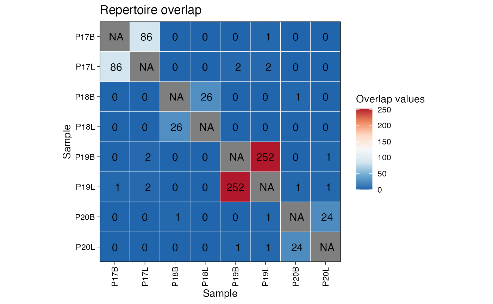
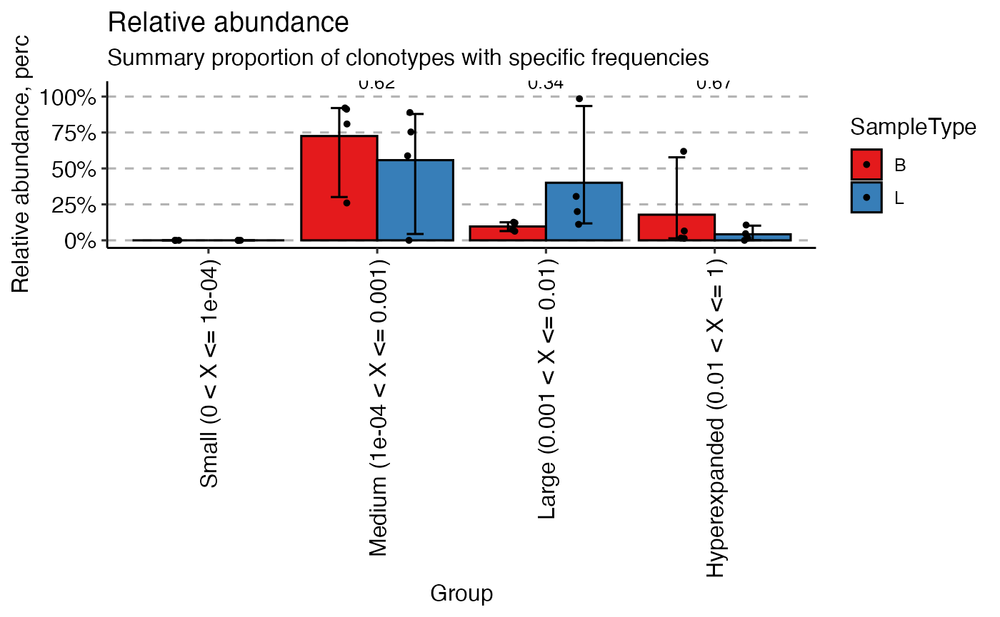
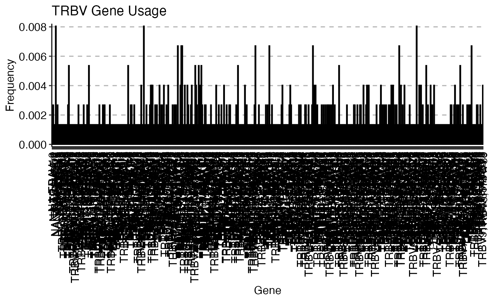
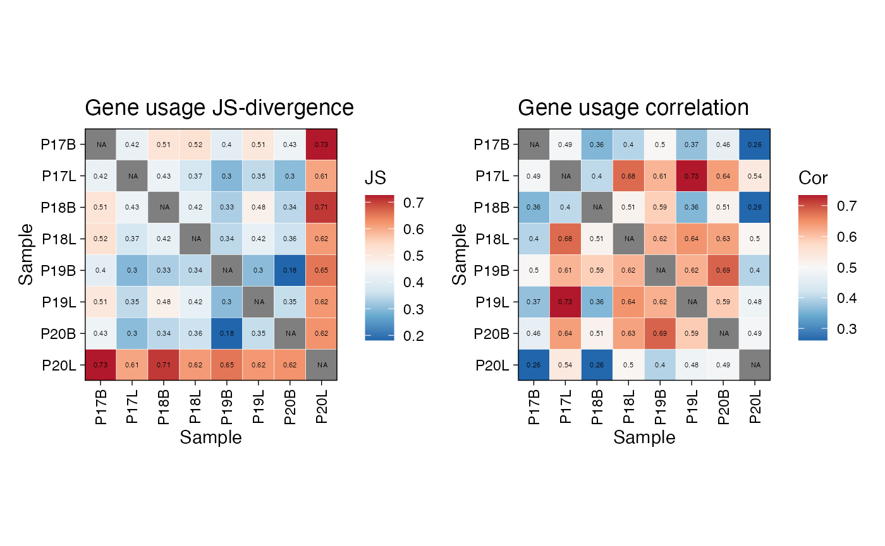
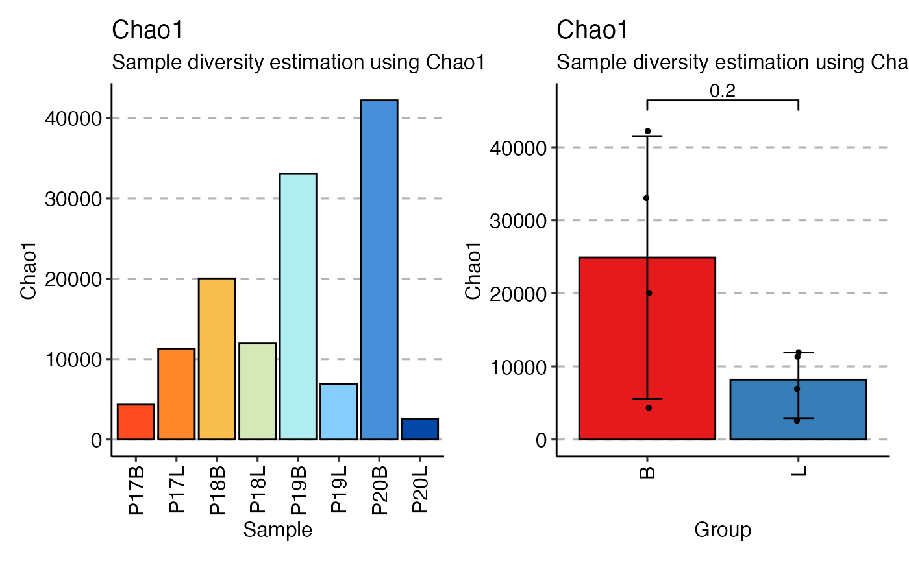

# Downstream Analysis with immunarch

## Overview

The `scRepertoire` package provides robust tools for the initial
processing, filtering, and combining of single-cell immune receptor
sequencing data. In addition to `scRepertoire`, users have used the
`immunarch` package, which offers a powerful and comprehensive suite of
immune profiling functions.

This vignette demonstrates the seamless integration between
`scRepertoire` and `immunarch`. We will use the
[`exportClones()`](https://www.borch.dev/uploads/scRepertoire/reference/exportClones.md)
function with the `format = "immunarch"` option to generate a compatible
data object, which can then be directly used for downstream analysis and
visualization with `immunarch`.

### Citation

If using *immunarch*, please cite the
[package](https://immunarch.com/authors.html#citation)

    @Manual{,
      title = {immunarch: Bioinformatics Analysis of T-Cell and B-Cell Immune Repertoires},
      author = {Vadim I. Nazarov and Vasily O. Tsvetkov and Siarhei Fiadziushchanka and Eugene Rumynskiy and Aleksandr A. Popov and Ivan Balashov and Maria Samokhina},
      year = {2023},
      note = {https://immunarch.com/, https://github.com/immunomind/immunarch},
    }

## Setup

First, we need to load the necessary libraries and prepare the initial
data using `scRepertoire`. We will use the built-in `contig_list`
example data.

``` r
suppressMessages(library(scRepertoire))
suppressMessages(library(immunarch))
suppressMessages(library(ggplot2))

# Load example data from scRepertoire
data("contig_list") 

# Combine contigs into a single list
combined <- combineTCR(contig_list, 
                       samples = c("P17B", "P17L", "P18B", "P18L", 
                                   "P19B", "P19L", "P20B", "P20L"))
```

## Exporting for `immunarch`

The
[`exportClones()`](https://www.borch.dev/uploads/scRepertoire/reference/exportClones.md)
function can now format the `scRepertoire` object into a list that
`immunarch` can immediately use. This list contains two key components:

- **`$data`**: A list of data frames, where each data frame is a
  repertoire from a single sample.
- **`$meta`**: A metadata data frame describing the samples.

``` r
# Export the data with write.file = FALSE to get the R object
immunarch_data <- exportClones(combined, 
                               format = "immunarch", 
                               write.file = FALSE)

# We can inspect the structure of the output
str(immunarch_data, max.level = 2)
```

    ## List of 2
    ##  $ data:List of 8
    ##   ..$ P17B:'data.frame': 745 obs. of  9 variables:
    ##   ..$ P17L:'data.frame': 2117 obs. of  9 variables:
    ##   ..$ P18B:'data.frame': 1254 obs. of  9 variables:
    ##   ..$ P18L:'data.frame': 1202 obs. of  9 variables:
    ##   ..$ P19B:'data.frame': 5544 obs. of  9 variables:
    ##   ..$ P19L:'data.frame': 1619 obs. of  9 variables:
    ##   ..$ P20B:'data.frame': 6087 obs. of  9 variables:
    ##   ..$ P20L:'data.frame': 192 obs. of  9 variables:
    ##  $ meta:'data.frame':    8 obs. of  1 variable:
    ##   ..$ Sample: chr [1:8] "P17B" "P17L" "P18B" "P18L" ...

As you can see, the output is already in the format required by
`immunarch`. Now we can proceed with downstream analysis.

## Basic Analysis with `immunarch`

Let’s perform a few common analyses to demonstrate the workflow. For
visualization purposes, we will add a “SampleType” column to the
metadata to group the samples by their origin (B for blood, L for lymph
node).

``` r
# Add a grouping variable to the metadata
immunarch_data$meta$Patient <- substr(immunarch_data$meta$Sample, 1, 3)
immunarch_data$meta$SampleType <- substr(immunarch_data$meta$Sample, 4, 4)
head(immunarch_data$meta)
```

    ##   Sample Patient SampleType
    ## 1   P17B     P17          B
    ## 2   P17L     P17          L
    ## 3   P18B     P18          B
    ## 4   P18L     P18          L
    ## 5   P19B     P19          B
    ## 6   P19L     P19          L

### Repertoire Overlap

We can measure the similarity between repertoires by calculating the
number of shared clonotypes (public clonotypes) using
[`repOverlap()`](https://immunarch.com/reference/repOverlap.html). The
[`vis()`](https://immunarch.com/reference/vis.html) function can then
generate a heatmap to visualize the pairwise overlap.

``` r
# Calculate overlap using the number of public clonotypes
imm_ov <- repOverlap(immunarch_data$data, .method = "public", .verbose = FALSE)

# Visualize the overlap as a heatmap
vis(imm_ov)
```



### Clonal Homeostasis

Next, let’s assess the clonal space homeostasis, which is the proportion
of the repertoire occupied by clones of different sizes (e.g., Small,
Medium, Large). The
[`repClonality()`](https://immunarch.com/reference/repClonality.html)
function calculates this, and
[`vis()`](https://immunarch.com/reference/vis.html) creates a bar plot.

``` r
# Calculate clonal space homeostasis
imm_hom <- repClonality(immunarch_data$data,
                        .method = "homeo",
                        .clone.types = c(Small = 0.0001, Medium = 0.001, 
                                         Large = 0.01, Hyperexpanded = 1))

# Visualize homeostasis, grouped by sample type
vis(imm_hom, .by = "SampleType", .meta = immunarch_data$meta)
```



### Gene Usage

`immunarch` provides powerful tools to analyze and visualize the usage
of V, D, and J genes. Here, we’ll compute the usage of TRAV/TRBV genes
and visualize their distribution across samples. It is important to
note, in paired mode, immunarch calculates usage for both V genes.

``` r
# Compute TRAV/TRBV gene usage
imm_gu <- geneUsage(immunarch_data$data[1], "hs.trbv", .norm = TRUE)

# Visualize gene usage as a heatmap
vis(imm_gu[30:60,], .grid = TRUE, .title = "TRAV/TRBV Gene Usage")
```



We can also visualize the gene usage grouped by our metadata variable.
Here, we analyze the imm_gu object using the Jensen-Shannon (`js`)
divergence and correlation analysis. JS divergence is a measure of
similarity between two probability distributions (lower = more similar).
Conversely, correlation (`cor`) measures the linear relationship between
the gene usage profiles of different samples.

``` r
imm_gu <- geneUsage(immunarch_data$data, "hs.trbv", 
                    .norm = T)
imm_gu_js <- geneUsageAnalysis(imm_gu, 
                               .method = "js", 
                               .verbose = F)
imm_gu_cor <- geneUsageAnalysis(imm_gu, 
                                .method = "cor", 
                                .verbose = F)

p1 <- vis(imm_gu_js, .title = "Gene usage JS-divergence", 
          .leg.title = "JS", 
          .text.size = 1.5)
p2 <- vis(imm_gu_cor, .title = "Gene usage correlation", 
          .leg.title = "Cor", 
          .text.size = 1.5)

p1 + p2
```



### Calculating Diversity

`immunarch` and `scRepertoire` have many overlapping features, such as
diversity. One key difference is `immunarch` separation of calculation
and visualization. This offers `immunarch` users the ability to group
calculations in a post-hoc fashion. Here we can use the nonparametric
`chao1` estimation to look at diversity across samples or by sampleType
(B = Blood and L = Lung).

``` r
div_chao <- repDiversity(immunarch_data$data, "chao1")

p1 <- vis(div_chao)
p2 <- vis(div_chao, .by = c("SampleType"), 
          .meta = immunarch_data$meta)

p1 + p2 
```



This concludes the vignette on integrating `scRepertoire` with
`immunarch`. By using the
[`exportClones()`](https://www.borch.dev/uploads/scRepertoire/reference/exportClones.md)
function, you can easily leverage the extensive analytical and
visualization capabilities of `immunarch` for your single-cell TCR
sequencing data. Immunarch has extensive documentation and vignettes
available at [immunarch.com](https://immunarch.com/index.html).
