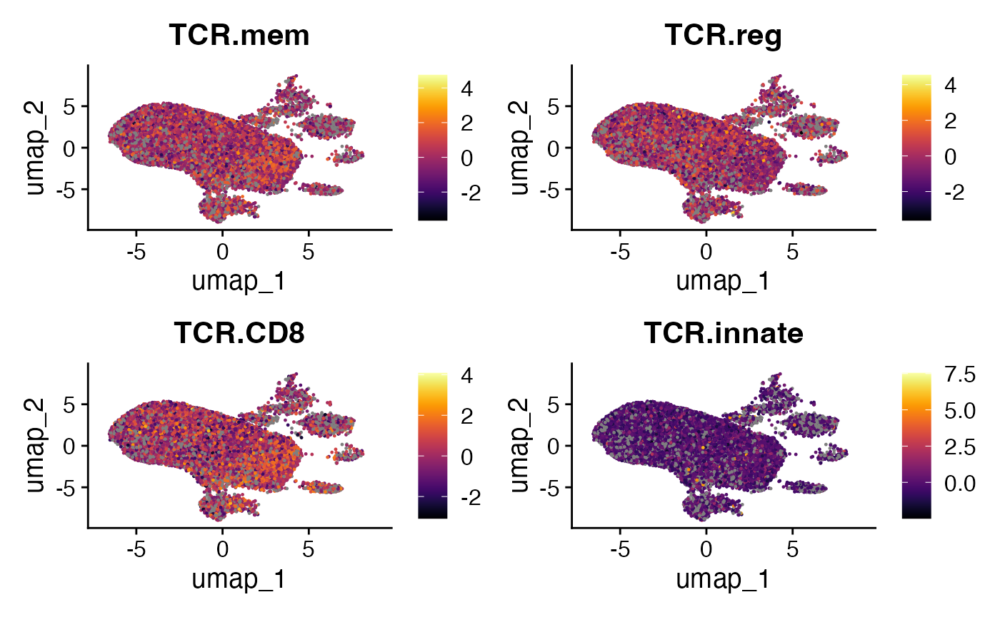
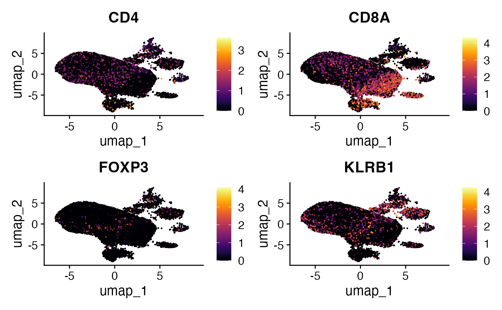

# TCRpheno applied to T cell fate

## Overview

`tcrpheno` is an R package that applies a logistic regression model to
the amino acid sequences of T-cell receptor complementarity-determining
regions (CDRs) 1, 2, and 3. This model produces phenotype scores
associated with specific T cell fates, providing insights into the
potential functional trajectory of T cells based on their TCR sequences.

### More information on individual phenotypes:

The tcrpheno package calculates four distinct scores, each linked to a
potential T cell phenotype

- **TCRinnate**: Higher scores suggest a greater likelihood of the T
  cell adopting an innate-like, *PLZF*-high phenotype, characteristic of
  mucosal-associated invariant T (MAIT) cells or invariant natural
  killer T (iNKT). This score is strongly influenced by features in
  CDR2α and specific TRAV gene usage.  
- **TCR.8**: Higher scores indicate a predisposition towards a CD8+ T
  cell fate over a CD4+ fate. TCRs with high TCR.8 scores tend to have a
  depletion of positive charge in the mid-region of their CDR3 loops.  
- **TCRreg**: Higher scores point to an increased probability of the T
  cell becoming a regulatory T cell (Treg), encompassing both CD4+ and
  CD8+ Treg populations. This is associated with increased
  hydrophobicity in CDR3β and CDR3α residues.  
- **TCRmem**: Higher scores suggest a T cell is more likely to
  differentiate into a memory cell rather than remaining naive. This
  score reflects a general propensity for T-cell activation and is
  influenced by features in both CDR3α and CDR3β. Notably, higher TCRmem
  scores correlate with increased T-cell activation even among T cells
  recognizing the same antigen and correspond to the strength of
  positive selection in the thymus.

### Citation

If using *tcrpheno*, please cite the
[article](https://pubmed.ncbi.nlm.nih.gov/39731734/): Lagattuta, K. et
al. The T cell receptor sequence influences the likelihood of T cell
memory formation. Cell Reports. 2025 Jan 28;44(1)

## Installation

``` r
# Ensure 'remotes' is installed: install.packages("remotes")
remotes::install_github("kalaga27/tcrpheno")
```

## Loading Data

his vignette uses example data provided by the scRepertoire package to
demonstrate the workflow. For more details on scRepertoire’s example
data and loading mechanisms, refer
[here](https://www.borch.dev/uploads/screpertoire/articles/loading#example-data-in-screpertoire).
For the sake of comparison, we will also filter out any cell without
clonal information.

``` r
# Load and normalize RNA
scRep_example <- readRDS("scRep_example_full.rds") %>%
                    NormalizeData(verbose = F)

# Adding Clonal Information
scRep_example  <- combineExpression(combined.TCR, 
                                    scRep_example , 
                                    cloneCall="aa", 
                                    group.by = "sample", 
                                    proportion = TRUE)

#Filtering for single-cells with TCRs
scRep_example <- subset(scRep_example, 
                        cells = colnames(scRep_example)[!is.na(scRep_example$CTaa)])
```

## Exporting Clonal Information for tcrpheno

The `tcrpheno` package requires TCR data in a specific format. The
[`exportClones()`](https://www.borch.dev/uploads/scRepertoire/reference/exportClones.md)
function from scRepertoire can now output data directly in this
`tcrpheno` format. This format includes separate columns for TRA V gene,
TRA J gene, TRA CDR3 sequence, TRB V gene, TRB J gene, and TRB CDR3
sequence, along with a cell identifier.

``` r
exported_clones <- exportClones(scRep_example,
                                write.file = FALSE,
                                format = "tcrpheno") 
exported_clones <- na.omit(exported_clones)
head(exported_clones)
```

    ##                      cell     TCRA_cdr3aa TCRA_vgene TCRA_jgene
    ## 1 P17B_AAAGCAACAGACAAAT-1  CALFTSGNTGKLIF     TRAV16     TRAJ37
    ## 2 P17B_AACCATGAGGCATGTG-1   CAVEDPRDYKLSF      TRAV2     TRAJ20
    ## 4 P17B_AAGCCGCCAATCTACG-1 CALSEARETGNQFYF     TRAV19     TRAJ49
    ## 5 P17B_AAGCCGCCATCCCACT-1   CAASINNNARLMF   TRAV13-1     TRAJ31
    ## 6 P17B_AAGCCGCGTCACCTAA-1  CAVQAGDSWGKLQF     TRAV20     TRAJ24
    ## 7 P17B_AAGGAGCGTTCTCATT-1  CATAPRDSWGKLQF     TRAV17     TRAJ24
    ##                                     TCRA_cdr3nt      TCRB_cdr3aa TCRB_vgene
    ## 1    TGTGCTCTCTTTACCTCTGGCAACACAGGCAAACTAATCTTT    CAIKGTGNGEQYF   TRBV10-3
    ## 2       TGTGCTGTGGAGGATCCTCGGGACTACAAGCTCAGCTTT CASSLGGAGGGYEQYF   TRBV11-2
    ## 4 TGTGCTCTGAGTGAGGCGAGGGAAACCGGTAACCAGTTCTATTTT  CASSQDADSFYEQYF    TRBV4-1
    ## 5       TGTGCAGCAAGTATAAATAACAATGCCAGACTCATGTTT    CASSPVRTDTQYF    TRBV5-4
    ## 6    TGTGCTGTGCAGGCCGGTGACAGCTGGGGGAAATTGCAGTTT   CASSLDGGSDTQYF   TRBV11-3
    ## 7    TGTGCTACGGCCCCCAGGGACAGCTGGGGGAAATTGCAGTTT  CASSLYDTNTGELFF    TRBV5-1
    ##   TCRB_jgene                                      TCRB_cdr3nt
    ## 1    TRBJ2-7          TGTGCCATCAAGGGGACAGGGAATGGTGAGCAGTACTTC
    ## 2    TRBJ2-7 TGTGCCAGCAGCTTGGGGGGCGCGGGTGGGGGCTACGAGCAGTACTTC
    ## 4    TRBJ2-7    TGCGCCAGCAGCCAAGATGCGGACAGCTTCTACGAGCAGTACTTC
    ## 5    TRBJ2-3          TGTGCCAGCAGCCCCGTTCGAACAGATACGCAGTATTTT
    ## 6    TRBJ2-3       TGTGCCAGCAGCTTAGACGGGGGCTCAGATACGCAGTATTTT
    ## 7    TRBJ2-2    TGCGCCAGCAGCTTGTACGACACAAACACCGGGGAGCTGTTTTTT

## Generating Phenotype Scores

With the TCR data correctly formatted, we can use the `score_tcrs()`
function from the `tcrpheno` package to calculate the phenotype scores.

``` r
tcrpheno.results <- score_tcrs(exported_clones, "ab")
```

    ## [1] "adding CDR1 and CDR2 based on V gene..."
    ## [1] "identifying amino acids at each position..."
    ## [1] "converting amino acids into Atchley factors..."
    ## [1] 18670
    ## [1] 18670
    ## [1] "adding interactions between adjacent residues..."
    ## [1] "TCRs featurized!"
    ## [1] "scoring TCRs..."
    ## [1] "all done!"

``` r
head(tcrpheno.results)
```

    ##                         TCR.innate     TCR.CD8    TCR.reg    TCR.mem
    ## P17B_AAAGCAACAGACAAAT-1 -0.0675532 -1.19523036  0.4049552 -0.1555845
    ## P17B_AACCATGAGGCATGTG-1  0.6501125  0.02883556 -1.1217330 -0.1431962
    ## P17B_AAGCCGCCAATCTACG-1  0.2681321  3.05374879 -0.8430967 -0.1919169
    ## P17B_AAGCCGCCATCCCACT-1 -0.1228840 -0.97613780  0.4996984 -1.2836692
    ## P17B_AAGCCGCGTCACCTAA-1 -0.6160124  0.27602943 -1.0244453  0.5860345
    ## P17B_AAGGAGCGTTCTCATT-1 -0.1305800 -0.06879752  0.3131880 -0.2055134

## Adding to Single Cell Object

To visualize and analyze these TCR-derived phenotype scores in
conjunction with gene expression data, we add them to the metadata of
our Seurat object.

``` r
scRep_example <- AddMetaData(scRep_example, tcrpheno.results)
```

### Visualizing Predictions

Now that the phenotype scores are part of the Seurat object, we can
visualize them on dimensionality reduction plots, such as UMAPs. This
helps to see if cells with particular TCR-derived phenotype scores
cluster together or co-localize with known cell populations.

``` r
tcrpheno.plots <- FeaturePlot(scRep_example, 
                              features = c("TCR.mem", 
                                           "TCR.reg", 
                                           "TCR.CD8", 
                                           "TCR.innate"))

lapply(tcrpheno.plots, function(x) {
  x + scale_color_viridis(option = "B") 
}) -> tcrpheno.plots

wrap_plots(tcrpheno.plots)
```



### Comparing With Gene Expression

A key aspect of integrating TCR phenotype scores is to compare them with
the expression of known marker genes associated with different T cell
states. This can help validate or provide biological context to the
`tcrpheno` predictions.

``` r
RNA.plots <- FeaturePlot(scRep_example, 
                          features = c("CD4","CD8A", "FOXP3", "KLRB1"), 
                          combine = FALSE) 

lapply(RNA.plots, function(x) {
  x + scale_color_viridis(option = "B") 
}) -> RNA.plots

wrap_plots(RNA.plots)
```



This concludes the vignette on applying `tcrpheno` to predict T cell
fate from TCR sequences and integrating these predictions with
single-cell RNA sequencing data.
