# Starting work with scRepertoire.

## Introduction

scRepertoire is designed to take filter contig outputs from the 10x
Genomics Cell Ranger pipeline, process that data to assign clonotype
based on two TCR or Ig chains and analyze the clonotype dynamics. The
latter can be separated into 1) clonotype-only analysis functions, such
as unique clonotypes or clonal space quantification, and 2) interaction
with mRNA expression data using Seurat or SingleCellExperiment packages.

### Loading Libraries

``` r
suppressMessages(library(scRepertoire))
```

### Loading Data

#### What data to load into scRepertoire?

`scRepertoire` primarily functions using the
`filtered_contig_annotations.csv` output generated by 10x Genomics Cell
Ranger. This file is typically found in the ./outs/ directory of your
VDJ alignment folder.

#### Demonstrating Manual Data Loading (10x Genomics)

To prepare data for scRepertoire from 10x Genomics outputs, you would:

- Load the `filtered_contig_annotations.csv` file for each of your
  samples.
- Combine these loaded data frames into a single list in your R
  environment.

``` r
S1 <- read.csv(".../Sample1/outs/filtered_contig_annotations.csv")
S2 <- read.csv(".../Sample2/outs/filtered_contig_annotations.csv")
S3 <- read.csv(".../Sample3/outs/filtered_contig_annotations.csv")
S4 <- read.csv(".../Sample4/outs/filtered_contig_annotations.csv")

contig_list <- list(S1, S2, S3, S4)
```

### Other alignment workflows

Beyond the default 10x Genomics Cell Ranger pipeline outputs,
`scRepertoire` supports various other single-cell immune receptor
sequencing formats through the
[`loadContigs()`](https://www.borch.dev/uploads/scRepertoire/reference/loadContigs.md)
function.

#### Supported Formats and Expected File Names

- `10X`: “filtered_contig_annotations.csv”
- `AIRR`: “airr_rearrangement.tsv”
- `BD`: “Contigs_AIRR.tsv”
- `Dandelion`: “all_contig_dandelion.tsv”
- `Immcantation`: “\_data.tsv” (or similar)
- `JSON`: “.json”
- `MiXCR`: “clones.tsv”
- `ParseBio`: “barcode_report.tsv”
- `TRUST4`: “barcode_report.tsv”
- `WAT3R`: “barcode_results.csv”

Key Parameter(s) for
[`loadContigs()`](https://www.borch.dev/uploads/scRepertoire/reference/loadContigs.md)

- `input`: A directory path containing your contig files (the function
  will recursively search) or a list/data frame of pre-loaded contig
  data.
- `format`: A string specifying the data format (e.g., `10X`, `TRUST4`,
  `WAT3R`). If set to “auto”, the function will attempt to automatically
  detect the format based on file names or data structure.

You can provide
[`loadContigs()`](https://www.borch.dev/uploads/scRepertoire/reference/loadContigs.md)
with a directory where your sequencing experiments are located, and it
will recursively load and process the contig data based on the file
names:

``` r
# Directory example
contig.output <- c("~/Documents/MyExperiment")
contig.list <- loadContigs(input = contig.output, 
                           format = "TRUST4")
```

Alternatively,
[`loadContigs()`](https://www.borch.dev/uploads/scRepertoire/reference/loadContigs.md)
can be given a list of pre-loaded data frames and process the contig
data based on the specified format:

``` r
# List of data frames example
S1 <- read.csv("~/Documents/MyExperiment/Sample1/outs/barcode_results.csv")
S2 <- read.csv("~/Documents/MyExperiment/Sample2/outs/barcode_results.csv")
S3 <- read.csv("~/Documents/MyExperiment/Sample3/outs/barcode_results.csv")
S4 <- read.csv("~/Documents/MyExperiment/Sample4/outs/barcode_results.csv")

contig.list <- list(S1, S2, S3, S4)
contig.list <- loadContigs(input = contig.list, 
                           format = "WAT3R")
```

### Multiplexed Experiment

It is now easy to create the contig list from a multiplexed experiment
by first generating a single-cell RNA object (either Seurat or Single
Cell Experiment), loading the filtered contig file, and then using
[`createHTOContigList()`](https://www.borch.dev/uploads/scRepertoire/reference/createHTOContigList.md).
This function will return a list separated by the `group.by`
variable(s).

#### Important Considerations for `createHTOContigList()`

- This function depends on the match of barcodes between the single-cell
  object and contigs. If there is a prefix or different suffix added to
  the barcode, this will result in no contigs being recovered.
- It is currently recommended to perform this step before integration
  workflows, as integration commonly alters the barcodes.
- There is a multi.run variable that can be used on an integrated
  object. However, it assumes you have modified the barcodes with the
  Seurat pipeline (automatic addition of \_# to the end), and your
  contig list is in the same order.

To create a contig list separated by HTO (Hash Tag Oligo) IDs from a
single-cell object:

``` r
contigs <- read.csv(".../outs/filtered_contig_annotations.csv")

contig.list <- createHTOContigList(contigs, 
                                   Seurat.Obj, 
                                   group.by = "HTO_maxID")
```

### Example Data in `scRepertoire`

`scRepertoire` includes a built-in example dataset to demonstrate the
functionality of the R package. This dataset consists of T cells derived
from four patients with acute respiratory distress with paired
peripheral-blood (B) and bronchoalveolar lavage (L), effectively
creating 8 distinct runs for T cell receptor (TCR) enrichment. More
information on the data set can be found in the corresponding
[manuscript](https://pubmed.ncbi.nlm.nih.gov/33622974/).

The built-in example data is derived from the 10x Cell Ranger pipeline,
so it is ready to go for downstream processing and analysis.

To load and preview the example data built into `scRepertoire`:

``` r
data("contig_list") #the data built into scRepertoire

head(contig_list[[1]])
```

    ##              barcode is_cell                   contig_id high_confidence length
    ## 1 AAACCTGAGTACGACG-1    True AAACCTGAGTACGACG-1_contig_1            True    500
    ## 2 AAACCTGAGTACGACG-1    True AAACCTGAGTACGACG-1_contig_2            True    478
    ## 4 AAACCTGCAACACGCC-1    True AAACCTGCAACACGCC-1_contig_1            True    506
    ## 5 AAACCTGCAACACGCC-1    True AAACCTGCAACACGCC-1_contig_2            True    470
    ## 6 AAACCTGCAGGCGATA-1    True AAACCTGCAGGCGATA-1_contig_1            True    558
    ## 7 AAACCTGCAGGCGATA-1    True AAACCTGCAGGCGATA-1_contig_2            True    505
    ##   chain       v_gene d_gene  j_gene c_gene full_length productive
    ## 1   TRA       TRAV25   None  TRAJ20   TRAC        True       True
    ## 2   TRB      TRBV5-1   None TRBJ2-7  TRBC2        True       True
    ## 4   TRA TRAV38-2/DV8   None  TRAJ52   TRAC        True       True
    ## 5   TRB     TRBV10-3   None TRBJ2-2  TRBC2        True       True
    ## 6   TRA     TRAV12-1   None   TRAJ9   TRAC        True       True
    ## 7   TRB        TRBV9   None TRBJ2-2  TRBC2        True       True
    ##                 cdr3                                                cdr3_nt
    ## 1        CGCSNDYKLSF                      TGTGGGTGTTCTAACGACTACAAGCTCAGCTTT
    ## 2     CASSLTDRTYEQYF             TGCGCCAGCAGCTTGACCGACAGGACCTACGAGCAGTACTTC
    ## 4 CAYRSAQAGGTSYGKLTF TGTGCTTATAGGAGCGCGCAGGCTGGTGGTACTAGCTATGGAAAGCTGACATTT
    ## 5      CAISEQGKGELFF                TGTGCCATCAGTGAACAGGGGAAAGGGGAGCTGTTTTTT
    ## 6     CVVSDNTGGFKTIF             TGTGTGGTCTCCGATAATACTGGAGGCTTCAAAACTATCTTT
    ## 7  CASSVRRERANTGELFF    TGTGCCAGCAGCGTAAGGAGGGAAAGGGCGAACACCGGGGAGCTGTTTTTT
    ##   reads umis raw_clonotype_id         raw_consensus_id
    ## 1  8344    4     clonotype123 clonotype123_consensus_2
    ## 2 65390   38     clonotype123 clonotype123_consensus_1
    ## 4 18372    8     clonotype124 clonotype124_consensus_1
    ## 5 34054    9     clonotype124 clonotype124_consensus_2
    ## 6  5018    2       clonotype1   clonotype1_consensus_2
    ## 7 25110   11       clonotype1   clonotype1_consensus_1

------------------------------------------------------------------------

## Combining Contigs into Clones

The
[`combineTCR()`](https://www.borch.dev/uploads/scRepertoire/reference/combineTCR.md)
function processes a list of TCR sequencing results, consolidating them
to the level of individual cell barcodes. It handles potential issues
with repeated barcodes by adding prefixes from `samples` and `ID`
parameters. The output includes combined reads into clone calls by
nucleotide sequence (`CTnt`), amino acid sequence (`CTaa`), VDJC gene
sequence (`CTgene`), or a combination of nucleotide and gene sequence
(`CTstrict`).

Key Parameter(s) for
[`combineTCR()`](https://www.borch.dev/uploads/scRepertoire/reference/combineTCR.md)

- `input.data`: A list of filtered contig annotations (e.g.,
  filtered_contig_annotations.csv from 10x Cell Ranger) or outputs from
  [`loadContigs()`](https://www.borch.dev/uploads/scRepertoire/reference/loadContigs.md).
- `samples`: Labels for your samples (recommended).
- `ID`: Additional sample labels (optional).
- `removeNA`: If `TRUE`, removes any cell barcode with an NA value in at
  least one chain (default is `FALSE`).
- `removeMulti`: If `TRUE`, removes any cell barcode with more than two
  immune receptor chains (default is `FALSE`).
- `filterMulti`: If `TRUE`, isolates the top two expressed chains in
  cell barcodes with multiple chains (default is `FALSE`).
- `filterNonproductive`: If `TRUE`, removes non-productive chains if the
  variable exists in the contig data (default is `TRUE`).

To combine TCR contigs from `contig_list` and apply sample prefixes:

``` r
combined.TCR <- combineTCR(contig_list, 
                           samples = c("P17B", "P17L", "P18B", "P18L", 
                                            "P19B","P19L", "P20B", "P20L"),
                           removeNA = FALSE, 
                           removeMulti = FALSE, 
                           filterMulti = FALSE)

head(combined.TCR[[1]])
```

    ##                    barcode sample                     TCR1           cdr3_aa1
    ## 1  P17B_AAACCTGAGTACGACG-1   P17B       TRAV25.TRAJ20.TRAC        CGCSNDYKLSF
    ## 3  P17B_AAACCTGCAACACGCC-1   P17B TRAV38-2/DV8.TRAJ52.TRAC CAYRSAQAGGTSYGKLTF
    ## 5  P17B_AAACCTGCAGGCGATA-1   P17B      TRAV12-1.TRAJ9.TRAC     CVVSDNTGGFKTIF
    ## 7  P17B_AAACCTGCATGAGCGA-1   P17B      TRAV12-1.TRAJ9.TRAC     CVVSDNTGGFKTIF
    ## 9  P17B_AAACGGGAGAGCCCAA-1   P17B        TRAV20.TRAJ8.TRAC      CAVRGEGFQKLVF
    ## 10 P17B_AAACGGGAGCGTTTAC-1   P17B      TRAV12-1.TRAJ9.TRAC     CVVSDNTGGFKTIF
    ##                                                  cdr3_nt1
    ## 1                       TGTGGGTGTTCTAACGACTACAAGCTCAGCTTT
    ## 3  TGTGCTTATAGGAGCGCGCAGGCTGGTGGTACTAGCTATGGAAAGCTGACATTT
    ## 5              TGTGTGGTCTCCGATAATACTGGAGGCTTCAAAACTATCTTT
    ## 7              TGTGTGGTCTCCGATAATACTGGAGGCTTCAAAACTATCTTT
    ## 9                 TGTGCTGTGCGAGGAGAAGGCTTTCAGAAACTTGTATTT
    ## 10             TGTGTGGTCTCCGATAATACTGGAGGCTTCAAAACTATCTTT
    ##                           TCR2          cdr3_aa2
    ## 1   TRBV5-1.None.TRBJ2-7.TRBC2    CASSLTDRTYEQYF
    ## 3  TRBV10-3.None.TRBJ2-2.TRBC2     CAISEQGKGELFF
    ## 5     TRBV9.None.TRBJ2-2.TRBC2 CASSVRRERANTGELFF
    ## 7     TRBV9.None.TRBJ2-2.TRBC2 CASSVRRERANTGELFF
    ## 9                         <NA>              <NA>
    ## 10    TRBV9.None.TRBJ2-2.TRBC2 CASSVRRERANTGELFF
    ##                                               cdr3_nt2
    ## 1           TGCGCCAGCAGCTTGACCGACAGGACCTACGAGCAGTACTTC
    ## 3              TGTGCCATCAGTGAACAGGGGAAAGGGGAGCTGTTTTTT
    ## 5  TGTGCCAGCAGCGTAAGGAGGGAAAGGGCGAACACCGGGGAGCTGTTTTTT
    ## 7  TGTGCCAGCAGCGTAAGGAGGGAAAGGGCGAACACCGGGGAGCTGTTTTTT
    ## 9                                                 <NA>
    ## 10 TGTGCCAGCAGCGTAAGGAGGGAAAGGGCGAACACCGGGGAGCTGTTTTTT
    ##                                                  CTgene
    ## 1         TRAV25.TRAJ20.TRAC_TRBV5-1.None.TRBJ2-7.TRBC2
    ## 3  TRAV38-2/DV8.TRAJ52.TRAC_TRBV10-3.None.TRBJ2-2.TRBC2
    ## 5          TRAV12-1.TRAJ9.TRAC_TRBV9.None.TRBJ2-2.TRBC2
    ## 7          TRAV12-1.TRAJ9.TRAC_TRBV9.None.TRBJ2-2.TRBC2
    ## 9                                  TRAV20.TRAJ8.TRAC_NA
    ## 10         TRAV12-1.TRAJ9.TRAC_TRBV9.None.TRBJ2-2.TRBC2
    ##                                                                                              CTnt
    ## 1                    TGTGGGTGTTCTAACGACTACAAGCTCAGCTTT_TGCGCCAGCAGCTTGACCGACAGGACCTACGAGCAGTACTTC
    ## 3  TGTGCTTATAGGAGCGCGCAGGCTGGTGGTACTAGCTATGGAAAGCTGACATTT_TGTGCCATCAGTGAACAGGGGAAAGGGGAGCTGTTTTTT
    ## 5  TGTGTGGTCTCCGATAATACTGGAGGCTTCAAAACTATCTTT_TGTGCCAGCAGCGTAAGGAGGGAAAGGGCGAACACCGGGGAGCTGTTTTTT
    ## 7  TGTGTGGTCTCCGATAATACTGGAGGCTTCAAAACTATCTTT_TGTGCCAGCAGCGTAAGGAGGGAAAGGGCGAACACCGGGGAGCTGTTTTTT
    ## 9                                                      TGTGCTGTGCGAGGAGAAGGCTTTCAGAAACTTGTATTT_NA
    ## 10 TGTGTGGTCTCCGATAATACTGGAGGCTTCAAAACTATCTTT_TGTGCCAGCAGCGTAAGGAGGGAAAGGGCGAACACCGGGGAGCTGTTTTTT
    ##                                CTaa
    ## 1        CGCSNDYKLSF_CASSLTDRTYEQYF
    ## 3  CAYRSAQAGGTSYGKLTF_CAISEQGKGELFF
    ## 5  CVVSDNTGGFKTIF_CASSVRRERANTGELFF
    ## 7  CVVSDNTGGFKTIF_CASSVRRERANTGELFF
    ## 9                  CAVRGEGFQKLVF_NA
    ## 10 CVVSDNTGGFKTIF_CASSVRRERANTGELFF
    ##                                                                                                                                               CTstrict
    ## 1                           TRAV25.TRAJ20.TRAC;TGTGGGTGTTCTAACGACTACAAGCTCAGCTTT_TRBV5-1.None.TRBJ2-7.TRBC2;TGCGCCAGCAGCTTGACCGACAGGACCTACGAGCAGTACTTC
    ## 3  TRAV38-2/DV8.TRAJ52.TRAC;TGTGCTTATAGGAGCGCGCAGGCTGGTGGTACTAGCTATGGAAAGCTGACATTT_TRBV10-3.None.TRBJ2-2.TRBC2;TGTGCCATCAGTGAACAGGGGAAAGGGGAGCTGTTTTTT
    ## 5          TRAV12-1.TRAJ9.TRAC;TGTGTGGTCTCCGATAATACTGGAGGCTTCAAAACTATCTTT_TRBV9.None.TRBJ2-2.TRBC2;TGTGCCAGCAGCGTAAGGAGGGAAAGGGCGAACACCGGGGAGCTGTTTTTT
    ## 7          TRAV12-1.TRAJ9.TRAC;TGTGTGGTCTCCGATAATACTGGAGGCTTCAAAACTATCTTT_TRBV9.None.TRBJ2-2.TRBC2;TGTGCCAGCAGCGTAAGGAGGGAAAGGGCGAACACCGGGGAGCTGTTTTTT
    ## 9                                                                                      TRAV20.TRAJ8.TRAC;TGTGCTGTGCGAGGAGAAGGCTTTCAGAAACTTGTATTT_NA;NA
    ## 10         TRAV12-1.TRAJ9.TRAC;TGTGTGGTCTCCGATAATACTGGAGGCTTCAAAACTATCTTT_TRBV9.None.TRBJ2-2.TRBC2;TGTGCCAGCAGCGTAAGGAGGGAAAGGGCGAACACCGGGGAGCTGTTTTTT

[`combineTCR()`](https://www.borch.dev/uploads/scRepertoire/reference/combineTCR.md)
is the essential first step for organizing raw TCR sequencing data into
a structured format for `scRepertoire` analyses. It allows for flexible
handling of single and paired chains, barcode disambiguation, and
initial filtering, producing a list of data frames where each row
represents a single cell and its associated TCR clonotypes.

### combineBCR

The
[`combineBCR()`](https://www.borch.dev/uploads/scRepertoire/reference/combineBCR.md)
function is the primary tool for processing raw B cell receptor contig
data into a format ready for analysis. It is analogous to
[`combineTCR()`](https://www.borch.dev/uploads/scRepertoire/reference/combineTCR.md)
but includes specialized logic for handling the complexities of BCRs,
such as somatic hypermutation. The function consolidates contigs into a
single data frame per sample, with each row representing a unique cell.

By default `(call.related.clones = TRUE)`,
[`combineBCR()`](https://www.borch.dev/uploads/scRepertoire/reference/combineBCR.md)
groups B cells into clones based on the similarity of their CDR3
sequences.

#### How `combineBCR()` Groups Related Clones

- Internally calling
  [`clonalCluster()`](https://www.borch.dev/uploads/scRepertoire/reference/clonalCluster.md)
  to build a network of related sequences.
- Using the `threshold` parameter to define connections. The `threshold`
  is a normalized Levenshtein distance, where a value closer to 1.0
  requires higher sequence similarity. The default of 0.85 is a good
  starting point.
- Assigning a cluster-based ID to the CTstrict column.

Additionally, the `group.by` argument allows you to constrain the
clustering analysis to only occur within distinct categories in your
metadata. For example, using `group.by = "sample"` ensures that
sequences from different samples are never compared or clustered
together, even if they are identical.

Key Parameter(s) for
[`combineBCR()`](https://www.borch.dev/uploads/scRepertoire/reference/combineBCR.md)

- `call.related.clones`: If `TRUE` (default), uses
  [`clonalCluster()`](https://www.borch.dev/uploads/scRepertoire/reference/clonalCluster.md)
  to identify related clones based on sequence similarity.
- `group.by`: The column header used to group clones for clustering (if
  `NULL`, clusters will be calculated across all samples).
- `threshold`: The similarity threshold for
  [`clonalCluster()`](https://www.borch.dev/uploads/scRepertoire/reference/clonalCluster.md)
  (default: 0.85).
- `dist_type`: The metric for calculating difference: “levenshtein”
  (default), “hamming”, “nw” (Needleman-Wunsch), or “sw”
  (Smith-Waterman).
- `dist_mat:` The substitution matrix used if dist_type is “nw” or “sw”
  (e.g., “BLOSUM62”, “PAM30”)
- `normalize`: How to handle the threshold: “none”, “length”, or
  “maxlen”.
- `chain`: The chain to use for clustering when call.related.clones =
  TRUE (default: `both`).
- `sequence`: The sequence type (`nt` or `aa`) for clustering (default:
  `nt`).
- use.V, use.J: If `TRUE`, sequences must share the same V/J gene to be
  clustered (default: `TRUE`)
- `cluster.method`: The clustering algorithm to apply to the
  edit-distanc network (default: `components`).

First, load the example BCR contig data:

``` r
# Load example BCR contig data
BCR.contigs <- read.csv("https://www.borch.dev/uploads/contigs/b_contigs.csv")
```

Then, combine BCR contigs using the default similarity clustering:

``` r
# Combine using the default similarity clustering
combined.BCR.clustered <- combineBCR(BCR.contigs, 
                                     samples = "Patient1", 
                                     threshold = 0.85)

# The CTstrict column contains cluster IDs (e.g., "cluster.1")
head(combined.BCR.clustered[[1]][, c("barcode", "CTstrict", "IGH", "cdr3_aa1")])
```

    ##                       barcode
    ## 1 Patient1_AAACCTGAGGGCACTA-1
    ## 2 Patient1_AAACCTGAGTACGTTC-1
    ## 3 Patient1_AAACCTGAGTCCGGTC-1
    ## 4 Patient1_AAACCTGCACCAGGTC-1
    ## 5 Patient1_AAACCTGGTAAATGAC-1
    ## 6 Patient1_AAACGGGTCACCTCGT-1
    ##                                                                                                                         CTstrict
    ## 1                                                                            NA_IGLV1-51.TGCGGAACATGGGATAGCAGCCTGAGTGCTGGCGTGTTC
    ## 2                           IGHV3-64.TGTGCGAAATCGTATAGCAGAGACCTGCCGCGGTACTTTGGCTCCTGG_IGKV3-15.TGTCAGCAGTATAGTAACTGGCCGCTCACTTTC
    ## 3                                                                                     NA_IGKV3-20.TGTCAACAGTATGGTGACTCTCTCCCTTTC
    ## 4 IGHV1-69-2.TGTGTGAGAGATGGGGCGGGTCACTATGGTTCGGGGATAGGCTACTACGGTATGGACGTCTGG_IGLV2-14.TGCAGTTCATATATAAGTACCAGCACTCTCGAGGTCCTATTC
    ## 5                  IGHV1-46.TGTTCGAGGGGTCGTCTCCCGATGCCAGCAGCTGGCAGTGGTTTGGTCTCCTGG_IGKV3-15.TGTCAGCACTATCATAACTGGCCTCCGTACACTTTT
    ## 6                                                                                  NA_IGKV3-11.TGTCAGCAGCGTAGCAACTGGCCTCTGACGTTC
    ##                              IGH              cdr3_aa1
    ## 1                           <NA>                  <NA>
    ## 2   IGHV3-64.IGHD6-6.IGHJ4.IGHG1      CAKSYSRDLPRYFGSW
    ## 3                           <NA>                  <NA>
    ## 4 IGHV1-69-2.IGHD3-10.IGHJ6.IGHM CVRDGAGHYGSGIGYYGMDVW
    ## 5  IGHV1-46.IGHD6-13.IGHJ5.IGHA2    CSRGRLPMPAAGSGLVSW
    ## 6                           <NA>                  <NA>

#### Advanced: Grouping by Alignment

For more biological accuracy—specifically when analyzing amino acid
sequences—you can use alignment metrics. This allows the clustering to
penalize conservative amino acid changes less than radical changes.

Here we use Needleman-Wunsch alignment with the BLOSUM80 substitution
matrix:

``` r
combined.BCR.aligned <- combineBCR(BCR.contigs, 
                                   samples = "Patient1",
                                   sequence = "aa",        
                                   dist_type = "nw",      
                                   dist_mat = "BLOSUM80",  
                                   threshold = 0.85)

head(combined.BCR.aligned[[1]][, c("barcode", "CTstrict", "IGH", "cdr3_aa1")])
```

    ##                       barcode
    ## 1 Patient1_AAACCTGAGGGCACTA-1
    ## 2 Patient1_AAACCTGAGTACGTTC-1
    ## 3 Patient1_AAACCTGAGTCCGGTC-1
    ## 4 Patient1_AAACCTGCACCAGGTC-1
    ## 5 Patient1_AAACCTGGTAAATGAC-1
    ## 6 Patient1_AAACGGGTCACCTCGT-1
    ##                                                   CTstrict
    ## 1                                NA_IGLV1-51.CGTWDSSLSAGVF
    ## 2           IGHV3-64.CAKSYSRDLPRYFGSW_IGKV3-15.CQQYSNWPLTF
    ## 3                                   NA_IGKV3-20.CQQYGDSLPF
    ## 4 IGHV1-69-2.CVRDGAGHYGSGIGYYGMDVW_IGLV2-14.CSSYISTSTLEVLF
    ## 5        IGHV1-46.CSRGRLPMPAAGSGLVSW_IGKV3-15.CQHYHNWPPYTF
    ## 6                                  NA_IGKV3-11.CQQRSNWPLTF
    ##                              IGH              cdr3_aa1
    ## 1                           <NA>                  <NA>
    ## 2   IGHV3-64.IGHD6-6.IGHJ4.IGHG1      CAKSYSRDLPRYFGSW
    ## 3                           <NA>                  <NA>
    ## 4 IGHV1-69-2.IGHD3-10.IGHJ6.IGHM CVRDGAGHYGSGIGYYGMDVW
    ## 5  IGHV1-46.IGHD6-13.IGHJ5.IGHA2    CSRGRLPMPAAGSGLVSW
    ## 6                           <NA>                  <NA>

#### Filtering and Cleaning Data

[`combineBCR()`](https://www.borch.dev/uploads/scRepertoire/reference/combineBCR.md)
includes several arguments to filter and clean the contig data during
processing. \* `filterNonproductive = TRUE` (Default): Removes any
contigs that are not classified as productive, ensuring that only
functional receptor chains are included in the analysis. \*
`filterMulti = TRUE` (Default): For cells with more than one heavy or
light chain detected, this automatically selects the chain with the
highest UMI count (read abundance) and discards the others. This helps
resolve cellular multiplets or technical artifacts.

Here is an example applying these filters (though they are on by
default):

``` r
cleaned.BCR <- combineBCR(BCR.contigs,
                          samples = "Patient1",
                          filterNonproductive = TRUE,
                          filterMulti = TRUE)

head(cleaned.BCR[[1]])
```

    ##                       barcode   sample                            IGH
    ## 1 Patient1_AAACCTGAGGGCACTA-1 Patient1                           <NA>
    ## 2 Patient1_AAACCTGAGTACGTTC-1 Patient1   IGHV3-64.IGHD6-6.IGHJ4.IGHG1
    ## 3 Patient1_AAACCTGAGTCCGGTC-1 Patient1                           <NA>
    ## 4 Patient1_AAACCTGCACCAGGTC-1 Patient1 IGHV1-69-2.IGHD3-10.IGHJ6.IGHM
    ## 5 Patient1_AAACCTGGTAAATGAC-1 Patient1  IGHV1-46.IGHD6-13.IGHJ5.IGHA2
    ## 6 Patient1_AAACGGGTCACCTCGT-1 Patient1                           <NA>
    ##                cdr3_aa1
    ## 1                  <NA>
    ## 2      CAKSYSRDLPRYFGSW
    ## 3                  <NA>
    ## 4 CVRDGAGHYGSGIGYYGMDVW
    ## 5    CSRGRLPMPAAGSGLVSW
    ## 6                  <NA>
    ##                                                          cdr3_nt1
    ## 1                                                            <NA>
    ## 2                TGTGCGAAATCGTATAGCAGAGACCTGCCGCGGTACTTTGGCTCCTGG
    ## 3                                                            <NA>
    ## 4 TGTGTGAGAGATGGGGCGGGTCACTATGGTTCGGGGATAGGCTACTACGGTATGGACGTCTGG
    ## 5          TGTTCGAGGGGTCGTCTCCCGATGCCAGCAGCTGGCAGTGGTTTGGTCTCCTGG
    ## 6                                                            <NA>
    ##                   IGLC       cdr3_aa2
    ## 1 IGLV1-51.IGLJ3.IGLC2  CGTWDSSLSAGVF
    ## 2  IGKV3-15.IGKJ4.IGKC    CQQYSNWPLTF
    ## 3  IGKV3-20.IGKJ4.IGKC     CQQYGDSLPF
    ## 4 IGLV2-14.IGLJ2.IGLC2 CSSYISTSTLEVLF
    ## 5  IGKV3-15.IGKJ2.IGKC   CQHYHNWPPYTF
    ## 6  IGKV3-11.IGKJ1.IGKC    CQQRSNWPLTF
    ##                                     cdr3_nt2
    ## 1    TGCGGAACATGGGATAGCAGCCTGAGTGCTGGCGTGTTC
    ## 2          TGTCAGCAGTATAGTAACTGGCCGCTCACTTTC
    ## 3             TGTCAACAGTATGGTGACTCTCTCCCTTTC
    ## 4 TGCAGTTCATATATAAGTACCAGCACTCTCGAGGTCCTATTC
    ## 5       TGTCAGCACTATCATAACTGGCCTCCGTACACTTTT
    ## 6          TGTCAGCAGCGTAGCAACTGGCCTCTGACGTTC
    ##                                                CTgene
    ## 1                             NA_IGLV1-51.IGLJ3.IGLC2
    ## 2    IGHV3-64.IGHD6-6.IGHJ4.IGHG1_IGKV3-15.IGKJ4.IGKC
    ## 3                              NA_IGKV3-20.IGKJ4.IGKC
    ## 4 IGHV1-69-2.IGHD3-10.IGHJ6.IGHM_IGLV2-14.IGLJ2.IGLC2
    ## 5   IGHV1-46.IGHD6-13.IGHJ5.IGHA2_IGKV3-15.IGKJ2.IGKC
    ## 6                              NA_IGKV3-11.IGKJ1.IGKC
    ##                                                                                                         CTnt
    ## 1                                                                 NA_TGCGGAACATGGGATAGCAGCCTGAGTGCTGGCGTGTTC
    ## 2                         TGTGCGAAATCGTATAGCAGAGACCTGCCGCGGTACTTTGGCTCCTGG_TGTCAGCAGTATAGTAACTGGCCGCTCACTTTC
    ## 3                                                                          NA_TGTCAACAGTATGGTGACTCTCTCCCTTTC
    ## 4 TGTGTGAGAGATGGGGCGGGTCACTATGGTTCGGGGATAGGCTACTACGGTATGGACGTCTGG_TGCAGTTCATATATAAGTACCAGCACTCTCGAGGTCCTATTC
    ## 5                TGTTCGAGGGGTCGTCTCCCGATGCCAGCAGCTGGCAGTGGTTTGGTCTCCTGG_TGTCAGCACTATCATAACTGGCCTCCGTACACTTTT
    ## 6                                                                       NA_TGTCAGCAGCGTAGCAACTGGCCTCTGACGTTC
    ##                                   CTaa
    ## 1                     NA_CGTWDSSLSAGVF
    ## 2         CAKSYSRDLPRYFGSW_CQQYSNWPLTF
    ## 3                        NA_CQQYGDSLPF
    ## 4 CVRDGAGHYGSGIGYYGMDVW_CSSYISTSTLEVLF
    ## 5      CSRGRLPMPAAGSGLVSW_CQHYHNWPPYTF
    ## 6                       NA_CQQRSNWPLTF
    ##                                                                                                                         CTstrict
    ## 1                                                                            NA_IGLV1-51.TGCGGAACATGGGATAGCAGCCTGAGTGCTGGCGTGTTC
    ## 2                           IGHV3-64.TGTGCGAAATCGTATAGCAGAGACCTGCCGCGGTACTTTGGCTCCTGG_IGKV3-15.TGTCAGCAGTATAGTAACTGGCCGCTCACTTTC
    ## 3                                                                                     NA_IGKV3-20.TGTCAACAGTATGGTGACTCTCTCCCTTTC
    ## 4 IGHV1-69-2.TGTGTGAGAGATGGGGCGGGTCACTATGGTTCGGGGATAGGCTACTACGGTATGGACGTCTGG_IGLV2-14.TGCAGTTCATATATAAGTACCAGCACTCTCGAGGTCCTATTC
    ## 5                  IGHV1-46.TGTTCGAGGGGTCGTCTCCCGATGCCAGCAGCTGGCAGTGGTTTGGTCTCCTGG_IGKV3-15.TGTCAGCACTATCATAACTGGCCTCCGTACACTTTT
    ## 6                                                                                  NA_IGKV3-11.TGTCAGCAGCGTAGCAACTGGCCTCTGACGTTC

[`combineBCR()`](https://www.borch.dev/uploads/scRepertoire/reference/combineBCR.md)
is designed for processing B cell repertoire data, going beyond simple
contig aggregation to incorporate advanced clustering based on CDR3
sequence similarity. This enables the identification of clonally related
B cells, crucial for studying B cell development, affinity maturation,
and humoral immune responses. Its filtering options further ensure the
quality and interpretability of the processed data.

------------------------------------------------------------------------

## Additional Processing

### addVariable: Adding Variables for Plotting

What if there are more variables to add than just sample and ID? We can
add them by using the
[`addVariable()`](https://www.borch.dev/uploads/scRepertoire/reference/addVariable.md)
function. For each element, the function will add a column (labeled by
`variable.name`) with the `variable`. The length of the `variables`
parameter needs to match the length of the combined object.

Key Parameter(s) for
[`addVariable()`](https://www.borch.dev/uploads/scRepertoire/reference/addVariable.md)

- `variable.name`: A character string that defines the new variable to
  add (e.g., “Type”, “Treatment”).
- `variables`: A character vector defining the desired column value for
  each list element. Its length must match the number of elements in the
  input.data list.

As an example, here we add the Type in which the samples were processed
and sequenced to the `combined.TCR` object:

``` r
combined.TCR <- addVariable(combined.TCR, 
                            variable.name = "Type", 
                            variables = rep(c("B", "L"), 4))

head(combined.TCR[[1]])
```

    ##                    barcode sample                     TCR1           cdr3_aa1
    ## 1  P17B_AAACCTGAGTACGACG-1   P17B       TRAV25.TRAJ20.TRAC        CGCSNDYKLSF
    ## 3  P17B_AAACCTGCAACACGCC-1   P17B TRAV38-2/DV8.TRAJ52.TRAC CAYRSAQAGGTSYGKLTF
    ## 5  P17B_AAACCTGCAGGCGATA-1   P17B      TRAV12-1.TRAJ9.TRAC     CVVSDNTGGFKTIF
    ## 7  P17B_AAACCTGCATGAGCGA-1   P17B      TRAV12-1.TRAJ9.TRAC     CVVSDNTGGFKTIF
    ## 9  P17B_AAACGGGAGAGCCCAA-1   P17B        TRAV20.TRAJ8.TRAC      CAVRGEGFQKLVF
    ## 10 P17B_AAACGGGAGCGTTTAC-1   P17B      TRAV12-1.TRAJ9.TRAC     CVVSDNTGGFKTIF
    ##                                                  cdr3_nt1
    ## 1                       TGTGGGTGTTCTAACGACTACAAGCTCAGCTTT
    ## 3  TGTGCTTATAGGAGCGCGCAGGCTGGTGGTACTAGCTATGGAAAGCTGACATTT
    ## 5              TGTGTGGTCTCCGATAATACTGGAGGCTTCAAAACTATCTTT
    ## 7              TGTGTGGTCTCCGATAATACTGGAGGCTTCAAAACTATCTTT
    ## 9                 TGTGCTGTGCGAGGAGAAGGCTTTCAGAAACTTGTATTT
    ## 10             TGTGTGGTCTCCGATAATACTGGAGGCTTCAAAACTATCTTT
    ##                           TCR2          cdr3_aa2
    ## 1   TRBV5-1.None.TRBJ2-7.TRBC2    CASSLTDRTYEQYF
    ## 3  TRBV10-3.None.TRBJ2-2.TRBC2     CAISEQGKGELFF
    ## 5     TRBV9.None.TRBJ2-2.TRBC2 CASSVRRERANTGELFF
    ## 7     TRBV9.None.TRBJ2-2.TRBC2 CASSVRRERANTGELFF
    ## 9                         <NA>              <NA>
    ## 10    TRBV9.None.TRBJ2-2.TRBC2 CASSVRRERANTGELFF
    ##                                               cdr3_nt2
    ## 1           TGCGCCAGCAGCTTGACCGACAGGACCTACGAGCAGTACTTC
    ## 3              TGTGCCATCAGTGAACAGGGGAAAGGGGAGCTGTTTTTT
    ## 5  TGTGCCAGCAGCGTAAGGAGGGAAAGGGCGAACACCGGGGAGCTGTTTTTT
    ## 7  TGTGCCAGCAGCGTAAGGAGGGAAAGGGCGAACACCGGGGAGCTGTTTTTT
    ## 9                                                 <NA>
    ## 10 TGTGCCAGCAGCGTAAGGAGGGAAAGGGCGAACACCGGGGAGCTGTTTTTT
    ##                                                  CTgene
    ## 1         TRAV25.TRAJ20.TRAC_TRBV5-1.None.TRBJ2-7.TRBC2
    ## 3  TRAV38-2/DV8.TRAJ52.TRAC_TRBV10-3.None.TRBJ2-2.TRBC2
    ## 5          TRAV12-1.TRAJ9.TRAC_TRBV9.None.TRBJ2-2.TRBC2
    ## 7          TRAV12-1.TRAJ9.TRAC_TRBV9.None.TRBJ2-2.TRBC2
    ## 9                                  TRAV20.TRAJ8.TRAC_NA
    ## 10         TRAV12-1.TRAJ9.TRAC_TRBV9.None.TRBJ2-2.TRBC2
    ##                                                                                              CTnt
    ## 1                    TGTGGGTGTTCTAACGACTACAAGCTCAGCTTT_TGCGCCAGCAGCTTGACCGACAGGACCTACGAGCAGTACTTC
    ## 3  TGTGCTTATAGGAGCGCGCAGGCTGGTGGTACTAGCTATGGAAAGCTGACATTT_TGTGCCATCAGTGAACAGGGGAAAGGGGAGCTGTTTTTT
    ## 5  TGTGTGGTCTCCGATAATACTGGAGGCTTCAAAACTATCTTT_TGTGCCAGCAGCGTAAGGAGGGAAAGGGCGAACACCGGGGAGCTGTTTTTT
    ## 7  TGTGTGGTCTCCGATAATACTGGAGGCTTCAAAACTATCTTT_TGTGCCAGCAGCGTAAGGAGGGAAAGGGCGAACACCGGGGAGCTGTTTTTT
    ## 9                                                      TGTGCTGTGCGAGGAGAAGGCTTTCAGAAACTTGTATTT_NA
    ## 10 TGTGTGGTCTCCGATAATACTGGAGGCTTCAAAACTATCTTT_TGTGCCAGCAGCGTAAGGAGGGAAAGGGCGAACACCGGGGAGCTGTTTTTT
    ##                                CTaa
    ## 1        CGCSNDYKLSF_CASSLTDRTYEQYF
    ## 3  CAYRSAQAGGTSYGKLTF_CAISEQGKGELFF
    ## 5  CVVSDNTGGFKTIF_CASSVRRERANTGELFF
    ## 7  CVVSDNTGGFKTIF_CASSVRRERANTGELFF
    ## 9                  CAVRGEGFQKLVF_NA
    ## 10 CVVSDNTGGFKTIF_CASSVRRERANTGELFF
    ##                                                                                                                                               CTstrict
    ## 1                           TRAV25.TRAJ20.TRAC;TGTGGGTGTTCTAACGACTACAAGCTCAGCTTT_TRBV5-1.None.TRBJ2-7.TRBC2;TGCGCCAGCAGCTTGACCGACAGGACCTACGAGCAGTACTTC
    ## 3  TRAV38-2/DV8.TRAJ52.TRAC;TGTGCTTATAGGAGCGCGCAGGCTGGTGGTACTAGCTATGGAAAGCTGACATTT_TRBV10-3.None.TRBJ2-2.TRBC2;TGTGCCATCAGTGAACAGGGGAAAGGGGAGCTGTTTTTT
    ## 5          TRAV12-1.TRAJ9.TRAC;TGTGTGGTCTCCGATAATACTGGAGGCTTCAAAACTATCTTT_TRBV9.None.TRBJ2-2.TRBC2;TGTGCCAGCAGCGTAAGGAGGGAAAGGGCGAACACCGGGGAGCTGTTTTTT
    ## 7          TRAV12-1.TRAJ9.TRAC;TGTGTGGTCTCCGATAATACTGGAGGCTTCAAAACTATCTTT_TRBV9.None.TRBJ2-2.TRBC2;TGTGCCAGCAGCGTAAGGAGGGAAAGGGCGAACACCGGGGAGCTGTTTTTT
    ## 9                                                                                      TRAV20.TRAJ8.TRAC;TGTGCTGTGCGAGGAGAAGGCTTTCAGAAACTTGTATTT_NA;NA
    ## 10         TRAV12-1.TRAJ9.TRAC;TGTGTGGTCTCCGATAATACTGGAGGCTTCAAAACTATCTTT_TRBV9.None.TRBJ2-2.TRBC2;TGTGCCAGCAGCGTAAGGAGGGAAAGGGCGAACACCGGGGAGCTGTTTTTT
    ##    Type
    ## 1     B
    ## 3     B
    ## 5     B
    ## 7     B
    ## 9     B
    ## 10    B

### subsetClones: Filter Out Clonal Information

Likewise, we can remove specific list elements after
[`combineTCR()`](https://www.borch.dev/uploads/scRepertoire/reference/combineTCR.md)
or
[`combineBCR()`](https://www.borch.dev/uploads/scRepertoire/reference/combineBCR.md)
using the
[`subsetClones()`](https://www.borch.dev/uploads/scRepertoire/reference/subsetClones.md)
function. In order to subset, we need to identify the column header we
would like to use for subsetting (`name`) and the specific values to
include (`variables`).

Key Parameter(s) for
[`subsetClones()`](https://www.borch.dev/uploads/scRepertoire/reference/subsetClones.md)

- `name`: The column header/name in the metadata of input.data to use
  for subsetting (e.g., “sample”, “Type”).
- `variables`: A character vector of the specific values within the
  chosen name column to retain in the subsetted data.

Below, we isolate just the two sequencing results from “P18L” and “P18B”
samples:

``` r
subset1 <- subsetClones(combined.TCR, 
                        name = "sample", 
                        variables = c("P18L", "P18B"))

head(subset1[[1]][,1:4])
```

    ##                    barcode sample                 TCR1         cdr3_aa1
    ## 1  P18B_AAACCTGAGGCTCAGA-1   P18B TRAV26-1.TRAJ37.TRAC  CIVRGGSSNTGKLIF
    ## 3  P18B_AAACCTGCATGACATC-1   P18B    TRAV3.TRAJ20.TRAC    CAVQRSNDYKLSF
    ## 5  P18B_AAACCTGGTATGCTTG-1   P18B TRAV26-1.TRAJ53.TRAC   CIGSSGGSNYKLTF
    ## 8  P18B_AAACGGGCAGATGGGT-1   P18B                 <NA>             <NA>
    ## 9  P18B_AAACGGGTCTTACCGC-1   P18B    TRAV20.TRAJ9.TRAC CAVQAKRYTGGFKTIF
    ## 12 P18B_AAAGATGAGTTACGGG-1   P18B   TRAV8-3.TRAJ8.TRAC   CAVGGDTGFQKLVF

Alternatively, we can also just select the list elements after
[`combineTCR()`](https://www.borch.dev/uploads/scRepertoire/reference/combineTCR.md)
or
[`combineBCR()`](https://www.borch.dev/uploads/scRepertoire/reference/combineBCR.md).

``` r
subset2 <- combined.TCR[c(3,4)]
head(subset2[[1]][,1:4])
```

    ##                    barcode sample                 TCR1         cdr3_aa1
    ## 1  P18B_AAACCTGAGGCTCAGA-1   P18B TRAV26-1.TRAJ37.TRAC  CIVRGGSSNTGKLIF
    ## 3  P18B_AAACCTGCATGACATC-1   P18B    TRAV3.TRAJ20.TRAC    CAVQRSNDYKLSF
    ## 5  P18B_AAACCTGGTATGCTTG-1   P18B TRAV26-1.TRAJ53.TRAC   CIGSSGGSNYKLTF
    ## 8  P18B_AAACGGGCAGATGGGT-1   P18B                 <NA>             <NA>
    ## 9  P18B_AAACGGGTCTTACCGC-1   P18B    TRAV20.TRAJ9.TRAC CAVQAKRYTGGFKTIF
    ## 12 P18B_AAAGATGAGTTACGGG-1   P18B   TRAV8-3.TRAJ8.TRAC   CAVGGDTGFQKLVF

### exportClones: Save Clonal Data

After assigning the clone by barcode, we can export the clonal
information using
[`exportClones()`](https://www.borch.dev/uploads/scRepertoire/reference/exportClones.md)
to save for later use or to integrate with other bioinformatics
pipelines. This function supports various output formats tailored for
different analytical needs.

Key Parameter(s) for
[`exportClones()`](https://www.borch.dev/uploads/scRepertoire/reference/exportClones.md)
\* `format`: The desired output format for the clonal data. \* `airr`:
Exports data in an Adaptive Immune Receptor Repertoire (AIRR)
Community-compliant format, with each row representing a single receptor
chain. \* `immunarch`: Exports a list containing a data frame and
metadata formatted for use with the `immunarch` package. \* `paired`:
Exports a data frame with paired chain information (amino acid,
nucleotide, genes) per barcode. This is the default. \* `TCRMatch`:
Exports a data frame specifically for the TCRMatch algorithm, containing
TRB chain amino acid sequence and clonal frequency. \* `tcrpheno`:
Exports a data frame compatible with the `tcrpheno` pipeline, with TRA
and TRB chains in separate columns. \* `write.file`: If `TRUE`
(default), saves the output to a CSV file. If `FALSE`, returns the data
frame or list to the R environment. \* `dir`: The directory where the
output file will be saved. Defaults to the current working directory. \*
`file.name`: The name of the CSV file to be saved.

To export the combined clonotypes as a `paired` data frame and save it
to a specified directory:

``` r
exportClones(combined, 
             write.file = TRUE,
             dir = "~/Documents/MyExperiment/Sample1/"
             file.name = "clones.csv")
```

To return an `immunarch`-formatted data frame directly to your R
environment without saving a file:

``` r
immunarch <- exportClones(combined.TCR, 
                          format = "immunarch", 
                          write.file = FALSE)
head(immunarch[[1]][[1]])
```

    ##   Clones   Proportion                                             CDR3.nt
    ## 1      1 0.0003565062    NA;TGCGCCAGCAGTCGGGGACTAGCGGGATACAATGAGCAGTTCTTC
    ## 2      1 0.0003565062       NA;TGTGCCATCAGCGCGGACCCCCGCTACAATGAGCAGTTCTTC
    ## 3      1 0.0003565062 NA;TGTGCCAGCAGCTTGAGGGACAGCTATCGGTACTATGGCTACACCTTC
    ## 4      2 0.0007130125          NA;TGTGCCAGCAGCCGGCAGGGCGCAGATACGCAGTATTTT
    ## 5      1 0.0003565062       NA;TGTGCCAGCAGTCCCTTTACAGGGTTCTATGGCTACACCTTC
    ## 6      1 0.0003565062          NA;TGTGCCAGCTCATCCGGGATCAATCAGCCCCAGCATTTT
    ##               CDR3.aa      V.name  D.name     J.name   C.name
    ## 1  NA;CASSRGLAGYNEQFF NA;TRBV10-2 NA;None NA;TRBJ2-1 NA;TRBC2
    ## 2   NA;CAISADPRYNEQFF NA;TRBV10-3 NA;None NA;TRBJ2-1 NA;TRBC2
    ## 3 NA;CASSLRDSYRYYGYTF NA;TRBV11-3 NA;None NA;TRBJ1-2 NA;TRBC1
    ## 4    NA;CASSRQGADTQYF NA;TRBV11-3 NA;None NA;TRBJ2-3 NA;TRBC2
    ## 5   NA;CASSPFTGFYGYTF NA;TRBV12-4 NA;None NA;TRBJ1-2 NA;TRBC1
    ## 6    NA;CASSSGINQPQHF   NA;TRBV18 NA;None NA;TRBJ1-5 NA;TRBC1
    ##                                           Barcode
    ## 1                         P17B_AGCGGTCCAAAGGAAG-1
    ## 2                         P17B_GGCTCGAGTCGCGGTT-1
    ## 3                         P17B_CGCGTTTTCGGCTACG-1
    ## 4 P17B_CACCAGGGTTCCTCCA-1;P17B_TCTATTGCAGGTGCCT-1
    ## 5                         P17B_GCTGGGTGTACGAAAT-1
    ## 6                         P17B_AGGGTGACATTGGTAC-1

### clonalBin: Bin Clones by Frequency or Proportion

The
[`clonalBin()`](https://www.borch.dev/uploads/scRepertoire/reference/clonalBin.md)
function adds a clonal grouping variable (`cloneSize`) to the output of
[`combineTCR()`](https://www.borch.dev/uploads/scRepertoire/reference/combineTCR.md),
[`combineBCR()`](https://www.borch.dev/uploads/scRepertoire/reference/combineBCR.md),
or
[`combineExpression()`](https://www.borch.dev/uploads/scRepertoire/reference/combineExpression.md).
This function calculates the clonal frequency and proportion, then bins
clones into categories based on customizable thresholds. This is useful
for categorizing clones prior to downstream analysis or visualization,
without needing to attach the data to a single-cell object.

Key Parameter(s) for
[`clonalBin()`](https://www.borch.dev/uploads/scRepertoire/reference/clonalBin.md)

- `clone.call`: Defines the clonal sequence grouping (`gene`, `nt`,
  `aa`, or `strict`).
- `chain`: The TCR/BCR chain to use (`both`, `TRA`, `TRB`, `TRG`, `TRD`,
  `IGH`, `IGL`).
- `group.by`: A column header in the metadata to group the analysis by
  (e.g., “sample”, “Type”).
- `proportion`: Whether to use proportion (`TRUE`) or total frequency
  (`FALSE`) for binning.
- `clone.size`: The bins for grouping based on proportion or frequency.

#### Basic Usage with Proportion

By default,
[`clonalBin()`](https://www.borch.dev/uploads/scRepertoire/reference/clonalBin.md)
uses proportion-based binning with the following default bins:
`c(Rare = 1e-4, Small = 0.001, Medium = 0.01, Large = 0.1, Hyperexpanded = 1)`.

``` r
combined.TCR <- clonalBin(combined.TCR, clone.call = "strict")

# Check the cloneSize column
head(combined.TCR[[1]][, c("barcode", "CTstrict", "clonalProportion", "clonalFrequency", "cloneSize")])
```

    ##                   barcode
    ## 1 P17B_AGCGGTCCAAAGGAAG-1
    ## 2 P17B_GGCTCGAGTCGCGGTT-1
    ## 3 P17B_CGCGTTTTCGGCTACG-1
    ## 4 P17B_CACCAGGGTTCCTCCA-1
    ## 5 P17B_TCTATTGCAGGTGCCT-1
    ## 6 P17B_GCTGGGTGTACGAAAT-1
    ##                                                                             CTstrict
    ## 1    NA;NA_TRBV10-2.None.TRBJ2-1.TRBC2;TGCGCCAGCAGTCGGGGACTAGCGGGATACAATGAGCAGTTCTTC
    ## 2       NA;NA_TRBV10-3.None.TRBJ2-1.TRBC2;TGTGCCATCAGCGCGGACCCCCGCTACAATGAGCAGTTCTTC
    ## 3 NA;NA_TRBV11-3.None.TRBJ1-2.TRBC1;TGTGCCAGCAGCTTGAGGGACAGCTATCGGTACTATGGCTACACCTTC
    ## 4          NA;NA_TRBV11-3.None.TRBJ2-3.TRBC2;TGTGCCAGCAGCCGGCAGGGCGCAGATACGCAGTATTTT
    ## 5          NA;NA_TRBV11-3.None.TRBJ2-3.TRBC2;TGTGCCAGCAGCCGGCAGGGCGCAGATACGCAGTATTTT
    ## 6       NA;NA_TRBV12-4.None.TRBJ1-2.TRBC1;TGTGCCAGCAGTCCCTTTACAGGGTTCTATGGCTACACCTTC
    ##   clonalProportion clonalFrequency                  cloneSize
    ## 1     0.0003565062               1 Small (1e-04 < X <= 0.001)
    ## 2     0.0003565062               1 Small (1e-04 < X <= 0.001)
    ## 3     0.0003565062               1 Small (1e-04 < X <= 0.001)
    ## 4     0.0007130125               2 Small (1e-04 < X <= 0.001)
    ## 5     0.0007130125               2 Small (1e-04 < X <= 0.001)
    ## 6     0.0003565062               1 Small (1e-04 < X <= 0.001)

``` r
# View the distribution of clone sizes
table(combined.TCR[[1]]$cloneSize)
```

    ## 
    ## Hyperexpanded (0.1 < X <= 1)      Large (0.01 < X <= 0.1) 
    ##                          952                          784 
    ##   Medium (0.001 < X <= 0.01)   Small (1e-04 < X <= 0.001) 
    ##                          340                          729 
    ##        Rare (0 < X <= 1e-04)             None ( < X <= 0) 
    ##                            0                            0

#### Using Frequency-Based Binning

When using frequency-based binning (`proportion = FALSE`), the
`clone.size` values must be integers. If the maximum frequency exceeds
the upper bin limit, it will be automatically adjusted.

``` r
combined.TCR.freq <- combineTCR(contig_list,
                                samples = c("P17B", "P17L", "P18B", "P18L",
                                            "P19B","P19L", "P20B", "P20L"))

combined.TCR.freq <- clonalBin(combined.TCR.freq,
                               clone.call = "strict",
                               proportion = FALSE,
                               clone.size = c(Rare = 1, Small = 5, Medium = 20,
                                              Large = 100, Hyperexpanded = 500))

# Check the frequency-based binning
head(combined.TCR.freq[[1]][, c("barcode", "clonalFrequency", "cloneSize")])
```

    ##                   barcode clonalFrequency          cloneSize
    ## 1 P17B_AGCGGTCCAAAGGAAG-1               1  Rare (0 < X <= 1)
    ## 2 P17B_GGCTCGAGTCGCGGTT-1               1  Rare (0 < X <= 1)
    ## 3 P17B_CGCGTTTTCGGCTACG-1               1  Rare (0 < X <= 1)
    ## 4 P17B_CACCAGGGTTCCTCCA-1               2 Small (1 < X <= 5)
    ## 5 P17B_TCTATTGCAGGTGCCT-1               2 Small (1 < X <= 5)
    ## 6 P17B_GCTGGGTGTACGAAAT-1               1  Rare (0 < X <= 1)

#### Grouping by a Variable

You can calculate clonal frequency and proportion across samples grouped
by a variable (e.g., “Type” or “sample”). This is particularly useful
when you want consistent binning across experimental conditions.

``` r
combined.TCR.grouped <- combineTCR(contig_list,
                                   samples = c("P17B", "P17L", "P18B", "P18L",
                                               "P19B","P19L", "P20B", "P20L"))

combined.TCR.grouped <- addVariable(combined.TCR.grouped,
                                    variable.name = "Type",
                                    variables = rep(c("B", "L"), 4))

combined.TCR.grouped <- clonalBin(combined.TCR.grouped,
                                  clone.call = "strict",
                                  group.by = "Type")

# Check grouped binning
head(combined.TCR.grouped[[1]][, c("barcode", "Type", "clonalProportion", "cloneSize")])
```

    ##                   barcode Type clonalProportion                  cloneSize
    ## 1 P20B_TACTCGCAGAGGTTGC-1    B     4.983554e-05      Rare (0 < X <= 1e-04)
    ## 2 P18L_CGTGTCTGTGTATGGG-1    L     1.404692e-04 Small (1e-04 < X <= 0.001)
    ## 3 P18L_AGTGTCAGTAGCGCAA-1    L     1.404692e-04 Small (1e-04 < X <= 0.001)
    ## 4 P18L_TTTACTGCAAGTTCTG-1    L     1.404692e-04 Small (1e-04 < X <= 0.001)
    ## 5 P19L_GTGTGCGCAAAGGAAG-1    L     1.404692e-04 Small (1e-04 < X <= 0.001)
    ## 6 P20L_CCCTCCTAGTAGCGGT-1    L     1.404692e-04 Small (1e-04 < X <= 0.001)

### annotateInvariant

The
[`annotateInvariant()`](https://www.borch.dev/uploads/scRepertoire/reference/annotateInvariant.md)
function enables the identification of mucosal-associated invariant T
(`MAIT`) cells and invariant natural killer T (`iNKT`) cells in
single-cell sequencing datasets. These specialized T-cell subsets are
defined by their characteristic TCR usage, making them distinguishable
within single-cell immune profiling data. The function extracts TCR
chain information from the provided single-cell dataset and evaluates it
against known invariant TCR criteria for either MAIT or iNKT cells. Each
cell is assigned a score indicating the presence (1) or absence (0) of
the specified invariant T-cell population.

Key Parameter(s) for `annotateInavriant()`

- `type`: Character string specifying the type of invariant T cell to
  annotate (`MAIT` or `iNKT`).
- `species`: Character string specifying the species (`mouse` or
  `human`).

``` r
combined <- annotateInvariant(combined, 
                              type = "MAIT", 
                              species = "human")

combined <- annotateInvariant(combined, 
                              type = "iNKT", 
                              species = "human")
```

------------------------------------------------------------------------

## Basic Clonal Visualizations

### cloneCall: How to call clones.

- `gene` - use the VDJC genes comprising the TCR/Ig  
- `nt` - use the nucleotide sequence of the CDR3 region  
- `aa` - use the amino acid sequence of the CDR3 region  
- `strict` - use the VDJC genes comprising the TCR + the nucleotide
  sequence of the CDR3 region. This is the [proper definition of
  clonotype](https://www.ncbi.nlm.nih.gov/pubmed/19568742). For
  [`combineBCR()`](https://www.borch.dev/uploads/scRepertoire/reference/combineBCR.md)
  strict refers to the edit distance clusters + Vgene of the Ig.

It is important to note that the clonotype is called using essentially
the combination of genes or nt/aa CDR3 sequences for both loci. As of
this implementation of scRepertoire, clonotype calling is not
incorporating small variations within the CDR3 sequences. As such the
`gene` approach will be the most sensitive, while the use of `nt` or
`aa` is moderately so, and the most specific for clonotypes being
`strict`. Additionally, the clonotype call is trying to incorporate both
loci, *i.e.*, both **TCRA** and **TCRB** chains and if a single cell
barcode has multiple sequences identified (*i.e.*, 2 TCRA chains
expressed in one cell). Using the 10x approach, there is a subset of
barcodes that only return one of the immune receptor chains. The
unreturned chain is assigned an **NA** value.

### clonalQuant: Quantifying Unique Clones

The
[`clonalQuant()`](https://www.borch.dev/uploads/scRepertoire/reference/clonalQuant.md)
function is used to explore the clones by returning the total or
relative numbers of unique clones.

Key Parameter(s) for
[`clonalQuant()`](https://www.borch.dev/uploads/scRepertoire/reference/clonalQuant.md)

- `scale`: If `TRUE`, converts the output to the relative percentage of
  unique clones scaled by the total repertoire size; if `FALSE`
  (default), reports the total number of unique clones.

To visualize the relative percent of unique clones across all chains
(`"both"`) using the `strict` clone definition:

``` r
clonalQuant(combined.TCR, 
            cloneCall="strict", 
            chain = "both", 
            scale = TRUE)
```


Another option is to define the visualization by data classes using the
`group.by` parameter. Here, we’ll use the `"Type"` variable, which was
previously added to the combined.TCR list.

``` r
clonalQuant(combined.TCR, 
            cloneCall="gene", 
            group.by = "Type", 
            scale = TRUE)
```

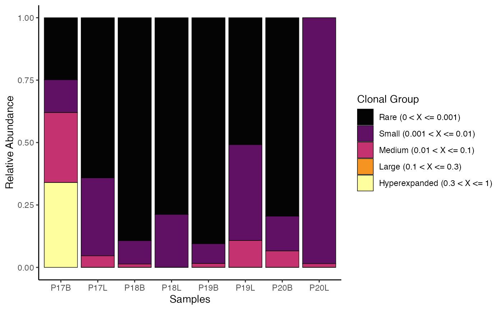

### clonalAbundance: Distribution of Clones by Size

[`clonalAbundance()`](https://www.borch.dev/uploads/scRepertoire/reference/clonalAbundance.md)
allows for the examination of the relative distribution of clones by
abundance. It produces a line graph showing the total number of clones
at specific frequencies within a sample or group.

Key Parameter(s) for
[`clonalAbundance()`](https://www.borch.dev/uploads/scRepertoire/reference/clonalAbundance.md)

- `scale`: If `TRUE`, converts the graphs into density plots to show
  relative distributions; if `FALSE` (default), displays raw counts.

To visualize the raw clonal abundance using the `gene` clone definition:

``` r
clonalAbundance(combined.TCR, 
                cloneCall = "gene", 
                scale = FALSE)
```

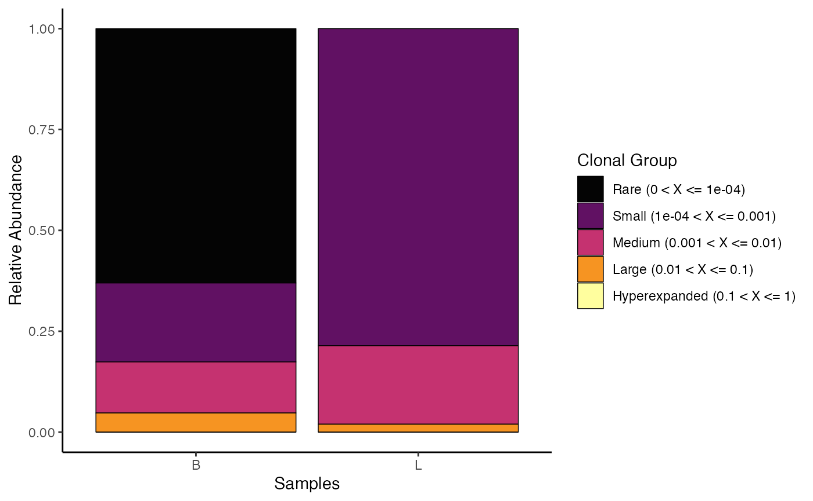

[`clonalAbundance()`](https://www.borch.dev/uploads/scRepertoire/reference/clonalAbundance.md)
output can also be converted into a density plot, which may allow for
better comparisons between different repertoire sizes, by setting
`scale = TRUE`.

``` r
clonalAbundance(combined.TCR, 
                cloneCall = "gene", 
                scale = TRUE)
```

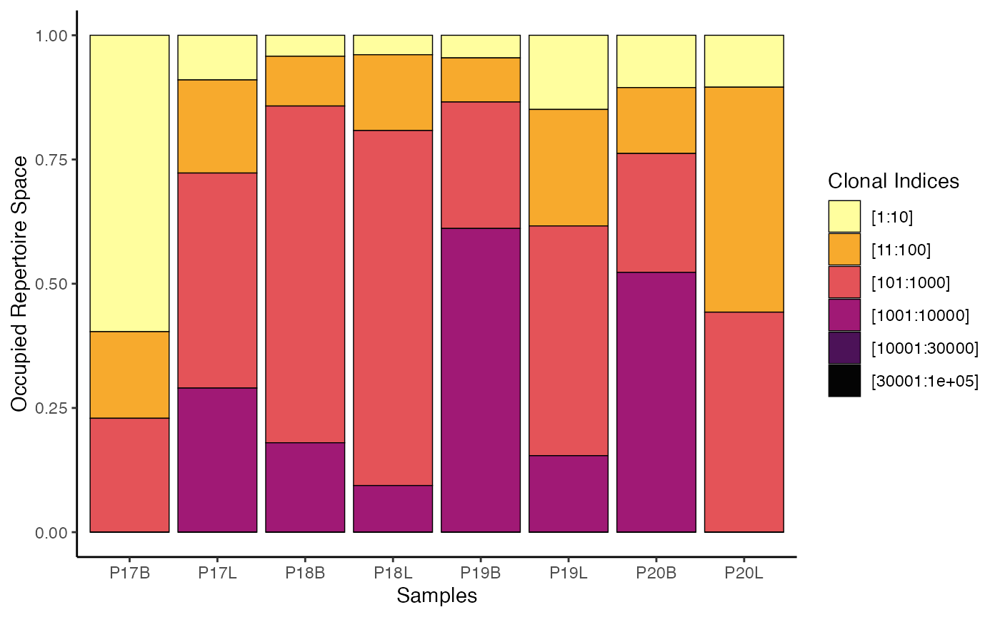

### clonalLength: Distribution of Sequence Lengths

[`clonalLength()`](https://www.borch.dev/uploads/scRepertoire/reference/clonalLength.md)
allows you to look at the length distribution of the CDR3 sequences.
Importantly, unlike the other basic visualizations, the `cloneCall` can
only be `nt` (nucleotide) or `aa` (amino acid). Due to the method of
calling clones as outlined previously (e.g., using NA for unreturned
chain sequences or multiple chains within a single barcode), the length
distribution may reveal a multimodal curve.

To visualize the amino acid length distribution for both chains
(“both”):

``` r
clonalLength(combined.TCR, 
             cloneCall="aa", 
             chain = "both") 
```

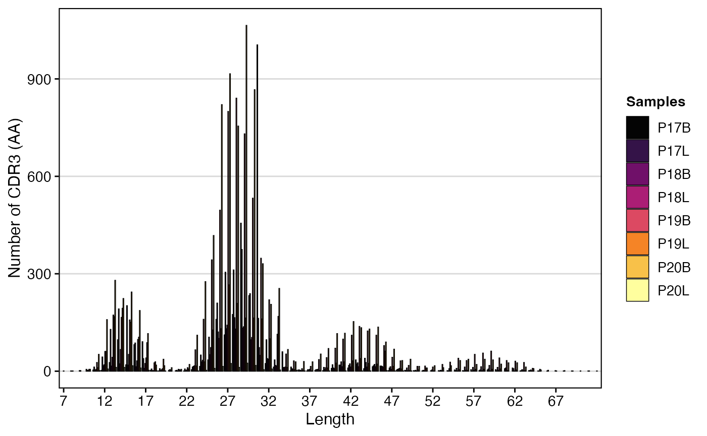

To visualize the amino acid length distribution for the `TRA` chain,
scaled as a density plot:

``` r
clonalLength(combined.TCR, 
             cloneCall="aa", 
             chain = "TRA", 
             scale = TRUE) 
```

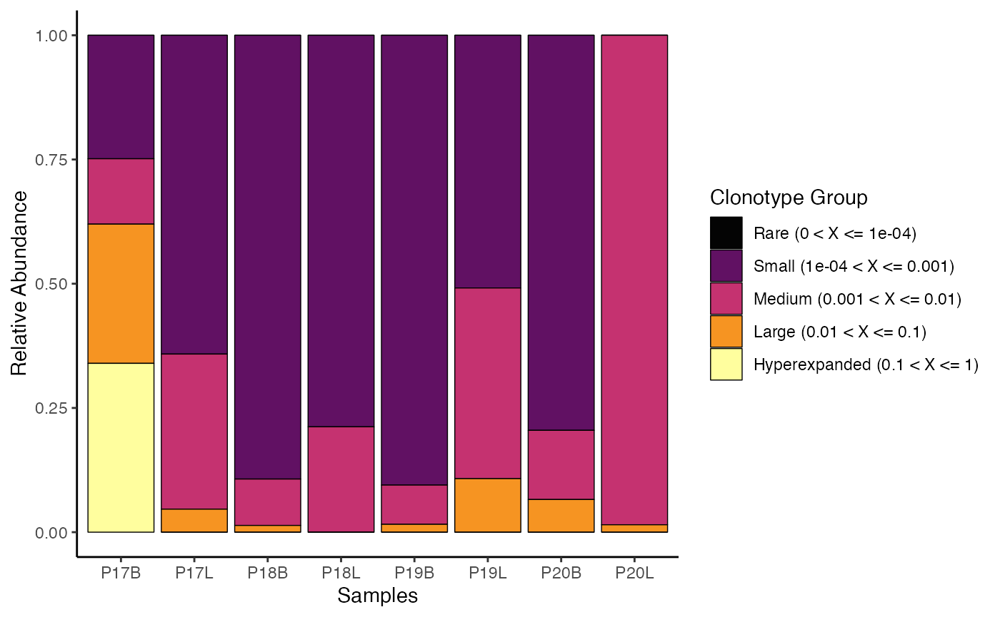

### clonalCompare: Clonal Dynamics Between Categorical Variables

[`clonalCompare()`](https://www.borch.dev/uploads/scRepertoire/reference/clonalCompare.md)
allows you to look at clones between samples and changes in dynamics. It
is useful for tracking how the proportions of top clones change between
conditions.

Key Parameters for
[`clonalCompare()`](https://www.borch.dev/uploads/scRepertoire/reference/clonalCompare.md)

- `samples`: A character vector to isolate specific samples by their
  list element name.
- `clones`: A character vector of specific clonal sequences to
  visualize. If used, `top.clones` will be ignored. \*`top.clones`: The
  top n number of clones to graph, calculated based on the frequency
  within individual samples.
- `highlight.clones`: A character vector of specific clonal sequences to
  color; all other clones will be greyed out.
- `relabel.clones`: If `TRUE`, simplifies the legend by labeling
  isolated clones numerically (e.g., “Clone: 1”).
- `graph`: The type of plot to generate; `alluvial` (default) or `area`.
- `proportion`: If `TRUE` (default), the y-axis represents proportional
  abundance; if `FALSE`, it represents raw clone counts.

To compare the top 10 clones between samples “P17B” and “P17L” using
amino acid sequences as an alluvial plot:

``` r
clonalCompare(combined.TCR, 
                  top.clones = 10, 
                  samples = c("P17B", "P17L"), 
                  cloneCall="aa", 
                  graph = "alluvial")
```

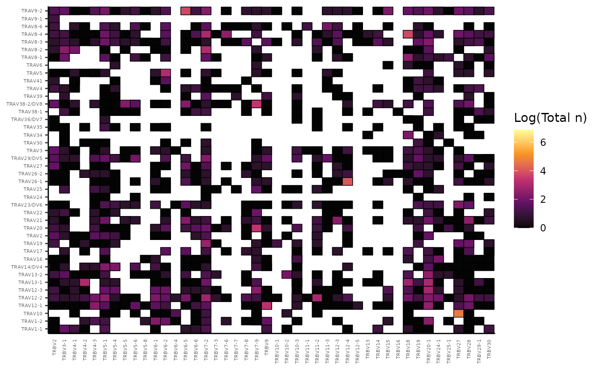

We can also choose to highlight specific clones, such as in the case of
*“CVVSDNTGGFKTIF_CASSVRRERANTGELFF”* and *“NA_CASSVRRERANTGELFF”* using
the `highlight.clones` parameter. In addition, we can simplify the plot
to label the clones as “Clone: 1”, “Clone: 2”, etc., by setting
`relabel.clones = TRUE`.

``` r
clonalCompare(combined.TCR, 
              top.clones = 10,
              highlight.clones = c("CVVSDNTGGFKTIF_CASSVRRERANTGELFF", "NA_CASSVRRERANTGELFF"),
              relabel.clones = TRUE,
              samples = c("P17B", "P17L"), 
              cloneCall="aa", 
              graph = "alluvial")
```

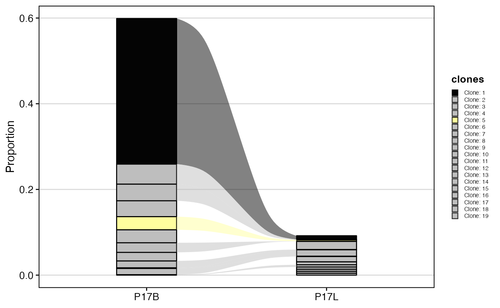

Alternatively, if we only want to show specific clones, we can use the
`clones` parameter.

``` r
clonalCompare(combined.TCR, 
              clones = c("CVVSDNTGGFKTIF_CASSVRRERANTGELFF", "NA_CASSVRRERANTGELFF"),
              relabel.clones = TRUE,
              samples = c("P17B", "P17L"), 
              cloneCall="aa", 
              graph = "alluvial")
```

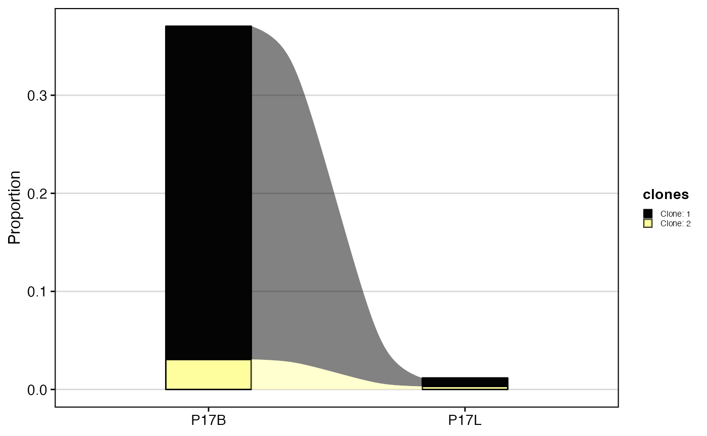

### clonalScatter: Scatterplot of Two Variables

clonalScatter() organizes two repertoires, quantifies their relative
clone sizes, and produces a scatter plot comparing the two samples.
Clones are categorized by counts into singlets or expanded, either
exclusively present or shared between the selected samples.

Key Parameter(s) for
[`clonalScatter()`](https://www.borch.dev/uploads/scRepertoire/reference/clonalScatter.md)

- `x.axis`, `y.axis`: Names of the list elements or meta data variable
  to place on the x-axis and y-axis.
- `dot.size`: Specifies how dot size is determined; `total` (default)
  displays the total number of clones between the x- and y-axis, or a
  specific list element name for size calculation.
- `graph`: The type of graph to display; `proportion` for the relative
  proportion of clones (default) or `count` for the total count of
  clones by sample.

To compare samples “P18B” and “P18L” based on `gene` clone calls, with
dot size representing the total number of clones, and plotting clone
proportions:

``` r
clonalScatter(combined.TCR, 
              cloneCall ="gene", 
              x.axis = "P18B", 
              y.axis = "P18L",
              dot.size = "total",
              graph = "proportion")
```

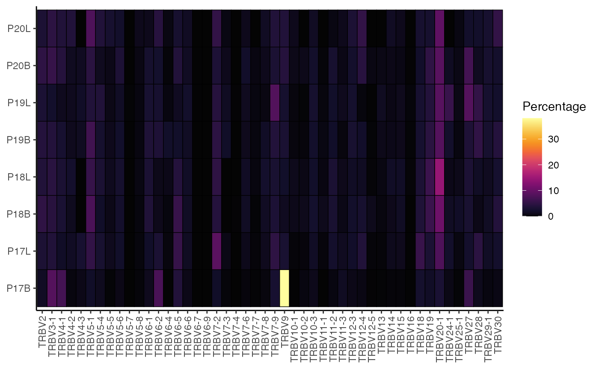

------------------------------------------------------------------------

## Visualizing Clonal Dynamics

### clonalHomeostasis: Examining Clonal Space

By examining the clonal space, we effectively look at the relative space
occupied by clones at specific proportions. Another way to think about
this would be to consider the total immune receptor sequencing run as a
measuring cup. In this cup, we will fill liquids of different
viscosity—or different numbers of clonal proportions. Clonal space
homeostasis asks what percentage of the cup is filled by clones in
distinct proportions (or liquids of different viscosity, to extend the
analogy). The proportional cut points are set under the `cloneSize`
variable in the function and can be adjusted.

Default `cloneSize` Bins

- **Rare**: 0 to 0.0001
- **Small**: 0.0001 to 0.001
- **Medium**: 0.001 to 0.01
- **Large**: 0.01 to 0.1
- **Hyperexpanded**: 0.1 to 1

To visualize clonal homeostasis using gene clone calls with default
`cloneSize` bins:

``` r
clonalHomeostasis(combined.TCR, 
                  cloneCall = "gene")
```


We can reassign the proportional cut points for `cloneSize`, which can
drastically alter the visualization and analysis

``` r
clonalHomeostasis(combined.TCR, 
                  cloneCall = "gene",
                  cloneSize = c(Rare = 0.001, Small = 0.01, Medium = 0.1, 
                                Large = 0.3, Hyperexpanded = 1))
```

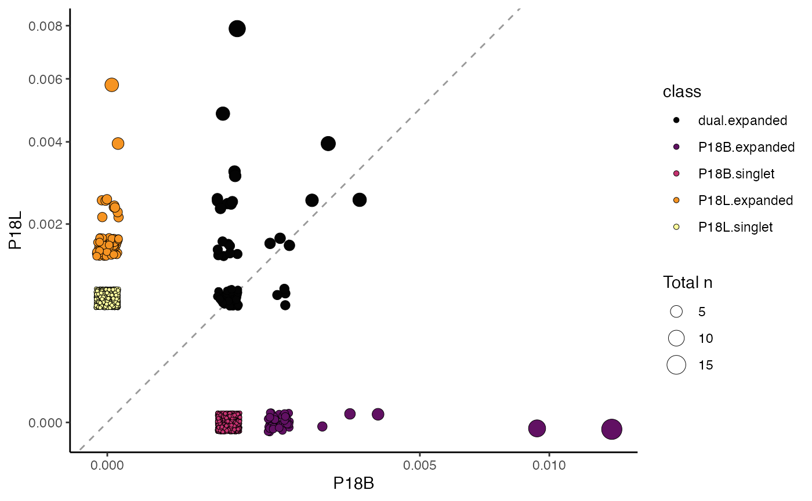

In addition, we can use the `group.by` parameter to look at the relative
proportion of clones between groups, such as by tissue type. First,
ensure the “Type” variable is added to `combined.TCR`:

``` r
combined.TCR <- addVariable(combined.TCR, 
                            variable.name = "Type", 
                            variables = rep(c("B", "L"), 4))
```

Now, visualize clonal homeostasis grouped by “Type”:

``` r
clonalHomeostasis(combined.TCR, 
                  group.by = "Type",
                  cloneCall = "gene")
```

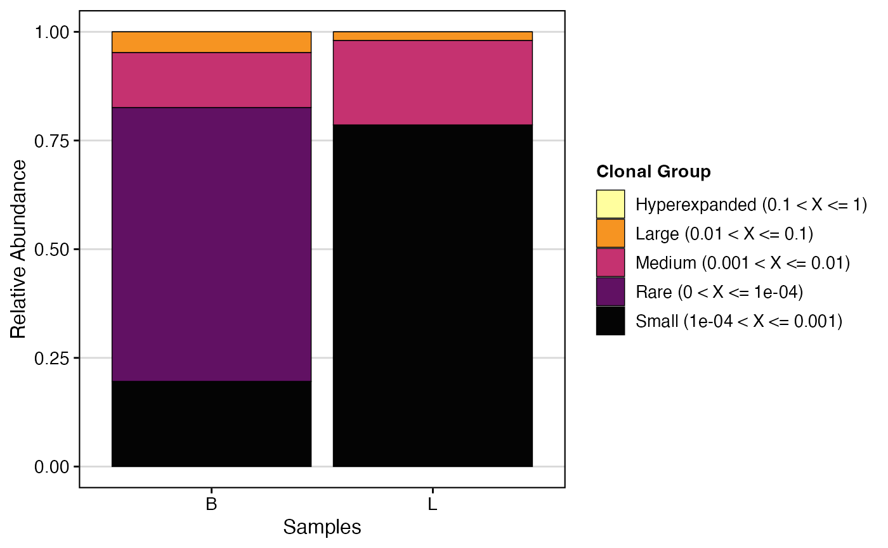

[`clonalHomeostasis()`](https://www.borch.dev/uploads/scRepertoire/reference/clonalHomeostasis.md)
provides an assessment of how different “sizes” of clones (based on
their proportional abundance) contribute to the overall repertoire. This
visualization helps to identify shifts in repertoire structure, such as
expansion of large clones in response to infection or contraction in
chronic conditions, offering insights into immune system activity and
health.

### clonalProportion: Examining Space Occupied by Ranks of Clones

Like clonal space homeostasis,
[`clonalProportion()`](https://www.borch.dev/uploads/scRepertoire/reference/clonalProportion.md)
also categorizes clones into separate bins. The key difference is that
instead of looking at the relative proportion of the clone to the total,
[`clonalProportion()`](https://www.borch.dev/uploads/scRepertoire/reference/clonalProportion.md)
ranks the clones by their total count or frequency of occurrence and
then places them into predefined bins.

The `clonalSplit` parameter represents the ranking of clonotypes. For
example, 1:10 refers to the top 10 clonotypes in each sample. The
default bins are set under the `clonalSplit` variable and can be
adjusted.

Default `clonalSplit` Bins

- **10** (top 1-10 clones)
- **100**: (top 11-100 clones)
- **1000**: (top 101-1000 clones)
- **10000**: (top 1001-10000 clones)
- **30000**: (top 10001-30000 clones)
- **100000**: (top 30001-100000 clones)

To visualize the clonal proportion using `gene` clone calls with default
`clonalSplit` bins:

``` r
clonalProportion(combined.TCR, 
                 cloneCall = "gene") 
```

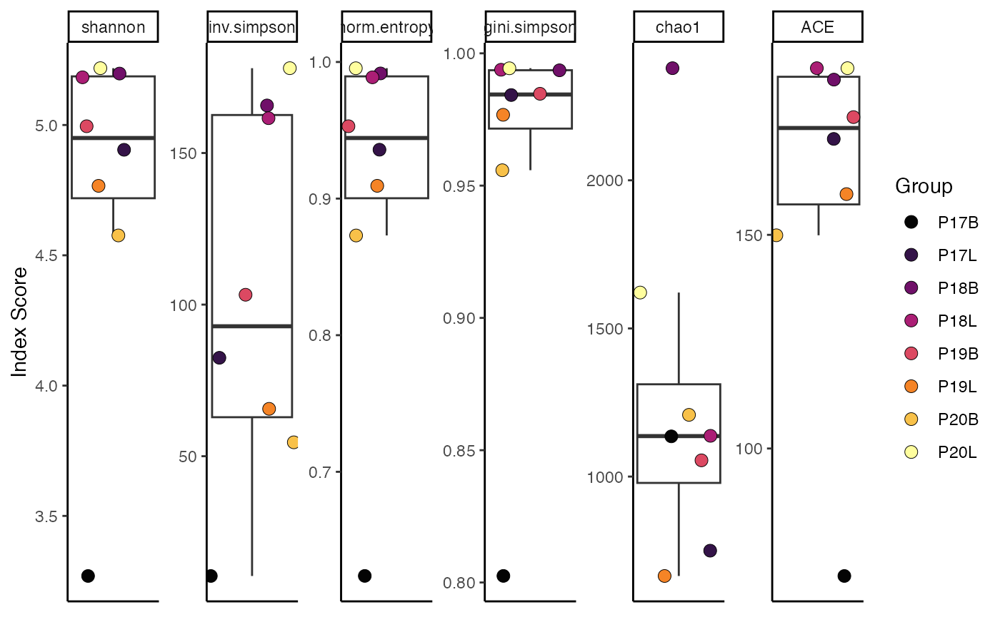

To visualize clonal proportion using `nt` (nucleotide) clone calls with
custom `clonalSplit` bins:

``` r
clonalProportion(combined.TCR, 
                 cloneCall = "nt",
                 clonalSplit = c(1, 5, 10, 100, 1000, 10000)) 
```

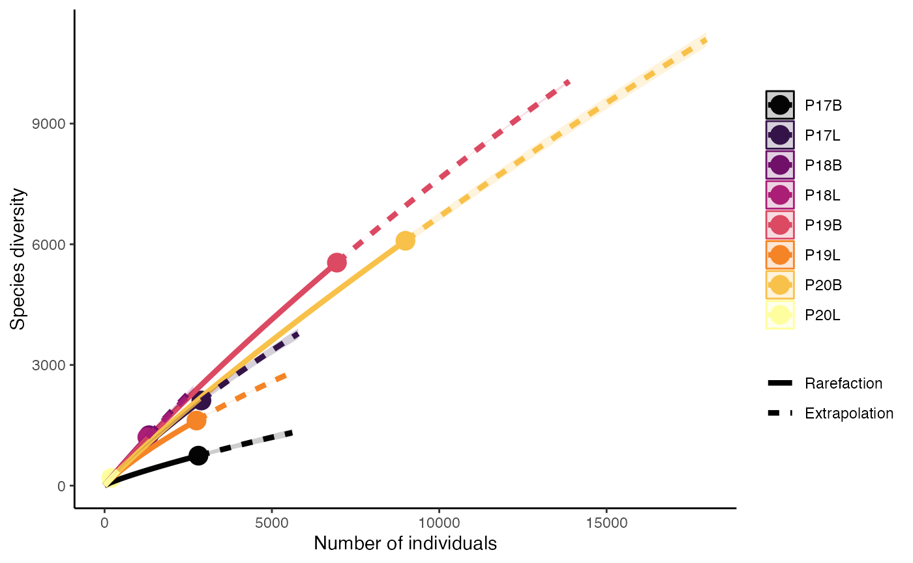

[`clonalProportion()`](https://www.borch.dev/uploads/scRepertoire/reference/clonalProportion.md)
complements
[`clonalHomeostasis()`](https://www.borch.dev/uploads/scRepertoire/reference/clonalHomeostasis.md)
by providing a perspective on how the “richest” (most abundant) clones
contribute to the overall repertoire space. By segmenting clones into
rank-based bins, it helps identify whether a few highly expanded clones
or a larger number of moderately expanded clones dominate the immune
response, offering distinct insights into repertoire structure and
dynamics.

------------------------------------------------------------------------

## Summarizing Repertoires

### percentGeneUsage

Gene quantification and visualization has been redesigned to offer a
more robust and translatable function under
[`percentGeneUsage()`](https://www.borch.dev/uploads/scRepertoire/reference/percentGeneUsage.md).
We have maintained the functionality of the previous functions for
gene-level quantification under the aliases
[`vizGenes()`](https://www.borch.dev/uploads/scRepertoire/reference/percentGeneUsage.md),
[`percentGenes()`](https://www.borch.dev/uploads/scRepertoire/reference/percentGeneUsage.md),
and
[`percentVJ()`](https://www.borch.dev/uploads/scRepertoire/reference/percentGeneUsage.md).

#### vizGenes: Flexible Gene Usage Visualization

The
[`vizGenes()`](https://www.borch.dev/uploads/scRepertoire/reference/percentGeneUsage.md)
function offers a highly adaptable approach to visualizing the relative
usage of TCR or BCR genes. It acts as a versatile alias for
[`percentGeneUsage()`](https://www.borch.dev/uploads/scRepertoire/reference/percentGeneUsage.md),
allowing for comparisons across different chains, scaling of values, and
selection between bar charts and heatmaps.

- `x.axis`: Specifies the gene segment to display along the x-axis
  (e.g., “TRBV”, “TRBD”, “IGKJ”).
- `y.axis`
  - Another gene segment (e.g., “TRAV”, “TRBJ”) for paired gene
    analysis. When x.axis and y.axis are both gene segments, vizGenes()
    internally calls percentGeneUsage() with genes = c(x.axis, y.axis),
    resulting in a heatmap.
  - A categorical variable (e.g., “sample”, “orig.ident”) to visualize
    gene usage across different groups. When y.axis is a categorical
    variable, vizGenes() maps it to the group.by parameter of
    percentGeneUsage(), creating facets for each category.
- `plot`: Determines the visualization type:
  - “barplot”: Ideal for visualizing the distribution of a single gene
    segment.
  - “heatmap”: Suitable for single gene usage (with a group.by or y.axis
    categorical variable) or for paired gene analysis.
- `summary.fun`: (Inherited from `percentGeneUsage`) Defines the
  statistic to display: “percent” (default), “proportion”, or “count”.
  This implicitly handles the scaling of values.

``` r
vizGenes(combined.TCR,
         x.axis = "TRBV",
         y.axis = NULL, # No specific y-axis variable, will group all samples
         plot = "barplot",
         summary.fun = "proportion") 
```

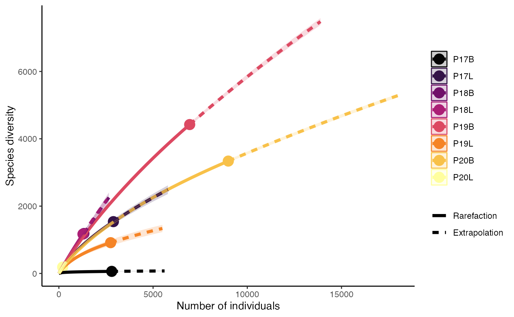

This plot shows the proportion of each *TRBV* gene segment observed
across the entire combined.TCR dataset. Since `y.axis` is NULL, samples
are grouped by the list element of the combined.TCR data.

[`vizGenes()`](https://www.borch.dev/uploads/scRepertoire/reference/percentGeneUsage.md)
is particularly useful for examining gene pairings. Let’s look at the
differences in *TRBV* and *TRBJ* usage between peripheral blood and lung
samples from your dataset. We’ll subset combined.TCR for this analysis.

``` r
# Peripheral Blood Samples
vizGenes(combined.TCR[c("P17B", "P18B", "P19B", "P20B")],
         x.axis = "TRBV",
         y.axis = "TRBJ",
         plot = "heatmap",
         summary.fun = "percent") # Display percentages
```

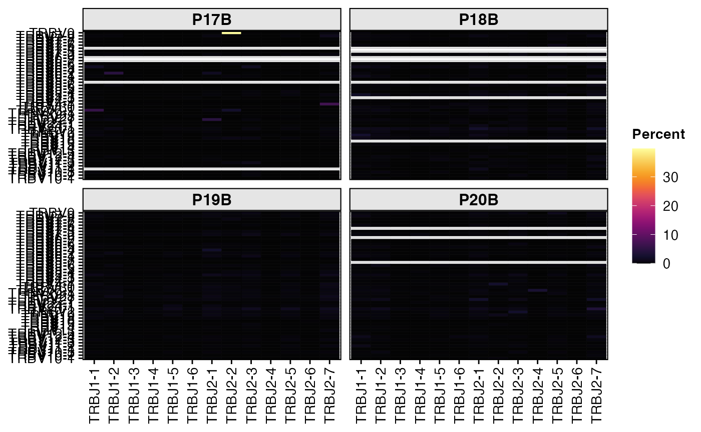

``` r
# Lung Samples
vizGenes(combined.TCR[c("P17L", "P18L", "P19L", "P20L")],
         x.axis = "TRBV",
         y.axis = "TRBJ",
         plot = "heatmap",
         summary.fun = "percent") # Display percentages
```

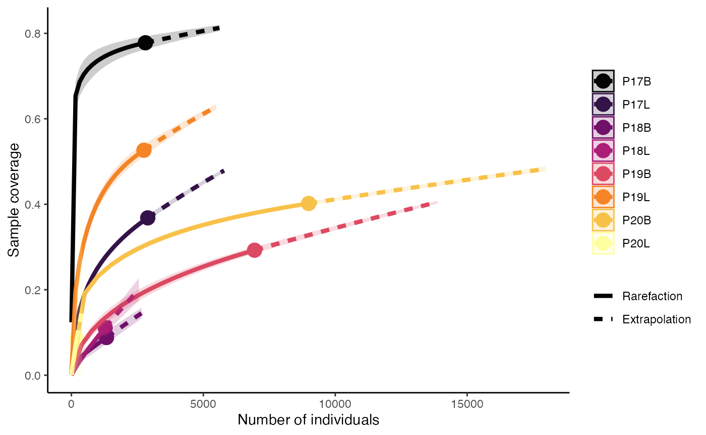

In these examples, by providing both `x.axis` and `y.axis` as gene
segments (“TRBV” and “TRBJ”),
[`vizGenes()`](https://www.borch.dev/uploads/scRepertoire/reference/percentGeneUsage.md)
automatically performs a paired gene analysis, generating a heatmap
where the intensity reflects the percentage of each V-J pairing.

Beyond V-J pairings within a single chain,
[`vizGenes()`](https://www.borch.dev/uploads/scRepertoire/reference/percentGeneUsage.md)
can also visualize gene usage across different chains. For instance, to
examine *TRBV* and *TRAV* pairings for patient P17’s samples:

``` r
vizGenes(combined.TCR[c("P17B", "P17L")],
         x.axis = "TRBV",
         y.axis = "TRAV",
         plot = "heatmap",
         summary.fun = "count") 
```

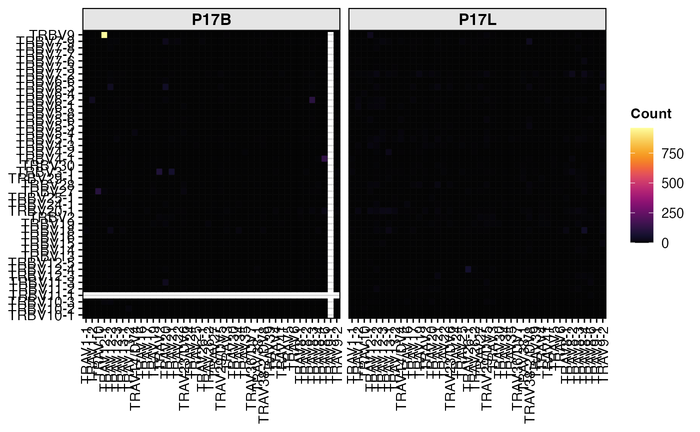

#### percentGenes: Quantifying Single Gene Usage

The
[`percentGenes()`](https://www.borch.dev/uploads/scRepertoire/reference/percentGeneUsage.md)
function is a specialized alias for
[`percentGeneUsage()`](https://www.borch.dev/uploads/scRepertoire/reference/percentGeneUsage.md)
designed to quantify the usage of a single V, D, or J gene locus for a
specified immune receptor chain. By default, it returns a heatmap
visualization.

Key Parameters for
[`percentGenes()`](https://www.borch.dev/uploads/scRepertoire/reference/percentGeneUsage.md):

- `chain`: Specifies the immune receptor chain (e.g., “TRB”, “TRA”,
  “IGH”, “IGL”).
- `gene`: Indicates the gene locus to quantify: “Vgene”, “Dgene”, or
  “Jgene”.
- `group.by`, `order.by`, `summary.fun`, `exportTable`, `palette`: These
  parameters are directly passed to
  [`percentGeneUsage()`](https://www.borch.dev/uploads/scRepertoire/reference/percentGeneUsage.md).

To quantify and visualize the percentage of TRBV gene usage across your
samples:

``` r
percentGenes(combined.TCR,
             chain = "TRB",
             gene = "Vgene",
             summary.fun = "percent")
```

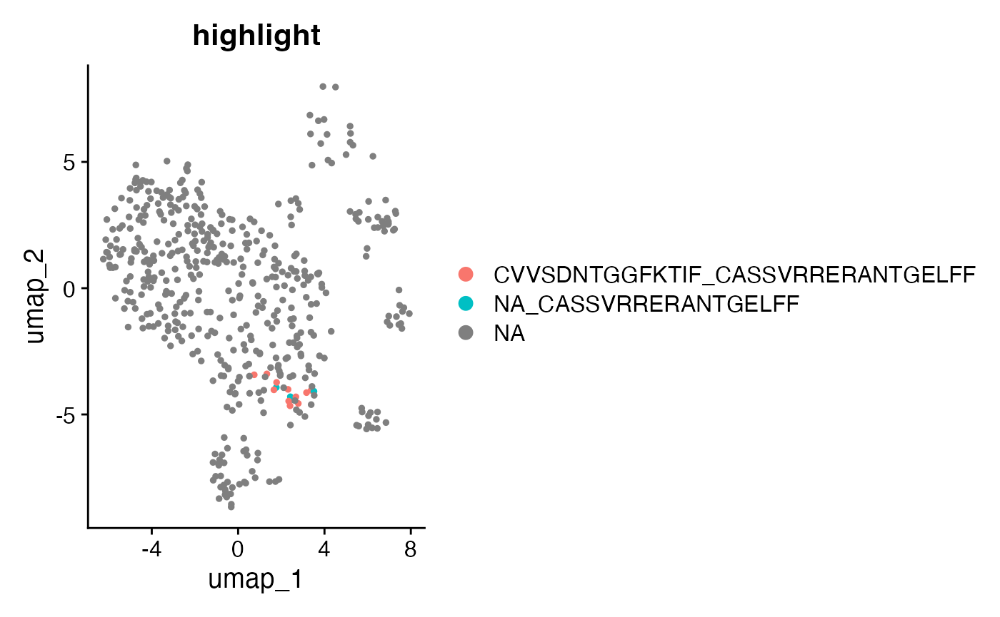

This generates a heatmap showing the percentage of each TRBV gene
segment within each sample, allowing for easy visual comparison of gene
usage profiles across your samples.

The raw data returned by
[`percentGenes()`](https://www.borch.dev/uploads/scRepertoire/reference/percentGeneUsage.md)
(when `exportTable` = TRUE) can be a powerful input for further
downstream analysis, such as dimensionality reduction techniques like
Principal Component Analysis. This allows you to summarize the complex
gene usage patterns and identify samples with similar or distinct
repertoires.

``` r
df.genes <- percentGenes(combined.TCR,
                         chain = "TRB",
                         gene = "Vgene",
                         exportTable = TRUE,
                         summary.fun = "proportion") 

# Performing PCA on the gene usage matrix
pc <- prcomp(t(df.genes) )

# Getting data frame to plot from
df_plot <- as.data.frame(cbind(pc$x[,1:2], colnames(df.genes)))
colnames(df_plot) <- c("PC1", "PC2", "Sample")
df_plot$PC1 <- as.numeric(df_plot$PC1)
df_plot$PC2 <- as.numeric(df_plot$PC2)

ggplot(df_plot, aes(x = PC1, y = PC2)) +
  geom_point(aes(fill = Sample), shape = 21, size = 5) +
  guides(fill=guide_legend(title="Samples")) +
  scale_fill_manual(values = hcl.colors(nrow(df_plot), "inferno")) +
  theme_classic() +
  labs(title = "PCA of TRBV Gene Usage")
```

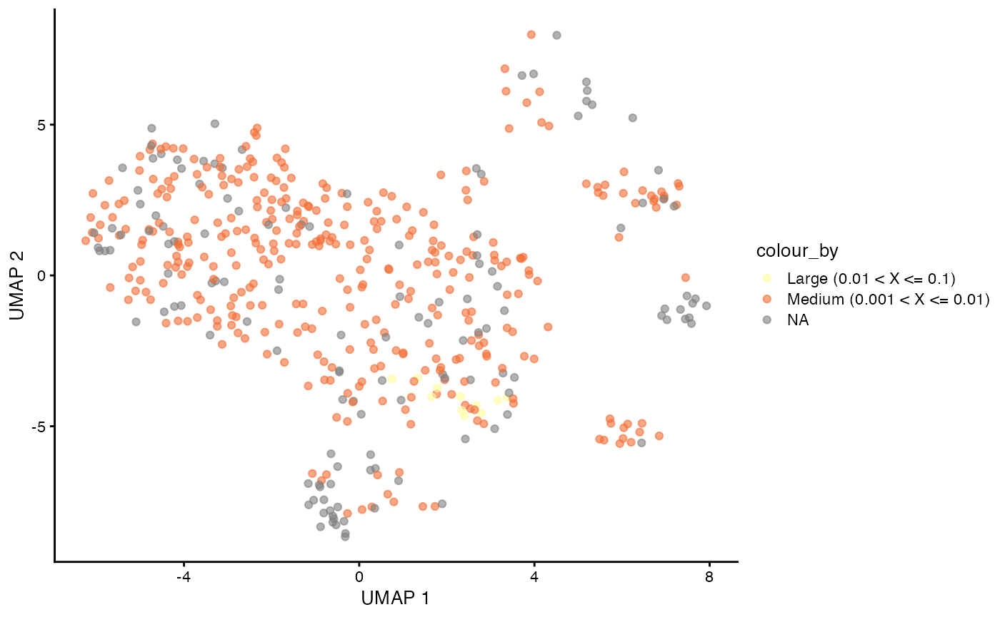

This PCA plot visually clusters samples based on their *TRBV* gene usage
profiles, helping to identify underlying patterns or relationships
between samples.

#### percentVJ: Quantifying V-J Gene Pairings

The
[`percentVJ()`](https://www.borch.dev/uploads/scRepertoire/reference/percentGeneUsage.md)
function is another specialized alias for
[`percentGeneUsage()`](https://www.borch.dev/uploads/scRepertoire/reference/percentGeneUsage.md),
specifically designed to quantify the proportion or percentage of V and
J gene segments paired together within individual repertoires. It always
produces a heatmap visualization.

Key Parameters for `percenVJ()`:

- `chain`: Specifies the immune receptor chain (e.g., **“TRB”**,
  **“TRA”**, **“IGH”**, **“IGL”**). This dictates which V and J gene
  segments are analyzed (e.g., **TRBV** and **TRBJ** for `chain` =
  “TRB”)

``` r
percentVJ(combined.TCR[1:2],
          chain = "TRB",
          summary.fun = "percent")
```

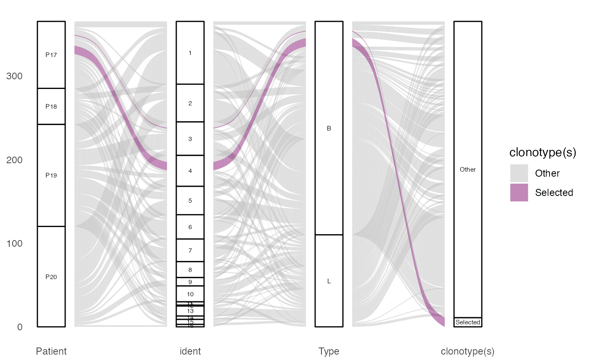

This heatmap displays the percentage of each *TRBV-TRBJ* pairing for
each sample, providing a detailed view of the V-J recombination
landscape.

Similar to
[`percentGenes()`](https://www.borch.dev/uploads/scRepertoire/reference/percentGeneUsage.md),
the quantitative output of
[`percentVJ()`](https://www.borch.dev/uploads/scRepertoire/reference/percentGeneUsage.md)
can be used for dimensionality reduction to summarize V-J pairing
patterns across samples.

``` r
df.vj <- percentVJ(combined.TCR,
                   chain = "TRB",
                   exportTable = TRUE,
                   summary.fun = "proportion") # Export proportions for PCA

# Performing PCA on the V-J pairing matrix
pc.vj <- prcomp(t(df.vj))

# Getting data frame to plot from
df_plot_vj <- as.data.frame(cbind(pc.vj$x[,1:2], colnames(df.vj)))
colnames(df_plot_vj) <- c("PC1", "PC2", "Sample")
df_plot_vj$PC1 <- as.numeric(df_plot_vj$PC1)
df_plot_vj$PC2 <- as.numeric(df_plot_vj$PC2)

# Plotting the PCA results
ggplot(df_plot_vj, aes(x = PC1, y = PC2)) +
  geom_point(aes(fill = Sample), shape = 21, size = 5) +
  guides(fill=guide_legend(title="Samples")) +
  scale_fill_manual(values = hcl.colors(nrow(df_plot_vj), "inferno")) +
  theme_classic() +
  labs(title = "PCA of TRBV-TRBJ Gene Pairings")
```

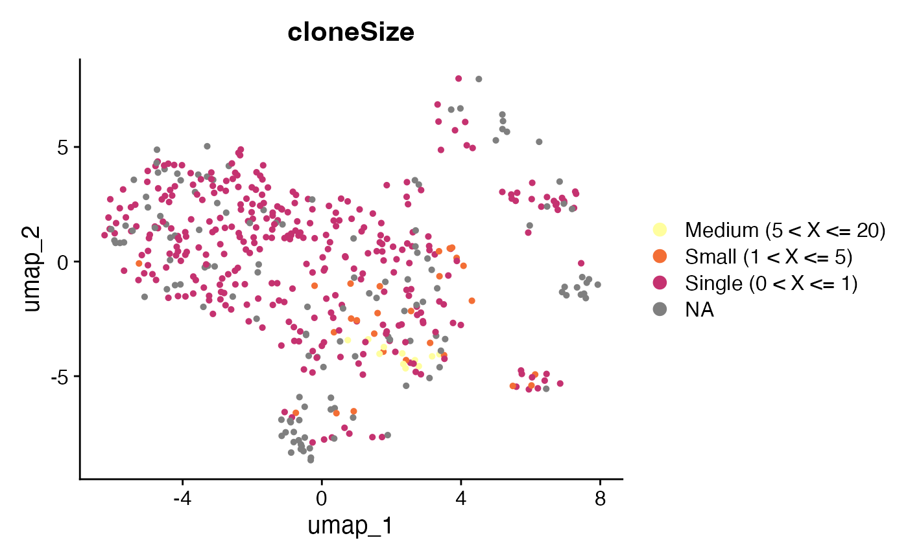

### percentAA: Amino Acid Composition by Residue

Quantify the proportion of amino acids along the CDR3 sequence with
[`percentAA()`](https://www.borch.dev/uploads/scRepertoire/reference/percentAA.md).
By default, the function will pad the sequences with NAs up to the
maximum of `aa.length`. Sequences longer than aa.length will be removed
before visualization (default `aa.length` = 20).

Key Parameter(s) for
[`percentAA()`](https://www.borch.dev/uploads/scRepertoire/reference/percentAA.md)

- `aa.length`: The maximum length of the CDR3 amino acid sequence to
  consider.

To visualize the relative percentage of amino acids at each position of
the CDR3 sequences for the TRB chain, up to a length of 20 amino acids:

``` r
percentAA(combined.TCR, 
          chain = "TRB", 
          aa.length = 20)
```


This plot displays the relative proportion of each amino acid at
different positions across the CDR3 sequence for the specified chain. It
provides insights into the amino acid composition and variability at
each residue, which can be indicative of functional constraints or
selection pressures on the CDR3

### positionalEntropy: Entropy across CDR3 Sequences

We can also quantify the level of entropy/diversity across amino acid
residues along the CDR3 sequence.
[`positionalEntropy()`](https://www.borch.dev/uploads/scRepertoire/reference/positionalEntropy.md)
combines the quantification by residue of
[`percentAA()`](https://www.borch.dev/uploads/scRepertoire/reference/percentAA.md)
with diversity calculations. Positions without variance will have a
value reported as 0 for the purposes of comparison.

Key Parameter(s) for
[`positionalEntropy()`](https://www.borch.dev/uploads/scRepertoire/reference/positionalEntropy.md)

- `method`
  - `shannon` - Shannon Index
  - `inv.simpson` - Inverse Simpson Index
  - `gini.simpson` - Gini-Simpson Index
  - `norm.entropy` - Normalized Entropy
  - `pielou` - Pielou’s Evenness
  - `hill1`, `hill2`, `hill3` - Hill Numbers

To visualize the normalized entropy across amino acid residues for the
TRB chain, up to a length of 20 amino acids:

``` r
positionalEntropy(combined.TCR, 
                  chain = "TRB", 
                  aa.length = 20)
```

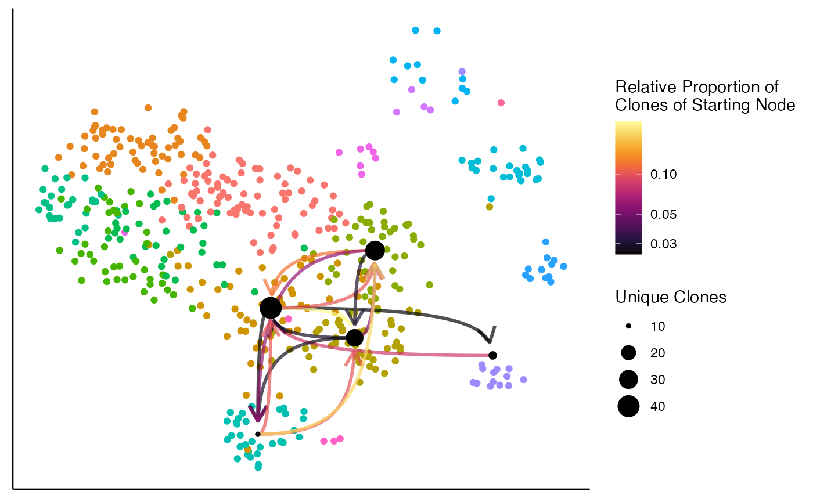

The plot generated by
[`positionalEntropy()`](https://www.borch.dev/uploads/scRepertoire/reference/positionalEntropy.md)
illustrates the diversity or entropy at each amino acid position within
the CDR3 sequence. Higher entropy values indicate greater variability in
amino acid usage at that position, suggesting less selective pressure or
more promiscuous binding, while lower values suggest conserved positions
critical for structural integrity or antigen recognition.

### positionalProperty: Amino Acid Properties across CDR3 Sequence

Like
[`positionalEntropy()`](https://www.borch.dev/uploads/scRepertoire/reference/positionalEntropy.md),
we can also examine a series of amino acid properties along the CDR3
sequences using
[`positionalProperty()`](https://www.borch.dev/uploads/scRepertoire/reference/positionalProperty.md).
Important differences for
[`positionalProperty()`](https://www.borch.dev/uploads/scRepertoire/reference/positionalProperty.md)
is dropping NA values as they would void the mean calculation and
displaying a ribbon with the 95% confidence interval surrounding the
mean value for the selected properties.

Key Parameter(s) for
[`positionalEntropy()`](https://www.borch.dev/uploads/scRepertoire/reference/positionalEntropy.md)

- `method`
  - `atchleyFactors`:
    [citation](https://pubmed.ncbi.nlm.nih.gov/15851683/)
  - `crucianiProperties`:
    [citation](https://analyticalsciencejournals.onlinelibrary.wiley.com/doi/abs/10.1002/cem.856)
  - `FASGAI`: [citation](https://pubmed.ncbi.nlm.nih.gov/18318694/)
  - `kideraFactors`:
    [citation](https://link.springer.com/article/10.1007/BF01025492)
  - `MSWHIM`: [citation](https://pubs.acs.org/doi/10.1021/ci980211b)
  - `ProtFP`: [citation](https://pubmed.ncbi.nlm.nih.gov/24059694/)
  - `stScales`: [citation](https://pubmed.ncbi.nlm.nih.gov/19373543/)
  - `tScales`:
    [citation](https://www.sciencedirect.com/science/article/abs/pii/S0022286006006314)
  - `VHSE`: [citation](https://pubmed.ncbi.nlm.nih.gov/15895431/)
  - `zScales`: [citation](https://pubmed.ncbi.nlm.nih.gov/9651153/)

To examine the Atchley factors of amino acids across the CDR3 sequence
for the first two samples:

``` r
positionalProperty(combined.TCR[c(1,2)], 
                  chain = "TRB", 
                  aa.length = 20, 
                  method = "atchleyFactors") + 
  scale_color_manual(values = hcl.colors(5, "inferno")[c(2,4)])
```

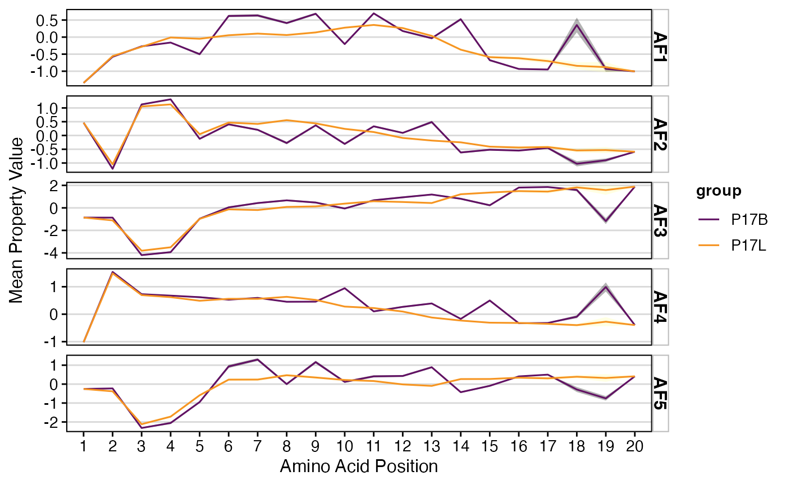

This function provides a detailed view of how physicochemical properties
of amino acids change along the CDR3 sequence. By visualizing the mean
property value and its confidence interval, one can identify positions
with distinct characteristics or significant variations between groups,
offering insights into structural and functional aspects of the CDR3.

### percentKmer: Motif Quantification

Another quantification of the composition of the CDR3 sequence is to
define motifs by sliding across the amino acid or nucleotide sequences
at set intervals, resulting in substrings or kmers.

Key Parameter(s) for
[`percentKmer()`](https://www.borch.dev/uploads/scRepertoire/reference/percentKmer.md):

- `cloneCall`: Defines the clonal sequence grouping; only accepts `aa`
  (amino acids) or `nt` (nucleotides)
- `motif.length`: The length of the kmer to analyze.
- `top.motifs`: Displays the n most variable motifs as a function of
  median absolute deviation.

To visualize the percentage of the top 25 most variable 3-mer amino acid
motifs for the TRB chain:

``` r
percentKmer(combined.TCR, 
            cloneCall = "aa",
            chain = "TRB", 
            motif.length = 3, 
            top.motifs = 25)
```

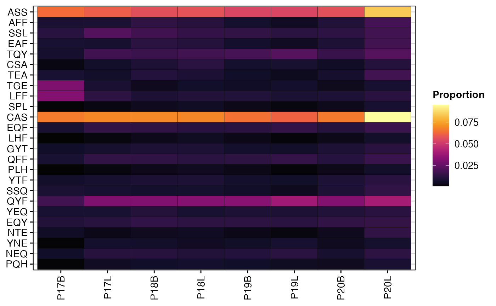

To perform the same analysis but for nucleotide motifs:

``` r
percentKmer(combined.TCR, 
            cloneCall = "nt",
            chain = "TRB", 
            motif.length = 3, 
            top.motifs = 25)
```

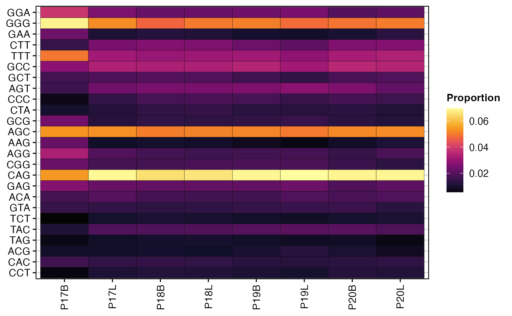

The heatmaps generated by
[`percentKmer()`](https://www.borch.dev/uploads/scRepertoire/reference/percentKmer.md)
illustrate the relative composition of frequently occurring k-mer motifs
across samples or groups. This analysis can highlight recurrent sequence
patterns in the CDR3, which may be associated with specific antigen
recognition, disease states, or processing mechanisms. By examining the
most variable motifs, researchers can identify key sequence features
that differentiate immune repertoires.

------------------------------------------------------------------------

## Comparing Clonal Diversity and Overlap

### clonalDiversity: Clonal Diversity Quantification

Diversity can be measured for samples or by other variables.
[`clonalDiversity()`](https://www.borch.dev/uploads/scRepertoire/reference/clonalDiversity.md)
calculates a specified diversity metric for groups within a dataset. To
control for variations in library size, the function can perform
bootstrapping with downsampling. It resamples each group to the size of
the smallest group and calculates the diversity metric across multiple
iterations, returning the mean values.

#### How `clonalDiversity()` Handles Downsampling and Bootstrapping

- It determines the number of clones in the smallest group.
- For each group, it performs `n.boots` iterations (default = 100).
- In each iteration, it randomly samples the clones (with replacement)
  down to the size of the smallest group.
- It calculates the selected diversity metric on this downsampled set.
- The final reported diversity value is the mean of the results from all
  bootstrap iterations.
- This process can be disabled by setting `skip.boots = TRUE`.

#### Available Diversity Metrics (`metric`)

| **Metric** | **What it measures** | **Typical scale** | **Higher value indicates…** |
|:---|:---|:---|:---|
| `shannon` | Joint *richness + evenness* of clonotypes; moderately sensitive to rare clones (entropy of the frequency distribution). | 0 → ∞ | **More distinct clonotypes** *and* a more even clone-size distribution. |
| `inv.simpson` | Evenness-weighted diversity (inverse Simpson’s D); heavily penalises dominance by a few large clones. | 1 → ∞ | **Few highly dominant clones**; diversity spread across many mid-abundance clones. |
| `norm.entropy` | Shannon entropy divided by ln *S* (where *S* = no. clonotypes); removes library-size dependence. | 0 → 1 | Same interpretation as `shannon`, but **comparable across samples of different depths**. |
| `gini.simpson` | 1 – Simpson’s D; probability that two reads drawn at random come from **different** clonotypes. | 0 → 1 | **Greater heterogeneity** (higher chance the two reads represent distinct clones). |
| `chao1` | Estimated *richness only* (number of clonotypes), correcting for unseen singletons/doubletons. | 0 → ∞ | **More unique clonotypes**, regardless of their relative abundances. |
| `ACE` | Abundance-based Coverage Estimator—alternative richness estimator robust when many clones are rare. | 0 → ∞ | **More unique clonotypes**, especially when the repertoire contains many low-frequency clones. |
| `gini` | Inequality of clone size distribution (Gini Coefficient); measures how unevenly clone sizes are distributed. | 0 → 1 | **Greater inequality**; a few highly abundant clones dominate the repertoire. |
| `d50` | Repertoire dominance; how many of the top clones are needed to constitute 50% of the total library. | 1 → ∞ | **Less dominance** by top clones; the repertoire is more evenly distributed. |
| `hill0` | Richness (Hill number q=0); the total number of unique clonotypes observed in the sample. | 0 → ∞ | **More unique clonotypes** (greater raw richness). |
| `hill1` | Effective number of abundant clonotypes (Hill number q=1); the exponential of Shannon entropy. | 1 → ∞ | **Higher diversity** of common clonotypes, balancing richness and evenness. |
| `hill2` | Effective number of dominant clonotypes (Hill number q=2); equivalent to the inverse Simpson index. | 1 → ∞ | **Higher diversity** among the most dominant clonotypes in the repertoire. |

Key Parameters for
[`clonalDiversity()`](https://www.borch.dev/uploads/scRepertoire/reference/clonalDiversity.md)

- `metric`: The diversity metric to calculate.
- `x.axis`: An additional metadata variable to group samples along the
  x-axis.
- `return.boots`: If `TRUE`, returns all bootstrap values instead of the
  mean.
- `skip.boots`: If `TRUE`, disables downsampling and bootstrapping.
- `n.boots`: The number of bootstrap iterations to perform (default is
  100).

To calculate Shannon diversity, grouped by sample:

``` r
clonalDiversity(combined.TCR, 
                cloneCall = "gene")
```

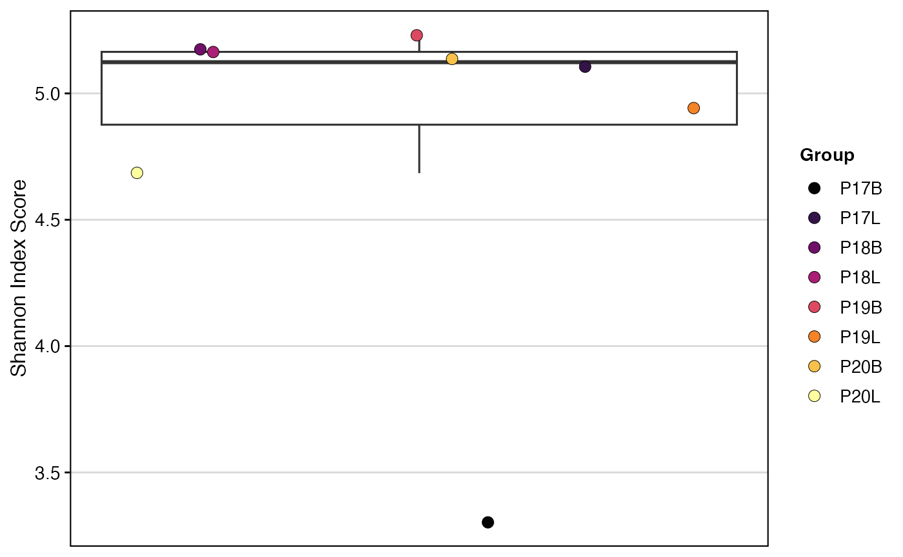

There are two options for grouping in
[`clonalDiversity()`](https://www.borch.dev/uploads/scRepertoire/reference/clonalDiversity.md):
`group.by` and `x.axis`.

- `group.by`: Reorganizes the clone information into new groups that the
  calculation will be based on.
- `x.axis`: Keeps the organization of the clone information the same,
  but plots along the x-axis for improved visibility or grouping.

First, add a “Patient” variable to combined.TCR

``` r
combined.TCR <- addVariable(combined.TCR, 
                            variable.name = "Patient", 
                             variables = c("P17", "P17", "P18", "P18", 
"P19","P19", "P20", "P20"))
```

Now, calculate Inverse Simpson diversity, grouped by “Patient”:

``` r
clonalDiversity(combined.TCR, 
                cloneCall = "gene", 
                group.by = "Patient", 
                metric = "inv.simpson")
```

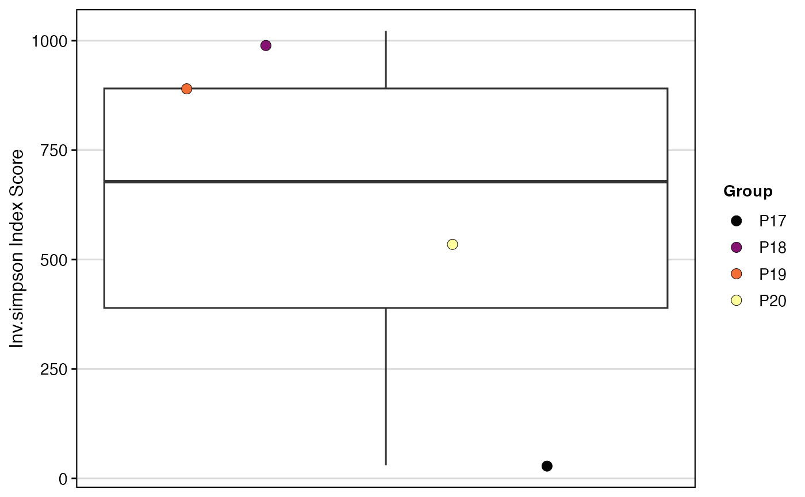

Calculate Inverse Simpson diversity with “Patient” on the x-axis,
keeping the original grouping:

``` r
clonalDiversity(combined.TCR, 
                cloneCall = "gene", 
                x.axis = "Patient", 
                metric = "inv.simpson")
```

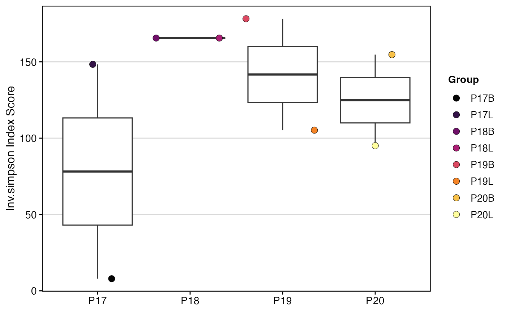

[`clonalDiversity()`](https://www.borch.dev/uploads/scRepertoire/reference/clonalDiversity.md)
functions in quantifying and comparing the diversity of immune
repertoires across different samples or experimental conditions. By
implementing bootstrapping and offering a wide range of diversity
metrics, it provides robust and comparable measures of clonal richness
and evenness, which are fundamental for understanding immune responses
and disease states

### clonalRarefaction: Sampling-based Extrapolation

[`clonalRarefaction()`](https://www.borch.dev/uploads/scRepertoire/reference/clonalRarefaction.md)
uses Hill numbers to estimate rarefaction, or estimating species
richness, based on the abundance of clones across groupings. The
underlying rarefaction calculation uses the observed receptor abundance
to compute diversity. This function relies on the `iNEXT` R package.

#### Hill Numbers and Their Interpretation

- `0`: Species richness
- `1`: Shannon Diversity
- `2`: Simpson Diversity

#### plot.type Options

- `1`: Sample-size-based rarefaction/extrapolation curve
- `2`: Sample completeness curve
- `3`: Coverage-based rarefaction/extrapolation curve

Key Parameter(s) for
[`clonalRarefaction()`](https://www.borch.dev/uploads/scRepertoire/reference/clonalRarefaction.md)

- `plot.type`: The type of plot to generate.
- `hill.numbers`: The Hill numbers to be plotted (0, 1, or 2).
- `n.boots`: The number of bootstrap replicates used to derive
  confidence intervals (default is 20).

This function relies on the
[iNEXT](https://cran.r-project.org/web/packages/iNEXT/index.html) with
the accompanying
[manuscript](http://chao.stat.nthu.edu.tw/wordpress/paper/120_pdf_appendix.pdf).
Like the other wrapping functions in scRepertoire, please cite the
original work. The sample completeness curve (**plot.type** = 2), may
not show full sample coverage due to the size/diversity of the input
data.

#### Rarefaction using Species Richness (q = 0)

``` r
clonalRarefaction(combined.TCR,
                  plot.type = 1,
                  hill.numbers = 0,
                  n.boots = 2)
```

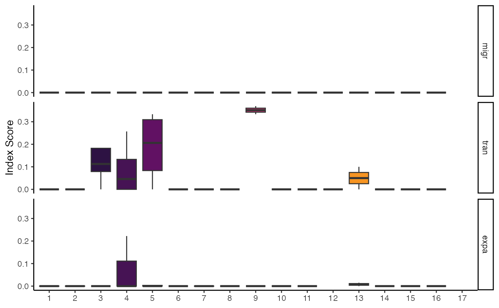

``` r
clonalRarefaction(combined.TCR,
                  plot.type = 2,
                  hill.numbers = 0,
                  n.boots = 2)
```

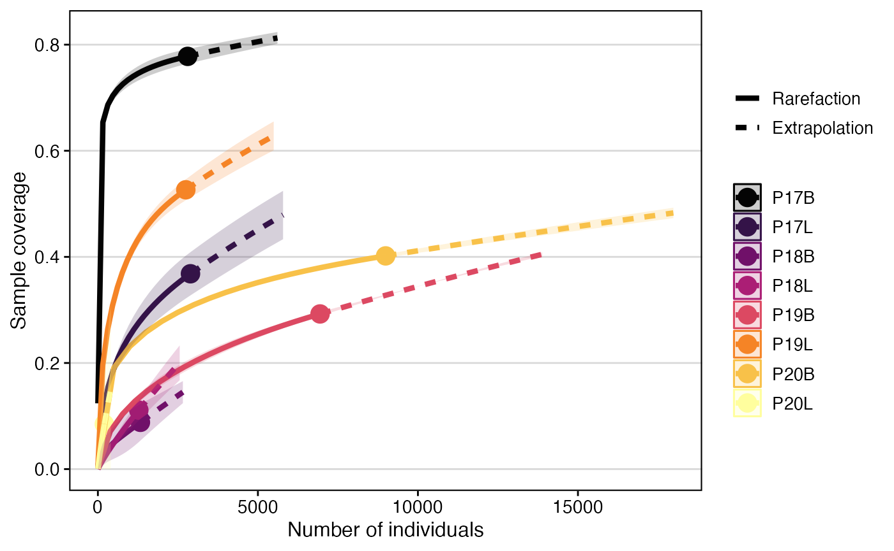

``` r
clonalRarefaction(combined.TCR,
                  plot.type = 3,
                  hill.numbers = 0,
                  n.boots = 2)
```

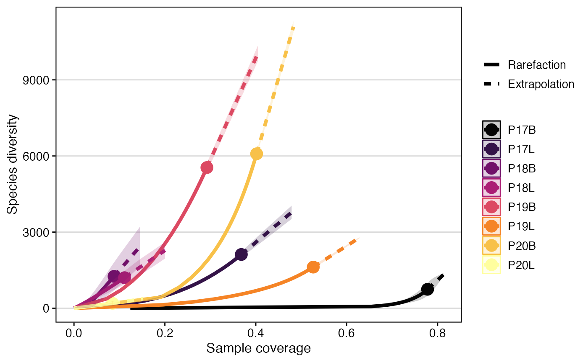

#### Rarefaction using Shannon Diversity (q = 1)

``` r
clonalRarefaction(combined.TCR,
                  plot.type = 1,
                  hill.numbers = 1,
                  n.boots = 2)
```

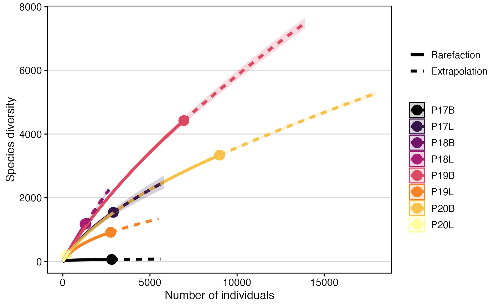

``` r
clonalRarefaction(combined.TCR,
                  plot.type = 2,
                  hill.numbers = 1,
                  n.boots = 2)
```

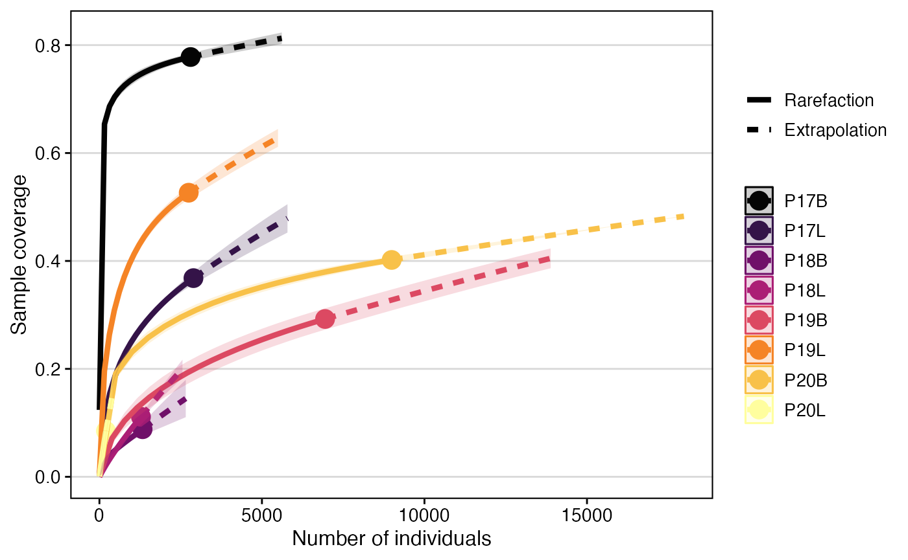

``` r
clonalRarefaction(combined.TCR,
                  plot.type = 3,
                  hill.numbers = 1,
                  n.boots = 2)
```

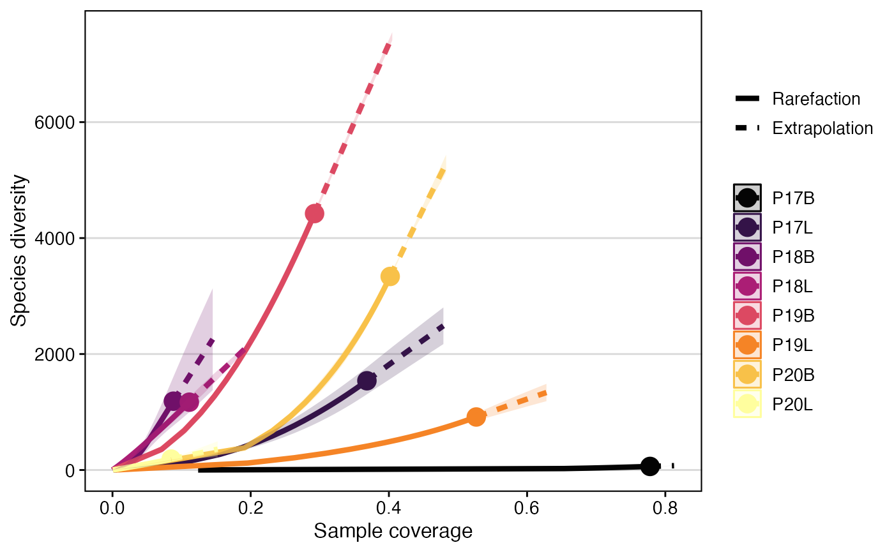

[`clonalRarefaction()`](https://www.borch.dev/uploads/scRepertoire/reference/clonalRarefaction.md)
provides robust estimates of immune repertoire diversity, allowing for
comparison of richness and effective diversity across samples, even with
varying sequencing depths. By visualizing rarefaction and extrapolation
curves, researchers can assess the completeness of their sampling and
make fair comparisons of diversity, which is essential for understanding
immune complexity.

### clonalSizeDistribution: Modeling Clonal Composition

Another method for modeling the repertoire distribution is a discrete
gamma-GPD spliced threshold model, proposed by [Koch et
al.](https://pubmed.ncbi.nlm.nih.gov/30485278/) The spliced model models
the repertoire and allows for the application of a power law
distribution for larger clonal-expanded sequences and a Poisson
distribution for smaller clones. After fitting the models, repertoires
can be compared using Euclidean distance. If using this function, please
read/cite [Koch et al.](https://pubmed.ncbi.nlm.nih.gov/30485278/) and
check out the
[powerTCR](https://bioconductor.org/packages/release/bioc/html/powerTCR.html)
R package.

Key Parameter(s) for
[`clonalSizeDistribution()`](https://www.borch.dev/uploads/scRepertoire/reference/clonalSizeDistribution.md)

- `method`: The agglomeration method for hierarchical clustering (e.g.,
  “ward.D2”).

To model the clonal size distribution using amino acid clone calls and
hierarchical clustering with the “ward.D2” method:

``` r
clonalSizeDistribution(combined.TCR, 
                       cloneCall = "aa", 
                       method= "ward.D2")
```

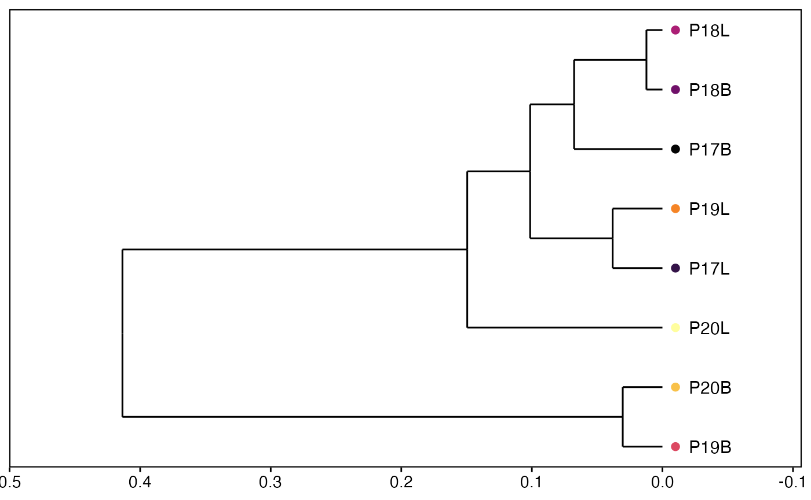

[`clonalSizeDistribution()`](https://www.borch.dev/uploads/scRepertoire/reference/clonalSizeDistribution.md)
offers a sophisticated approach to modeling immune repertoire
composition, distinguishing between the distribution of rare and
expanded clones. By applying a spliced statistical model, it provides a
more accurate representation of the repertoire’s underlying clonal
architecture, enabling robust comparisons and a deeper understanding of
immune system dynamics.

### clonalOverlap: Exploring Sequence Overlap

If you are interested in measures of similarity between the samples
loaded into scRepertoire, using
[`clonalOverlap()`](https://www.borch.dev/uploads/scRepertoire/reference/clonalOverlap.md)
can assist in the visualization. The underlying
[`clonalOverlap()`](https://www.borch.dev/uploads/scRepertoire/reference/clonalOverlap.md)
calculation varies by the `method` parameter.

#### `method` Parameters for `clonalOverlap()`

- `overlap` - Overlap coefficient
- `morisita` - Morisita’s overlap index
- `jaccard` - Jaccard index
- `cosine` - Cosine similarity
- `raw` - Exact number of overlapping clones

To calculate and visualize the Morisita overlap index using strict clone
calls:

``` r
clonalOverlap(combined.TCR, 
              cloneCall = "strict", 
              method = "morisita")
```

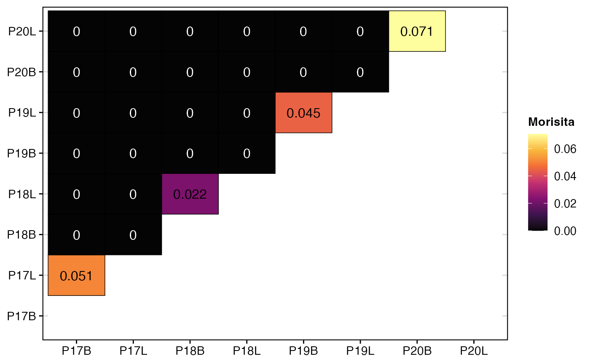

To calculate and visualize the raw number of overlapping clones using
strict clone calls:

``` r
clonalOverlap(combined.TCR, 
              cloneCall = "strict", 
              method = "raw")
```

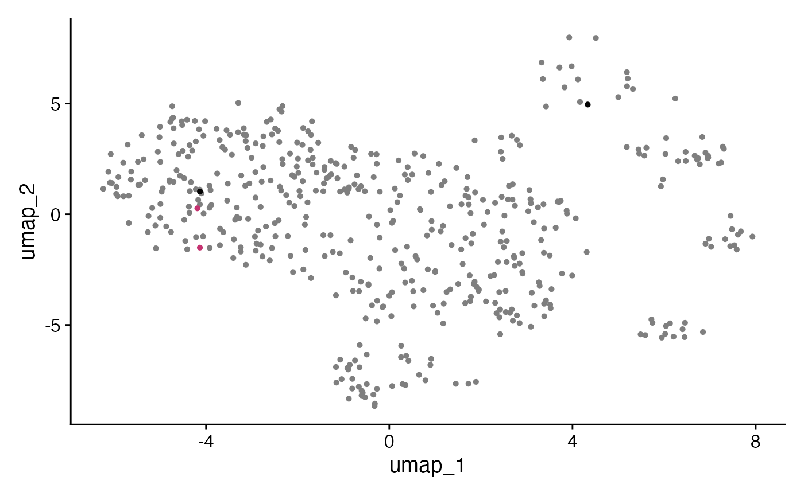

[`clonalOverlap()`](https://www.borch.dev/uploads/scRepertoire/reference/clonalOverlap.md)
is a tool for assessing the similarity and shared clonotypes between
different immune repertoires. By offering various quantitative methods
and a clear heatmap visualization, it allows researchers to identify the
degree of overlap, providing insights into shared immune responses,
cross-reactivity, or the impact of different treatments on clonal
composition.

------------------------------------------------------------------------

## Combining Clones and Single-Cell Objects

The data in the scRepertoire package is derived from a
[study](https://pubmed.ncbi.nlm.nih.gov/33622974/) of acute respiratory
stress disorder in the context of bacterial and COVID-19 infections. The
internal single cell data
([`scRep_example()`](https://www.borch.dev/uploads/scRepertoire/reference/scRep_example.md))
built in to scRepertoire is randomly sampled 500 cells from the fully
integrated Seurat object to minimize the package size. We will use both
Seurat and Single-Cell Experiment (SCE) with scater to perform further
visualizations in tandem.

### Preprocessed Single-Cell Object

``` r
scRep_example <- get(data("scRep_example"))

#Making a Single-Cell Experiment object
sce <- Seurat::as.SingleCellExperiment(scRep_example)

#Adding patient information
scRep_example$Patient <- substr(scRep_example$orig.ident, 1,3)

#Adding type information
scRep_example$Type <- substr(scRep_example$orig.ident, 4,4)
```

### Note on Dimensional Reduction

In single-cell RNA sequencing workflows, dimensional reduction is
typically performed by first identifying highly variable features. These
features are then used directly for UMAP/tSNE projection or as inputs
for principal component analysis. The same approach is commonly applied
to clustering as well.

However, in immune-focused datasets, VDJ genes from TCR and BCR are
often among the most variable genes. This variability arises naturally
due to clonal expansion and diversity within lymphocytes. As a result,
UMAP projections and clustering outcomes may be influenced by clonal
information rather than broader transcriptional differences across cell
types.

To mitigate this issue, a common strategy is to exclude VDJ genes from
the set of highly variable features before proceeding with clustering
and dimensional reduction. We introduce a set of functions that
facilitate this process by removing VDJ-related genes from either a
Seurat Object or a vector of gene names (useful for SCE-based
workflows).

#### Functions to Exclude VDJ Genes

- [`quietVDJgenes()`](https://www.borch.dev/uploads/scRepertoire/reference/quietVDJgenes.md)
  – Removes both TCR and BCR VDJ genes.
- [`quietTCRgenes()`](https://www.borch.dev/uploads/scRepertoire/reference/quietVDJgenes.md)
  – Removes only TCR VDJ genes.
- [`quietBCRgenes()`](https://www.borch.dev/uploads/scRepertoire/reference/quietVDJgenes.md)
  – Removes only BCR VDJ genes, but retains BCR VDJ pseudogenes in the
  variable features.

Let’s first check the top 10 variable features in the scRep_example
Seurat object before any removal:

``` r
# Check the first 10 variable features before removal
VariableFeatures(scRep_example)[1:10]
```

    ##  [1] "TRBV7-2"  "HSPA1B"   "HSPA1A"   "TRBV4-1"  "CCL4"     "TRBV5-1" 
    ##  [7] "TRBV10-3" "TRBV3-1"  "TRBV6-6"  "CD79A"

Now, we’ll remove TCR VDJ genes from the scRep_example object:

``` r
# Remove TCR VDJ genes
scRep_example <- quietTCRgenes(scRep_example)

# Check the first 10 variable features after removal
VariableFeatures(scRep_example)[1:10]
```

    ##  [1] "HSPA1B"  "HSPA1A"  "CCL4"    "CD79A"   "HLA-DRA" "CCL20"   "TUBA1B" 
    ##  [8] "HSPA6"   "TNF"     "MS4A1"

By applying these functions, you can ensure that clustering and
dimensional reduction are driven by broader transcriptomic differences
across cell types rather than being skewed by the inherent variability
due to clonal expansion. This provides a more accurate representation of
cellular heterogeneity independent of clonal lineage.

### Preprocessed Single-Cell Object

The data in the `scRepertoire` package is derived from a
[study](https://pubmed.ncbi.nlm.nih.gov/33622974/) of acute respiratory
stress disorder in the context of bacterial and COVID-19 infections. The
internal single cell data
([`scRep_example()`](https://www.borch.dev/uploads/scRepertoire/reference/scRep_example.md))
built in to scRepertoire is randomly sampled 500 cells from the fully
integrated Seurat object to minimize the package size. However, for the
purpose of the vignette we will use the full single-cell object with
30,000 cells. We will use both Seurat and Single-Cell Experiment (SCE)
with `scater` to perform further visualizations in tandem.

### combineExpression

After processing the contig data into clones via
[`combineBCR()`](https://www.borch.dev/uploads/scRepertoire/reference/combineBCR.md)
or
[`combineTCR()`](https://www.borch.dev/uploads/scRepertoire/reference/combineTCR.md),
we can add the clonal information to the single-cell object using
[`combineExpression()`](https://www.borch.dev/uploads/scRepertoire/reference/combineExpression.md).

**Importantly**, the major requirement for the attachment is matching
contig cell barcodes and barcodes in the row names of the metadata of
the Seurat or Single-Cell Experiment object. If these do not match, the
attachment will fail. We suggest making changes to the single-cell
object barcodes for ease of use.

#### Calculating `cloneSize`

Part of
[`combineExpression()`](https://www.borch.dev/uploads/scRepertoire/reference/combineExpression.md)
is calculating the clonal frequency and proportion, placing each clone
into groups called `cloneSize`. The default `cloneSize` argument uses
the following bins:
`c(Rare = 1e-4, Small = 0.001, Medium = 0.01, Large = 0.1, Hyperexpanded = 1)`,
which can be modified to include more/less bins or different names.

Clonal frequency and proportion are dependent on the repertoires being
compared. You can modify the calculation using the `group.by` parameter,
such as grouping by a Patient variable. If `group.by` is not set,
[`combineExpression()`](https://www.borch.dev/uploads/scRepertoire/reference/combineExpression.md)
will calculate clonal frequency, proportion, and `cloneSize` as a
function of individual sequencing runs. Additionally, `cloneSize` can
use the frequency of clones when `proportion = FALSE`.

Key Parameter(s) for
[`combineExpression()`](https://www.borch.dev/uploads/scRepertoire/reference/combineExpression.md)

- `input.data`: The product of
  [`combineTCR()`](https://www.borch.dev/uploads/scRepertoire/reference/combineTCR.md),
  [`combineBCR()`](https://www.borch.dev/uploads/scRepertoire/reference/combineBCR.md),
  or a list containing both.
- `sc.data`: The Seurat or Single-Cell Experiment (SCE) object to attach
  the clonal data to.
- `proportion`: If `TRUE` (default), calculates the proportion of the
  clone; if `FALSE`, calculates total frequency.
- `cloneSize`: Bins for grouping based on proportion or frequency. If
  proportion is `FALSE` and cloneSize bins are not set high enough, the
  upper limit will automatically adjust.
- `filterNA`: Method to subset the Seurat/SCE object of barcodes without
  clone information.
- `addLabel`: Adds a label to the frequency header, useful for trying
  multiple group.by variables or recalculating frequencies after
  subsetting.

We can look at the default cloneSize groupings using the Single-Cell
Experiment object we just created, with group.by set to the sample
variable used in combineTCR():

``` r
sce <- combineExpression(combined.TCR, 
                         sce, 
                         cloneCall="gene", 
                         group.by = "sample", 
                         proportion = TRUE)

#Define color palette 
colorblind_vector <- hcl.colors(n=7, palette = "inferno", fixup = TRUE)

plotUMAP(sce, colour_by = "cloneSize") +
    scale_color_manual(values=rev(colorblind_vector[c(1,3,5,7)]))
```

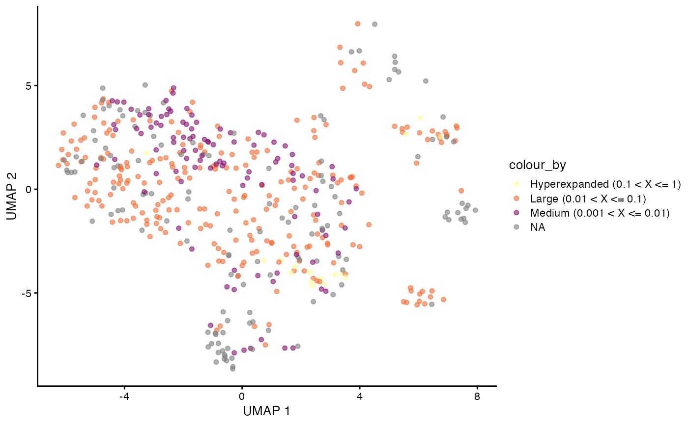

Alternatively, if we want `cloneSize` to be based on the frequency of
the clone, we can set proportion = FALSE and will need to change the
`cloneSize` bins to integers. If we haven’t inspected our clone data,
setting the upper limit of the clonal frequency might be difficult;
[`combineExpression()`](https://www.borch.dev/uploads/scRepertoire/reference/combineExpression.md)
will automatically adjust the upper limit to fit the distribution of the
frequencies.

``` r
scRep_example <- combineExpression(combined.TCR, 
                                   scRep_example, 
                                   cloneCall="gene", 
                                   group.by = "sample", 
                                   proportion = FALSE, 
                                   cloneSize=c(Single=1, Small=5, Medium=20, Large=100, Hyperexpanded=500))

# Bug in Seurat 5.3.1 no longer handles NA for DimPlot
# Will Update in Future Commits

# Seurat::DimPlot(scRep_example, group.by = "cloneSize") +
#    scale_color_manual(values=rev(colorblind_vector[c(1,3,4,5,7)]))
```

#### Combining both TCR and BCR

If you have both TCR and BCR enrichment data, or wish to include
information for both gamma-delta and alpha-beta T cells, you can create
a single list containing the outputs of
[`combineTCR()`](https://www.borch.dev/uploads/scRepertoire/reference/combineTCR.md)
and
[`combineBCR()`](https://www.borch.dev/uploads/scRepertoire/reference/combineBCR.md)
and then use
[`combineExpression()`](https://www.borch.dev/uploads/scRepertoire/reference/combineExpression.md).

**Major Note**: If there are duplicate barcodes (e.g., if a cell has
both Ig and TCR information), the immune receptor information will not
be added for those cells. It might be worth checking cluster identities
and removing incongruent barcodes in the products of
[`combineTCR()`](https://www.borch.dev/uploads/scRepertoire/reference/combineTCR.md)
and
[`combineBCR()`](https://www.borch.dev/uploads/scRepertoire/reference/combineBCR.md).
As an anecdote, the [testing
data](https://support.10xgenomics.com/single-cell-vdj/datasets/6.0.1/SC5v2_Melanoma_5Kcells_Connect_single_channel_SC5v2_Melanoma_5Kcells_Connect_single_channel)
used to improve this function showed 5-6% barcode overlap.

``` r
#This is an example of the process, which will not be evaluated during knit
TCR <- combineTCR(...)
BCR <- combineBCR(...)
list.receptors <- c(TCR, BCR)


seurat <- combineExpression(list.receptors, 
                            seurat, 
                            cloneCall="gene", 
                            proportion = TRUE)
```

[`combineExpression()`](https://www.borch.dev/uploads/scRepertoire/reference/combineExpression.md)
is a core function in `scRepertoire` that bridges the immune repertoire
data with single-cell gene expression data. It enriches your Seurat or
SCE object with crucial clonal information, including calculated
frequencies and proportions, allowing for integrated analysis of
cellular identity and clonal dynamics. Its flexibility in defining
`cloneSize` and handling various grouping scenarios makes it adaptable
to diverse experimental designs, even accommodating the integration of
both TCR and BCR data.

------------------------------------------------------------------------

## Visualizations for Single-Cell Objects

### clonalOverlay

Using the dimensional reduction graphs as a reference,
[`clonalOverlay()`](https://www.borch.dev/uploads/scRepertoire/reference/clonalOverlay.md)
generates an overlay of the positions of clonally-expanded cells. It
highlights areas of high clonal frequency or proportion on your UMAP or
tSNE plots.

Key Parameters for clonalOverlay()

- `sc.data`: The single-cell object
  after[`combineExpression()`](https://www.borch.dev/uploads/scRepertoire/reference/combineExpression.md).
- `reduction`: The dimensional reduction to visualize (e.g., “umap”,
  “pca”). Default is “pca”.
- `cut.category`: The metadata variable to use for filtering the overlay
  (e.g., “clonalFrequency” or “clonalProportion”).
- `cutpoint`: The lowest clonal frequency or proportion to include in
  the contour plot.
- `bins`: The number of contours to draw.

[`clonalOverlay()`](https://www.borch.dev/uploads/scRepertoire/reference/clonalOverlay.md)
can be used to look across all cells or faceted by a metadata variable
using `facet.by`. The overall dimensional reduction will be maintained
as we facet, while the contour plots will adjust based on the `facet.by`
variable. The coloring of the dot plot is based on the active identity
of the single-cell object.

This visualization was authored by Dr. Francesco Mazziotta and inspired
by Drs. Carmona and Andreatta and their work with
[ProjectTIL](https://github.com/carmonalab/ProjecTILs), a pipeline for
annotating T cell subtypes.

``` r
clonalOverlay(scRep_example, 
              reduction = "umap", 
              cutpoint = 1, 
              bins = 10, 
              facet.by = "Patient") + 
              guides(color = "none")
```

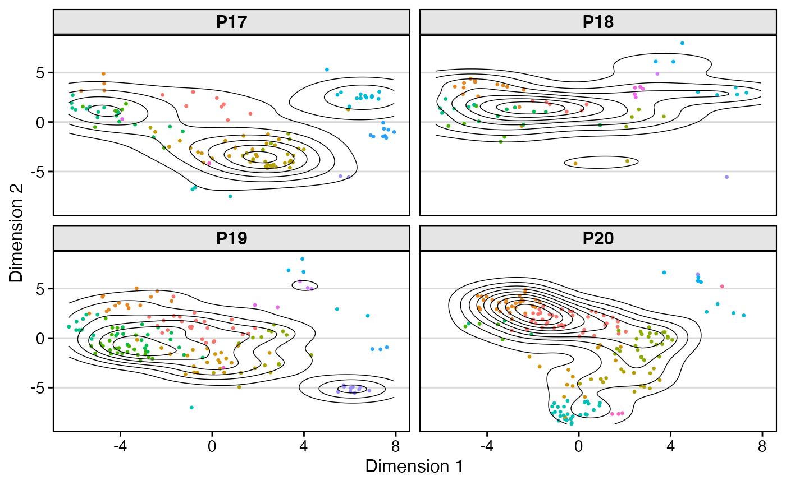

### clonalNetwork

Similar to
[`clonalOverlay()`](https://www.borch.dev/uploads/scRepertoire/reference/clonalOverlay.md),
[`clonalNetwork()`](https://www.borch.dev/uploads/scRepertoire/reference/clonalNetwork.md)
visualizes the network interaction of clones shared between clusters
along the single-cell dimensional reduction. This function shows the
relative proportion of clones flowing from a starting node, with the
ending node indicated by an arrow

#### Filtering Options for clonalNetwork()

- `filter.clones`:
  - Select a number to isolate the clones comprising the top n number of
    cells (e.g., `filter.clones = 2000`).
  - Select `min` to scale all groups to the size of the minimum group.
- `filter.identity`: For the identity chosen to visualize, show the “to”
  and “from” network connections for a single group.
- `filter.proportion`: Remove clones from the network that comprise less
  than a certain proportion of clones in groups.
- `filter.graph`: Remove reciprocal edges from one half of the graph,
  allowing for cleaner visualization.

Now, visualize the clonal network with no specific identity filter:

``` r
#ggraph needs to be loaded due to issues with ggplot
library(ggraph)

#No Identity filter
clonalNetwork(scRep_example, 
              reduction = "umap", 
              group.by = "seurat_clusters",
              filter.clones = NULL,
              filter.identity = NULL,
              cloneCall = "aa")
```

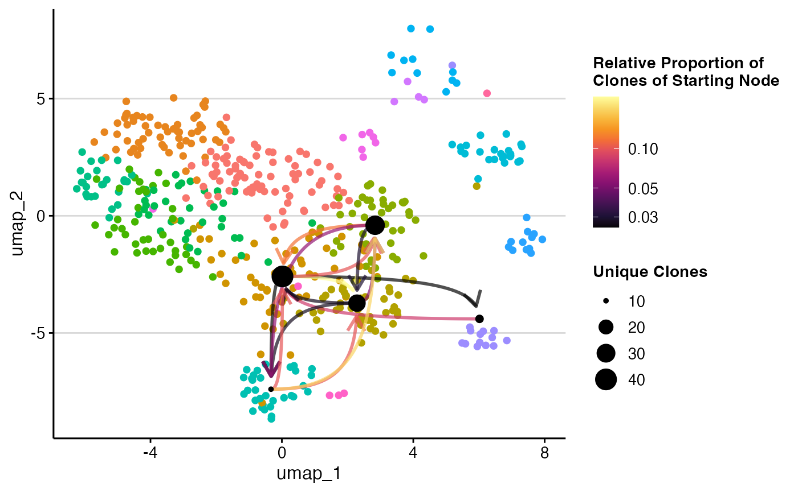

We can look at the clonal relationships relative to a single cluster
using the `filter.identity` parameter. For example, focusing on Cluster
3:

``` r
#Examining Cluster 3 only
clonalNetwork(scRep_example, 
              reduction = "umap", 
              group.by = "seurat_clusters",
              filter.identity = 3,
              cloneCall = "aa")
```

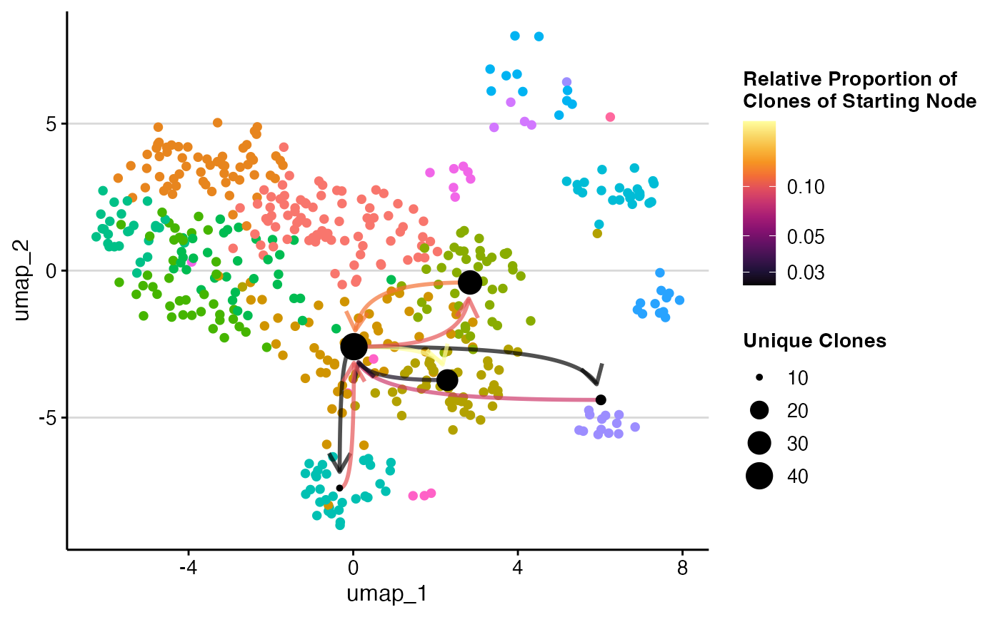

You can also use the `exportClones` parameter to quickly get clones that
are shared across multiple identity groups, along with the total number
of clone copies in the dataset.

``` r
shared.clones <- clonalNetwork(scRep_example, 
                               reduction = "umap", 
                               group.by = "seurat_clusters",
                               cloneCall = "aa", 
                               exportClones = TRUE)
head(shared.clones)
```

    ## # A tibble: 6 × 2
    ##   clone                                sum
    ##   <fct>                              <int>
    ## 1 CVVSDNTGGFKTIF_CASSVRRERANTGELFF      11
    ## 2 CAELNQAGTALIF_CASSQAPFSTSGELFF         3
    ## 3 CASLSGSARQLTF_CASSSTVAGEQYF            3
    ## 4 NA_CASSVRRERANTGELFF                   3
    ## 5 CAERGSGGSYIPTF_CASSDPSGRQGPRWDTQYF     2
    ## 6 CAGAAETSGSRLTF_CASSRLRTGALYEQYF        2

### highlightClones

The
[`highlightClones()`](https://www.borch.dev/uploads/scRepertoire/reference/highlightClones.md)
function allows you to specifically visualize the distribution of
particular clonal sequences on your single-cell dimensional reduction
plots. This helps in tracking the location and expansion of clones of
interest.

Key Parameters for
[`highlightClones()`](https://www.borch.dev/uploads/scRepertoire/reference/highlightClones.md)

- `cloneCall`: The type of sequence to use for highlighting (e.g., “aa”,
  “nt”, “strict”).
- `sequence`: A character vector of the specific clonal sequences to
  highlight.

To highlight the most prominent amino acid sequences:
*CAERGSGGSYIPTF_CASSDPSGRQGPRWDTQYF* and *CARKVRDSSYKLIF_CASSDSGYNEQFF*:

``` r
scRep_example <- highlightClones(scRep_example, 
                    cloneCall= "aa", 
                    sequence = c("CAERGSGGSYIPTF_CASSDPSGRQGPRWDTQYF", 
                                 "CARKVRDSSYKLIF_CASSDSGYNEQFF"))

# Bug in Seurat 5.3.1 no longer handles NA for DimPlot
# Will Update in Future Commits

# Seurat::DimPlot(scRep_example, group.by = "highlight") + 
#   guides(color=guide_legend(nrow=3,byrow=TRUE)) + 
#   ggplot2::theme(plot.title = element_blank(), 
#                 legend.position = "bottom")
```

### clonalOccupy

[`clonalOccupy()`](https://www.borch.dev/uploads/scRepertoire/reference/clonalOccupy.md)
visualizes the count of cells by cluster, categorized into specific
clonal frequency ranges. It uses the cloneSize metadata variable
(generated by
[`combineExpression()`](https://www.borch.dev/uploads/scRepertoire/reference/combineExpression.md))
to plot the number of cells within each clonal expansion designation,
using a secondary variable like cluster. Credit for the idea goes to
Drs. Carmona and Andreatta.

Key Parameters for
[`clonalOccupy()`](https://www.borch.dev/uploads/scRepertoire/reference/clonalOccupy.md)
\* `x.axis`: The variable in the metadata to graph along the x-axis
(e.g., “seurat_clusters”, “ident”). \* `label`: If TRUE, includes the
number of clones in each category by x.axis variable. \* `proportion`:
If TRUE, converts the stacked bars into relative proportions. \*
`na.include`: If TRUE, visualizes NA values.

To visualize the count of cells by `seurat_clusters` based on
`cloneSize` groupings:

``` r
clonalOccupy(scRep_example, 
              x.axis = "seurat_clusters")
```

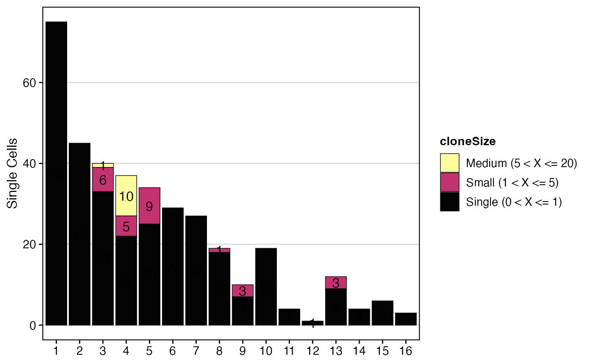

To visualize the proportion of cells by `ident` (active identity),
without labels:

``` r
clonalOccupy(scRep_example, 
             x.axis = "ident", 
             proportion = TRUE, 
             label = FALSE)
```

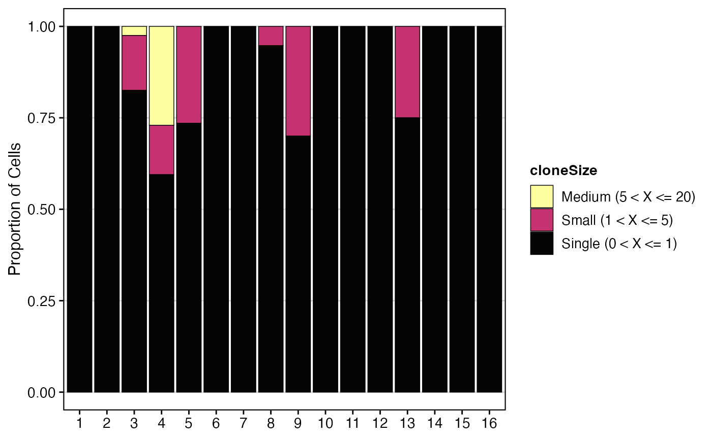

### alluvialClones

After the metadata has been modified with clonal information,
[`alluvialClones()`](https://www.borch.dev/uploads/scRepertoire/reference/alluvialClones.md)
allows you to look at clones across multiple categorical variables,
enabling the examination of the interchange between these variables.
Because this function produces a graph with each clone arranged by
called stratification, it may take some time depending on the size of
the repertoire.

Key Parameters for
[`alluvialClones()`](https://www.borch.dev/uploads/scRepertoire/reference/alluvialClones.md)

- `y.axes`: The columns that will separate the proportional
  visualizations.
- `color`: The column header or clone(s) to be highlighted.
- `facet`: The column label to separate facets.
- `alpha`: The column header to have gradated opacity.
- `top.clones`: Show only the top N clones by frequency.
- `min.freq`: Minimum frequency threshold for displaying flows.
- `highlight.clones`: Character vector of specific clone sequences to
  highlight.
- `highlight.color`: Color to use for highlighted clones (default:
  “red”).

#### Basic Alluvial Plot

To visualize clonal flow across “Patient”, “ident”, and “Type”,
highlighting specific amino acid clones:

``` r
alluvialClones(scRep_example,
               clone.call = "aa",
               y.axes = c("Patient", "ident", "Type"),
               color = c("CVVSDNTGGFKTIF_CASSVRRERANTGELFF", "NA_CASSVRRERANTGELFF")) +
    scale_fill_manual(values = c("grey", colorblind_vector[3]))
```

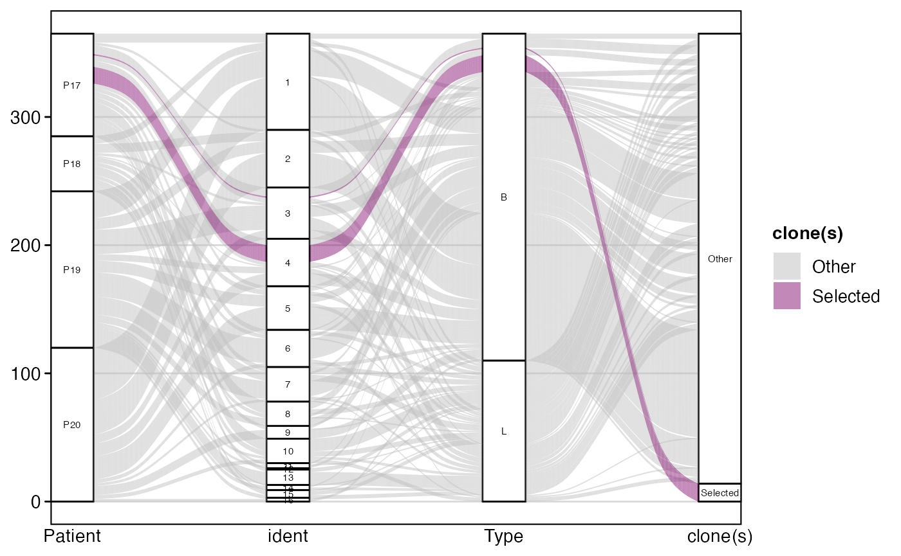

To visualize clonal flow across “Patient”, “ident”, and “Type”, coloring
by “ident”:

``` r
alluvialClones(scRep_example,
               clone.call = "gene",
               y.axes = c("Patient", "ident", "Type"),
               color = "ident")
```

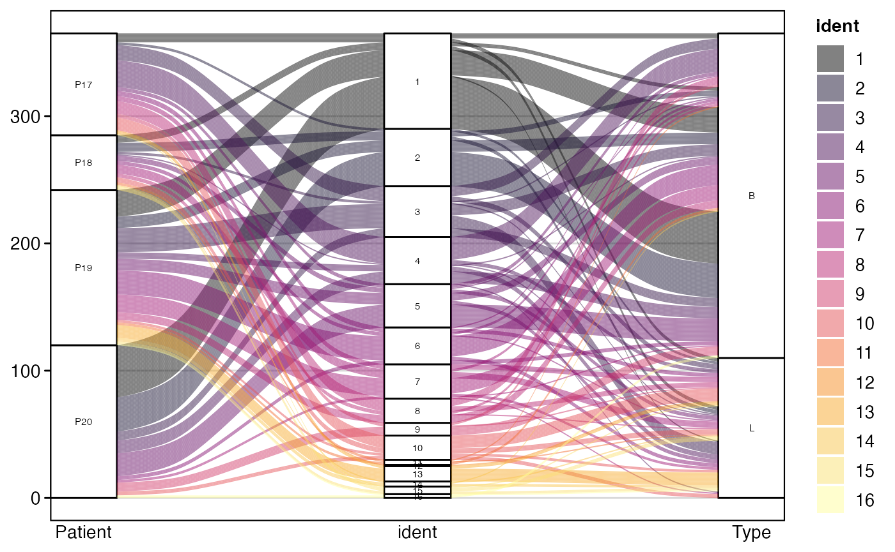

#### Filtering to Top Clones

When working with large repertoires, it can be helpful to focus on the
most frequent clones. The `top.clones` parameter allows you to filter to
the top N clones:

``` r
alluvialClones(scRep_example,
               clone.call = "aa",
               y.axes = c("Patient", "ident"),
               top.clones = 25,
               color = "ident")
```

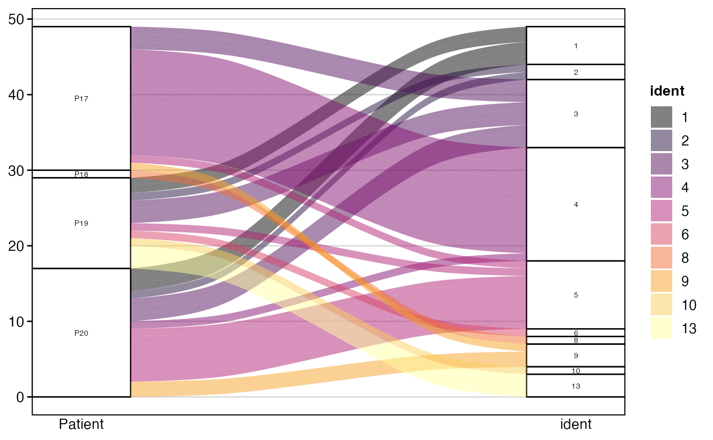

#### Highlighting Specific Clones

Use `highlight.clones` to call out specific clones of interest while
showing the context of other clones:

``` r
alluvialClones(scRep_example,
               clone.call = "aa",
               y.axes = c("Patient", "ident", "Type"),
               highlight.clones = c("CVVSDNTGGFKTIF_CASSVRRERANTGELFF"),
               highlight.color = "red")
```

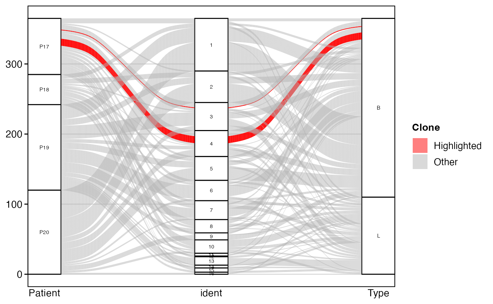

#### Visual Customization

Fine-tune the appearance with parameters like `stratum.width`,
`flow.alpha`, and `label.size`:

``` r
alluvialClones(scRep_example,
               clone.call = "gene",
               y.axes = c("Patient", "ident"),
               color = "ident",
               stratum.width = 0.3,
               flow.alpha = 0.7,
               label.size = 3)
```

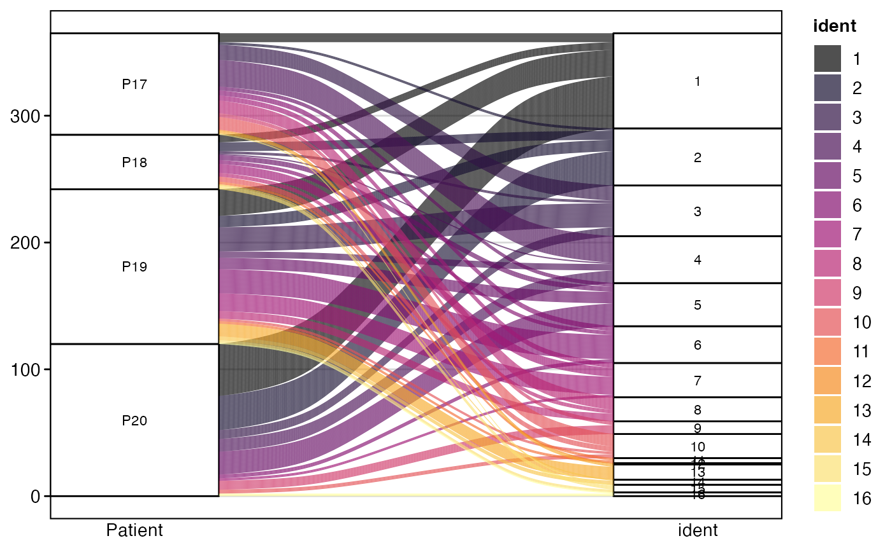

[`alluvialClones()`](https://www.borch.dev/uploads/scRepertoire/reference/alluvialClones.md)
provides a visual representation of clonal distribution and movement
across multiple categorical annotations. It is particularly effective
for tracking how specific clones or clonal groups transition between
different states, tissues, or cell types, offering a dynamic perspective
on immune repertoire evolution and function.

### getCirclize and vizCirclize

Like alluvial graphs, we can also visualize the interconnection of
clusters using chord diagrams from the [circlize R
package](https://jokergoo.github.io/circlize_book/book/). scRepertoire
provides two functions for this:

- [`getCirclize()`](https://www.borch.dev/uploads/scRepertoire/reference/getCirclize.md) -
  Generates data for use with the circlize package
- [`vizCirclize()`](https://www.borch.dev/uploads/scRepertoire/reference/vizCirclize.md) -
  A convenient wrapper that handles the circlize plotting automatically

These functions calculate the relative number of unique and shared
clones based on the `group.by` variable using the product of
[`combineExpression()`](https://www.borch.dev/uploads/scRepertoire/reference/combineExpression.md).
If using the downstream `circlize` R package, please read and cite the
following [manuscript](https://pubmed.ncbi.nlm.nih.gov/24930139/).

Key Parameters for
[`getCirclize()`](https://www.borch.dev/uploads/scRepertoire/reference/getCirclize.md)
and
[`vizCirclize()`](https://www.borch.dev/uploads/scRepertoire/reference/vizCirclize.md)

- `group.by`: A column header (or vector of column headers for
  hierarchical grouping).
- `method`: The method for calculating link values: `"unique"`
  (default), `"jaccard"`, or `"overlap"`.
- `proportion`: If `TRUE`, normalizes the relationship by proportion; if
  `FALSE` (default), uses unique clone counts.
- `include.self`: If `TRUE`, includes counting clones within a single
  group comparison.
- `min.shared`: Minimum number of shared clones to include a link.

#### Quick Visualization with vizCirclize

The simplest way to create a chord diagram is using
[`vizCirclize()`](https://www.borch.dev/uploads/scRepertoire/reference/vizCirclize.md):

``` r
library(circlize)
library(scales)

vizCirclize(scRep_example,
            group.by = "seurat_clusters",
            clone.call = "aa")
```


#### Manual Control with getCirclize

For more control over the visualization, use
[`getCirclize()`](https://www.borch.dev/uploads/scRepertoire/reference/getCirclize.md)
to generate the data and then plot with circlize directly. By default,
[`getCirclize()`](https://www.borch.dev/uploads/scRepertoire/reference/getCirclize.md)
returns a simple data frame:

``` r
circles <- getCirclize(scRep_example,
                       group.by = "seurat_clusters")

#Just assigning the normal colors to each cluster
grid.cols <- hue_pal()(length(unique(scRep_example$seurat_clusters)))
names(grid.cols) <- unique(scRep_example$seurat_clusters)

#Graphing the chord diagram
chordDiagram(circles, self.link = 1, grid.col = grid.cols)
```

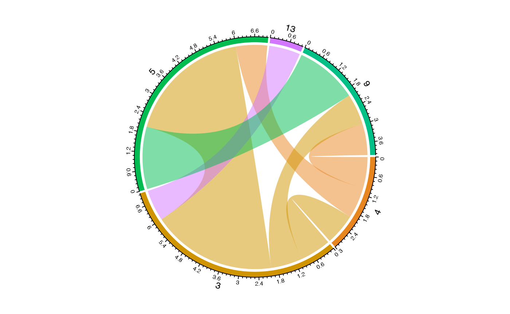

#### Multi-Level Hierarchical Grouping

A powerful feature is the ability to create hierarchical groupings by
passing a vector of column names to `group.by`. This creates compound
sector labels:

``` r
vizCirclize(scRep_example,
            group.by = c("Patient", "Type"),
            clone.call = "aa",
            min.shared = 1)
```

#### Directional Flow

Show the direction of clonal sharing with arrows:

``` r
vizCirclize(scRep_example,
            group.by = "seurat_clusters",
            clone.call = "aa",
            directional = TRUE)
```

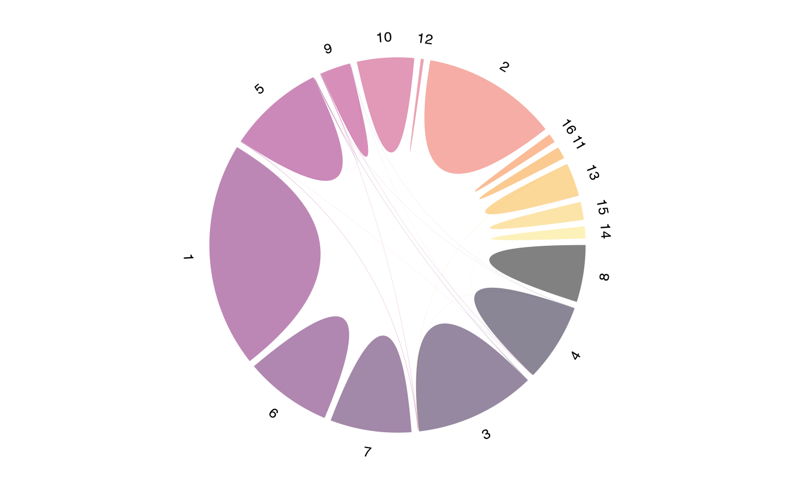

#### Different Similarity Methods

Use different methods for calculating link values:

``` r
# Jaccard similarity
circles.jaccard <- getCirclize(scRep_example,
                               group.by = "seurat_clusters",
                               method = "jaccard",
                               include.metadata = TRUE)

# The include.metadata option returns sector statistics
head(circles.jaccard$sector.stats)
```

    ## NULL

#### Subsetting and Proportion

This can also be used if we want to explore just the lung-specific T
cells by subsetting the single-cell object. For the sake of this
vignette, we can also look at setting `proportion = TRUE` to get a
scaled output.

``` r
subset <- subset(scRep_example, Type == "L")

circles <- getCirclize(subset, group.by = "ident", proportion = TRUE)

grid.cols <- scales::hue_pal()(length(unique(subset@active.ident)))
names(grid.cols) <- levels(subset@active.ident)

chordDiagram(circles,
             self.link = 1,
             grid.col = grid.cols,
             directional = 1,
             direction.type = "arrows",
             link.arr.type = "big.arrow")
```

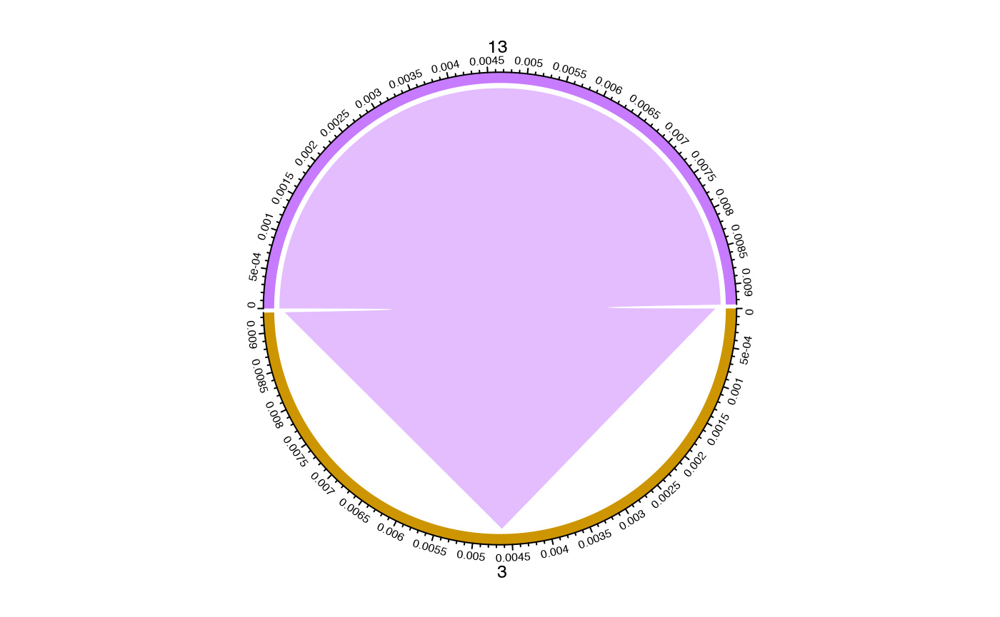

[`getCirclize()`](https://www.borch.dev/uploads/scRepertoire/reference/getCirclize.md)
and
[`vizCirclize()`](https://www.borch.dev/uploads/scRepertoire/reference/vizCirclize.md)
facilitate the creation of visually striking and informative chord
diagrams to represent shared clonal relationships between distinct
groups within your single-cell data. By providing a flexible way to
quantify and format clonal overlap, they enable researchers to
effectively illustrate complex clonal connectivity patterns, which are
crucial for understanding immune communication and migration.

------------------------------------------------------------------------

## Quantifying Clonal Bias

### StartracDiversity

From the excellent work by [Zhang et al. (2018,
Nature)](https://www.nature.com/articles/s41586-018-0694-x), the authors
introduced new methods for looking at clones by cellular origins and
cluster identification. We strongly recommend you read and cite their
publication when using this function.

To use the
[`StartracDiversity()`](https://www.borch.dev/uploads/scRepertoire/reference/StartracDiversity.md)
function, you need the output of the
[`combineExpression()`](https://www.borch.dev/uploads/scRepertoire/reference/combineExpression.md)
function and a column in your metadata that specifies the tissue of
origin.

#### Indices Output from `StartracDiversity()`

- `expa` - Clonal Expansion. Measures the degree of clonal proliferation
  within a given cell cluster. It is calculated as
  `1 - normalized Shannon entropy`, where a higher value indicates that
  a few clones dominate the cluster.  
- `migr` - Cross-tissue Migration. Quantifies the movement of clonal T
  cells between different tissues, as defined by the `type` parameter.
  This index is based on the entropy of a single clonotype’s
  distribution across the specified tissues.  
- `tran` - State Transition. Measures the developmental transition of T
  cell clones between different functional clusters. This index is
  calculated from the entropy of a single clonotype’s distribution
  across the cell clusters identified in the data.

Key Parameters for
[`StartracDiversity()`](https://www.borch.dev/uploads/scRepertoire/reference/StartracDiversity.md)

- `type`: The variable in the metadata that provides tissue type.
- `group.by`: A column header in the metadata to group the analysis by
  (e.g., “sample”, “treatment”).

By default,
[`StartracDiversity()`](https://www.borch.dev/uploads/scRepertoire/reference/StartracDiversity.md)
will calculate all three indices (`expa`, `migr`, and `tran`) for each
cluster and group you define. This provides a comprehensive overview of
the clonal dynamics in your dataset. The output is a three-paneled plot,
with each panel representing one index.

In the example data, `type` corresponds to the “Type” column, which
includes “P” (peripheral blood) and “L” (lung) classifiers. The analysis
is grouped by the “Patient” column.

``` r
# Calculate and plot all three STARTRAC indices
StartracDiversity(scRep_example, 
                  type = "Type", 
                  group.by = "Patient")
```

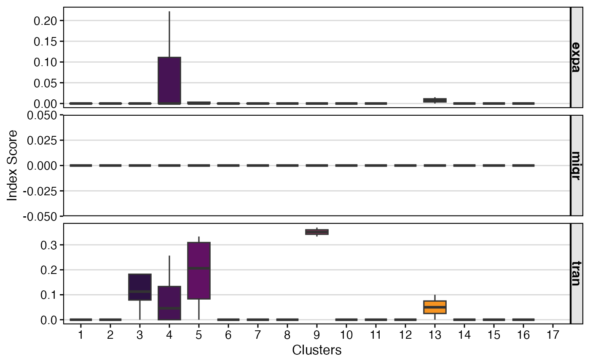

#### Calculating a Single Index

If you’re only interested in one aspect of clonal dynamics, you can
specify it using the `index` parameter. For example, to only calculate
and plot clonal expansion:

``` r
# Calculate and plot only the clonal expansion index
StartracDiversity(scRep_example, 
                  type = "Type", 
                  group.by = "Patient",
                  index = "expa")
```

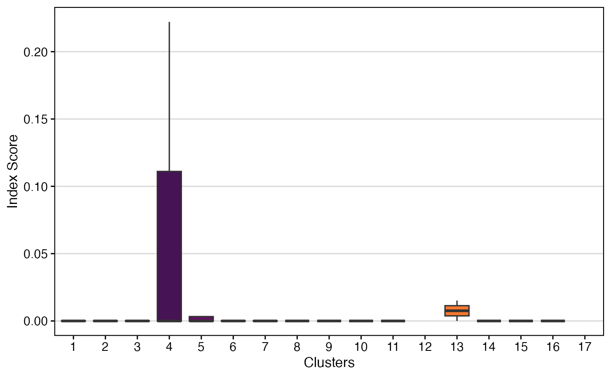

#### Pairwise Migration Analysis

Another feature of
[`StartracDiversity()`](https://www.borch.dev/uploads/scRepertoire/reference/StartracDiversity.md)
is the ability to perform pairwise comparisons. To specifically quantify
the migration between two tissues (e.g., Lung vs. Periphery), set
`index = "migr"` and tell the function which column to use for the
comparison with `pairwise = "Type"`.

``` r
# # Calculate pairwise migration between tissues
StartracDiversity(scRep_example, 
                  type = "Type", 
                  group.by = "Patient",
                  index = "migr",
                  pairwise = "Type")
```

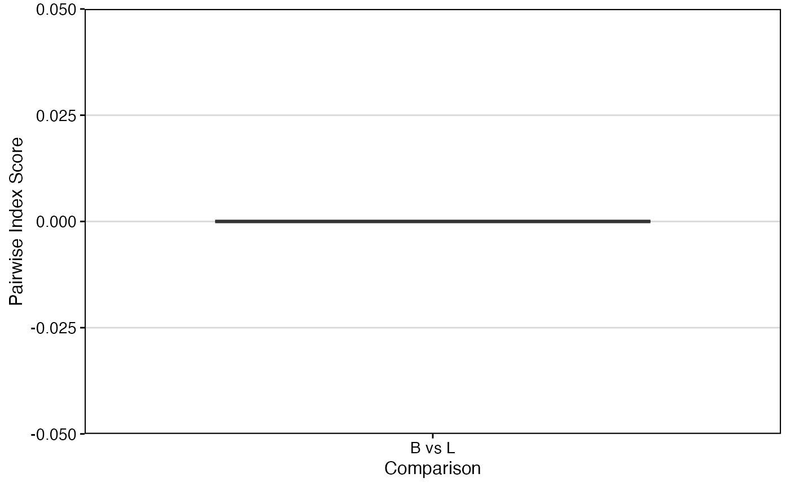

### clonalBias

A new metric proposed by [Massimo et
al](https://pubmed.ncbi.nlm.nih.gov/35829695/),
[`clonalBias()`](https://www.borch.dev/uploads/scRepertoire/reference/clonalBias.md),
like STARTRAC, is a clonal metric that seeks to quantify how individual
clones are skewed towards a specific cellular compartment or cluster. A
clone bias of `1` indicates that a clone is composed of cells from a
single compartment or cluster, while a clone bias of `0` matches the
background subtype distribution. Please read and cite the linked
manuscript if using
[`clonalBias()`](https://www.borch.dev/uploads/scRepertoire/reference/clonalBias.md)

Key Parameter(s) for
[`clonalBias()`](https://www.borch.dev/uploads/scRepertoire/reference/clonalBias.md)

- `group.by`: A column header in the metadata that bias will be based
  on.
- `split.by`: The variable to use for calculating the baseline
  frequencies (e.g., “Type” for lung vs peripheral blood comparison)
- `n.boots`: Number of bootstraps to downsample.
- `min.expand`: Clone frequency cut-off for the purpose of comparison
  (default = 10).

Here we calculate and plot clonal bias using `aa` clone calls, splitting
by “Patient” and grouping by “seurat_clusters”, with a minimum expansion
of 5 and 10 bootstraps:

``` r
clonalBias(scRep_example, 
           cloneCall = "aa", 
           split.by = "Patient", 
           group.by = "seurat_clusters",
           n.boots = 10, 
           min.expand =5)
```

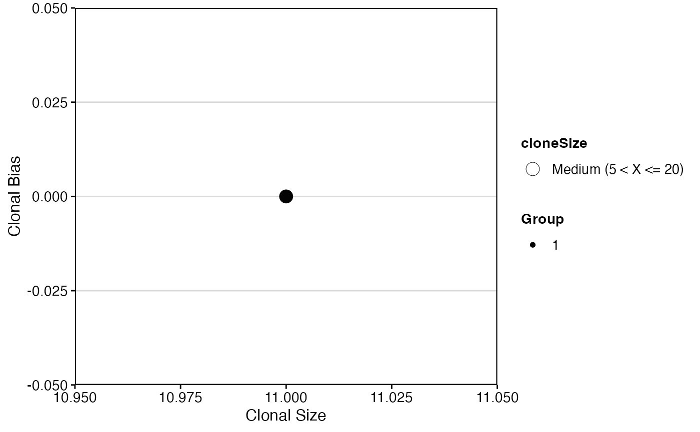

------------------------------------------------------------------------

## Clustering by Edit Distance

### clonalCluster: Cluster by Sequence Similarity

The
[`clonalCluster()`](https://www.borch.dev/uploads/scRepertoire/reference/clonalCluster.md)
function provides a powerful method to group clonotypes based on
sequence similarity. It calculates the edit distance between CDR3
sequences and uses this information to build a network, identifying
closely related clusters of T or B cell receptors. This functionality
allows for a more nuanced definition of a “clone” that extends beyond
identical sequence matches.

#### Core Concepts

The clustering process follows these key steps:

- **Sequence Selection**: The function selects either the nucleotide
  (`sequence = "nt"`) or amino acid (`sequence = "aa"`) CDR3 sequences
  for a specified chain.
- **Distance Calculation**: It calculates the edit distance between all
  pairs of sequences. By default, it also requires sequences to share
  the same V gene (`use.v = TRUE`).
- **Network Construction**: An edge is created between any two sequences
  that meet the similarity threshold, forming a network graph.
- **Clustering**: A graph-based clustering algorithm is run to identify
  connected components or communities within the network. By default, it
  identifies all directly or indirectly connected sequences as a single
  cluster (`cluster.method = "components"`).
- **Output**: The function can either add the resulting cluster IDs to
  the input object, return an `igraph` object for network analysis, or
  export a sparse adjacency matrix.

#### Understanding the `threshold` Parameter

The behavior of the threshold parameter is critical for controlling
cluster granularity:

- **Normalized Similarity (threshold \< 1)**: When the threshold is a
  value between 0 and 1 (e.g., `0.85`), it represents the normalized
  edit distance (Levenshtein distance / mean sequence length). A higher
  value corresponds to a stricter similarity requirement. This is useful
  for comparing sequences of varying lengths.
- **Raw Edit Distance (threshold \>= 1)**: When the threshold is a whole
  number (e.g., 2), it represents the maximum raw edit distance allowed.
  A lower value corresponds to a stricter similarity requirement. This
  is useful when you want to allow a specific number of mutations.

Key Parameter(s) for
[`clonalCluster()`](https://www.borch.dev/uploads/scRepertoire/reference/clonalCluster.md)

- `sequence`: Specifies whether to cluster based on `aa` (amino acid) or
  `nt` (nucleotide) sequences.
- `threshold`: The similarity threshold for clustering. Values `< 1` are
  normalized similarity, while values `>= 1` are raw edit distance.
- `group.by`: A column header in the metadata or lists to group the
  analysis by (e.g., “sample”, “treatment”). If `NULL`, clusters are
  calculated across all sequences.
- `use.V`: If `TRUE`, sequences must share the same V gene to be
  clustered together.
- `use.J`: If `TRUE`, sequences must share the same J gene to be
  clustered together.
- `cluster.method`: The clustering algorithm to use. Defaults to
  `components`, which finds connected subgraphs.
- `cluster.prefix`: A character prefix to add to the cluster names
  (e.g., “cluster.”).
- `exportGraph`: If `TRUE`, returns an igraph object of the sequence
  network.
- `exportAdjMatrix`: If `TRUE`, returns a sparse adjacency matrix
  (dgCMatrix) of the network.

#### Demonstrating Basic Use

To run clustering on the first two samples for the TRA chain, using
amino acid sequences with a normalized similarity threshold of 0.85:

``` r
# Run clustering on the first two samples for the TRA chain
sub_combined <- clonalCluster(combined.TCR[c(1,2)], 
                              chain = "TRA", 
                              sequence = "aa", 
                              threshold = 0.85)

# View the new cluster column
head(sub_combined[[1]][, c("barcode", "TCR1", "TRA.Cluster")])
```

    ##                   barcode TCR1 TRA.Cluster
    ## 1 P17B_AGCGGTCCAAAGGAAG-1 <NA>        <NA>
    ## 2 P17B_GGCTCGAGTCGCGGTT-1 <NA>        <NA>
    ## 3 P17B_CGCGTTTTCGGCTACG-1 <NA>        <NA>
    ## 4 P17B_CACCAGGGTTCCTCCA-1 <NA>        <NA>
    ## 5 P17B_TCTATTGCAGGTGCCT-1 <NA>        <NA>
    ## 6 P17B_GCTGGGTGTACGAAAT-1 <NA>        <NA>

#### Demonstrating Clustering with a Single-Cell Object

You can calculate clusters based on specific metadata variables within a
single-cell object by using the `group.by` parameter. This is useful for
analyzing clusters on a per-sample or per-patient basis without
subsetting the data first.

First, add patient and type information to the `scRep_example` Seurat
object:

``` r
#Adding patient information
scRep_example$Patient <- substr(scRep_example$orig.ident, 1,3)

#Adding type information
scRep_example$Type <- substr(scRep_example$orig.ident, 4,4)
```

Now, run clustering on the `scRep_example` Seurat object, grouping
calculations by “Patient”:

``` r
# Run clustering, but group calculations by "Patient"
scRep_example <- clonalCluster(scRep_example, 
                               chain = "TRA", 
                               sequence = "aa", 
                               threshold = 0.85, 
                               group.by = "Patient")

#Define color palette 
num_clusters <- length(unique(na.omit(scRep_example$TRA.Cluster)))
cluster_colors <- hcl.colors(n = num_clusters, palette = "inferno")

# Bug in Seurat 5.3.1 no longer handles NA for DimPlot
# Will Update in Future Commits

# DimPlot(scRep_example, group.by = "TRA.Cluster") +
#  scale_color_manual(values = cluster_colors, na.value = "grey") + 
#  NoLegend()
```

#### Returning an igraph Object:

Instead of modifying the input object,
[`clonalCluster()`](https://www.borch.dev/uploads/scRepertoire/reference/clonalCluster.md)
can export the underlying network structure for advanced analysis. Set
`exportGraph = TRUE` to get an igraph object consisting of the networks
of barcodes by the indicated clustering scheme.

``` r
set.seed(42)
#Clustering Patient 19 samples
igraph.object <- clonalCluster(combined.TCR[c(5,6)],
                               chain = "TRB",
                               sequence = "aa",
                               group.by = "sample",
                               threshold = 0.85, 
                               exportGraph = TRUE)

#Setting color scheme
col_legend <- factor(igraph::V(igraph.object)$group)
col_samples <- hcl.colors(2,"inferno")[as.numeric(col_legend)]
color.legend <- factor(unique(igraph::V(igraph.object)$group))
sample.vertices <- V(igraph.object)[sample(length(igraph.object), 500)]

subgraph.object <- induced_subgraph(igraph.object, vids = sample.vertices)
V(subgraph.object)$degrees <- igraph::degree(subgraph.object)
edge_alpha_color <- adjustcolor("gray", alpha.f = 0.3)

#Plotting
plot(subgraph.object,
     layout = layout_nicely(subgraph.object),
     vertex.label = NA,
     vertex.size = sqrt(igraph::V(subgraph.object)$degrees), 
     vertex.color = col_samples[sample.vertices],
     vertex.frame.color = "white", 
     edge.color = edge_alpha_color,
     edge.arrow.size = 0.05,
     edge.curved = 0.05, 
     margin = -0.1)
legend("topleft", 
       legend = levels(color.legend), 
       pch = 16, 
       col = unique(col_samples), 
       bty = "n")
```

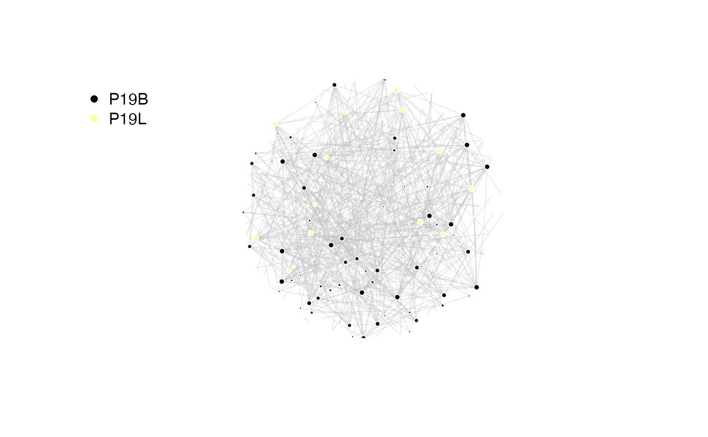

#### Returning a Sparse Adjacency Matrix

For computational applications, you can export a sparse adjacency matrix
using `exportAdjMatrix = TRUE`. This matrix represents the connections
between all barcodes in the input data, with the edit distance that meet
the threshold in places of connection.

``` r
# Generate the sparse matrix
adj.matrix <- clonalCluster(combined.TCR[c(1,2)],
                            chain = "TRB",
                            exportAdjMatrix = TRUE)

# View the dimensions and a snippet of the matrix
dim(adj.matrix)
```

    ## [1] 5698 5698

``` r
print(adj.matrix[1:10, 1:10])
```

    ## 10 x 10 sparse Matrix of class "dgCMatrix"

    ##                                                      
    ## P17B_AGCGGTCCAAAGGAAG-1 . . . .      .      . . . . .
    ## P17B_GGCTCGAGTCGCGGTT-1 . . . .      .      . . . . .
    ## P17B_CGCGTTTTCGGCTACG-1 . . . .      .      . . . . .
    ## P17B_CACCAGGGTTCCTCCA-1 . . . .       1e-06 . . . . .
    ## P17B_TCTATTGCAGGTGCCT-1 . . .  1e-06 .      . . . . .
    ## P17B_GCTGGGTGTACGAAAT-1 . . . .      .      . . . . .
    ## P17B_AGGGTGACATTGGTAC-1 . . . .      .      . . . . .
    ## P17B_GGAACTTCATCGGTTA-1 . . . .      .      . . . . .
    ## P17B_ACGGCCACATCCGTGG-1 . . . .      .      . . . . .
    ## P17B_CACATAGTCCTAAGTG-1 . . . .      .      . . . . .

#### Using Both Chains

You can analyze the combined network of both TRA/TRB or IGH/IGL chains
by setting `chain = "both"`. This will create a single cluster column
named `Multi.Cluster`.

``` r
# Cluster using both TRB and TRA chains simultaneously
clustered_both <- clonalCluster(combined.TCR[c(1,2)], 
                                chain = "both")

# View the new "Multi.Cluster" column
head(clustered_both[[1]][, c("barcode", "TCR1", "TCR2", "Multi.Cluster")])
```

    ##                   barcode TCR1                        TCR2 Multi.Cluster
    ## 1 P17B_AGCGGTCCAAAGGAAG-1 <NA> TRBV10-2.None.TRBJ2-1.TRBC2          <NA>
    ## 2 P17B_GGCTCGAGTCGCGGTT-1 <NA> TRBV10-3.None.TRBJ2-1.TRBC2   cluster.394
    ## 3 P17B_CGCGTTTTCGGCTACG-1 <NA> TRBV11-3.None.TRBJ1-2.TRBC1          <NA>
    ## 4 P17B_CACCAGGGTTCCTCCA-1 <NA> TRBV11-3.None.TRBJ2-3.TRBC2    cluster.23
    ## 5 P17B_TCTATTGCAGGTGCCT-1 <NA> TRBV11-3.None.TRBJ2-3.TRBC2    cluster.23
    ## 6 P17B_GCTGGGTGTACGAAAT-1 <NA> TRBV12-4.None.TRBJ1-2.TRBC1   cluster.262

#### Using Different Clustering Algorithms

While the default `cluster.method = "components"` is robust, you can use
other algorithms from the igraph package, such as `walktrap` or
`louvain`, to potentially uncover different community structures.

``` r
# Cluster using the walktrap algorithm
graph_walktrap <- clonalCluster(combined.TCR[c(1,2)],
                                cluster.method = "walktrap",
                                exportGraph = TRUE)

# Compare the number of clusters found
length(unique(V(graph_walktrap)$cluster))
```

    ## [1] 419

Overall,
[`clonalCluster()`](https://www.borch.dev/uploads/scRepertoire/reference/clonalCluster.md)
is a versatile function for defining and analyzing clonal relationships
based on sequence similarity. It allows researchers to move beyond exact
sequence matches, providing a more comprehensive understanding of clonal
families. The ability to customize parameters like `threshold`, `chain`
selection, and `group.by` ensures adaptability to diverse research
questions. Furthermore, the option to export `igraph` objects or sparse
adjacency matrices provides advanced users with the tools for in-depth
network analysis.

------------------------------------------------------------------------

## Conclusion

This has been a general overview of the capabilities of scRepertoire
from the initial processing and visualization to attach to the mRNA
expression values in a single-cell object. If you have any questions,
comments, or suggestions, please visit the [GitHub
repository](https://github.com/BorchLab/scRepertoire).

#### Session Info

``` r
sessionInfo()
```

    ## R version 4.5.1 (2025-06-13)
    ## Platform: aarch64-apple-darwin20
    ## Running under: macOS Sonoma 14.6
    ## 
    ## Matrix products: default
    ## BLAS:   /Library/Frameworks/R.framework/Versions/4.5-arm64/Resources/lib/libRblas.0.dylib 
    ## LAPACK: /Library/Frameworks/R.framework/Versions/4.5-arm64/Resources/lib/libRlapack.dylib;  LAPACK version 3.12.1
    ## 
    ## locale:
    ## [1] en_US.UTF-8/en_US.UTF-8/en_US.UTF-8/C/en_US.UTF-8/en_US.UTF-8
    ## 
    ## time zone: America/Chicago
    ## tzcode source: internal
    ## 
    ## attached base packages:
    ## [1] stats4    stats     graphics  grDevices utils     datasets  methods  
    ## [8] base     
    ## 
    ## other attached packages:
    ##  [1] scales_1.4.0                circlize_0.4.16            
    ##  [3] ggraph_2.2.2                scRepertoire_2.7.2         
    ##  [5] igraph_2.2.1                Seurat_5.3.1.1000          
    ##  [7] SeuratObject_5.2.0          sp_2.2-0                   
    ##  [9] scater_1.36.0               ggplot2_4.0.1              
    ## [11] scuttle_1.18.0              SingleCellExperiment_1.30.1
    ## [13] SummarizedExperiment_1.38.1 Biobase_2.68.0             
    ## [15] GenomicRanges_1.60.0        GenomeInfoDb_1.44.3        
    ## [17] IRanges_2.42.0              S4Vectors_0.48.0           
    ## [19] BiocGenerics_0.54.1         generics_0.1.4             
    ## [21] MatrixGenerics_1.20.0       matrixStats_1.5.0          
    ## [23] BiocStyle_2.36.0           
    ## 
    ## loaded via a namespace (and not attached):
    ##   [1] RcppAnnoy_0.0.22        splines_4.5.1           later_1.4.4            
    ##   [4] tibble_3.3.0            polyclip_1.10-7         fastDummies_1.7.5      
    ##   [7] lifecycle_1.0.4         processx_3.8.6          globals_0.18.0         
    ##  [10] lattice_0.22-7          MASS_7.3-65             magrittr_2.0.4         
    ##  [13] plotly_4.11.0           sass_0.4.10             rmarkdown_2.30         
    ##  [16] jquerylib_0.1.4         yaml_2.3.11             httpuv_1.6.16          
    ##  [19] otel_0.2.0              sctransform_0.4.2       spam_2.11-1            
    ##  [22] spatstat.sparse_3.1-0   reticulate_1.44.1       chromote_0.5.1         
    ##  [25] cowplot_1.2.0           pbapply_1.7-4           RColorBrewer_1.1-3     
    ##  [28] abind_1.4-8             rvest_1.0.5             Rtsne_0.17             
    ##  [31] purrr_1.2.0             hash_2.2.6.3            tweenr_2.0.3           
    ##  [34] evmix_2.12              GenomeInfoDbData_1.2.14 ggrepel_0.9.6          
    ##  [37] irlba_2.3.5.1           listenv_0.10.0          spatstat.utils_3.2-0   
    ##  [40] iNEXT_3.0.2             MatrixModels_0.5-4      goftest_1.2-3          
    ##  [43] RSpectra_0.16-2         spatstat.random_3.4-3   fitdistrplus_1.2-4     
    ##  [46] parallelly_1.45.1       pkgdown_2.2.0           codetools_0.2-20       
    ##  [49] DelayedArray_0.34.1     xml2_1.5.1              ggforce_0.5.0          
    ##  [52] shape_1.4.6.1           tidyselect_1.2.1        UCSC.utils_1.4.0       
    ##  [55] farver_2.1.2            ScaledMatrix_1.16.0     viridis_0.6.5          
    ##  [58] spatstat.explore_3.6-0  jsonlite_2.0.0          BiocNeighbors_2.2.0    
    ##  [61] tidygraph_1.3.1         progressr_0.18.0        ggalluvial_0.12.5      
    ##  [64] ggridges_0.5.7          survival_3.8-3          systemfonts_1.3.1      
    ##  [67] tools_4.5.1             ragg_1.5.0              ica_1.0-3              
    ##  [70] Rcpp_1.1.0              glue_1.8.0              gridExtra_2.3          
    ##  [73] SparseArray_1.8.1       xfun_0.54               websocket_1.4.4        
    ##  [76] dplyr_1.1.4             withr_3.0.2             BiocManager_1.30.27    
    ##  [79] fastmap_1.2.0           SparseM_1.84-2          digest_0.6.39          
    ##  [82] rsvd_1.0.5              R6_2.6.1                mime_0.13              
    ##  [85] colorspace_2.1-2        textshaping_1.0.4       scattermore_1.2        
    ##  [88] tensor_1.5.1            spatstat.data_3.1-9     utf8_1.2.6             
    ##  [91] tidyr_1.3.1             data.table_1.17.8       graphlayouts_1.2.2     
    ##  [94] httr_1.4.7              htmlwidgets_1.6.4       S4Arrays_1.8.1         
    ##  [97] uwot_0.2.4              pkgconfig_2.0.3         gtable_0.3.6           
    ## [100] lmtest_0.9-40           S7_0.2.1                XVector_0.48.0         
    ## [103] htmltools_0.5.9         dotCall64_1.2           bookdown_0.46          
    ## [106] png_0.1-8               spatstat.univar_3.1-5   ggdendro_0.2.0         
    ## [109] knitr_1.50              rstudioapi_0.17.1       rjson_0.2.23           
    ## [112] reshape2_1.4.5          nlme_3.1-168            GlobalOptions_0.1.3    
    ## [115] cachem_1.1.0            zoo_1.8-14              stringr_1.6.0          
    ## [118] KernSmooth_2.23-26      parallel_4.5.1          miniUI_0.1.2           
    ## [121] vipor_0.4.7             desc_1.4.3              pillar_1.11.1          
    ## [124] grid_4.5.1              vctrs_0.6.5             RANN_2.6.2             
    ## [127] promises_1.5.0          BiocSingular_1.24.0     beachmat_2.24.0        
    ## [130] xtable_1.8-4            cluster_2.1.8.1         beeswarm_0.4.0         
    ## [133] evaluate_1.0.5          isoband_0.2.7           cli_3.6.5              
    ## [136] compiler_4.5.1          rlang_1.1.6             crayon_1.5.3           
    ## [139] future.apply_1.20.0     labeling_0.4.3          ps_1.9.1               
    ## [142] immApex_1.4.4           plyr_1.8.9              fs_1.6.6               
    ## [145] ggbeeswarm_0.7.3        stringi_1.8.7           viridisLite_0.4.2      
    ## [148] deldir_2.0-4            BiocParallel_1.42.2     gsl_2.1-9              
    ## [151] lazyeval_0.2.2          spatstat.geom_3.6-1     quantreg_6.1           
    ## [154] Matrix_1.7-4            RcppHNSW_0.6.0          patchwork_1.3.2        
    ## [157] future_1.68.0           shiny_1.12.0            ROCR_1.0-11            
    ## [160] memoise_2.0.1           bslib_0.9.0
